 

# Capítulo II: Requirements Development and Software Solution Design

Este capítulo transforma la investigación del dominio en requisitos y decisiones de diseño de software para **Service Compliance**. La secuencia utilizada es: análisis competitivo → entrevistas → Needfinding → especificación de requisitos → diseño estratégico con Domain-Driven Design → diseño táctico. El objetivo es mantener trazabilidad entre el problema planteado en el Capítulo I, la evidencia recolectada y las decisiones posteriores, evitando convertir hipótesis de producto en requisitos sin sustento.

## 2.1. Competidores

Se analizaron tres productos digitales relacionados con el control de servicios en instalaciones, la ejecución en campo y la verificación del trabajo: **eGenya**, **OrangeQC** y **ServiceChannel**. La selección combina un competidor regional cercano al control de servicios tercerizados y dos soluciones internacionales con capacidades de inspección, órdenes de trabajo, evidencias y gestión de proveedores.

La comparación se realiza desde la perspectiva definida para Service Compliance en el Capítulo I: en esta primera iteración, la **empresa prestadora de limpieza** es el cliente organizacional y comprador potencial; los **supervisores/coordinadores** y **operarios** de la prestadora son los segmentos de usuario; la organización que recibe el servicio es un stakeholder que puede formular observaciones o recibir explicaciones y reportes.

### 2.1.1. Análisis competitivo

**Objetivo del análisis.** Determinar hasta qué punto productos existentes ya resuelven la trazabilidad del servicio y qué espacio de diferenciación puede defender Opervia sin basarse únicamente en funcionalidades genéricas como fotografías, QR, GPS, checklists o dashboards.

#### Competitive Analysis Landscape

| Aspecto | Service Compliance | eGenya  | OrangeQC  | ServiceChannel  |
|---|---|---|---|---|
| **Tipo de competidor** | Startup académica / propuesta propia. | Directo o cercano: gestión de servicios no operacionales y Facility Management con contratistas y equipos propios. | Indirecto especializado: control de calidad, inspecciones y validación de servicios de limpieza. | Indirecto empresarial: Facility Management, proveedores, work orders y cumplimiento en múltiples sedes. |
| **Overview** | Producto orientado a empresas prestadoras de limpieza tercerizada. Busca conservar una cadena trazable desde las condiciones del servicio y el plan operativo hasta la obligación, ejecución, evidencia, evaluación de cumplimiento, desviación y acción correctiva. | Plataforma chilena para gestionar servicios generales y Facility Management. Comunica trazabilidad de servicios ejecutados por prestadores o equipos propios, control por zonas, tareas preventivas y visibilidad operativa. | Plataforma de control de calidad e inspecciones para servicios de limpieza y facilities. Permite formularios configurables, inspecciones, checklists, tickets, acciones correctivas, reportes y operación móvil. | Plataforma empresarial de Facility Management que centraliza órdenes de trabajo, proveedores, mantenimiento, documentación, auditorías, analítica y operaciones de campo. |
| **Valor ofrecido** | Explicar el cumplimiento de un servicio conectando **qué debía cumplirse**, **qué se ejecutó**, **qué evidencia era requerida**, **cómo se evaluó** y **qué ocurrió después de una desviación**, sin borrar el historial original. | Saber si equipos o proveedores cumplen lo comprometido y visualizar el estado de servicios y zonas en tiempo real. | Estandarizar y demostrar calidad mediante inspecciones digitales, evidencias, tickets y seguimiento de acciones correctivas. | Coordinar el ciclo de trabajo con proveedores y sedes, documentar el servicio, controlar desempeño y mantener trazabilidad operativa a escala empresarial. |
| **Mercado objetivo** | Empresas prestadoras de servicios de limpieza tercerizada, inicialmente con operaciones en Lima Metropolitana. Usuarios: supervisores/coordinadores y operarios. | Organizaciones y áreas de servicios generales, Facility Management y operaciones que controlan servicios propios o tercerizados. | Building Service Contractors, instalaciones educativas, salud, municipios, aeropuertos, property/facility managers y equipos de control de calidad. | Operadores multi-sede y equipos de facilities en retail, restaurantes, supermercados, hoteles, educación, salud y otros sectores; también proveedores externos. |
| **Estrategia de marketing** | Validación mediante pilotos con prestadoras, comunicación centrada en reducción de reconstrucción manual, trazabilidad del cumplimiento y simplicidad de uso para campo. | Demostraciones, casos y comunicación enfocada en dejar de operar “a ciegas”, control remoto, datos y cumplimiento de servicios. | Prueba gratuita, demostraciones, contenido especializado y casos orientados a control de calidad, limpieza y auditorías. | Demostraciones, casos empresariales y una propuesta de plataforma integral para optimizar facilities y redes de proveedores. |
| **Productos y servicios** | Dos experiencias móviles: app nativa Android para operarios y app cross-platform para supervisores; REST API; trazabilidad de Service Plan/obligaciones, ejecución, evidencia configurable, compliance, acciones correctivas y reporting. | Registro y seguimiento de actividades, puntos QR, control preventivo/correctivo, monitoreo por zonas, reportes y trazabilidad de prestadores y equipos. | Inspecciones móviles online/offline, checklists, GPS/timestamps, fotografías, tickets, acciones correctivas, programación y reportes. También posee validación de servicio mediante checklists/QR. | Work orders, proveedor móvil, check-in/check-out, fotos y documentación, firmas, auditorías, mantenimiento, proveedores, cumplimiento, analítica y aprobaciones. |
| **Precios y costos** | Se ofrecen dos planes desde S/300 por la supervision de 10 personales de limpieza y S/900 por mas de 10 personales de limpieza | La página pública orienta la contratación a contacto comercial y demostración; no se utiliza una tarifa pública estándar en este análisis. | Publica Starter de **US$250/mes** para 2 inspectores, Standard de **US$500/mes** para 10 inspectores y plan Custom; también ofrece un módulo adicional de Service Validation. | La contratación pública revisada se orienta a consulta/demostración y alcance del servicio; no se utiliza una tarifa estándar en este análisis. |
| **Canales de distribución** | Aplicaciones móviles, Landing Page y pilotos directos con empresas prestadoras. | Plataforma web y uso móvil/QR por equipos de terreno; contacto comercial. | Apps iOS/Android, web, prueba gratuita y demostraciones. | Plataforma web, ServiceChannel Mobile y Provider App; venta empresarial y demos. |
| **Fortalezas** | Especialización en trazabilidad de cumplimiento y preservación de la relación entre Service Plan, obligación, ejecución, evidencia y Compliance Result. Alcance pequeño y orientado a un flujo concreto. | Cercanía regional, propuesta en español y fuerte relación con servicios tercerizados, trazabilidad y control de prestadores. | Especialización reconocible en limpieza, inspecciones, offline, evidencia, tickets y acciones correctivas. | Madurez funcional, red de proveedores, operación multi-sede y documentación de trabajo en campo. |
| **Debilidades** | Producto sin clientes, precio, product-market fit ni reglas definitivas de evidencia. La ventaja competitiva todavía debe demostrarse frente a soluciones que ya cubren ejecución e inspección. | Su alcance cubre varios servicios y no evidencia en la información pública revisada una especialización explícita en traducir condiciones/planes de servicio a un historial de Compliance Result. | Su centro de gravedad es inspección y control de calidad; no necesariamente el ciclo completo desde condiciones del servicio y planificación hasta evaluación contractual. | Amplia cobertura y complejidad empresarial que puede exceder las necesidades de una prestadora de limpieza que busca un flujo de cumplimiento más acotado. |
| **Oportunidades** | Especialización vertical, adaptación al contexto peruano, configuración de evidencia por obligación, menor fricción operativa y reporting explicable al cliente. | Expansión regional y digitalización de servicios no operacionales. | Mayor demanda de evidencia, auditoría y transparencia de calidad. | Digitalización de Facility Management, optimización de proveedores y operaciones multi-sede. |
| **Amenazas** | Competidores maduros ya ofrecen fotos, GPS, QR, offline, tickets y reportes; WhatsApp/Excel pueden seguir siendo “suficientes”; la evidencia válida puede variar por contrato; el buyer puede no ser quien inicialmente se supone. | Competidores globales y verticales especializados. | Plataformas de Facility Management más amplias y soluciones regionales en español. | Soluciones verticales más simples y económicas; costo y complejidad de adopción. |

**Conclusión del Landscape.** La oportunidad de Opervia no se sostiene en afirmar que funcionalidades como QR, fotografías, GPS u operación offline sean innovadoras: los competidores revisados ya ofrecen varias de ellas. La diferenciación candidata se concentra en la **trazabilidad de cumplimiento**: conservar una cadena explicable entre condiciones del servicio, Service Plan, Service Obligation, Execution, Evidence Requirement, Compliance Evaluation, Compliance Result y Corrective Action. Esta diferenciación debe validarse comercialmente y con usuarios antes de considerarse una ventaja comprobada.

### 2.1.2. Estrategias y tácticas frente a competidores

A partir del Landscape y del alcance del Capítulo I, Opervia plantea las siguientes estrategias preliminares:

1. **Especialización en compliance operativo, no en cantidad de módulos.** La solución prioriza explicar el estado de cumplimiento de un servicio por encima de competir como suite general de Facility Management.

   - Táctica: modelar explícitamente **Service Conditions → Service Plan → Service Obligation → Execution → Compliance Result**.
   - Táctica: conservar el estado original de una desviación o incumplimiento aun cuando exista una acción correctiva posterior.
   - Táctica: mantener fuera del MVP nómina, contabilidad, RR. HH., procurement, activos y administración genérica de proyectos.

2. **Evidencia configurable en lugar de un mecanismo universal.** OrangeQC, eGenya y ServiceChannel muestran que QR, GPS y fotografías son tecnologías comunes; por ello Service Compliance no debe depender de una única prueba.

   - Táctica: cada Obligation Definition especifica su **Evidence Requirement** cuando corresponda.
   - Táctica: permitir foto, checklist, firma, observación u otros mecanismos según el Service Plan, sin exigir siempre todos los tipos.
   - Táctica: tratar QR/NFC/GPS como alternativas de implementación, no como la propuesta de valor.

3. **Experiencias móviles diferenciadas por contexto de uso.** El operario necesita baja fricción y continuidad en campo; el supervisor necesita visibilidad, revisión y seguimiento.

   - Táctica: aplicación Android nativa para operarios, con almacenamiento local y acceso a cámara cuando la obligación lo requiera.
   - Táctica: aplicación cross-platform para supervisores/coordinadores, enfocada en planificación operativa, revisión, compliance y reporting.

4. **Adopción por pilotos y medición de outcomes.** El precio y la viabilidad no se fijan por intuición.

   - Táctica: ejecutar pilotos de alcance reducido con una empresa prestadora.
   - Táctica: medir tiempo de reconstrucción, completitud de registros, detección de desviaciones y fricción del registro de campo.
   - Táctica: validar la unidad de cobro y disposición de pago antes de cerrar pricing.

## 2.2. Entrevistas

La investigación con usuarios se dirige a los dos segmentos definidos en el Capítulo I: **operarios de limpieza tercerizada** y **supervisores/coordinadores de servicios de limpieza tercerizada**. Las entrevistas buscan comprender el proceso actual, las características objetivas y subjetivas necesarias para construir los User Personas y, especialmente, identificar evidencia que confirme o refute los assumptions de Lean UX.

### 2.2.1. Diseño de entrevistas

Las preguntas se plantean de forma semiestructurada. Se privilegian experiencias recientes y comportamientos reales antes que opiniones sobre una solución propuesta. Las preguntas de perfil cubren los elementos requeridos para los arquetipos: edad, distrito, ocupación, biografía, objetivos, frustraciones, personalidad, habilidades, dispositivos, canales digitales, influencias y hábitos tecnológicos.

#### Segmento 1: Operarios de limpieza tercerizada

**Objetivo.** Comprender cómo reciben y ejecutan instrucciones, cómo comunican resultados o excepciones, qué evidencia utilizan hoy, qué fricciones aparecen durante el turno y qué restricciones tecnológicas existen en campo.

**Preguntas principales**

- ¿Cuál es tu nombre, edad, distrito de residencia y ocupación actual?
- ¿Cuánto tiempo llevas trabajando en limpieza y cuánto tiempo llevas en tu sede o empresa actual?
- Cuéntame paso a paso cómo transcurre un turno normal desde que llegas hasta que terminas.
- ¿Cómo sabes qué áreas o actividades te corresponde realizar y en qué momento?
- Cuéntame la última vez que cambiaron tu zona, turno o prioridad durante la jornada. ¿Cómo te enteraste y qué hiciste?
- Cuando terminas una actividad, ¿cómo comunicas que fue realizada?
- ¿En qué situaciones te piden fotografías, firmas, checklists u otra evidencia? ¿Quién decide qué evidencia se necesita?
- Cuéntame una ocasión reciente en la que no pudiste completar una actividad. ¿Cómo explicaste el motivo?
- ¿Alguna vez hubo una discusión sobre si una actividad realmente se había realizado o si estaba bien hecha? ¿Cómo se resolvió?
- ¿Qué partes del proceso actual te quitan más tiempo o generan más confusión?
- ¿Cómo es la conectividad dentro de las instalaciones donde trabajas? ¿En qué zonas suele fallar?
- ¿Utilizas un teléfono propio o de la empresa? ¿Qué aplicaciones y canales digitales utilizas con mayor frecuencia?
- Cuando necesitas aprender algo nuevo, ¿a quién o qué medio recurres normalmente?
- Si pudieras cambiar una sola cosa del proceso actual de coordinación o registro, ¿qué cambiarías y por qué?

**Preguntas complementarias**

- ¿Qué nivel educativo alcanzaste y qué tipo de capacitaciones has recibido en el trabajo?
- ¿Con quién vives o tienes personas que dependan de ti? *(solo si el participante se siente cómodo respondiendo)*.
- ¿Qué tres palabras usarías para describirte cuando trabajas?
- ¿Qué marcas, aplicaciones o servicios digitales te resultan familiares o confiables?
- ¿Qué te motiva en el trabajo y qué objetivos personales o profesionales tienes?

#### Segmento 2: Supervisores/coordinadores

**Objetivo.** Comprender cómo se planifica y supervisa el servicio, cómo se controla el cumplimiento, cómo se gestionan evidencias y observaciones del cliente, qué información se consolida manualmente y cómo se atienden desviaciones.

**Preguntas principales**

- ¿Cuál es tu nombre, edad, distrito de residencia y cargo actual?
- ¿Cómo llegaste al rol de supervisión y cuánto tiempo llevas trabajando en el rubro?
- ¿Cuántas sedes, turnos o personas supervisas actualmente?
- Cuéntame paso a paso cómo organizas un día normal de supervisión.
- ¿De dónde provienen las instrucciones que finalmente recibe el operario: contrato, plan de trabajo, cronograma, carta de servicio, indicación del cliente u otra fuente?
- ¿Quién decide frecuencia, horario, zona, prioridad y evidencia requerida para una actividad?
- Cuéntame la última vez que una actividad importante quedó pendiente o se realizó de forma incorrecta. ¿Cómo te enteraste?
- ¿Cómo verificas actualmente que una actividad fue realizada y con qué criterios decides si el resultado es aceptable?
- ¿Qué sucede cuando el cliente observa o reclama una actividad que el equipo consideraba completada?
- ¿Cómo recopilas y organizas fotos, firmas, formatos, reportes u otras evidencias?
- ¿Cuánto tiempo empleas en consolidar información o reconstruir un caso cuando necesitas explicarlo?
- ¿Cómo haces seguimiento a una desviación hasta que se atiende? ¿La corrección reemplaza el registro del problema original o ambos quedan documentados?
- ¿Qué información necesitarías para responder rápidamente “qué ocurrió, quién intervino y cómo se cerró”?
- ¿Qué dispositivos, aplicaciones, hojas de cálculo o canales de mensajería utilizas habitualmente?
- Si pudieras eliminar una sola fricción del proceso de supervisión actual, ¿cuál sería y por qué?

**Preguntas complementarias**

- ¿Cuál es tu formación y qué habilidades consideras más importantes para el cargo?
- ¿Cómo describirías tu estilo de trabajo y tu personalidad?
- ¿Qué herramientas o marcas digitales utilizas con frecuencia?
- ¿Dónde aprendes nuevas prácticas o herramientas para tu trabajo?
- ¿Quién decide comprar o implantar software para este proceso en tu empresa?
- ¿Qué tendría que demostrar una nueva herramienta para justificar pagar por ella?

### 2.2.2. Registro de entrevistas

El enunciado requiere **3 a 5 entrevistas por cada segmento**. A continuación se conservan las entrevistas ya realizadas. Las entrevistas restantes deben añadirse con la misma estructura y posteriormente debe actualizarse el análisis estadístico.

#### Segmento 1: Operarios de limpieza tercerizada

##### Entrevista #1 — José Ramírez

| Campo | Detalle |
|---|---|
| **Entrevistador** | Carlos Franco Blancas Chávez |
| **Entrevistado** | José Ramírez |
| **Edad** | 32 años |
| **Ubicación** | San Juan de Lurigancho / edificio de oficinas |
| **Duración** | 12:50 minutos |
| **Enlace** | https://youtu.be/BublVzjOtw0 |
| **Timing en video consolidado** | |

**Resumen.** José Ramírez tiene 6 años trabajando en servicios de limpieza y actualmente se desempeña como jefe de operarios, participando en la coordinación de su equipo. Describe que la asignación de zonas y cambios operativos se comunica principalmente por WhatsApp, lo que puede provocar mensajes cruzados, duplicidad de asignaciones o zonas sin cubrir. La evidencia de ejecución también se maneja mediante mensajes y fotografías en WhatsApp; José está habituado a este mecanismo y no lo considera necesariamente tedioso, pero el contenido queda mezclado con otras conversaciones y no asociado estructuralmente a una obligación concreta. Ante situaciones fuera de su alcance, como daños en la infraestructura, existe escalamiento hacia responsables de seguridad o riesgos. La conectividad suele ser suficiente, aunque identifica menor señal en el sótano. Al plantearse cómo mejoraría el proceso, propuso centralizar tareas, estado y evidencia en una herramienta consultable. La entrevista aporta evidencia preliminar a FA-01, FA-02 y FA-05, pero también muestra que **WhatsApp puede resultar aceptable para el operario**, por lo que la solución deberá demostrar un beneficio superior a la fricción de adoptar otra herramienta.

##### Entrevista #2 — Juan Antonio Sánchez Cuadrado

| Campo                           | Detalle                                                                                                                                                                                                                                                                                                                                                            |
| ------------------------------- | ------------------------------------------------------------------------------------------------------------------------------------------------------------------------------------------------------------------------------------------------------------------------------------------------------------------------------------------------------------------ |
| **Entrevistador**               | Angel Thyago Flores Eusebio                                                                                                                                                                                                                                                                                                                                        |
| **Entrevistado**                | Juan Antonio Sánchez Cuadrado                                                                                                                                                                                                                                                                                                                                      |
| **Edad**                        | 21 años                                                                                                                                                                                                                                                                                                                                                            |
| **Ubicación**                   | Los Olivos / edificio de oficinas                                                                                                                                                                                                                                                                                                                                  |
| **Duración**                    | 13:37 minutos                                                                                                                                                                                                                                                                                                                                                      |
| **Enlace**                      | [Entrevista a Juan Sánchez Cuadrado](https://upcedupe-my.sharepoint.com/:v:/g/personal/u20231b781_upc_edu_pe/IQCjpy9muvkaT5sGZ22ewJkIAcbVqQm_IYAxXWDR5OwH2AA?nav=eyJyZWZlcnJhbEluZm8iOnsicmVmZXJyYWxBcHAiOiJPbmVEcml2ZUZvckJ1c2luZXNzIiwicmVmZXJyYWxBcHBQbGF0Zm9ybSI6IldlYiIsInJlZmVycmFsTW9kZSI6InZpZXciLCJyZWZlcnJhbFZpZXciOiJNeUZpbGVzTGlua0NvcHkifX0&e=NUm4gC) |
| **Timing en video consolidado** |                                                                                                                                                                                                                                                                                                                                                                    |

**Resumen.** Juan Antonio Sánchez Cuadrado tiene un año y medio de experiencia en servicios de limpieza. Reporta falta de claridad sobre prioridades, cambios de tareas comunicados por WhatsApp o verbalmente y problemas de coordinación cuando falta un compañero. Las evidencias se registran de manera selectiva: para áreas importantes u observadas toma fotografías y las envía a un grupo de WhatsApp. Explica que las imágenes pueden mezclarse con las de otros trabajadores y perder contexto de lugar o momento. Cuando existe un impedimento —por ejemplo, espacio ocupado o daño ajeno al servicio— avisa al supervisor o registra la situación. También describe conectividad limitada en almacenes, sótanos y estacionamientos, donde mensajes pueden quedar pendientes. Como mejora propone una herramienta sencilla que muestre qué le corresponde hacer, permita registrar la finalización y solicite evidencia solo cuando corresponda. La entrevista aporta evidencia preliminar a UA-02, UA-04, FA-01, FA-02, FA-03 y FA-05.

#### Segmento 2: Supervisores/coordinadores

##### Entrevista #1 — Ivonne Beatriz Ibañez Torres

| Campo | Detalle |
|---|---|
| **Entrevistador** | Carlos Franco Blancas Chávez |
| **Entrevistado** | Ivonne Beatriz Ibañez Torres |
| **Edad** | 36 años |
| **Ubicación** | San Martín de Porres / supervisa 4 sedes |
| **Duración** | 8:51 minutos |
| **Enlace** | https://youtu.be/9wKQs6Vbq0o |
| **Timing en video consolidado** | |

**Resumen.** Ivonne tiene 8 años de experiencia en limpieza tercerizada y pasó de operaria a encargada de grupo y luego a supervisora. Coordina 4 sedes y aproximadamente 35 personas. Señala una alta dependencia de WhatsApp para conocer el estado de la operación y recopilar fotografías e informes. Describe casos en los que se entera de un problema a partir del reclamo del cliente y debe contactar a responsables para reconstruir qué ocurrió; en el caso relatado, necesitó aproximadamente 30–40 minutos para entender la situación. También estima entre 4 y 5 horas semanales para consolidar información recibida por WhatsApp y trasladarla a Excel, según la cantidad de incidentes. Usa principalmente celular durante su movilidad y laptop para Excel; entre sus herramientas menciona WhatsApp, Excel, Google Drive y Google Calendar. La entrevista aporta evidencia preliminar a BO-01, BO-03 y BO-04 y respalda la necesidad de investigar un estado operativo consolidado y una historia trazable de las obligaciones.

##### Entrevista #2 — Andy

| Campo | Detalle |
|---|---|
| **Entrevistador** | Arias Tasayco, Jean Pool Alexander |
| **Entrevistado** | Andy |
| **Edad** | 20 años |
| **Ubicación** | San Martín de Porres / conjunto empresarial en Lima |
| **Duración** | 8:21 minutos |
| **Enlace** | https://youtu.be/naAdZEitKRU |
| **Timing en video consolidado** | |

**Resumen.** Andy trabaja como supervisor de limpieza tercerizada. Describe una jornada centrada en asistencia, revisión de novedades, cobertura de ausencias, rondas de inspección, atención de incidencias y actualización de reportes. Sus principales fricciones se relacionan con rotación o ausentismo repentino, reorganización de rutas y la dificultad de reconstruir evidencia histórica cuando el cliente formula una observación. Parte de la validación de actividades se realiza mediante comunicación verbal, formatos firmados y fotografías por WhatsApp, lo que obliga a revisar físicamente zonas y buscar posteriormente información dispersa. La entrevista aporta evidencia preliminar a UA-01, UA-03, BO-01, BO-03, BO-04, FA-02 y FA-04.

### 2.2.3. Análisis de entrevistas

El análisis siguiente corresponde a la **muestra exploratoria actualmente documentada de 2 participantes por segmento**. Los porcentajes describen únicamente esa muestra y deben recalcularse después de completar la tercera entrevista mínima de cada segmento. No deben interpretarse como estimaciones de toda la población de trabajadores o supervisores de limpieza.

#### Segmento 1: Operarios — análisis preliminar (n = 2)

| Característica observada | Tipo | Frecuencia actual | Evidencia |
|---|---|---:|---|
| Utiliza WhatsApp para coordinación o evidencia del trabajo. | Objetiva / operativa | 2/2 (100 % de la muestra parcial) | José, Juan Antonio |
| Ha experimentado cambios o falta de claridad en asignaciones/prioridades. | Objetiva / operativa | 2/2 (100 %) | José, Juan Antonio |
| Reporta al menos una zona con conectividad reducida o problemática. | Objetiva / tecnológica | 2/2 (100 %) | José: sótano; Juan: almacenes/sótanos/estacionamientos |
| Usa fotografía como evidencia en al menos algunos casos. | Objetiva / operativa | 2/2 (100 %) | José, Juan Antonio |
| Considera útil una referencia centralizada de actividades/estado. | Subjetiva / expectativa | 2/2 (100 %) | José, Juan Antonio |
| Considera que WhatsApp es necesariamente “tedioso”. | Subjetiva / frustración | 0/2 como patrón uniforme | José indicó estar habituado; Juan sí identificó pérdida de contexto |

**Interpretación.** La evidencia preliminar respalda que el problema no debe formularse simplemente como “WhatsApp es malo”. Para algunos operarios, WhatsApp resulta familiar y suficientemente sencillo. La oportunidad aparece cuando la información necesita conservar relación con una obligación, una zona, un momento, una excepción o una revisión posterior. La conectividad también aparece como riesgo real, pero con intensidad distinta según la instalación, por lo que FA-05 se mantiene como feature assumption respaldada de forma inicial, no como requisito universal.

#### Segmento 2: Supervisores/coordinadores — análisis preliminar (n = 2)

| Característica observada | Tipo | Frecuencia actual | Evidencia |
|---|---|---:|---|
| Consolida información de forma manual desde mensajería, hojas de cálculo, papel u observación directa. | Objetiva / operativa | 2/2 (100 % de la muestra parcial) | Ivonne, Andy |
| Usa WhatsApp como parte relevante de la operación. | Objetiva / tecnológica | 2/2 (100 %) | Ivonne, Andy |
| Ha debido reconstruir información ante una observación o reclamo del cliente. | Objetiva / operativa | 2/2 (100 %) | Ivonne, Andy |
| Expresa necesidad de mayor visibilidad del estado operativo. | Subjetiva / expectativa | 2/2 (100 %) | Ivonne, Andy |
| Gestiona problemas de personal/ausentismo además del compliance. | Objetiva / operativa | 2/2, con distinta intensidad | Ivonne, Andy |
| El supervisor es necesariamente el comprador del software. | Hipótesis comercial | **No validado** | Ninguna entrevista demuestra por sí sola autoridad de compra |

**Interpretación.** La información recolectada aporta evidencia preliminar a BO-01 y BO-04: reconstruir el estado del servicio y consolidar evidencia puede demandar trabajo manual. También respalda BO-03, dado que ambos supervisores describen escenarios donde la observación del cliente puede revelar o reabrir un problema. Sin embargo, las entrevistas muestran que el supervisor enfrenta también asignación, ausentismo y cobertura de zonas; Service Compliance no debe expandirse automáticamente hacia RR. HH., sino mantener esas tareas visibles como contexto para evitar que el flujo de compliance ignore la operación real.

#### Trazabilidad preliminar de investigación con Lean UX

| Assumption / Outcome | Evidencia actual | Estado preliminar |
|---|---|---|
| **BO-01** Reducir esfuerzo de reconstrucción. | Ivonne reporta 30–40 min para reconstruir un caso; Andy describe búsqueda manual de papeles/fotos. | Apoyado preliminarmente. |
| **BO-03** Detectar desviaciones antes de reclamos tardíos. | Ivonne y Andy describen observaciones del cliente como disparadores relevantes. | Apoyado preliminarmente. |
| **BO-04** Reducir consolidación manual. | Ivonne reporta 4–5 h semanales; Andy usa registros físicos y WhatsApp. | Apoyado preliminarmente. |
| **FA-01** Obligaciones estructuradas. | Operarios describen zonas/prioridades y cambios comunicados por canales informales. | Apoyado preliminarmente. |
| **FA-02** Registro móvil vinculado a obligación/evidencia. | Todos utilizan móvil; fotos y mensajes pierden contexto. | Apoyado preliminarmente. |
| **FA-03** Excepciones y correctivas con historial. | Se reportan impedimentos, reclamos y escalamiento, pero falta profundizar en cierre/correctivas. | Parcial; requiere más evidencia. |
| **FA-04** Estado de cumplimiento y reporting. | Supervisores describen consolidación y falta de visibilidad. | Apoyado preliminarmente. |
| **FA-05** Almacenamiento local/sync. | Ambos operarios reportan algún problema de conectividad, con severidad distinta. | Apoyado de forma contextual, no universal. |
| **BA-02** Buyer distinto del usuario. | No se entrevistó aún al decisor de compra. | Pendiente de validación comercial. |

## 2.3. Needfinding

Los artefactos de Needfinding sintetizan el proceso actual de los dos segmentos. Deben conservar trazabilidad con las entrevistas y evitar introducir funcionalidades que no se hayan derivado de necesidades o restricciones del proyecto.

### 2.3.1. User Personas

Se mantiene un User Persona por cada segmento objetivo. Las fichas deben reflejar únicamente características que puedan rastrearse a las entrevistas y al análisis competitivo; después de completar la tercera entrevista de cada segmento, las fichas deben actualizarse si cambian los patrones dominantes.

- **Segmento 1: Operarios de limpieza tercerizada**

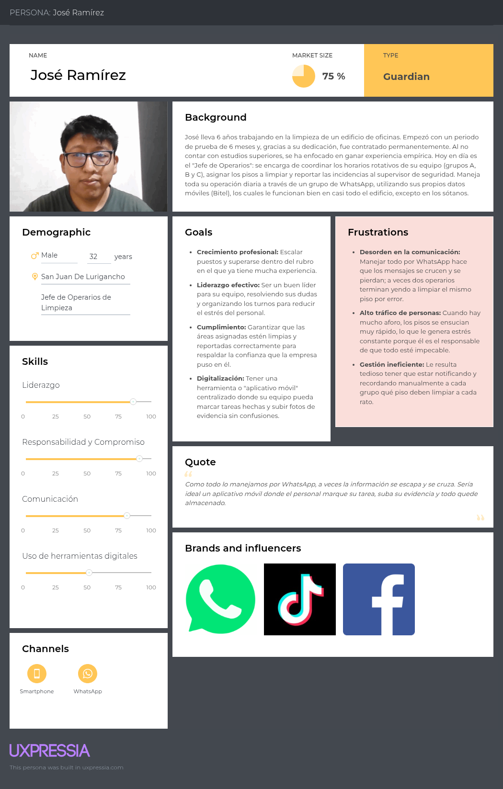

- **Segmento 2: Supervisores/coordinadores**

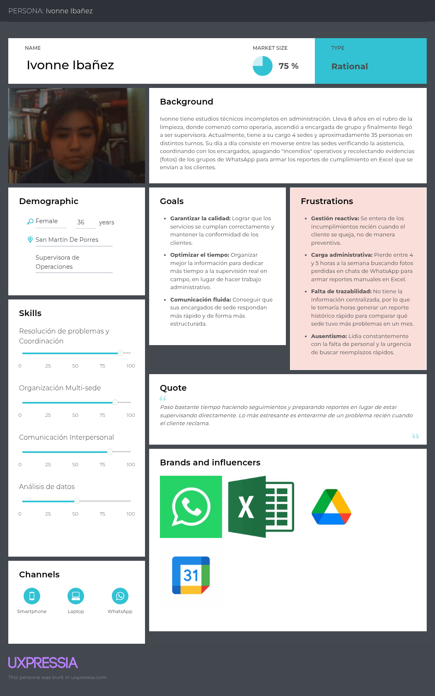

### 2.3.2. User Task Matrix

La matriz incluye tareas que los segmentos realizan **independientemente de Service Compliance**. No se incluyen como tareas “escanear QR”, “usar GPS”, “sincronizar” o “abrir dashboard”, porque esas serían decisiones de solución.

| Tarea actual | Operario — Frecuencia | Operario — Importancia | Supervisor — Frecuencia | Supervisor — Importancia |
|---|---|---|---|---|
| Consultar o recibir las áreas/actividades asignadas. | Alta | Alta | Media | Alta |
| Ejecutar actividades de limpieza. | Alta | Alta | Baja | Media |
| Comunicar o confirmar la finalización de una actividad. | Alta | Alta | Media | Alta |
| Presentar evidencia cuando el proceso o cliente la requiere. | Media/Alta | Alta | Media | Alta |
| Comunicar un impedimento, daño o excepción. | Media | Alta | Media | Alta |
| Adaptarse a cambios de zona, turno o prioridad. | Media | Alta | Alta | Alta |
| Verificar la calidad o finalización del trabajo. | Baja | Baja | Alta | Alta |
| Reasignar cobertura ante ausencias o cambios operativos. | Baja | Baja | Alta | Alta |
| Recopilar y organizar evidencias/registros. | Baja | Baja | Alta | Alta |
| Atender observaciones o reclamos del cliente. | Baja | Baja | Media/Alta | Alta |
| Dar seguimiento a desviaciones hasta su atención. | Baja | Media | Media/Alta | Alta |
| Consolidar el estado del servicio y elaborar reportes. | Baja | Baja | Media | Alta |

**Lectura de la matriz.** Ambos segmentos coinciden en la necesidad de compartir una referencia sobre qué actividad se espera y qué ocurrió. El operario concentra frecuencia e importancia en ejecución y comunicación del resultado; el supervisor concentra importancia en coordinación, verificación, reconstrucción del estado y atención de desviaciones. Esto justifica experiencias móviles diferentes sin convertir al operario en responsable de interpretar reglas contractuales.

### 2.3.3. User Journey Mapping

Los Journey Maps representan el proceso **As-Is**, es decir, la situación actual antes de Service Compliance.

- **Operario**

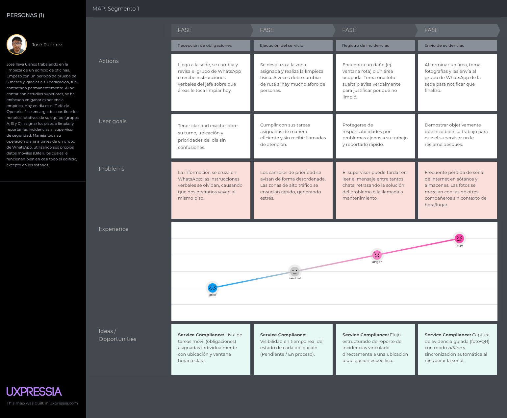

- **Supervisor/coordinador**

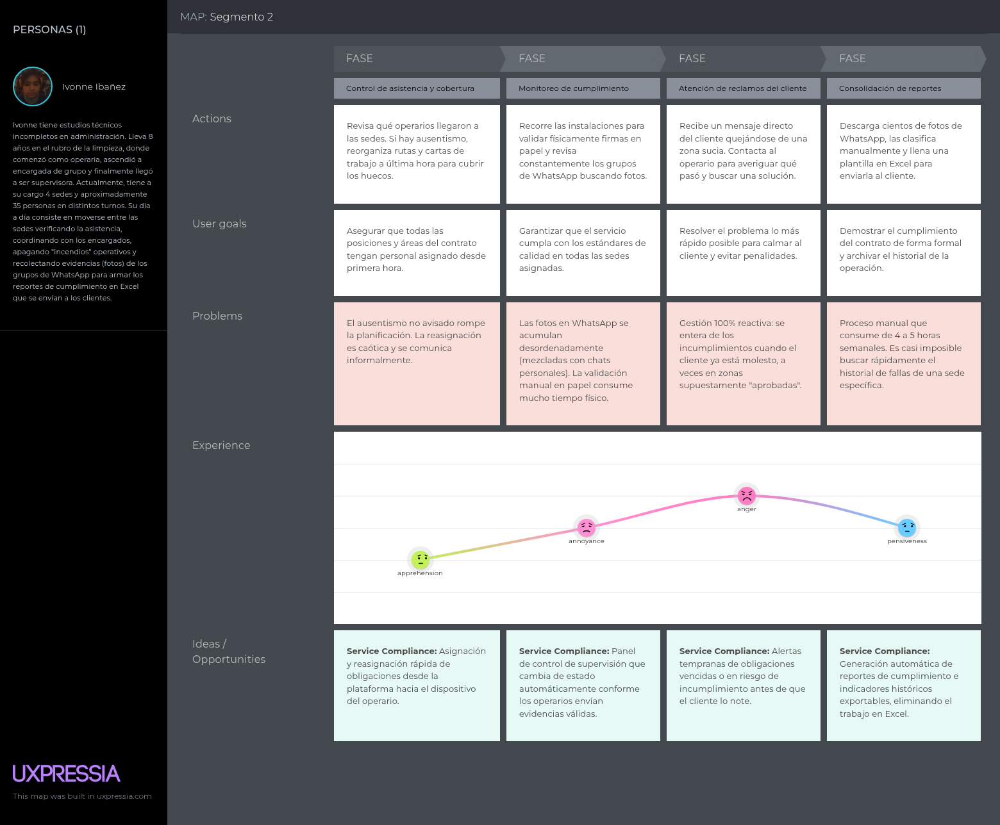

#### 2.3.3.1. As-Is Scenario Mapping

La rúbrica exige también As-Is Scenario Mapping. La siguiente especificación resume los escenarios actuales y puede trasladarse a la herramienta indicada por el curso.

##### As-Is — Operario

| Etapa | Qué hace | Información/canal actual | Pain point / riesgo |
|---|---|---|---|
| Inicio del turno | Recibe zona, rutina o cambio de prioridad. | Indicación verbal, WhatsApp, carta/cronograma. | Mensajes cruzados, prioridad ambigua o cambio tardío. |
| Ejecución | Realiza la actividad en el espacio asignado. | Conocimiento operativo e instrucciones. | El espacio puede estar ocupado o presentar un impedimento. |
| Confirmación | Comunica que terminó. | Aviso verbal, mensaje, foto o formato. | El resultado puede quedar sin referencia estructurada a la actividad. |
| Excepción | Reporta daño, imposibilidad o situación fuera de alcance. | Supervisor, WhatsApp o escalamiento local. | Puede perderse el contexto o interpretarse como incumplimiento. |
| Cierre | Continúa con otra actividad. | Confirmación informal. | No siempre conoce si el registro fue recibido, aceptado o requiere corrección. |

##### As-Is — Supervisor

| Etapa | Qué hace | Información/canal actual | Pain point / riesgo |
|---|---|---|---|
| Planificación diaria | Revisa personal, novedades, zonas y prioridades. | WhatsApp, papel, Excel, experiencia propia. | Ausencias y cambios obligan a reorganizar. |
| Seguimiento | Consulta encargados, realiza rondas y recibe evidencia. | WhatsApp, llamadas, observación física. | Estado distribuido y difícil de consolidar. |
| Verificación | Decide si una actividad parece completada. | Foto, firma, inspección o comunicación. | Evidencia y criterio pueden no estar ligados a la obligación original. |
| Observación/reclamo | Reconstruye qué ocurrió. | Chats, archivos, Excel, llamadas. | Tiempo alto para localizar responsables y evidencia. |
| Corrección | Coordina solución y vuelve a verificar. | Mensajes, llamadas, ronda física. | El historial original y la corrección pueden quedar separados. |
| Reporte | Consolida información del periodo. | Excel, fotos, informes. | Trabajo manual y dificultad para comparar sedes/periodos. |

### 2.3.4. Empathy Mapping

Los Empathy Maps deben construirse a partir de los User Personas y entrevistas, registrando qué ve, oye, dice, hace, piensa y siente cada arquetipo, junto con pains y gains.

- **Operarios de limpieza tercerizada**

- **Supervisores/coordinadores**

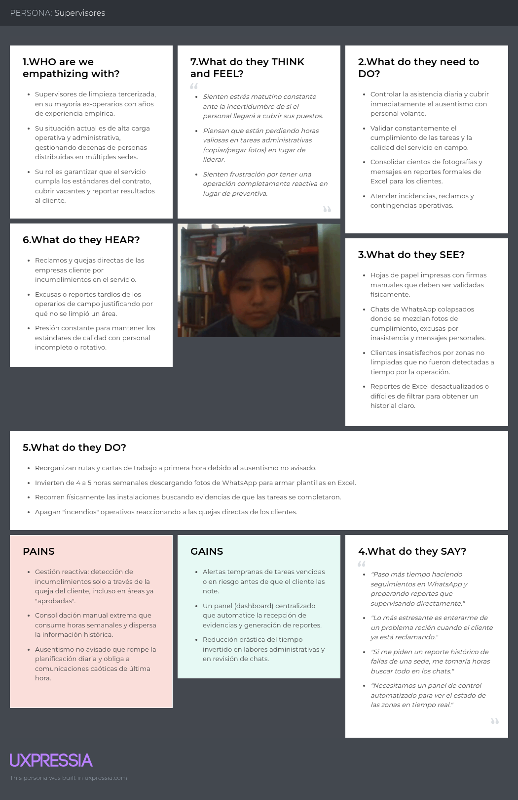

### 2.3.5. Big Picture EventStorming

El Big Picture EventStorming debe representar el **dominio del negocio actual**, no la interfaz ni la arquitectura de Service Compliance. Por ello los eventos se expresan en pasado y se excluyen términos como API, base de datos, sincronización, QR o GPS como si fueran eventos de dominio.

La sesión colaborativa debe documentar al menos: exploración sin estructura, ordenamiento en timeline, identificación de pain points/hotspots y consolidación de eventos significativos.

#### Eventos de dominio propuestos para la sesión

| Orden | Domain Event candidato | Hotspot / pregunta |
|---:|---|---|
| 1 | **Service Contract was agreed** | ¿El contrato es la única fuente del trabajo operativo? |
| 2 | **Service Conditions were identified** | ¿Quién interpreta qué condiciones son operables? |
| 3 | **Service Plan was defined** | ¿Existe plan, cronograma, carta de trabajo u otro artefacto intermedio? |
| 4 | **Service Obligation was scheduled** | ¿Cómo se determina frecuencia, ventana y sitio? |
| 5 | **Service Obligation was assigned** | ¿Quién asigna y cuándo cambia el responsable? |
| 6 | **Service Obligation became due** | ¿Qué significa “a tiempo” en cada servicio? |
| 7 | **Execution was started** | ¿Es necesario registrar inicio en todos los casos? |
| 8 | **Execution result was recorded** | ¿Qué resultados posibles existen además de “completado”? |
| 9 | **Evidence was provided** | ¿Qué evidencia es suficiente para cada obligación? |
| 10 | **Exception was reported** | ¿Qué diferencia una excepción aceptable de una desviación? |
| 11 | **Execution was submitted for review** | ¿Siempre existe revisión humana? |
| 12 | **Compliance was evaluated** | ¿Qué reglas y actor participan en la evaluación? |
| 13 | **Compliance Result was determined** | ¿Cumplido, excepción aceptada, desviación o incumplimiento? |
| 14 | **Client Observation was received** | ¿Puede reabrir o cuestionar una evaluación previa? |
| 15 | **Non-compliance was confirmed** | ¿Toda desviación se convierte en incumplimiento? |
| 16 | **Corrective Action was assigned** | ¿Quién decide que hace falta una acción correctiva? |
| 17 | **Corrective Action was completed** | ¿Cómo se verifica que la acción fue suficiente? |
| 18 | **Compliance Case was closed** | ¿Qué debe conservarse del estado original? |
| 19 | **Compliance Report was generated** | ¿Por sede, servicio, cliente o periodo? |

#### Pain points a contrastar durante la sesión

- información distribuida entre mensajes, hojas de cálculo, formatos y observación directa;
- cambios de prioridad y asignación durante el turno;
- evidencia sin contexto suficiente;
- conectividad limitada en determinadas zonas;
- observaciones del cliente que obligan a reconstruir el caso;
- ambigüedad entre excepción, desviación e incumplimiento;
- corrección realizada sin un historial común del problema original;
- consolidación manual para reportes.

#### Timeline propuesto para la sesión

El ordenamiento en timeline se propone por fases del negocio (Contrato → Planificación → Ejecución → Revisión → Evaluación de cumplimiento → Corrección y cierre → Reporte). La numeración E1–E19 corresponde a los candidatos de la tabla anterior; los hot spots se contrastan durante la exploración.

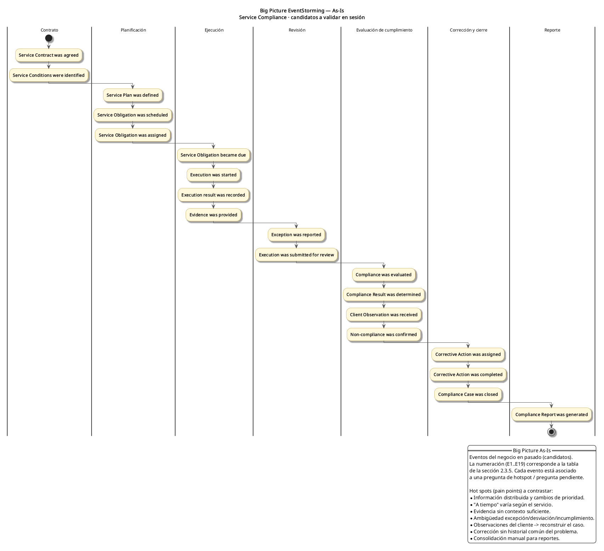

### 2.3.6. Ubiquitous Language

El glosario utiliza términos del negocio en inglés y evita términos de ingeniería de software.

| Término | Definición de trabajo |
|---|---|
| **Service Contract** | Acuerdo entre la empresa prestadora y la organización cliente que establece el marco del servicio. |
| **Service Condition** | Condición relevante del acuerdo que debe ser considerada al planificar u operar el servicio. |
| **Service Plan** | Interpretación operativa aprobada del servicio, donde se organizan sitios, condiciones, obligaciones, frecuencia, ventanas y requisitos. |
| **Service Site** | Instalación o ubicación donde se presta el servicio. |
| **Obligation Definition** | Regla del Service Plan que describe qué actividad debe cumplirse, dónde, con qué frecuencia/ventana y bajo qué criterio. |
| **Service Obligation** | Instancia operativa que debe ser atendida en un periodo o ventana específica. |
| **Assignment** | Relación entre una Service Obligation y el operario responsable de atenderla. |
| **Execution** | Registro de lo que efectivamente se realizó o intentó realizar para una Service Obligation. |
| **Evidence Requirement** | Condición que establece qué respaldo debe acompañar una ejecución cuando sea necesario. |
| **Evidence** | Información presentada para respaldar una afirmación sobre la ejecución; su validez depende del Evidence Requirement y del contexto. |
| **Exception** | Circunstancia que impide o modifica la ejecución esperada y que puede ser aceptada según las reglas aplicables. |
| **Deviation** | Diferencia detectada entre el resultado esperado y el observado. No implica automáticamente Non-compliance. |
| **Compliance Evaluation** | Proceso de comparar la Service Obligation y sus criterios con la Execution, Evidence y Exception disponibles. |
| **Compliance Result** | Resultado de la evaluación: puede indicar cumplimiento, excepción aceptada, desviación o incumplimiento. |
| **Non-compliance** | Compliance Result que confirma que una obligación no cumplió un criterio aplicable y que no existe una excepción aceptada que lo justifique. |
| **Client Observation** | Cuestionamiento o comentario de la organización cliente acerca del resultado de un servicio. |
| **Corrective Action** | Acción acordada para responder a un Non-compliance o situación que requiere corrección. No elimina el resultado original. |
| **Compliance Case** | Conjunto trazable que conserva evaluación, resultado, observaciones y acciones posteriores relacionadas con una ejecución. |
| **Compliance Report** | Consolidación del estado de cumplimiento para un servicio, sitio y periodo definidos. |

## 2.4. Requirements Specification

Los requisitos se derivan de Lean UX, entrevistas y Needfinding, junto con restricciones académicas explícitas del curso. Se distinguen las necesidades del dominio de decisiones tecnológicas obligatorias: el curso exige experiencia móvil nativa y cross-platform, almacenamiento local, acceso a un recurso interno del dispositivo, RESTful API propia y un servicio externo de terceros.

### To-Be Scenario Mapping

#### To-Be — Operario

| Etapa | Comportamiento esperado | Resultado buscado |
|---|---|---|
| Recibir trabajo | Consulta sus Service Obligations asignadas con sitio, ventana e instrucciones necesarias. | Menor ambigüedad sobre qué debe ejecutar. |
| Ejecutar | Inicia/atiende la obligación sin interpretar cláusulas contractuales. | Mantener foco en trabajo físico. |
| Registrar resultado | Registra completed, partial, blocked u otro resultado permitido. | Explicar qué ocurrió, no solo marcar una tarea. |
| Adjuntar evidencia | Presenta únicamente la Evidence requerida para esa obligación. | Evitar evidencia innecesaria y conservar contexto. |
| Reportar excepción | Registra impedimento/exception con motivo. | Evitar que una ejecución imposible quede como incumplimiento sin explicación. |
| Trabajar con conectividad limitada | Guarda temporalmente el registro y sincroniza posteriormente. | Reducir pérdida de información sin detener el trabajo. |
| Recibir corrección | Consulta una Corrective Action cuando le corresponde y registra su atención. | Cerrar el ciclo sin borrar el Non-compliance original. |

#### To-Be — Supervisor/coordinador

| Etapa | Comportamiento esperado | Resultado buscado |
|---|---|---|
| Preparar servicio | Define/activa un Service Plan y sus Obligation Definitions a partir de condiciones operativas aprobadas. | Separar contrato de interpretación operativa. |
| Coordinar | Asigna obligaciones y consulta estado por sitio/periodo. | Visibilidad compartida de la operación. |
| Revisar | Consulta Execution, Evidence y Exceptions. | Evitar reconstrucción desde múltiples canales. |
| Evaluar | Registra o confirma Compliance Result conforme a reglas aplicables. | Distinguir cumplimiento, excepción, desviación e incumplimiento. |
| Corregir | Asigna y sigue Corrective Action cuando corresponde. | Mantener historial del problema y de su respuesta. |
| Responder observaciones | Consulta el Compliance Case completo. | Explicar qué ocurrió con trazabilidad. |
| Reportar | Genera Compliance Report e indicadores por periodo/sitio. | Reducir consolidación manual. |

### 2.4.1. User Stories

#### Epics

| Epic ID | Epic | Propósito |
|---|---|---|
| **EP01** | Service Planning | Definir Service Plan, sitios, Obligation Definitions y Evidence Requirements. |
| **EP02** | Field Operations | Asignar y ejecutar Service Obligations en campo con evidencia/excepciones. |
| **EP03** | Compliance Management | Evaluar cumplimiento, registrar Compliance Result y gestionar correctivas/observaciones. |
| **EP04** | Reporting & Follow-up | Consultar estado, alertas, indicadores e informes trazables. |
| **EP05** | Identity & Access | Autenticar usuarios y aplicar roles/permisos. |
| **EP06** | Landing Page | Comunicar propuesta de valor y captar contacto para pilotos/demos. |
| **EP07** | Technical Foundation | REST API, almacenamiento local, servicios externos y capacidades técnicas. |

#### User Stories funcionales

##### US-01 — Crear Service Plan

| Campo | Contenido |
|---|---|
| **Story ID** | US-01 |
| **User** | Supervisor/coordinador autorizado |
| **Priority** | High |
| **Epic** | EP01 — Service Planning |
| **Title** | Crear un Service Plan |
| **Description** | Como supervisor/coordinador autorizado, deseo registrar un Service Plan para un servicio y sitio, para disponer de una referencia operativa común sin interpretar el contrato durante cada ejecución. |
| **Acceptance Criteria** | **Scenario 1:** Given que el supervisor cuenta con datos mínimos del servicio y sitio, When registra el Service Plan, Then el sistema conserva un identificador, periodo de vigencia, sitio y estado Draft. **Scenario 2:** Given un Service Plan Draft, When faltan datos obligatorios, Then el sistema no permite activarlo e informa qué información falta. |

##### US-02 — Definir Obligation Definition y Evidence Requirement

| Campo | Contenido |
|---|---|
| **Story ID** | US-02 |
| **User** | Supervisor/coordinador autorizado |
| **Priority** | High |
| **Epic** | EP01 |
| **Title** | Definir una obligación operativa |
| **Description** | Como supervisor/coordinador, deseo definir qué actividad debe realizarse, dónde, con qué frecuencia/ventana y qué evidencia requiere, para que cada ejecución tenga criterios claros. |
| **Acceptance Criteria** | **Scenario 1:** Given un Service Plan Draft, When se añade una Obligation Definition válida, Then queda asociada al plan con sitio, descripción, schedule rule y criterio de aceptación. **Scenario 2:** Given una obligación que requiere evidencia, When se configura su Evidence Requirement, Then el requisito queda explícitamente asociado y no se aplica automáticamente a otras obligaciones. |

##### US-03 — Activar Service Plan

| Campo | Contenido |
|---|---|
| **Story ID** | US-03 |
| **User** | Supervisor/coordinador autorizado |
| **Priority** | High |
| **Epic** | EP01 |
| **Title** | Activar el Service Plan |
| **Description** | Como supervisor/coordinador, deseo activar un Service Plan revisado para que sus obligaciones puedan ser programadas para la operación. |
| **Acceptance Criteria** | **Scenario 1:** Given un plan con al menos una Obligation Definition válida, When el supervisor lo activa, Then el estado cambia a Active y queda registrada la fecha de activación. **Scenario 2:** Given un plan Active, When se intenta modificar una regla que afectaría obligaciones ya emitidas, Then el sistema exige una nueva versión o cambio con trazabilidad. |

##### US-04 — Consultar obligaciones asignadas

| Campo | Contenido |
|---|---|
| **Story ID** | US-04 |
| **User** | Operario |
| **Priority** | High |
| **Epic** | EP02 — Field Operations |
| **Title** | Consultar Service Obligations asignadas |
| **Description** | Como operario, deseo consultar las obligaciones que me corresponden, para conocer qué debo realizar, dónde y dentro de qué ventana. |
| **Acceptance Criteria** | **Scenario 1:** Given que existen obligaciones asignadas al operario, When consulta su trabajo, Then recibe únicamente obligaciones dentro de su alcance con sitio, actividad, ventana e instrucciones necesarias. **Scenario 2:** Given que una obligación cambia antes de iniciarse, When el operario vuelve a consultar o sincroniza, Then visualiza la versión vigente. |

##### US-05 — Registrar Execution

| Campo | Contenido |
|---|---|
| **Story ID** | US-05 |
| **User** | Operario |
| **Priority** | High |
| **Epic** | EP02 |
| **Title** | Registrar el resultado de una ejecución |
| **Description** | Como operario, deseo registrar qué ocurrió al atender una Service Obligation, para que supervisión conozca el resultado real de la actividad. |
| **Acceptance Criteria** | **Scenario 1:** Given una obligación asignada, When el operario inicia y registra su resultado, Then la Execution queda vinculada a la obligación, operario y timestamps correspondientes. **Scenario 2:** Given una obligación no asignada al operario, When intenta registrar una ejecución, Then el sistema rechaza la operación. |

##### US-06 — Adjuntar Evidence requerida

| Campo | Contenido |
|---|---|
| **Story ID** | US-06 |
| **User** | Operario |
| **Priority** | High |
| **Epic** | EP02 |
| **Title** | Adjuntar evidencia cuando corresponde |
| **Description** | Como operario, deseo presentar la evidencia solicitada por la obligación para respaldar el resultado sin capturar información innecesaria. |
| **Acceptance Criteria** | **Scenario 1:** Given una obligación con Evidence Requirement, When el operario registra la evidencia del tipo permitido, Then queda vinculada a la Execution. **Scenario 2:** Given una obligación que no exige una evidencia específica, When el operario registra el resultado, Then el sistema no bloquea el envío por ausencia de foto/QR/GPS no requeridos. |

##### US-07 — Reportar Exception

| Campo | Contenido |
|---|---|
| **Story ID** | US-07 |
| **User** | Operario |
| **Priority** | High |
| **Epic** | EP02 |
| **Title** | Reportar un impedimento o excepción |
| **Description** | Como operario, deseo registrar una Exception cuando una obligación no puede ejecutarse como estaba prevista, para que el resultado sea revisado con contexto. |
| **Acceptance Criteria** | **Scenario 1:** Given una obligación asignada, When el operario reporta una excepción con motivo, Then la excepción queda asociada a la Execution y disponible para revisión. **Scenario 2:** Given una Exception registrada, When se evalúa el cumplimiento, Then no se convierte automáticamente en Non-compliance sin aplicar las reglas correspondientes. |

##### US-08 — Guardar y sincronizar con conectividad limitada

| Campo | Contenido |
|---|---|
| **Story ID** | US-08 |
| **User** | Operario |
| **Priority** | High |
| **Epic** | EP02 |
| **Title** | Continuar el registro sin conexión inmediata |
| **Description** | Como operario, deseo guardar temporalmente mis registros cuando no tengo conectividad para no perder el trabajo realizado y sincronizarlo después. |
| **Acceptance Criteria** | **Scenario 1:** Given que el dispositivo no tiene conexión, When el operario guarda una Execution o Evidence, Then el registro queda almacenado localmente con estado pendiente de sincronización. **Scenario 2:** Given registros pendientes y conectividad recuperada, When se ejecuta la sincronización, Then los registros se envían de forma idempotente y el usuario conoce si quedaron sincronizados o requieren atención. |

##### US-09 — Consultar estado operativo

| Campo | Contenido |
|---|---|
| **Story ID** | US-09 |
| **User** | Supervisor/coordinador |
| **Priority** | High |
| **Epic** | EP04 — Reporting & Follow-up |
| **Title** | Consultar el estado de las obligaciones |
| **Description** | Como supervisor, deseo consultar obligaciones por sitio, periodo y estado para identificar qué requiere mi atención sin revisar múltiples canales. |
| **Acceptance Criteria** | **Scenario 1:** Given obligaciones del alcance del supervisor, When consulta el estado operativo, Then puede distinguir assigned, in progress, submitted, excepted y overdue según las reglas vigentes. **Scenario 2:** Given una obligación fuera de su alcance, When intenta consultarla, Then el sistema no expone información no autorizada. |

##### US-10 — Revisar Execution y Evidence

| Campo | Contenido |
|---|---|
| **Story ID** | US-10 |
| **User** | Supervisor/coordinador |
| **Priority** | High |
| **Epic** | EP03 — Compliance Management |
| **Title** | Revisar la ejecución de una obligación |
| **Description** | Como supervisor, deseo revisar Execution, Evidence y Exceptions juntas para comprender qué ocurrió antes de evaluar el cumplimiento. |
| **Acceptance Criteria** | **Scenario 1:** Given una Execution submitted, When el supervisor abre el caso, Then visualiza obligación, resultado, evidencias, excepciones y timestamps relacionados. **Scenario 2:** Given que falta información exigida por el Service Plan, When revisa el caso, Then la ausencia queda indicada sin inventar automáticamente un Compliance Result. |

##### US-11 — Registrar Compliance Result

| Campo | Contenido |
|---|---|
| **Story ID** | US-11 |
| **User** | Supervisor/coordinador |
| **Priority** | High |
| **Epic** | EP03 |
| **Title** | Evaluar el cumplimiento |
| **Description** | Como supervisor, deseo registrar el Compliance Result aplicando los criterios del Service Plan para distinguir cumplimiento, excepción aceptada, desviación e incumplimiento. |
| **Acceptance Criteria** | **Scenario 1:** Given una Execution revisable, When se aplican criterios y evidencia disponibles, Then el caso registra un Compliance Result válido con actor y timestamp. **Scenario 2:** Given una Exception aceptada por la regla aplicable, When se evalúa el caso, Then el resultado puede ser Exception Accepted sin convertirla en Non-compliance. |

##### US-12 — Gestionar Corrective Action

| Campo | Contenido |
|---|---|
| **Story ID** | US-12 |
| **User** | Supervisor/coordinador |
| **Priority** | High |
| **Epic** | EP03 |
| **Title** | Asignar y dar seguimiento a una acción correctiva |
| **Description** | Como supervisor, deseo asignar una Corrective Action cuando corresponde para dar seguimiento a la respuesta sin borrar el Non-compliance original. |
| **Acceptance Criteria** | **Scenario 1:** Given un Compliance Case que requiere corrección, When el supervisor asigna una Corrective Action, Then queda registrada con responsable, descripción, fecha objetivo y estado. **Scenario 2:** Given una acción completada, When el supervisor verifica el cierre, Then el historial conserva tanto el Compliance Result original como la acción realizada. |

##### US-13 — Registrar Client Observation

| Campo | Contenido |
|---|---|
| **Story ID** | US-13 |
| **User** | Supervisor/coordinador |
| **Priority** | Medium |
| **Epic** | EP03 |
| **Title** | Registrar una observación del cliente |
| **Description** | Como supervisor, deseo registrar una Client Observation asociada a un caso para conservar el contexto de un cuestionamiento posterior a la ejecución. |
| **Acceptance Criteria** | **Scenario 1:** Given una observación relacionada con una obligación, When se registra, Then queda vinculada al Compliance Case con fecha, descripción y origen. **Scenario 2:** Given un resultado previamente registrado, When llega una observación, Then el sistema conserva el resultado original y registra cualquier reevaluación como una nueva decisión trazable. |

##### US-14 — Consultar historial del Compliance Case

| Campo | Contenido |
|---|---|
| **Story ID** | US-14 |
| **User** | Supervisor/coordinador |
| **Priority** | High |
| **Epic** | EP03 |
| **Title** | Consultar el historial completo de un caso |
| **Description** | Como supervisor, deseo consultar la secuencia de ejecución, evaluación, observaciones y correctivas para explicar qué ocurrió sin reconstruir datos dispersos. |
| **Acceptance Criteria** | **Scenario 1:** Given un Compliance Case con cambios, When se consulta su historial, Then se muestran los eventos relevantes en orden temporal. **Scenario 2:** Given una Corrective Action cerrada, When se consulta el historial, Then el Non-compliance original sigue visible y no aparece reescrito como si nunca hubiera ocurrido. |

##### US-15 — Generar Compliance Report

| Campo | Contenido |
|---|---|
| **Story ID** | US-15 |
| **User** | Supervisor/coordinador |
| **Priority** | Medium |
| **Epic** | EP04 |
| **Title** | Generar un reporte de cumplimiento |
| **Description** | Como supervisor, deseo generar un Compliance Report por servicio, sitio y periodo para comunicar el estado sin consolidar manualmente múltiples fuentes. |
| **Acceptance Criteria** | **Scenario 1:** Given un periodo con información disponible, When el supervisor solicita el reporte, Then se consolidan obligaciones, resultados, excepciones, incumplimientos y correctivas del alcance seleccionado. **Scenario 2:** Given que existen casos sin evaluación, When se genera el reporte, Then se muestran como pendientes y no se asumen cumplidos. |

##### US-16 — Recibir alertas relevantes

| Campo | Contenido |
|---|---|
| **Story ID** | US-16 |
| **User** | Supervisor/coordinador |
| **Priority** | Medium |
| **Epic** | EP04 |
| **Title** | Recibir alertas de obligaciones o casos que requieren atención |
| **Description** | Como supervisor, deseo recibir alertas configuradas para situaciones relevantes para actuar antes de que el problema dependa exclusivamente de un reclamo del cliente. |
| **Acceptance Criteria** | **Scenario 1:** Given una obligación próxima o vencida según una regla configurada, When se cumple la condición de alerta, Then el supervisor recibe una notificación una sola vez por el evento relevante. **Scenario 2:** Given una situación que no requiere alerta, When cambia de estado, Then el sistema no genera notificaciones innecesarias. |

##### US-17 — Autenticarse y acceder según rol

| Campo | Contenido |
|---|---|
| **Story ID** | US-17 |
| **User** | Operario / Supervisor |
| **Priority** | Medium |
| **Epic** | EP05 — Identity & Access |
| **Title** | Acceder con un rol autorizado |
| **Description** | Como usuario de la empresa prestadora, deseo autenticarme para acceder únicamente a las capacidades y datos permitidos para mi rol. |
| **Acceptance Criteria** | **Scenario 1:** Given credenciales válidas y cuenta activa, When el usuario se autentica, Then obtiene una sesión con su rol y empresa. **Scenario 2:** Given un operario autenticado, When intenta ejecutar una operación exclusiva de supervisor, Then la solicitud es rechazada. |

##### US-18 — Landing Page: comprender la propuesta

| Campo | Contenido |
|---|---|
| **Story ID** | US-18 |
| **User** | Visitante / potencial comprador |
| **Priority** | Medium |
| **Epic** | EP06 — Landing Page |
| **Title** | Comprender qué problema resuelve Service Compliance |
| **Description** | Como responsable de una empresa prestadora, deseo comprender la propuesta de valor de Service Compliance para decidir si vale la pena solicitar una demostración. |
| **Acceptance Criteria** | **Scenario 1:** Given un visitante en la Landing Page, When revisa la propuesta principal, Then puede identificar público objetivo, problema, beneficios y alcance inicial. **Scenario 2:** Given la página publicada, When se accede desde móvil o escritorio, Then el contenido principal permanece legible y navegable. |

##### US-19 — Landing Page: solicitar contacto

| Campo | Contenido |
|---|---|
| **Story ID** | US-19 |
| **User** | Visitante / potencial comprador |
| **Priority** | Medium |
| **Epic** | EP06 |
| **Title** | Solicitar una demostración o piloto |
| **Description** | Como potencial comprador, deseo disponer de un canal de contacto para manifestar interés en una demostración o piloto. |
| **Acceptance Criteria** | **Scenario 1:** Given un visitante interesado, When utiliza el mecanismo de contacto, Then puede enviar sus datos mínimos y motivo de interés. **Scenario 2:** Given datos obligatorios incompletos, When intenta enviarlos, Then el sistema informa qué información falta. |

#### Technical Stories

##### TS-01 — RESTful API propia

| Campo | Contenido |
|---|---|
| **Story ID** | TS-01 |
| **User** | Developer |
| **Priority** | High |
| **Epic** | EP07 — Technical Foundation |
| **Title** | Exponer capacidades mediante RESTful API documentada |
| **Description** | Como Developer, deseo exponer las capacidades del dominio mediante una RESTful API propia para que ambas aplicaciones móviles consuman el mismo modelo de negocio. |
| **Acceptance Criteria** | **Scenario 1:** Given una operación válida, When un cliente autorizado envía un request al endpoint correspondiente, Then la API responde con código HTTP y contrato JSON documentados en OpenAPI. **Scenario 2:** Given un request inválido, When la validación falla, Then la API retorna Problem Details sin filtrar información sensible. |

##### TS-02 — Persistencia local y sincronización

| Campo | Contenido |
|---|---|
| **Story ID** | TS-02 |
| **User** | Developer |
| **Priority** | High |
| **Epic** | EP07 |
| **Title** | Implementar cola local e idempotencia de sincronización |
| **Description** | Como Developer, deseo persistir localmente ejecuciones pendientes y sincronizarlas de forma idempotente para soportar conectividad intermitente en la app nativa del operario. |
| **Acceptance Criteria** | **Scenario 1:** Given un registro creado offline, When la aplicación se reinicia, Then el registro pendiente continúa disponible localmente. **Scenario 2:** Given que el mismo registro se envía más de una vez por reintento, When la API lo procesa, Then no se crean duplicados. |

##### TS-03 — Servicio externo de notificaciones

| Campo | Contenido |
|---|---|
| **Story ID** | TS-03 |
| **User** | Developer |
| **Priority** | Medium |
| **Epic** | EP07 |
| **Title** | Integrar notificaciones push con Firebase Cloud Messaging |
| **Description** | Como Developer, deseo integrar un servicio externo de notificaciones para enviar alertas relevantes a supervisores sin implementar infraestructura push propia. |
| **Acceptance Criteria** | **Scenario 1:** Given un evento configurado para notificación, When el backend lo procesa, Then se solicita a FCM el envío al usuario objetivo. **Scenario 2:** Given un token inválido o expirado, When FCM rechaza el envío, Then el error se registra y no se repite indefinidamente. |

##### TS-04 — Almacenamiento externo de evidencia multimedia

| Campo | Contenido |
|---|---|
| **Story ID** | TS-04 |
| **User** | Developer |
| **Priority** | Medium |
| **Epic** | EP07 |
| **Title** | Almacenar evidencia multimedia fuera de la base relacional |
| **Description** | Como Developer, deseo almacenar archivos de evidencia en un servicio de objetos para conservar en PostgreSQL solo metadatos y referencias controladas. |
| **Acceptance Criteria** | **Scenario 1:** Given una fotografía válida, When se confirma su registro, Then el archivo se almacena en el servicio configurado y la Evidence conserva una referencia. **Scenario 2:** Given un archivo no permitido o demasiado grande, When se intenta almacenar, Then la operación se rechaza antes de crear una Evidence válida. |

#### Spike Story de aprendizaje autónomo

##### SP-01 — Investigar tecnología para sincronización offline robusta

| Campo | Contenido |
|---|---|
| **Story ID** | SP-01 |
| **User** | Development Team |
| **Priority** | High |
| **Epic** | EP07 |
| **Title** | Investigar y prototipar una tecnología no utilizada en clase para sincronización offline/conflict handling |
| **Description** | Como equipo de desarrollo, deseamos investigar, comparar y prototipar una tecnología, biblioteca o servicio no utilizado en clase que permita robustecer la sincronización offline o resolución de conflictos, para cumplir el feature de aprendizaje autónomo y reducir riesgo técnico antes de implementar US-08. |
| **Acceptance Criteria** | **Scenario 1:** Given al menos dos alternativas candidatas, When el equipo las evalúa, Then documenta compatibilidad, limitaciones, curva de aprendizaje, costo y relación con el problema. **Scenario 2:** Given una alternativa seleccionada que no fue utilizada en clase, When se completa un proof of concept, Then existe evidencia ejecutable y conclusiones sobre su viabilidad. **Scenario 3:** Given los resultados del spike, When se cierra la investigación, Then la decisión y el aprendizaje se documentan para el Student Outcome y arquitectura. |

### 2.4.2. Impact Mapping

El Impact Map conecta Business Goals SMART con los User Personas, los cambios de comportamiento esperados, Deliverables y User Stories.

#### Business Goals propuestos

- **BG-01.** Durante un piloto de **8 semanas**, reducir al menos **30 %** el tiempo mediano que los supervisores participantes necesitan para reconstruir el estado completo de una obligación, comparado con la línea base medida durante la primera semana del piloto.
- **BG-02.** Durante el mismo piloto, lograr que al menos **90 %** de las ejecuciones que tengan Evidence Requirement finalicen con registro completo o Exception explícita antes de cerrar el periodo correspondiente.
- **BG-03.** Al finalizar el piloto, lograr que **100 %** de los Non-compliance identificados dentro de Service Compliance conserven una decisión explícita sobre seguimiento/correctiva y un historial consultable, evitando cierres sin trazabilidad.

| Goal | Actor / Persona | Impact buscado | Deliverables | User Stories |
|---|---|---|---|---|
| BG-01 | Supervisor | Consulta una fuente común en lugar de reconstruir chats, hojas y papeles. | Estado operativo, Compliance Case, historial y filtros. | US-09, US-10, US-14 |
| BG-01 | Operario | Registra el resultado directamente sobre su obligación. | Obligaciones asignadas, Execution, Evidence/Exception. | US-04, US-05, US-06, US-07 |
| BG-02 | Operario | Completa el registro requerido con mínima fricción incluso con conectividad limitada. | Evidence Requirement configurable, almacenamiento local y sync. | US-06, US-08, TS-02 |
| BG-02 | Supervisor | Define qué evidencia corresponde a cada obligación en vez de exigirla de forma uniforme. | Service Plan y Obligation Definition. | US-01, US-02, US-03 |
| BG-03 | Supervisor | Distingue Compliance Result y conserva la respuesta posterior. | Compliance Evaluation, Corrective Action, historial. | US-11, US-12, US-13, US-14 |
| BG-01 / BG-03 | Supervisor | Comunica el estado mediante reportes consistentes. | Reporting & Insights. | US-15, US-16 |

### 2.4.3. Product Backlog

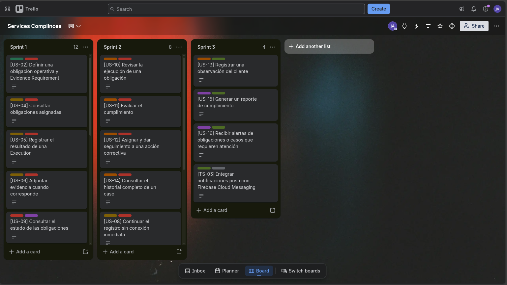

*Enlace del Trello*: https://trello.com/invite/b/6aac04da3175e8ef74c2b934/ATTI9a99c2adb3c18edd32f308698b0a396930149107/services-complinces

El orden prioriza valor de negocio y reducción de riesgo. Authentication no se coloca en primer lugar. Las historias de Landing Page se consideran desde Sprint 1, como exige el enunciado. Los Story Points son una **estimación inicial** y deben ser ratificados por el equipo en la herramienta de gestión.

| Orden | Story ID | Título | Story Points | Sprint propuesto |
|---:|---|---|---:|---:|
| 1 | US-02 | Definir una obligación operativa y Evidence Requirement | 5 | 1 |
| 2 | US-04 | Consultar obligaciones asignadas | 3 | 1 |
| 3 | US-05 | Registrar el resultado de una Execution | 5 | 1 |
| 4 | US-06 | Adjuntar Evidence requerida | 3 | 1 |
| 5 | US-09 | Consultar estado operativo | 5 | 1 |
| 6 | US-18 | Landing Page: comprender propuesta | 3 | 1 |
| 7 | US-19 | Landing Page: solicitar contacto | 2 | 1 |
| 8 | SP-01 | Investigar tecnología de aprendizaje autónomo | 5 | 1 |
| 9 | TS-01 | RESTful API propia documentada | 5 | 1 |
| 10 | US-01 | Crear Service Plan | 5 | 1 |
| 11 | US-03 | Activar Service Plan | 3 | 1 |
| 12 | US-07 | Reportar Exception | 3 | 1 |
| 13 | US-10 | Revisar Execution y Evidence | 5 | 2 |
| 14 | US-11 | Registrar Compliance Result | 8 | 2 |
| 15 | US-12 | Gestionar Corrective Action | 5 | 2 |
| 16 | US-14 | Consultar historial de Compliance Case | 5 | 2 |
| 17 | US-08 | Guardar y sincronizar con conectividad limitada | 8 | 2 |
| 18 | TS-02 | Persistencia local e idempotencia de sync | 8 | 2 |
| 19 | US-17 | Autenticarse y acceder según rol | 5 | 2 |
| 20 | US-13 | Registrar Client Observation | 3 | 3 |
| 21 | US-15 | Generar Compliance Report | 8 | 3 |
| 22 | US-16 | Recibir alertas relevantes | 5 | 3 |
| 23 | TS-03 | Integrar FCM | 3 | 3 |
| 24 | TS-04 | Almacenar evidencia multimedia | 5 | 2 |

## 2.5. Strategic-Level Domain-Driven Design

### 2.5.1. EventStorming

Con el objetivo de comprender a profundidad el dominio de la aplicación Service Compliance, se llevó a cabo una sesión de EventStorming de aproximadamente 2 horas. Esta sesión permitió identificar los eventos clave dentro del sistema, así como actores, comandos, agregados y posibles hotspots (dudas o riesgos del dominio). El enfoque se centró en capturar la mayor cantidad de conocimiento del dominio desde una perspectiva colaborativa, permitiendo así una primera aproximación al modelo general del negocio.

La herramienta utilizada para la sesión fue Miro, que facilitó la colaboración en tiempo real y la organización visual de los eventos. La sesión se dividió en las siguientes etapas:

- **Unstructured Exploration** (exploración sin estructura)
- **Timelines** (flujo del negocio)
- **Pain Points** (puntos de fricción)

Se identificaron eventos relacionados con el ciclo de vida completo de una obligación de servicio, desde el registro del contrato hasta la generación del reporte de cumplimiento, incluyendo actividades complementarias como la captura de evidencia en campo, la detección de incumplimientos y la gestión de incidencias.

**Step 1: Unstructured Exploration**

Lluvia de ideas con eventos importantes dentro del dominio de Service Compliance, organizados por área funcional para facilitar su posterior análisis: Cuenta/Sesión, Contrato/Obligación, Ejecución/Evidencia, Cumplimiento/SLA, Incidencia/Acción Correctiva, y Reportes/Notificaciones.

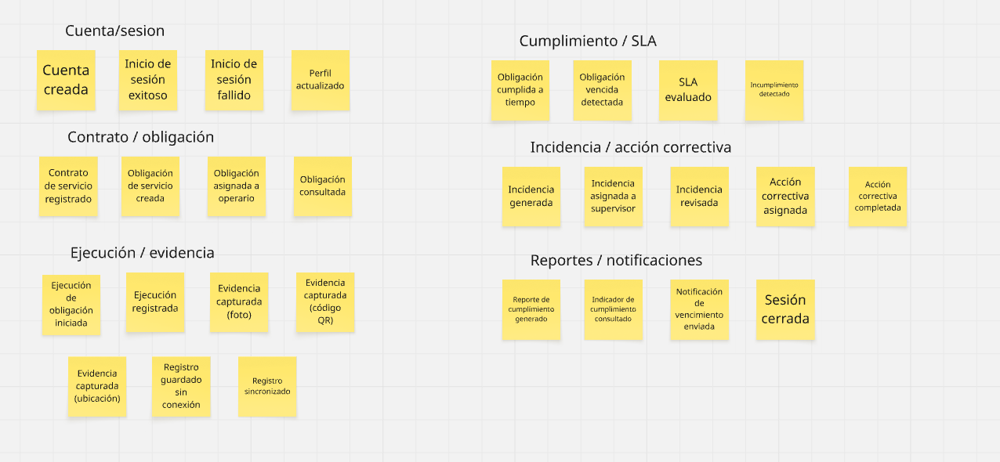

**Step 2: Timelines**

Organización de los eventos identificados en el Step 1 en flujos funcionales secuenciales, incluyendo escenarios alternativos como el registro de evidencia sin conexión y la bifurcación entre obligaciones cumplidas a tiempo y obligaciones vencidas que derivan en incidencias.

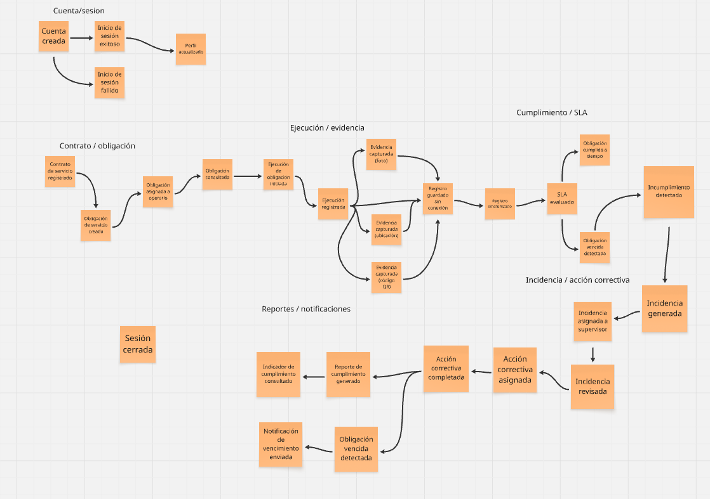

**Step 3: Pain Points**

Identificación de puntos conflictivos o dolorosos en la experiencia de los usuarios (operarios y supervisores), incluyendo problemas de conectividad al capturar evidencia, ambigüedad en la interpretación del plazo del SLA, y riesgos de duplicidad de registros al sincronizar ejecuciones offline.

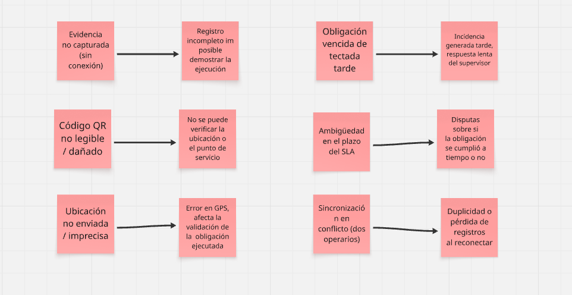

#### 2.5.1.1. Candidate Context Discovery

Sobre el timeline del EventStorming general se realizó una segunda sesión para delimitar los Candidate Bounded Contexts de la solución, aplicando las técnicas de *start-with-value* y *look-for-pivotal-events* sobre los eventos identificados. El detalle de los contextos definidos y sus flujos de interacción se presenta en el siguiente apartado.

#### 2.5.1.2. Domain Message Flows Modeling

Como resultado de la delimitación se definieron cinco Candidate Bounded Contexts, los cuales reciben el flujo de mensajes de dominio requerido para operar:

**Authentication:**

Gestiona la información y operaciones relacionadas con el registro, inicio de sesión y perfil de los usuarios del sistema (operarios y supervisores).

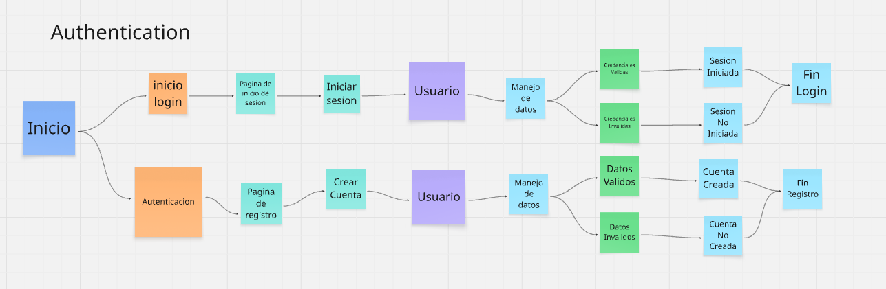

**Contract & Obligation Management:**

Gestiona la información y operaciones relacionadas con los contratos de servicio y las obligaciones operativas derivadas de ellos, incluyendo su registro y asignación a los operarios de campo.

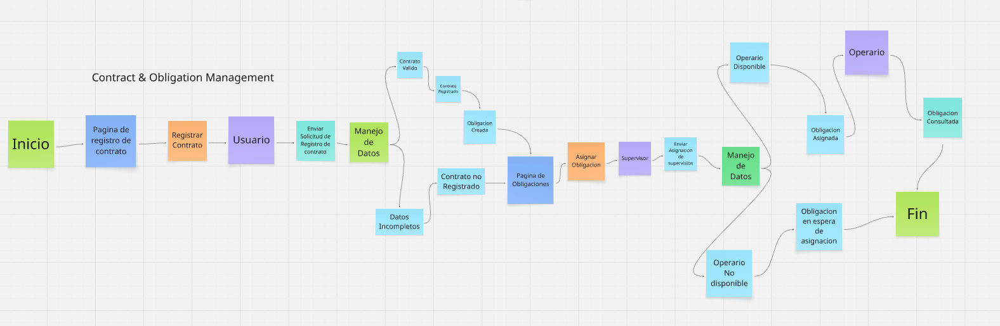

**Field Execution & Evidence:**

Gestiona la ejecución de obligaciones en campo y la captura de evidencia asociada (foto, código QR, ubicación), incluyendo el soporte de registro sin conexión y su posterior sincronización. Constituye el core domain de la solución.

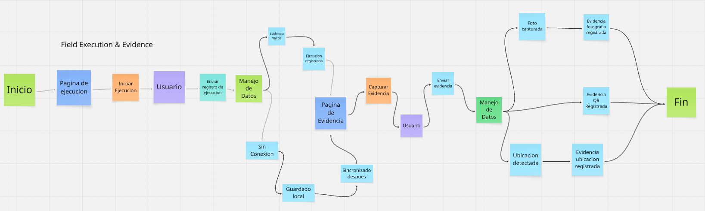

**Incident & Corrective Action:**

Gestiona la evaluación del cumplimiento de SLA, la detección de incumplimientos, y el ciclo de vida de las incidencias generadas junto con sus acciones correctivas asignadas por el supervisor.

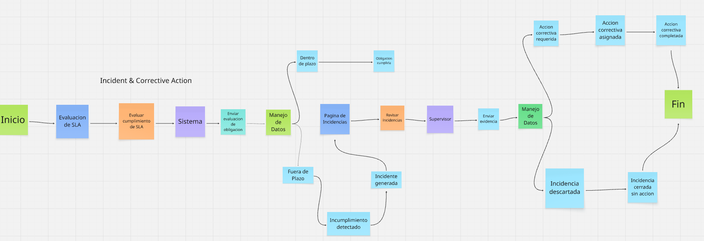

**Compliance Reporting:**

Gestiona la consolidación de información proveniente de los demás contextos para la generación de reportes de cumplimiento e indicadores, así como el envío de notificaciones automáticas de vencimientos y cambios de estado.

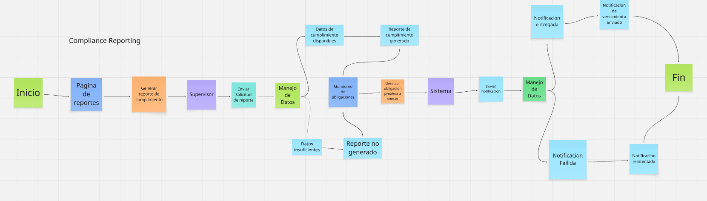

Con el fin de visualizar cómo colaboran los Bounded Contexts identificados para resolver los casos de uso principales del negocio, se aplicó la técnica de Domain Storytelling. A continuación, se presentan los flujos de interacción:

**Authentication:**

Representa el flujo de registro e inicio de sesión del usuario en el sistema.

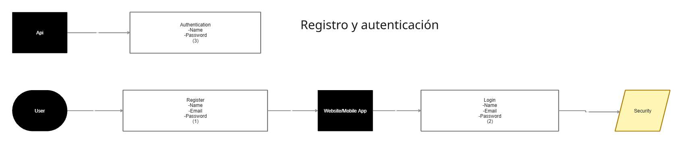

**Field Execution & Evidence:**

Representa el flujo mediante el cual un operario consulta su obligación asignada, ejecuta el servicio y registra la evidencia correspondiente, incluyendo el escenario de registro sin conexión.

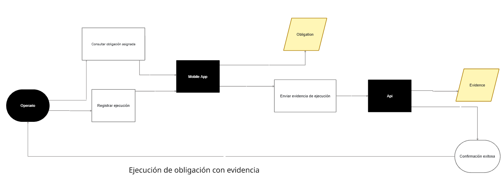

**Incident & Corrective Action:**

Representa el flujo mediante el cual el sistema evalúa automáticamente el cumplimiento del SLA, genera una incidencia ante un incumplimiento, y el supervisor revisa y asigna una acción correctiva.

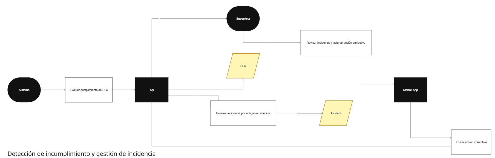

**Compliance Reporting:**

Representa el flujo mediante el cual el supervisor solicita un reporte de cumplimiento, el cual es generado consolidando información proveniente de los contextos de Field Execution & Evidence e Incident & Corrective Action.

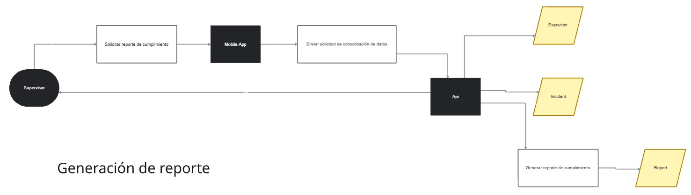

**Flujo General:**

Representa la interacción y el flujo de información entre los diferentes Bounded Contexts del sistema, evidenciando cómo Authentication habilita el acceso, Contract & Obligation Management origina las obligaciones, Field Execution & Evidence registra la ejecución, Incident & Corrective Action gestiona las desviaciones y Compliance Reporting consolida la información.

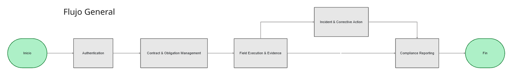

#### 2.5.1.3. Bounded Context Canvases

Para cada uno de los Bounded Contexts candidatos identificados, se elaboró un Bounded Context Canvas siguiendo un proceso iterativo de Context Overview Definition, Business Rules Distillation & Ubiquitous Language Definition, según las prácticas de Domain-Driven Design. A continuación, se presentan los canvases elaborados:

**Authentication:**

Gestiona la identificación, verificación y autorización de operarios y supervisores dentro del sistema.

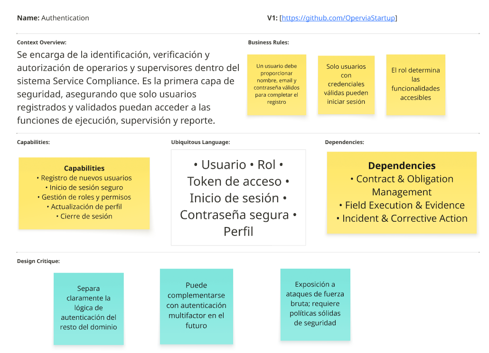

**Contract & Obligation Management:**

Gestiona el registro de contratos de servicio y la traducción de sus condiciones en obligaciones operativas.

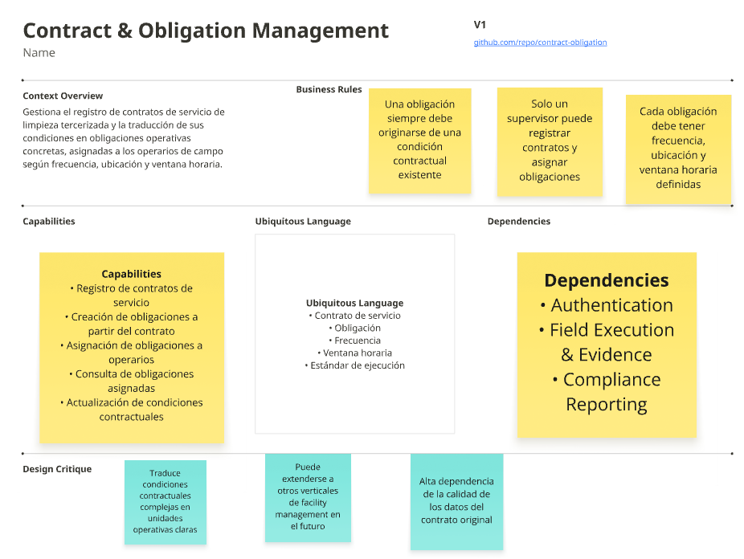

**Field Execution & Evidence:**

Core domain de la solución. Gestiona la ejecución de obligaciones en campo y la captura de evidencia, incluyendo soporte offline.

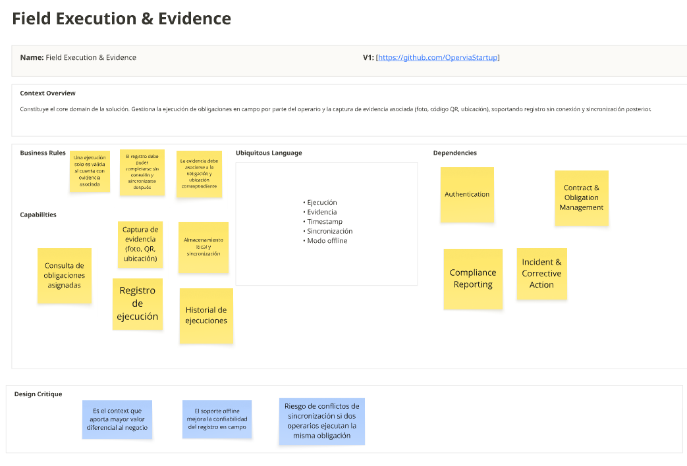

**Incident & Corrective Action:**

Gestiona la evaluación de SLA, detección de incumplimientos y el ciclo de vida de incidencias y acciones correctivas.

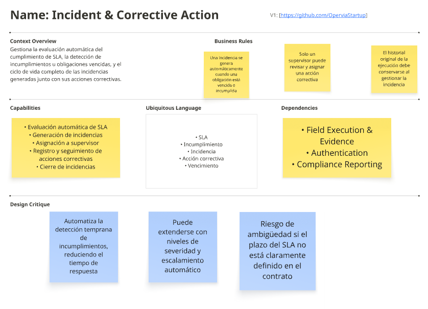

**Compliance Reporting:**

Consolida información de los demás contextos para la generación de reportes de cumplimiento y notificaciones.

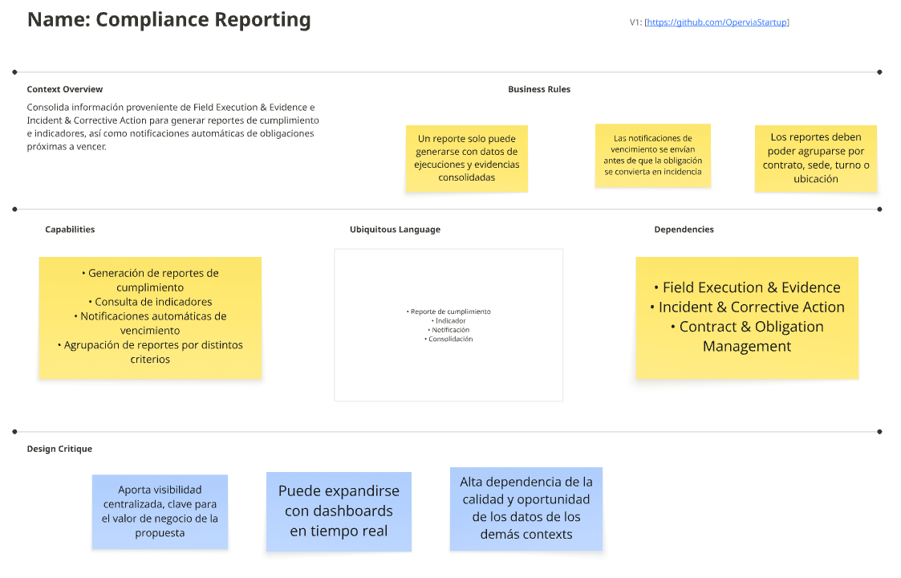

### 2.5.2. Context Mapping

#### 2.5.2.1. Context Mapping Process

A partir de los Bounded Context Canvases elaborados, el equipo desarrolló un Context Map para visualizar las relaciones estructurales entre los contextos identificados, aplicando los patrones de relación descritos por Newman (2015): Customer/Supplier, Partnership, Shared Kernel, Conformist, Anti-Corruption Layer y Open Host Service.

Durante el proceso se discutieron alternativas de diseño, entre ellas: mover la evaluación de SLA desde Field Execution & Evidence hacia Incident & Corrective Action (descartado por generar dependencias circulares), consolidar Authentication y Contract & Obligation Management (descartado para mantener separación de intereses) e implementar una anti-corruption layer entre los contextos (descartado en favor de una arquitectura más simple en la fase inicial).

Como resultado de esta discusión, se estableció el siguiente Context Map:

- **Authentication → Contract & Obligation Management** (Customer/Supplier): Contract & Obligation depende de la identidad y rol validados por Authentication.
- **Authentication → Field Execution & Evidence** (Customer/Supplier): el operario debe estar autenticado antes de ejecutar una obligación.
- **Contract & Obligation Management → Field Execution & Evidence** (Customer/Supplier): la obligación debe existir antes de poder ser ejecutada.
- **Field Execution & Evidence ↔ Incident & Corrective Action** (Partnership): ambos contextos evolucionan de forma coordinada, dado que un cambio en el registro de evidencia impacta directamente en la evaluación de cumplimiento.
- **Field Execution & Evidence e Incident & Corrective Action → Open Host Service → Compliance Reporting**: Compliance Reporting consume información consolidada de ambos contextos mediante un lenguaje de integración neutral.

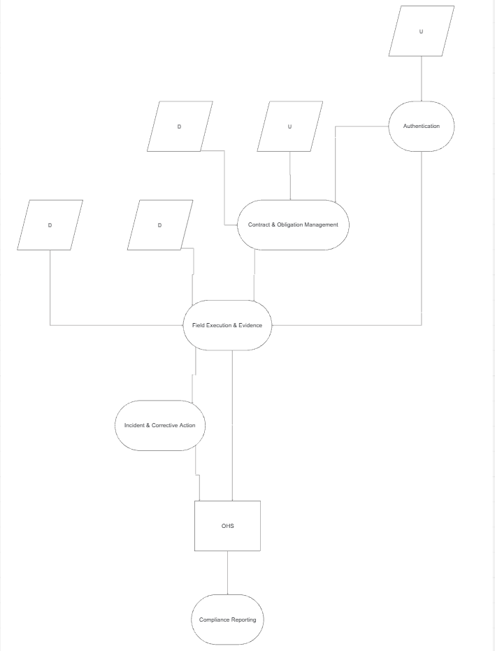

### 2.5.3. Software Architecture

#### 2.5.3.1. Software Architecture Context Level Diagrams

Aplicando el C4 Model, el equipo elaboró la representación de la arquitectura de software de la solución, utilizando Structurizr como herramienta de Diagram-as-Code (Structurizr DSL).

##### Context Diagram

El Context Diagram muestra el sistema Service Compliance como una caja central, rodeado de sus usuarios (Operario de campo y Supervisor) y los sistemas externos con los que interactúa (Servicio de Notificaciones).

El Operario de campo utiliza el sistema para consultar sus obligaciones asignadas, ejecutar el servicio y registrar evidencia. El Supervisor lo utiliza para supervisar el cumplimiento, gestionar incidencias y consultar reportes de cumplimiento.

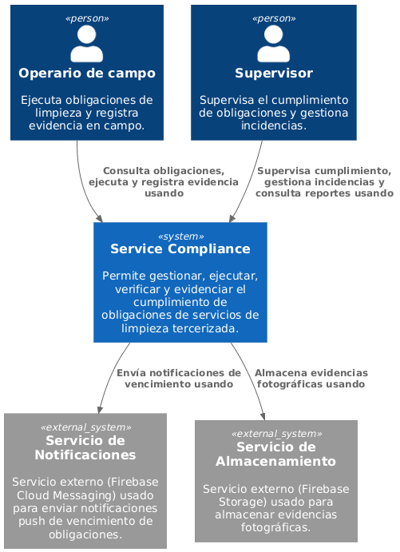

#### 2.5.3.2. Software Architecture Container Level Diagrams

**Container Diagram**

El Container Diagram muestra los elementos de alto nivel de la arquitectura de software de Service Compliance y cómo se distribuyen las responsabilidades entre ellos. La solución está compuesta por una Mobile App (frontend), una API REST (backend), una base de datos relacional y servicios externos de notificación.

La Mobile App se comunica con la API REST mediante peticiones HTTPS/JSON, mientras que la API REST se comunica con dos servicios externos: un servicio de notificaciones para alertar sobre obligaciones vencidas y un servicio de ubicación para validar geolocalización en tiempo real.

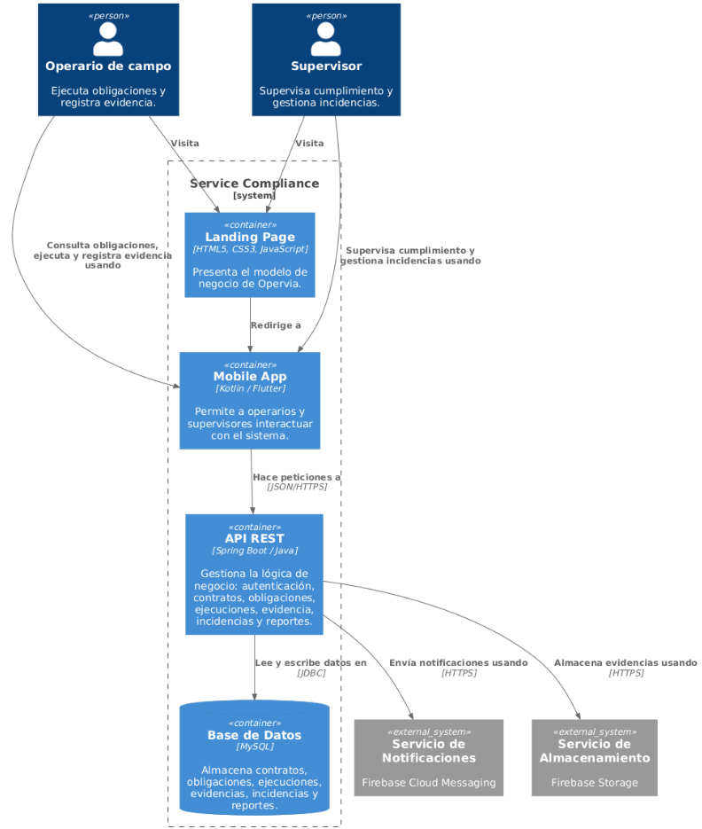

#### 2.5.3.3. Software Architecture Deployment Diagrams

**Deployment Diagram**

El Deployment Diagram muestra la distribución física de los componentes del sistema Service Compliance sobre la infraestructura de hardware. La Mobile App se ejecuta en el dispositivo móvil del operario y del supervisor, la API REST se ejecuta en un servidor en la nube, y la base de datos se ejecuta en una instancia administrada en la nube.

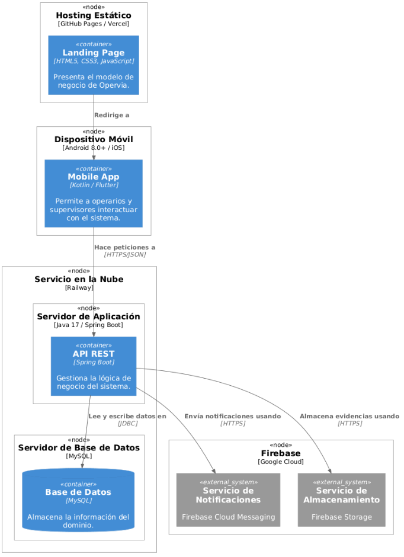

## 2.6. Tactical-Level Domain-Driven Design

En esta sección se explica y presenta la propuesta para la perspectiva táctica del diseño de la solución para cada uno de los cinco Bounded Contexts identificados. Para cada contexto se documentan las clases de las capas de Domain, Interface, Application e Infrastructure a manera de diccionario (nombre, propósito, atributos, métodos y relaciones), junto con los diagramas de componentes (C4 Model) y los diagramas de código de nivel de detalle: Class Diagram del Domain Layer y Database Design Diagram.

### 2.6.1. Bounded Context: Authentication

Este Bounded Context gestiona la información y operaciones relacionadas con el registro, inicio de sesión y perfil de los usuarios del sistema (operarios y supervisores). Garantiza que el acceso a cada contexto del sistema sea realizado por un usuario válido y con el rol correspondiente.

#### 2.6.1.1. Domain Layer

El Domain Layer representa el core del contexto Authentication mediante la entidad `User` y el rol asociado, encapsulando las reglas de negocio de identificación y verificación de credenciales, así como las reglas de negocio de creación de cuentas. A continuación, se detalla el diccionario de clases del dominio:

| Clase | Categoría | Propósito | Atributos y métodos principales | Relaciones |
|---|---|---|---|---|
| `User` | Entity | Representa a un usuario registrado del sistema (operario o supervisor) que puede autenticarse. | Atributos: `userId: Long`, `fullName: String`, `email: String`, `phoneNumber: String`, `role: Role`, `status: AccountStatus`. Métodos: `getName(): String`, `getEmail(): String`, `hasRole(r: Role): Boolean`, `isActive(): Boolean`. | 1..1 con `Account`; 1..* con `Role` (via `Account`). |
| `Account` | Aggregate Root | Agrega la entidad `User` con sus credenciales y estado de cuenta, garantizando la integridad del acceso. | Atributos: `accountId: Long`, `username: String`, `passwordHash: String`, `createdAt: DateTime`, `status: AccountStatus`. Métodos: `authenticate(password: String): Boolean`, `updatePassword(newHash: String): void`, `suspend(): void`, `activate(): void`. | Root del agregado; contiene 1 `User`, 1..* `Credential`. |
| `Role` | Value Object | Define el perfil de acceso del usuario en el sistema. | Atributos: `code: RoleCode` (`OPERATOR`, `SUPERVISOR`). Métodos: `isOperator(): Boolean`, `isSupervisor(): Boolean`. | Usado por `User`. |
| `Credential` | Value Object | Encapsula las credenciales de acceso de la cuenta. | Atributos: `username: String`, `passwordHash: String`. Métodos: `isValidPassword(candidate: String, hasher: IPasswordHasher): Boolean`. | Pertenecen al agregado `Account`. |
| `AccountStatus` | Enumeración | Estado del ciclo de vida de la cuenta. | Valores: `ACTIVE`, `SUSPENDED`, `INACTIVE`. | Usado por `Account`. |
| `AuthenticationService` | Domain Service | Orquesta la validación de credenciales y la creación segura de sesiones. | Métodos: `login(username: String, password: String): Session`, `logout(sessionId: String): void`. | Depende de `IAccountRepository` y `ISessionRepository`. |
| `UserAccountFactory` | Factory | Crea instancias válidas del agregado `Account` a partir de datos de registro. | Métodos: `createAccount(userData, role): Account`, `validateDuplicatedEmail(email): void`. | Crea `Account` y `User`. |
| `IAccountRepository` | Repository (interface) | Abstracción de persistencia de cuentas. | Métodos: `findByUsername(username): Account`, `findByEmail(email): User`, `save(account): void`. | Implementado en Infrastructure Layer. |
| `ISessionRepository` | Repository (interface) | Abstracción de persistencia de sesiones. | Métodos: `create(session): void`, `invalidate(sessionId): void`. | Implementado en Infrastructure Layer. |

#### 2.6.1.2. Interface Layer

La Interface Layer expone los endpoints REST que permiten a los usuarios del sistema (operarios y supervisores) registrarse, iniciar sesión y consultar su perfil, así como consumir el estado de la sesión.

| Clase | Tipo | Endpoints | Responsabilidad |
|---|---|---|---|
| `AuthController` | Controller | `POST /auth/register`, `POST /auth/login`, `POST /auth/logout` | Recibe las solicitudes de registro, inicio y cierre de sesión y las delega en los command handlers correspondientes. |
| `UserProfileController` | Controller | `GET /auth/me`, `PUT /auth/me` | Permite consultar y actualizar el perfil del usuario autenticado. |

#### 2.6.1.3. Application Layer

La Application Layer maneja los flujos de proceso del contexto mediante Command Handlers y Event Handlers, aplicando las capabilities identificadas en el Bounded Context Canvas.

| Clase | Tipo | Operaciones | Eventos publicados/suscritos |
|---|---|---|---|
| `RegisterUserCommandHandler` | Command Handler | Procesa `RegisterUserCommand` (datos del usuario, rol). | Publica `UserRegistered`. |
| `LoginCommandHandler` | Command Handler | Procesa `LoginCommand` (username, password), delega en `AuthenticationService`. | Publica `LoginSucceeded` / `LoginFailed`. |
| `LogoutCommandHandler` | Command Handler | Procesa `LogoutCommand` (sessionId). | Publica `SessionClosed`. |
| `UserRegisteredEventHandler` | Event Handler | Reacciona a `UserRegistered` para enviar notificación de bienvenida vía el servicio de notificaciones. | Suscribe `UserRegistered`. |
| `LoginSucceededEventHandler` | Event Handler | Reacciona a `LoginSucceeded` para auditar el acceso del usuario. | Suscribe `LoginSucceeded`. |

#### 2.6.1.4. Infrastructure Layer

La Infrastructure Layer implementa los repositorios definidos en el Domain Layer y el acceso a servicios externos.

| Clase | Responsabilidad | Tecnología / Servicio externo |
|---|---|---|
| `AccountRepository` | Implementa `IAccountRepository` para persistir cuentas en la base de datos relacional. | Entity Framework Core + PostgreSQL. |
| `SessionRepository` | Implementa `ISessionRepository` para gestionar las sesiones activas. | EF Core + PostgreSQL. |
| `PasswordHasher` | Implementa `IPasswordHasher` para generar y validar hashes de contraseñas. | BCrypt / PBKDF2. |
| `JwtTokenGenerator` | Genera y valida tokens JWT de sesión. | `System.IdentityModel.Tokens.Jwt`. |
| `NotificationClient` | Envía notificaciones (bienvenida, alertas) mediante el servicio externo de notificaciones. | API REST externa de notificaciones. |

#### 2.6.1.5. Bounded Context Software Architecture Component Level Diagrams

El siguiente diagrama de componentes (C4 Model) muestra la descomposición del container Mobile App y API REST para el Bounded Context Authentication, identificando los bloques estructurales del contexto y sus interacciones:

| Component | Container | Responsabilidad | Detalles de implementación |
|---|---|---|---|
| `LoginScreen` | Mobile App | Interfaz de inicio de sesión del usuario (operario/supervisor). | Vue 3 + TypeScript. |
| `RegisterScreen` | Mobile App | Interfaz de registro de nueva cuenta. | Vue 3 + TypeScript. |
| `AuthController` | API REST | Recibe peticiones HTTP de autenticación. | .NET 10 / ASP.NET Core Web API. |
| `AuthenticationApplicationService` | API REST | Orquesta los flujos de registro e inicio de sesión. | C# / .NET 10. |
| `AccountRepository` | API REST | Persistencia de cuentas y sesiones. | EF Core + PostgreSQL. |
| `PasswordHasher` / `JwtTokenGenerator` | API REST | Seguridad de credenciales y emisión de tokens. | BCrypt + JWT. |

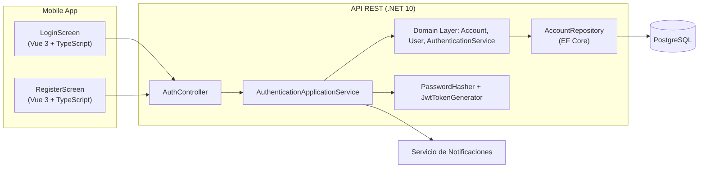

#### 2.6.1.6. Bounded Context Software Architecture Code Level Diagrams

##### 2.6.1.6.1. Bounded Context Domain Layer Class Diagrams

El siguiente diagrama de clases UML detalla las clases del Domain Layer del Bounded Context Authentication, incluyendo miembros (atributos y métodos con su scope), relaciones, dirección y multiplicidad:

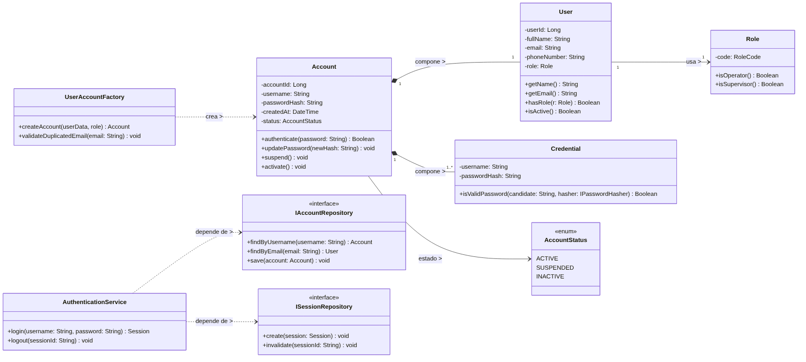

##### 2.6.1.6.2. Bounded Context Database Design Diagram

La siguiente tabla y el diagrama de base de datos muestran los objetos de persistencia del Bounded Context Authentication sobre una base de datos relacional:

| Tabla | Columnas | Constraints |
|---|---|---|
| `Users` | `user_id` (PK), `full_name`, `email` (UQ), `phone_number`, `role`, `status` | PK: `user_id`. |
| `Accounts` | `account_id` (PK), `user_id` (FK), `username` (UQ), `password_hash`, `created_at`, `status` | PK: `account_id`; FK: `user_id` → `Users(user_id)`. |
| `Sessions` | `session_id` (PK), `account_id` (FK), `token`, `created_at`, `expires_at`, `is_active` | PK: `session_id`; FK: `account_id` → `Accounts(account_id)`. |

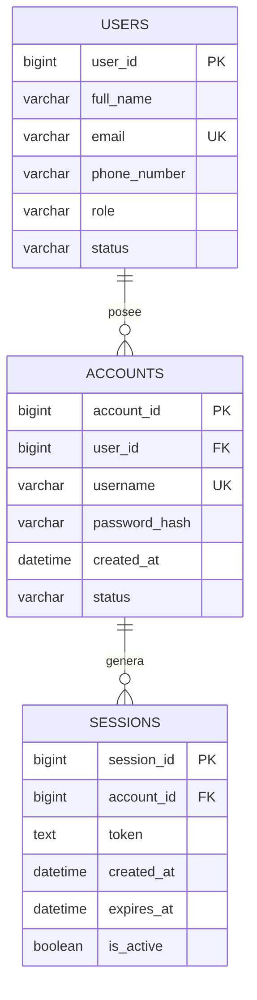

### 2.6.2. Bounded Context: Contract & Obligation Management

Este Bounded Context gestiona la información y operaciones relacionadas con los contratos de servicio y las obligaciones operativas derivadas de ellos, incluyendo su registro y asignación a los operarios de campo.

#### 2.6.2.1. Domain Layer

El Domain Layer representa el core del contexto mediante los agregados `ServiceContract` y `ServiceObligation`, encapsulando las reglas de negocio de registro de contratos, derivación de obligaciones a partir de las condiciones contractuales y la asignación de operarios. A continuación, se detalla el diccionario de clases del dominio:

| Clase | Categoría | Propósito | Atributos y métodos principales | Relaciones |
|---|---|---|---|---|
| `ServiceContract` | Aggregate Root | Representa el contrato de servicio con un cliente, origen de las obligaciones operativas. | Atributos: `contractId: Long`, `clientName: String`, `startDate: DateTime`, `endDate: DateTime`, `slaMinutes: Integer`, `status: ContractStatus`. Métodos: `activate(): void`, `suspend(): void`, `terminate(): void`, `hasObligations(): Boolean`. | 1..* con `ServiceObligation`. |
| `ServiceObligation` | Aggregate Root | Representa una obligación operativa recurrente derivada del contrato y asignada a un operario. | Atributos: `obligationId: Long`, `contractId: Long`, `siteName: String`, `address: Address`, `frequency: Frequency`, `timeWindow: TimeWindow`, `assignedOperator: Long`, `status: ObligationStatus`. Métodos: `assignOperator(operatorId: Long): void`, `reschedule(window: TimeWindow): void`, `markReady(): void`. | 1..* pertenecen a 1 `ServiceContract`; 1..1 con `Address`, `Frequency`, `TimeWindow`. |
| `Address` | Value Object | Ubicación del sitio donde se ejecuta la obligación. | Atributos: `street: String`, `city: String`, `country: String`(`PER`), `reference: String`. Métodos: `fullAddress(): String`. | Usado por `ServiceObligation`. |
| `Frequency` | Value Object | Periodicidad de ejecución de la obligación. | Atributos: `code: FrequencyCode` (`DAILY`, `WEEKLY`), `days: Set<DayOfWeek>`. Métodos: `isDueOn(date: DateTime): Boolean`. | Usado por `ServiceObligation`. |
| `TimeWindow` | Value Object | Ventana horaria permitida para ejecutar la obligación. | Atributos: `start: Time`, `end: Time`. Métodos: `isWithin(time: DateTime): Boolean`. | Usado por `ServiceObligation`. |
| `ContractStatus` | Enumeración | Estado del ciclo de vida del contrato. | Valores: `DRAFT`, `ACTIVE`, `SUSPENDED`, `TERMINATED`. | Usado por `ServiceContract`. |
| `ObligationStatus` | Enumeración | Estado del ciclo de vida de la obligación. | Valores: `PENDING`, `READY`, `OVERDUE`. | Usado por `ServiceObligation`. |
| `ObligationDerivator` | Domain Service | Deriva las obligaciones operativas a partir de las condiciones del contrato (sitio, frecuencia, ventana SLA). | Métodos: `deriveObligations(contract: ServiceContract): List<ServiceObligation>`. | Depende de `IObligationRepository`. |
| `ObligationFactory` | Factory | Crea instancias válidas de `ServiceObligation` garantizando unicidad por contrato y frecuencia. | Métodos: `create(contractId, site, frequency, window): ServiceObligation`, `validateDuplicated(): void`. | Crea `ServiceObligation`. |
| `IContractRepository` | Repository (interface) | Abstracción de persistencia de contratos. | Métodos: `findById(id): ServiceContract`, `save(contract): void`, `findActive(): List<ServiceContract>`. | Implementado en Infrastructure Layer. |
| `IObligationRepository` | Repository (interface) | Abstracción de persistencia de obligaciones. | Métodos: `findById(id): ServiceObligation`, `save(obligation): void`, `findByContract(contractId): List<ServiceObligation>`, `findDueOn(date): List<ServiceObligation>`. | Implementado en Infrastructure Layer. |

#### 2.6.2.2. Interface Layer

La Interface Layer expone los endpoints REST para registrar contratos, consultar obligaciones y asignar operarios, tanto para usuarios supervisor como para el operario móvil.

| Clase | Tipo | Endpoints | Responsabilidad |
|---|---|---|---|
| `ContractController` | Controller | `POST /contracts`, `GET /contracts/{id}`, `PUT /contracts/{id}` | Gestiona el registro y ciclo de vida comercial de los contratos. |
| `ObligationController` | Controller | `GET /obligations`, `GET /obligations/{id}`, `POST /obligations/{id}/assign` | Consulta obligaciones y realiza la asignación de operarios. |

#### 2.6.2.3. Application Layer

La Application Layer maneja los flujos de negocio del contexto mediante Command Handlers y Event Handlers, aplicando las capabilities del Bounded Context Canvas.

| Clase | Tipo | Operaciones | Eventos publicados/suscritos |
|---|---|---|---|
| `RegisterContractCommandHandler` | Command Handler | Procesa `RegisterContractCommand` (cliente, fechas, SLA). | Publica `ContractRegistered`. |
| `ActivateContractCommandHandler` | Command Handler | Activa el contrato y delega la derivación de obligaciones. | Publica `ContractActivated`. |
| `DeriveObligationsCommandHandler` | Command Handler | Ejecuta `ObligationDerivator` para generar las obligaciones del contrato. | Publica `ObligationsDerived`. |
| `AssignObligationCommandHandler` | Command Handler | Asigna la obligación a un operario de campo. | Publica `ObligationAssigned`. |
| `ContractActivatedEventHandler` | Event Handler | Reacciona a `ContractActivated` disparando la derivación de obligaciones. | Suscribe `ContractActivated`. |
| `ObligationAssignedEventHandler` | Event Handler | Reacciona a `ObligationAssigned` para notificar al operario móvil. | Suscribe `ObligationAssigned`. |

#### 2.6.2.4. Infrastructure Layer

La Infrastructure Layer implementa los repositorios del dominio y el acceso a servicios externos del contexto.

| Clase | Responsabilidad | Tecnología / Servicio externo |
|---|---|---|
| `ContractRepository` | Implementa `IContractRepository` para persistir contratos. | EF Core + PostgreSQL. |
| `ObligationRepository` | Implementa `IObligationRepository` para persistir obligaciones. | EF Core + PostgreSQL. |
| `ObligationDueJob` | Proceso programado que detecta obligaciones que superan su ventana SLA y las marca como `OVERDUE`. | Background Service (.NET 10) / Quartz. |
| `NotificationClient` | Notifica al operario la asignación de una obligación. | API REST externa de notificaciones. |

#### 2.6.2.5. Bounded Context Software Architecture Component Level Diagrams

El siguiente diagrama de componentes (C4 Model) muestra la descomposición de los containers de la solución para el Bounded Context Contract & Obligation Management:

| Component | Container | Responsabilidad | Detalles de implementación |
|---|---|---|---|
| `ContractListScreen` | Mobile App (Supervisor) | Interfaz de registro y consulta de contratos. | Vue 3 + TypeScript. |
| `ContractController` | API REST | Recibe peticiones HTTP de contratos. | .NET 10 / ASP.NET Core Web API. |
| `ObligationController` | API REST | Recibe peticiones HTTP de obligaciones. | .NET 10 / ASP.NET Core Web API. |
| `ContractApplicationService` | API REST | Orquesta registro, activación y derivación de obligaciones. | C# / .NET 10. |
| `ContractRepository` / `ObligationRepository` | API REST | Persistencia de contratos y obligaciones. | EF Core + PostgreSQL. |
| `ObligationDueJob` | API REST | Detecta obligaciones vencidas según SLA. | Background Service / Quartz. |

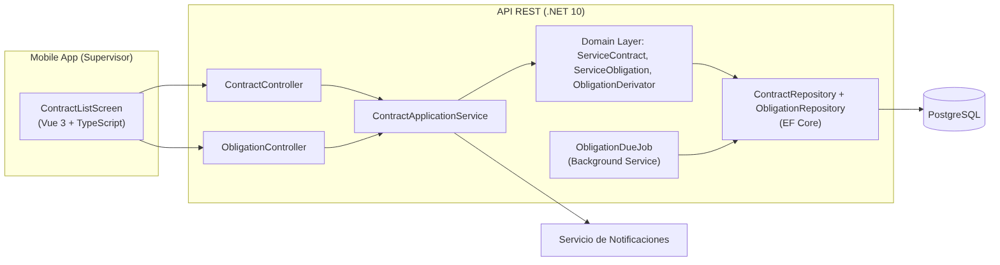

#### 2.6.2.6. Bounded Context Software Architecture Code Level Diagrams

##### 2.6.2.6.1. Bounded Context Domain Layer Class Diagrams

El siguiente diagrama de clases UML detalla las clases del Domain Layer del Bounded Context Contract & Obligation Management, incluyendo miembros, relaciones, dirección y multiplicidad:

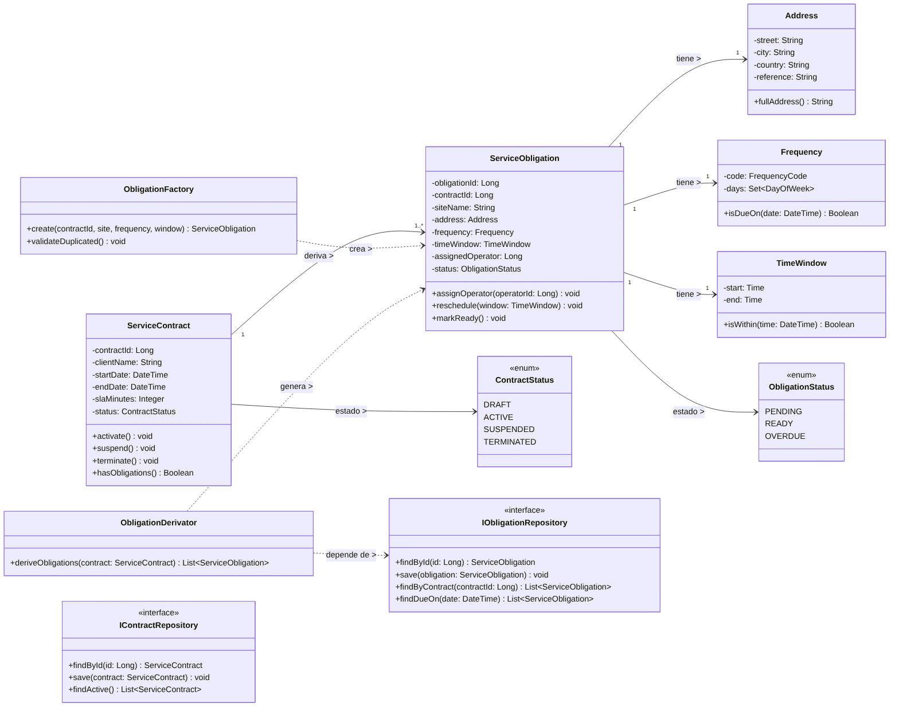

##### 2.6.2.6.2. Bounded Context Database Design Diagram

La siguiente tabla y el diagrama de base de datos muestran los objetos de persistencia del Bounded Context Contract & Obligation Management sobre una base de datos relacional:

| Tabla | Columnas | Constraints |
|---|---|---|
| `ServiceContracts` | `contract_id` (PK), `client_name`, `start_date`, `end_date`, `sla_minutes`, `status` | PK: `contract_id`. |
| `ServiceObligations` | `obligation_id` (PK), `contract_id` (FK), `site_name`, `street`, `city`, `country`, `reference`, `frequency`, `time_window_start`, `time_window_end`, `assigned_operator_id`, `status` | PK: `obligation_id`; FK: `contract_id` → `ServiceContracts(contract_id)`. |

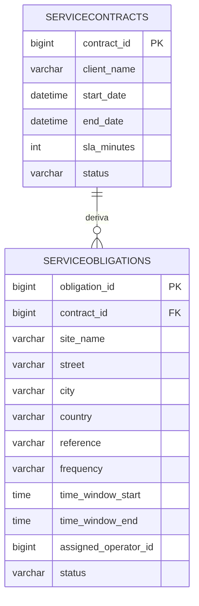

### 2.6.3. Bounded Context: Field Execution & Evidence

Este Bounded Context gestiona la ejecución de obligaciones en campo y la captura de evidencia asociada (foto, código QR, ubicación), incluyendo el soporte de registro sin conexión y su posterior sincronización. Constituye el **core domain** de la solución.

#### 2.6.3.1. Domain Layer

El Domain Layer representa el core de la solución mediante el agregado `ObligationExecution`, que agrupa la evidencia capturada durante la ejecución y coordina las reglas de negocio de cierre de ejecución (validación de evidencia mínima, geolocalización y registro offline).

| Clase | Categoría | Propósito | Atributos y métodos principales | Relaciones |
|---|---|---|---|---|
| `ObligationExecution` | Aggregate Root | Representa la ejecución de una obligación por parte de un operario, agrupando la evidencia capturada. | Atributos: `executionId: Long`, `obligationId: Long`, `operatorId: Long`, `startedAt: DateTime`, `completedAt: DateTime`, `status: ExecutionStatus`, `isOffline: Boolean`. Métodos: `start(): void`, `registerEvidence(e: Evidence): void`, `complete(): void`, `markOffline(): void`, `isComplete(): Boolean`. | 1..* con `Evidence`. |
| `Evidence` | Entity | Representa una pieza de evidencia de la ejecución (foto, código QR o ubicación). | Atributos: `evidenceId: Long`, `executionId: Long`, `type: EvidenceType`, `url: String`, `capturedAt: DateTime`, `location: GeoLocation`. Métodos: `isValid(): Boolean`, `type(): EvidenceType`. | Pertenecen a 1 `ObligationExecution`. |
| `EvidenceType` | Enumeración | Tipo de evidencia capturada. | Valores: `PHOTO`, `QR_CODE`, `LOCATION`. | Usado por `Evidence`. |
| `ExecutionStatus` | Enumeración | Estado del ciclo de vida de la ejecución. | Valores: `PENDING`, `IN_PROGRESS`, `COMPLETED`, `SYNCED`. | Usado por `ObligationExecution`. |
| `GeoLocation` | Value Object | Coordenadas de la ubicación donde se registró la evidencia. | Atributos: `latitude: Double`, `longitude: Double`, `accuracy: Double`. Métodos: `isNear(expected: GeoLocation, radiusM: Double): Boolean`. | Usado por `Evidence`. |
| `OfflineBatch` | Value Object | Identifica el lote de registros capturados sin conexión para su sincronización. | Atributos: `batchId: UUID`, `createdAt: DateTime`, `pendingCount: Integer`. Métodos: `add(execution: ObligationExecution): void`. | Agrupa `ObligationExecution`. |
| `ExecutionRegistrar` | Domain Service | Orquesta el inicio, el registro de evidencia y el cierre de la ejecución, validando la evidencia mínima requerida. | Métodos: `start(obligationId, operator): ObligationExecution`, `complete(execution): void`, `validateEvidence(execution): Boolean`. | Depende de `IExecutionRepository` e `IEvidenceRepository`. |
| `EvidenceValidator` | Domain Service | Valida la calidad y requisitos de la evidencia capturada (presencia obligatoria de foto, QR y ubicación). | Métodos: `validate(evidence: Evidence): ValidationResult`. | Depende de `Evidence`. |
| `IExecutionRepository` | Repository (interface) | Abstracción de persistencia de ejecuciones. | Métodos: `findById(id): ObligationExecution`, `save(execution): void`, `findByOperator(operatorId): List<ObligationExecution>`, `findPendingSync(): List<ObligationExecution>`. | Implementado en Infrastructure Layer. |
| `IEvidenceRepository` | Repository (interface) | Abstracción de persistencia de evidencia. | Métodos: `save(evidence): void`, `findByExecution(executionId): List<Evidence>`. | Implementado en Infrastructure Layer. |

#### 2.6.3.2. Interface Layer

La Interface Layer expone los endpoints rest para que el operario móvil ejecute obligaciones y registre evidencia, así como el ingreso del sincronizador de registros offline.

| Clase | Tipo | Endpoints | Responsabilidad |
|---|---|---|---|
| `ExecutionController` | Controller | `POST /executions`, `POST /executions/{id}/complete`, `GET /executions/operator/{operatorId}` | Gestiona el inicio y cierre de ejecuciones en campo. |
| `EvidenceController` | Controller | `POST /executions/{id}/evidences`, `GET /executions/{id}/evidences` | Registra y consulta la evidencia capturada. |
| `SyncController` | Controller | `POST /sync/offline-batches`, `GET /sync/status` | Recibe los lotes de registros capturados sin conexión para su sincronización. |

#### 2.6.3.3. Application Layer

La Application Layer maneja los flujos de negocio del contexto (inicio, captura, cierre y sincronización) mediante Command Handlers y Event Handlers, aplicando las capabilities del núcleo de la solución.

| Clase | Tipo | Operaciones | Eventos publicados/suscritos |
|---|---|---|---|
| `StartExecutionCommandHandler` | Command Handler | Procesa `StartExecutionCommand` (obligación, operario) y delega en `ExecutionRegistrar`. | Publica `ExecutionStarted`. |
| `RegisterEvidenceCommandHandler` | Command Handler | Procesa `RegisterEvidenceCommand` (tipo, url, ubicación) y valida la evidencia. | Publica `EvidenceRegistered`. |
| `CompleteExecutionCommandHandler` | Command Handler | Procesa `CompleteExecutionCommand` validando la evidencia mínima y cerrando la ejecución. | Publica `ExecutionCompleted`. |
| `SyncOfflineBatchCommandHandler` | Command Handler | Procesa `SyncOfflineBatchCommand` para sincronizar ejecuciones registradas sin conexión. | Publica `OfflineBatchSynced`. |
| `ExecutionStartedEventHandler` | Event Handler | Reacciona a `ExecutionStarted` para notificar el inicio de la ejecución. | Suscribe `ExecutionStarted`. |
| `ExecutionCompletedEventHandler` | Event Handler | Reacciona a `ExecutionCompleted` para publicar el evento de dominio hacia el contexto Incident & Corrective Action (evaluación SLA) y Compliance Reporting (consolidación). | Suscribe `ExecutionCompleted`; publica integración. |

#### 2.6.3.4. Infrastructure Layer

La Infrastructure Layer implementa los repositorios del dominio, el almacenamiento de archivos de evidencia y el acceso a recursos del dispositivo móvil y servicios externos.

| Clase | Responsabilidad | Tecnología / Servicio externo |
|---|---|---|
| `ExecutionRepository` | Implementa `IExecutionRepository` para persistir ejecuciones. | EF Core + PostgreSQL. |
| `EvidenceRepository` | Implementa `IEvidenceRepository` para persistir evidencia. | EF Core + PostgreSQL. |
| `LocalExecutionStore` | Almacena las ejecuciones y evidencia capturadas sin conexión en el dispositivo. | SQLite local (dispositivo móvil). |
| `MediaStorageService` | Almacena las imágenes (fotos) de evidencia. | Bucket de almacenamiento (S3). |
| `QrCodeReader` | Acceso al componente de lectura de códigos QR en la cámara. | Librería nativa (ZXing / CameraX). |
| `GeolocationService` | Acceso al GPS del dispositivo para registrar la ubicación. | APIs de ubicación del dispositivo. |

#### 2.6.3.5. Bounded Context Software Architecture Component Level Diagrams

El siguiente diagrama de componentes (C4 Model) muestra la descomposición de los containers de la solución para el Bounded Context Field Execution & Evidence (core domain):

| Component | Container | Responsabilidad | Detalles de implementación |
|---|---|---|---|
| `ExecutionScreen` | Mobile App (Operario) | Interfaz de consulta, inicio y cierre de ejecución de la obligación. | Vue 3 + TypeScript. |
| `EvidenceCaptureScreen` | Mobile App (Operario) | Captura de foto, lectura de QR y geolocalización. | Vue 3 + TypeScript + librerías nativas. |
| `LocalExecutionStore` | Mobile App (Operario) | Persistencia offline de ejecuciones y evidencia. | SQLite local. |
| `ExecutionController` / `EvidenceController` / `SyncController` | API REST | Reciben las peticiones de ejecución, evidencia y sincronización. | .NET 10 / ASP.NET Core Web API. |
| `ExecutionApplicationService` | API REST | Orquesta inicio, registro de evidencia, cierre y sincronización. | C# / .NET 10. |
| `ExecutionRepository` / `EvidenceRepository` | API REST | Persistencia de ejecuciones y evidencia. | EF Core + PostgreSQL. |
| `MediaStorageService` | API REST | Almacena las fotos de evidencia. | Amazon S3. |

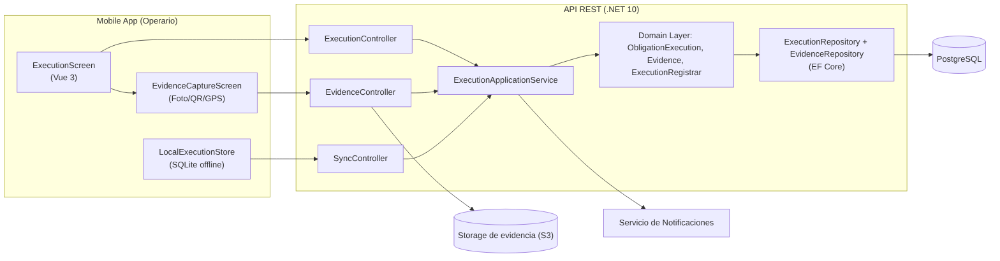

#### 2.6.3.6. Bounded Context Software Architecture Code Level Diagrams

##### 2.6.3.6.1. Bounded Context Domain Layer Class Diagrams

El siguiente diagrama de clases UML detalla las clases del Domain Layer del Bounded Context Field Execution & Evidence, incluyendo miembros, relaciones, dirección y multiplicidad:

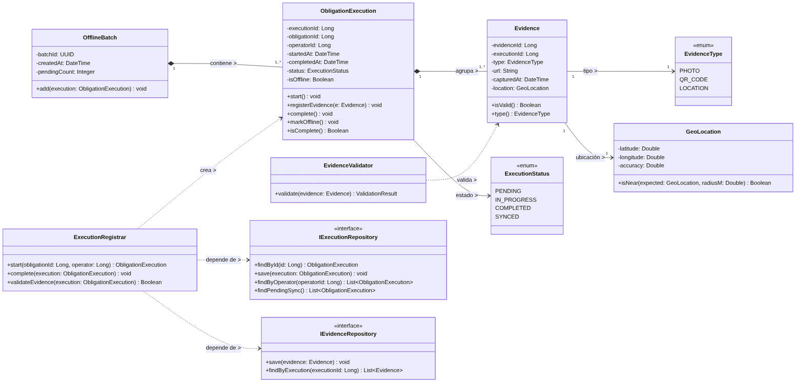

##### 2.6.3.6.2. Bounded Context Database Design Diagram

La siguiente tabla y el diagrama de base de datos muestran los objetos de persistencia del Bounded Context Field Execution & Evidence sobre una base de datos relacional:

| Tabla | Columnas | Constraints |
|---|---|---|
| `ObligationExecutions` | `execution_id` (PK), `obligation_id` (FK), `operator_id`, `started_at`, `completed_at`, `status`, `is_offline` | PK: `execution_id`; FK: `obligation_id` → `ServiceObligations(obligation_id)`. |
| `Evidences` | `evidence_id` (PK), `execution_id` (FK), `type`, `url`, `captured_at`, `latitude`, `longitude`, `accuracy` | PK: `evidence_id`; FK: `execution_id` → `ObligationExecutions(execution_id)`. |

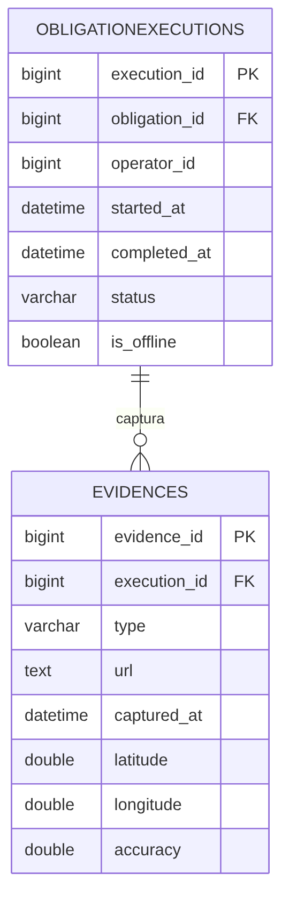

### 2.6.4. Bounded Context: Incident & Corrective Action

Este Bounded Context gestiona la evaluación del cumplimiento de SLA, la detección de incumplimientos y el ciclo de vida de las incidencias generadas junto con sus acciones correctivas asignadas por el supervisor.

#### 2.6.4.1. Domain Layer

El Domain Layer representa el core del contexto mediante el agregado `Incident`, que agrupa las acciones correctivas asociadas y encapsula las reglas de negocio de evaluación de SLA, apertura, resolución y cierre de incidencias.

| Clase | Categoría | Propósito | Atributos y métodos principales | Relaciones |
|---|---|---|---|---|
| `Incident` | Aggregate Root | Representa una incidencia generada ante un incumplimiento de la obligación, con su ciclo de vida completo. | Atributos: `incidentId: Long`, `obligationId: Long`, `type: IncidentType`, `severity: Severity`, `description: String`, `openedAt: DateTime`, `status: IncidentStatus`. Métodos: `open(): void`, `assignAction(action: CorrectiveAction): void`, `resolve(): void`, `close(): void`. | 1..* con `CorrectiveAction`. |
| `CorrectiveAction` | Entity | Representa la acción correctiva asignada al operario por el supervisor para subsanar la incidencia. | Atributos: `actionId: Long`, `incidentId: Long`, `description: String`, `assignedOperatorId: Long`, `dueDate: DateTime`, `status: ActionStatus`. Métodos: `assign(operatorId: Long): void`, `complete(): void`. | Pertenecen a 1 `Incident`. |
| `ComplianceResult` | Value Object | Resultado de la evaluación SLA sobre la ejecución de una obligación. | Atributos: `executionId: Long`, `isCompliant: Boolean`, `deviationMinutes: Integer`, `evaluatedAt: DateTime`. Métodos: `isCompliant(): Boolean`. | Resultado del `SlaEvaluator`. |
| `IncidentType` | Enumeración | Tipo de incidencia detectada. | Valores: `SLA_BREACH`, `EVIDENCE_MISSING`, `GEO_MISMATCH`. | Usado por `Incident`. |
| `Severity` | Enumeración | Nivel de severidad de la incidencia. | Valores: `LOW`, `MEDIUM`, `HIGH`. | Usado por `Incident`. |
| `IncidentStatus` | Enumeración | Estado del ciclo de vida de la incidencia. | Valores: `OPEN`, `ACTION_ASSIGNED`, `RESOLVED`, `CLOSED`. | Usado por `Incident`. |
| `ActionStatus` | Enumeración | Estado de la acción correctiva. | Valores: `PENDING`, `IN_PROGRESS`, `COMPLETED`. | Usado por `CorrectiveAction`. |
| `SlaEvaluator` | Domain Service | Evalúa si una ejecución cumplió la ventana SLA del contrato. | Métodos: `evaluate(execution, contract): ComplianceResult`. | Depende de `IExecutionDataProvider`. |
| `IncidentFactory` | Factory | Crea instancias válidas de `Incident` a partir de un `ComplianceResult` incumplido. | Métodos: `createFromNonCompliance(result: ComplianceResult): Incident`. | Crea `Incident`. |
| `IIncidentRepository` | Repository (interface) | Abstracción de persistencia de incidencias. | Métodos: `findById(id): Incident`, `save(incident): void`, `findOpen(): List<Incident>`. | Implementado en Infrastructure Layer. |
| `ICorrectiveActionRepository` | Repository (interface) | Abstracción de persistencia de acciones correctivas. | Métodos: `save(action): void`, `findByIncident(incidentId): List<CorrectiveAction>`. | Implementado en Infrastructure Layer. |

#### 2.6.4.2. Interface Layer

La Interface Layer expone los endpoints rest para que el supervisor consulte, asigne y resuelva incidencias y acciones correctivas, así como el ingreso de la evaluación automática de SLA.

| Clase | Tipo | Endpoints | Responsabilidad |
|---|---|---|---|
| `IncidentController` | Controller | `GET /incidents`, `GET /incidents/{id}`, `POST /incidents/{id}/resolve` | Consulta y gestiona el ciclo de vida de las incidencias. |
| `CorrectiveActionController` | Controller | `POST /incidents/{id}/actions`, `PUT /actions/{id}/complete` | Asigna y finaliza las acciones correctivas. |
| `SlaEvaluationConsumer` | Consumer | Consume el evento `ExecutionCompleted` para disparar la evaluación SLA. | Suscriptor del bus de eventos de integración. |

#### 2.6.4.3. Application Layer

La Application Layer maneja los flujos de negocio del contexto (evaluación, apertura, asignación y resolución) mediante Command Handlers y Event Handlers.

| Clase | Tipo | Operaciones | Eventos publicados/suscritos |
|---|---|---|---|
| `EvaluateSlaCommandHandler` | Command Handler | Procesa `EvaluateSlaCommand` (ejecución, contrato) y delega en `SlaEvaluator`. | Publica `SlaEvaluated`. |
| `RegisterIncidentCommandHandler` | Command Handler | Procesa `RegisterIncidentCommand` con el resultado de incumplimiento y crea el `Incident` mediante `IncidentFactory`. | Publica `IncidentOpened`. |
| `AssignCorrectiveActionCommandHandler` | Command Handler | Procesa `AssignCorrectiveActionCommand` (incidencia, operario, tarea). | Publica `CorrectiveActionAssigned`. |
| `ResolveIncidentCommandHandler` | Command Handler | Procesa `ResolveIncidentCommand` al completarse la acción correctiva. | Publica `IncidentResolved`. |
| `CloseIncidentCommandHandler` | Command Handler | Procesa `CloseIncidentCommand` para el cierre definitivo de la incidencia. | Publica `IncidentClosed`. |
| `ExecutionCompletedEventHandler` | Event Handler | Reacciona al evento `ExecutionCompleted` del contexto Field Execution & Evidence y dispara la evaluación SLA. | Suscribe `ExecutionCompleted`; publica `EvaluateSlaCommand`. |
| `SlaEvaluatedEventHandler` | Event Handler | Reacciona a `SlaEvaluated`; si el resultado es no conforme, dispara el registro de la incidencia. | Suscribe `SlaEvaluated`. |
| `IncidentResolvedEventHandler` | Event Handler | Reacciona a `IncidentResolved` para notificar al supervisor. | Suscribe `IncidentResolved`. |

#### 2.6.4.4. Infrastructure Layer

La Infrastructure Layer implementa los repositorios del dominio, la lectura de datos de ejecución para la evaluación SLA y el acceso al servicio externo de notificaciones.

| Clase | Responsabilidad | Tecnología / Servicio externo |
|---|---|---|
| `IncidentRepository` | Implementa `IIncidentRepository` para persistir incidencias. | EF Core + PostgreSQL. |
| `CorrectiveActionRepository` | Implementa `ICorrectiveActionRepository` para persistir acciones correctivas. | EF Core + PostgreSQL. |
| `ExecutionDataProvider` | Implementa `IExecutionDataProvider` obteniendo datos de ejecución del contexto Field Execution & Evidence para la evaluación SLA. | Lectura sobre la base de datos del contexto / API. |
| `EventBus` | Consume y publica los eventos de integración del contexto. | RabbitMQ / MassTransit. |
| `NotificationClient` | Notifica al supervisor la apertura y resolución de incidencias. | API REST externa de notificaciones. |

#### 2.6.4.5. Bounded Context Software Architecture Component Level Diagrams

El siguiente diagrama de componentes (C4 Model) muestra la descomposición de los containers de la solución para el Bounded Context Incident & Corrective Action:

| Component | Container | Responsabilidad | Detalles de implementación |
|---|---|---|---|
| `IncidentsScreen` | Mobile App (Supervisor) | Interfaz de consulta de incidencias y acciones correctivas. | Vue 3 + TypeScript. |
| `IncidentController` / `CorrectiveActionController` | API REST | Reciben las peticiones de incidencias y acciones correctivas. | .NET 10 / ASP.NET Core Web API. |
| `IncidentApplicationService` | API REST | Orquesta evaluación, apertura, asignación y resolución. | C# / .NET 10. |
| `SlaEvaluator` | API REST | Evalúa el cumplimiento SLA de la ejecución. | C# / .NET 10. |
| `IncidentRepository` / `CorrectiveActionRepository` | API REST | Persistencia de incidencias y acciones. | EF Core + PostgreSQL. |
| `EventBus` | API REST | Consume `ExecutionCompleted` y publica eventos de negocio. | RabbitMQ / MassTransit. |

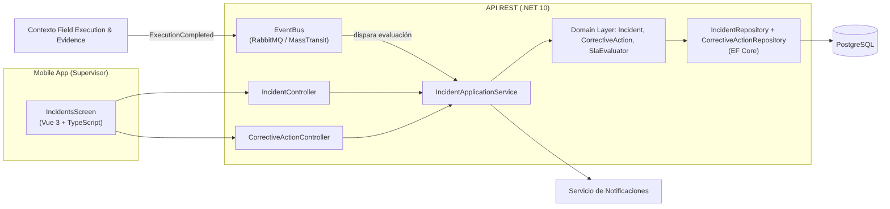

#### 2.6.4.6. Bounded Context Software Architecture Code Level Diagrams

##### 2.6.4.6.1. Bounded Context Domain Layer Class Diagrams

El siguiente diagrama de clases UML detalla las clases del Domain Layer del Bounded Context Incident & Corrective Action, incluyendo miembros, relaciones, dirección y multiplicidad:

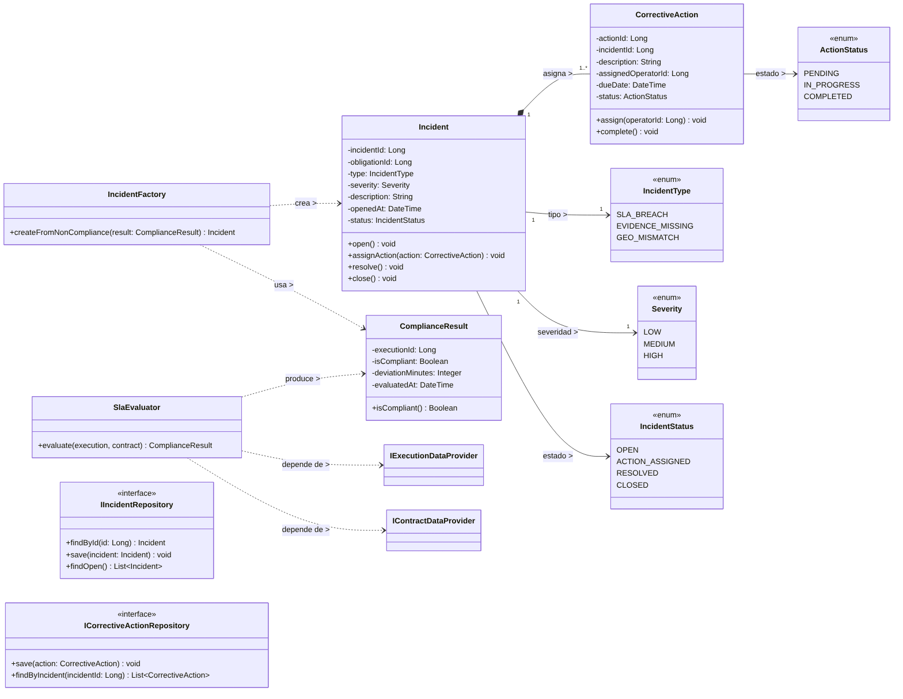

##### 2.6.4.6.2. Bounded Context Database Design Diagram

La siguiente tabla y el diagrama de base de datos muestran los objetos de persistencia del Bounded Context Incident & Corrective Action sobre una base de datos relacional:

| Tabla | Columnas | Constraints |
|---|---|---|
| `Incidents` | `incident_id` (PK), `obligation_id` (FK), `type`, `severity`, `description`, `opened_at`, `status` | PK: `incident_id`; FK: `obligation_id` → `ServiceObligations(obligation_id)`. |
| `CorrectiveActions` | `action_id` (PK), `incident_id` (FK), `description`, `assigned_operator_id`, `due_date`, `status` | PK: `action_id`; FK: `incident_id` → `Incidents(incident_id)`. |
| `SlaEvaluations` | `evaluation_id` (PK), `execution_id` (FK), `is_compliant`, `deviation_minutes`, `evaluated_at` | PK: `evaluation_id`; FK: `execution_id` → `ObligationExecutions(execution_id)`. |

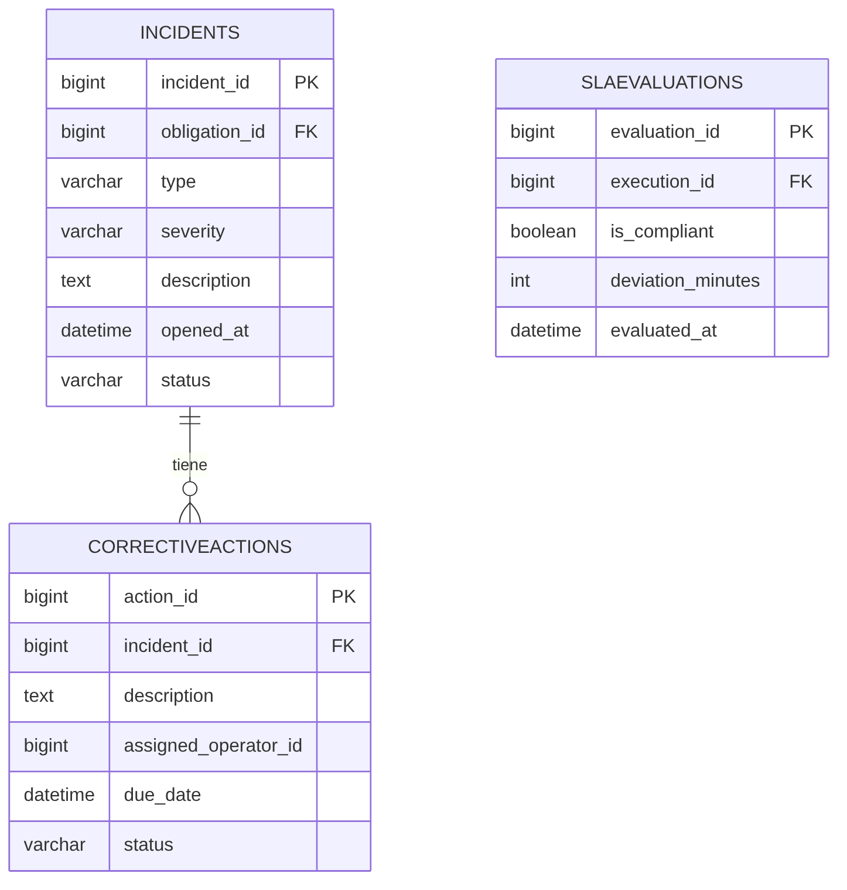

### 2.6.5. Bounded Context: Compliance Reporting

Este Bounded Context consolida información proveniente de los demás contextos para la generación de reportes de cumplimiento e indicadores, así como el envío de notificaciones automáticas de vencimientos y cambios de estado.

#### 2.6.5.1. Domain Layer

El Domain Layer representa el core del contexto mediante el agregado `ComplianceReport`, que agrupa los indicadores de cumplimiento calculados a partir de la información consolidada de ejecuciones e incidencias.

| Clase | Categoría | Propósito | Atributos y métodos principales | Relaciones |
|---|---|---|---|---|
| `ComplianceReport` | Aggregate Root | Representa un reporte de cumplimiento correspondiente a un contrato en un período determinado. | Atributos: `reportId: Long`, `contractId: Long`, `period: ReportPeriod`, `generatedAt: DateTime`, `status: ReportStatus`, `overallRate: Double`. Métodos: `generate(): void`, `addIndicator(i: ReportIndicator): void`, `markAsSent(): void`. | 1..* con `ReportIndicator`. |
| `ReportIndicator` | Entity | Representa un indicador calculado del reporte (ej. tasa de cumplimiento, incidencias abiertas). | Atributos: `indicatorId: Long`, `reportId: Long`, `name: String`, `value: Double`, `unit: String`. Métodos: `value(): Double`. | Pertenecen a 1 `ComplianceReport`. |
| `ReportPeriod` | Value Object | Período de cobertura del reporte. | Atributos: `startDate: DateTime`, `endDate: DateTime`. Métodos: `contains(date: DateTime): Boolean`. | Usado por `ComplianceReport`. |
| `ReportStatus` | Enumeración | Estado del ciclo de vida del reporte. | Valores: `GENERATING`, `READY`, `SENT`. | Usado por `ComplianceReport`. |
| `ReportConsolidator` | Domain Service | Consolida la información de ejecuciones e incidencias y calcula los indicadores del reporte. | Métodos: `consolidate(contractId, period): CompositionRoot`, `computeOverallRate(data): Double`. | Depende de la data consolidada de los contextos de ejecución e incidencias. |
| `ReportFactory` | Factory | Crea instancias válidas de `ComplianceReport` para un contrato y período. | Métodos: `create(contractId, period): ComplianceReport`, `validateNoDuplicate(period): void`. | Crea `ComplianceReport`. |
| `IComplianceReportRepository` | Repository (interface) | Abstracción de persistencia de reportes. | Métodos: `findById(id): ComplianceReport`, `save(report): void`, `findByContractAndPeriod(contractId, period): ComplianceReport`. | Implementado en Infrastructure Layer. |
| `IReportIndicatorRepository` | Repository (interface) | Abstracción de persistencia de indicadores. | Métodos: `save(indicator): void`, `findByReport(reportId): List<ReportIndicator>`. | Implementado en Infrastructure Layer. |

#### 2.6.5.2. Interface Layer

La Interface Layer expone los endpoints rest para que el supervisor consulte reportes e indicadores, así como el ingreso de datos consolidados de los demás contextos.

| Clase | Tipo | Endpoints | Responsabilidad |
|---|---|---|---|
| `ReportController` | Controller | `POST /reports`, `GET /reports/{id}`, `GET /reports/contract/{contractId}` | Genera y consulta reportes de cumplimiento. |
| `DashboardController` | Controller | `GET /dashboard/summary`, `GET /dashboard/trends` | Expone los indicadores de cumplimiento para el tablero del supervisor. |
| `ExecutionDataConsumer` | Consumer | Consume eventos de ejecuciones e incidencias para actualizar el repositorio de consolidación. | Suscriptor del bus de eventos de integración. |

#### 2.6.5.3. Application Layer

La Application Layer maneja los flujos de negocio del contexto (generación, consolidación, publicación y notificaciones) mediante Command Handlers y Event Handlers.

| Clase | Tipo | Operaciones | Eventos publicados/suscritos |
|---|---|---|---|
| `GenerateReportCommandHandler` | Command Handler | Procesa `GenerateReportCommand` (contrato, período) y delega en `ReportConsolidator`. | Publica `ReportGenerated`. |
| `PublishReportCommandHandler` | Command Handler | Procesa `PublishReportCommand` para publicar el reporte al supervisor. | Publica `ReportPublished`. |
| `ScheduleNotificationCommandHandler` | Command Handler | Procesa `ScheduleNotificationCommand` para alertas de vencimientos (obligaciones due) y cambios de estado. | Publica `NotificationScheduled`. |
| `ExecutionCompletedEventHandler` | Event Handler | Reacciona a `ExecutionCompleted` y actualiza la información de consolidación del contexto. | Suscribe `ExecutionCompleted`. |
| `IncidentClosedEventHandler` | Event Handler | Reacciona a `IncidentClosed` y actualiza los indicadores de cumplimiento. | Suscribe `IncidentClosed`. |
| `ReportGeneratedEventHandler` | Event Handler | Reacciona a `ReportGenerated` para notificar al supervisor la disponibilidad del reporte. | Suscribe `ReportGenerated`. |

#### 2.6.5.4. Infrastructure Layer

La Infrastructure Layer implementa los repositorios del dominio, el almacenamiento de datos consolidados y el acceso al servicio externo de notificaciones.

| Clase | Responsabilidad | Tecnología / Servicio externo |
|---|---|---|
| `ComplianceReportRepository` | Implementa `IComplianceReportRepository` para persistir reportes. | EF Core + PostgreSQL. |
| `ReportIndicatorRepository` | Implementa `IReportIndicatorRepository` para persistir indicadores. | EF Core + PostgreSQL. |
| `ConsolidatedDataStore` | Almacena la información consolidada de ejecuciones e incidencias para el cálculo de indicadores. | Vistas materializadas / tablas de consolidación. |
| `EventBus` | Consume los eventos de integración de los demás contextos. | RabbitMQ / MassTransit. |
| `NotificationClient` | Envía notificaciones de reportes disponibles y alertas de vencimiento. | API REST externa de notificaciones. |

#### 2.6.5.5. Bounded Context Software Architecture Component Level Diagrams

El siguiente diagrama de componentes (C4 Model) muestra la descomposición de los containers de la solución para el Bounded Context Compliance Reporting:

| Component | Container | Responsabilidad | Detalles de implementación |
|---|---|---|---|
| `DashboardScreen` | Mobile App (Supervisor) | Interfaz de indicadores y reportes de cumplimiento. | Vue 3 + TypeScript. |
| `ReportController` / `DashboardController` | API REST | Reciben las peticiones de reportes e indicadores. | .NET 10 / ASP.NET Core Web API. |
| `ReportApplicationService` | API REST | Orquesta generación, consolidación y publicación de reportes. | C# / .NET 10. |
| `ReportConsolidator` | API REST | Consolida datos de ejecuciones e incidencias y calcula indicadores. | C# / .NET 10. |
| `ComplianceReportRepository` | API REST | Persistencia de reportes e indicadores. | EF Core + PostgreSQL. |
| `EventBus` | API REST | Consume eventos de los demás contextos. | RabbitMQ / MassTransit. |

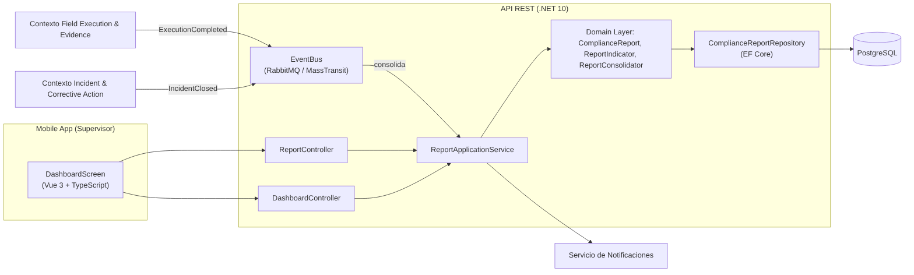

#### 2.6.5.6. Bounded Context Software Architecture Code Level Diagrams

##### 2.6.5.6.1. Bounded Context Domain Layer Class Diagrams

El siguiente diagrama de clases UML detalla las clases del Domain Layer del Bounded Context Compliance Reporting, incluyendo miembros, relaciones, dirección y multiplicidad:

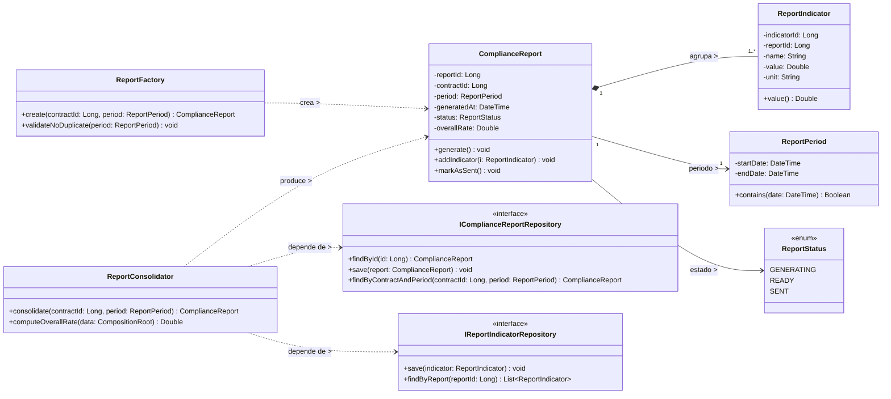

##### 2.6.5.6.2. Bounded Context Database Design Diagram

La siguiente tabla y el diagrama de base de datos muestran los objetos de persistencia del Bounded Context Compliance Reporting sobre una base de datos relacional:

| Tabla               | Columnas                                                                                                     | Constraints                                                              |
| ------------------- | ------------------------------------------------------------------------------------------------------------ | ------------------------------------------------------------------------ |
| `ComplianceReports` | `report_id` (PK), `contract_id` (FK), `period_start`, `period_end`, `generated_at`, `status`, `overall_rate` | PK: `report_id`; FK: `contract_id` → `ServiceContracts(contract_id)`.    |
| `ReportIndicators`  | `indicator_id` (PK), `report_id` (FK), `name`, `value`, `unit`                                               | PK: `indicator_id`; FK: `report_id` → `ComplianceReports(report_id)`.    |
| `Notifications`     | `notification_id` (PK), `report_id` (FK), `recipient_id`, `type`, `sent_at`, `status`                        | PK: `notification_id`; FK: `report_id` → `ComplianceReports(report_id)`. |

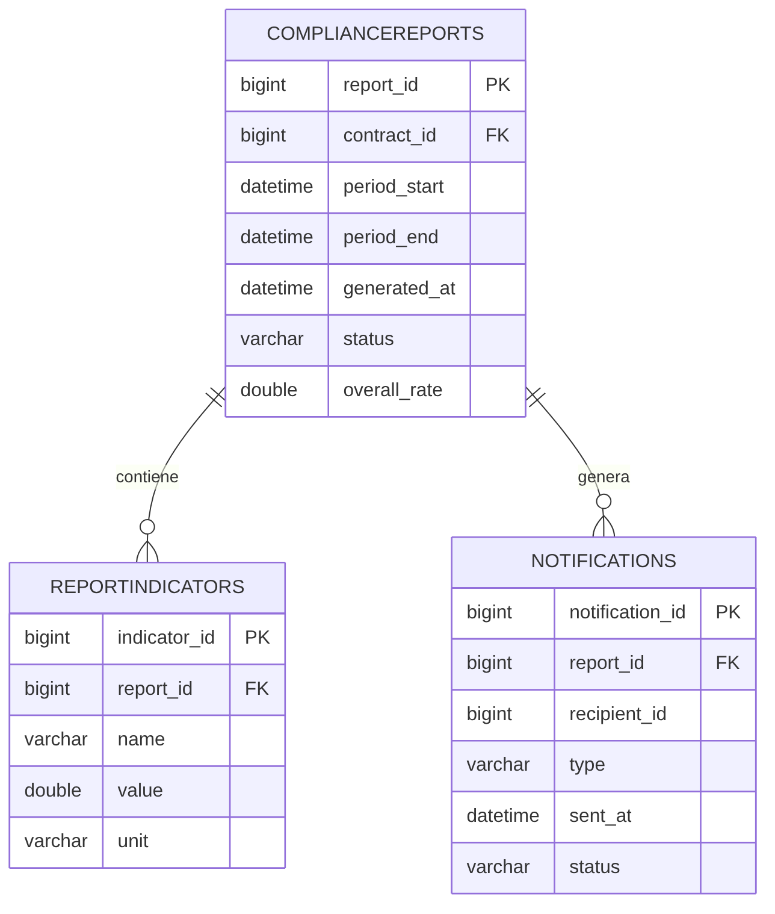

