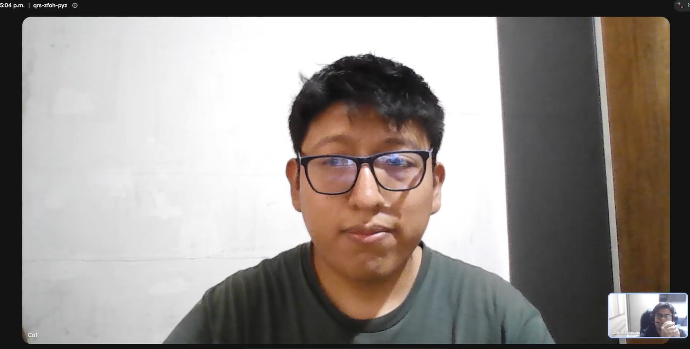
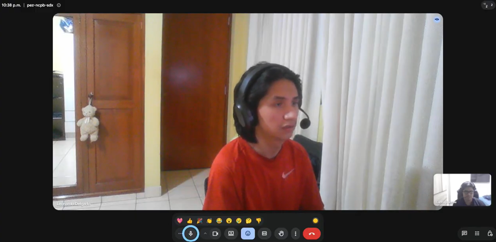
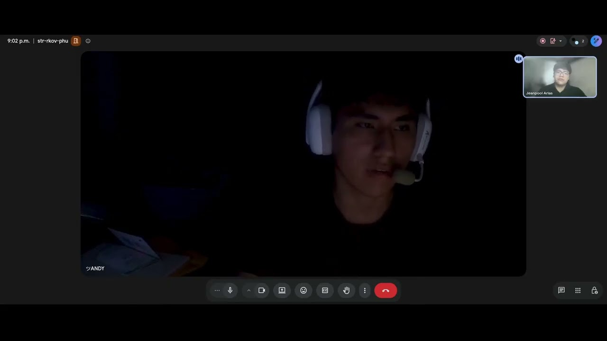
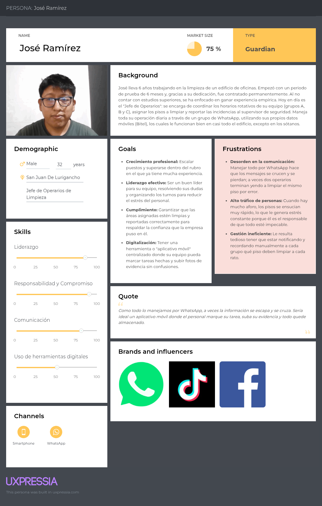
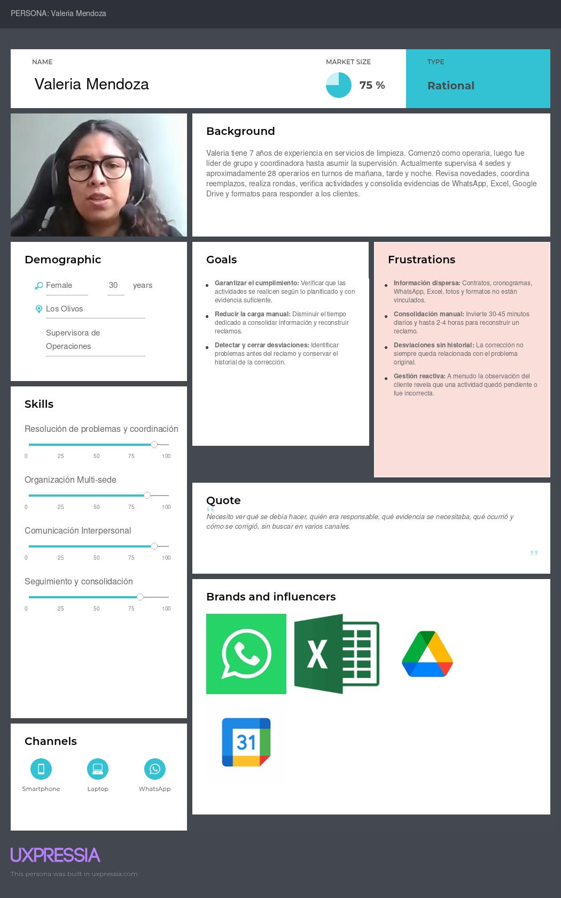
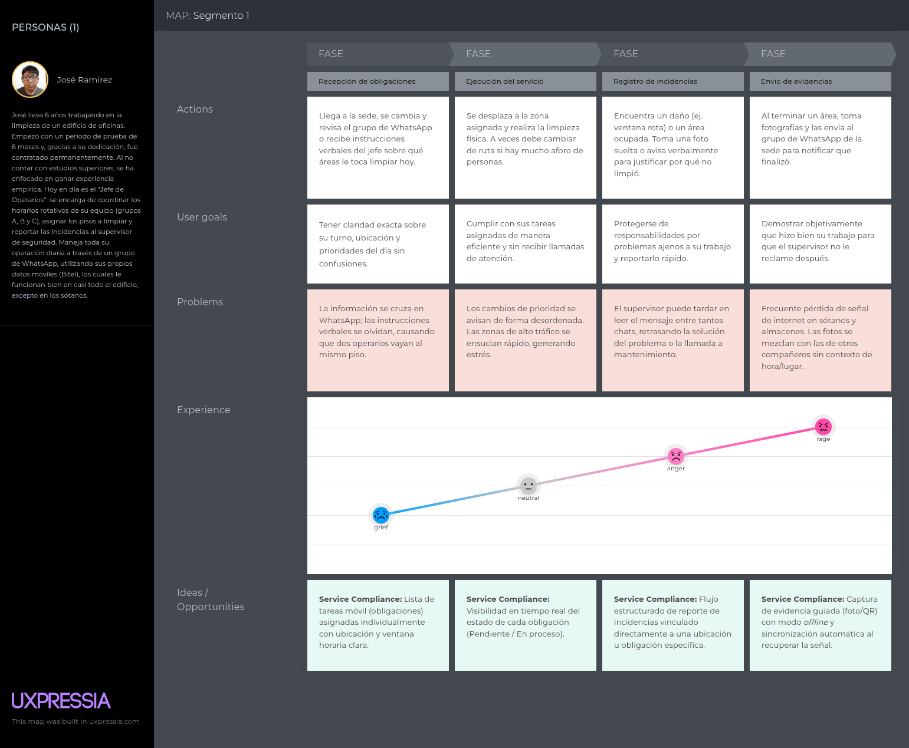
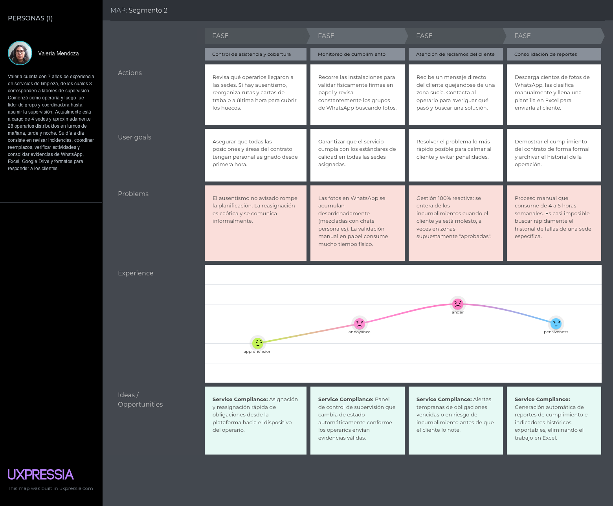
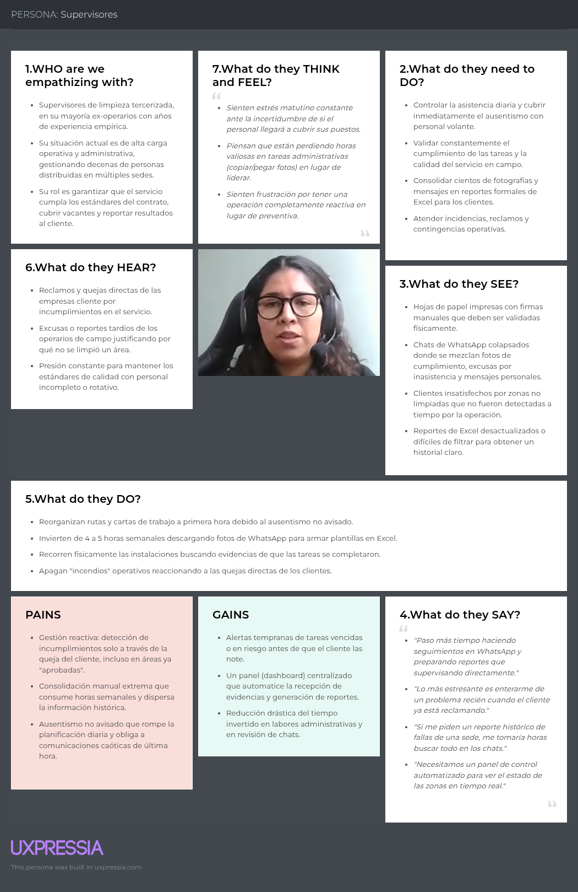
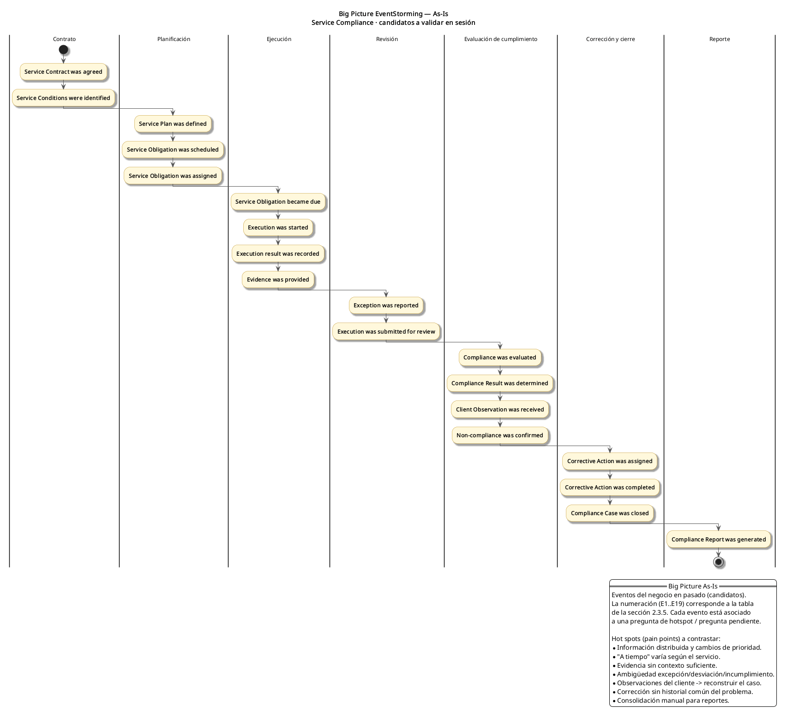

 

# Capítulo II: Requirements Development and Software Solution Design.

Este capítulo desarrolla la propuesta de Service Compliance a partir del análisis competitivo y de la investigación realizada con los dos segmentos objetivo: operarios de limpieza tercerizada y supervisores/coordinadores. Los hallazgos se sintetizan mediante artefactos de Needfinding, se convierten en requisitos del producto y sirven como base para el diseño estratégico y táctico de la solución.

## 2.1. Competidores

Para analizar el espacio competitivo se seleccionaron tres productos digitales relacionados con la supervisión de servicios en instalaciones, las inspecciones de limpieza, el trabajo de campo y la gestión de proveedores: eGenya, OrangeQC y ServiceChannel. La selección permite comparar a Service Compliance con una alternativa regional de Facility Management, una solución especializada en control de calidad de limpieza y una plataforma empresarial de gestión de facilities.

### 2.1.1. Análisis competitivo

El análisis busca identificar qué necesidades ya son atendidas por productos existentes y dónde puede diferenciarse Opervia. La comparación evita considerar como ventaja exclusiva mecanismos comunes de la industria, (como fotografías, QR, GPS, checklists u operación offline) y se concentra en la trazabilidad del cumplimiento.

#### Competitive Analysis Landscape

| Aspecto | Service Compliance | eGenya  | OrangeQC  | ServiceChannel  |
|---|---|---|---|---|
| Tipo de competidor | Producto de Opervia, en fase de desarrollo y validación. | Directo o cercano: gestión de servicios no operacionales y Facility Management con contratistas y equipos propios. | Indirecto especializado: control de calidad, inspecciones y validación de servicios de limpieza. | Indirecto empresarial: Facility Management, proveedores, work orders y cumplimiento en múltiples sedes. |
| Overview | Producto orientado a empresas prestadoras de limpieza tercerizada. Busca conservar una cadena trazable desde las condiciones del servicio y el plan operativo hasta la obligación, ejecución, evidencia, evaluación de cumplimiento, desviación y acción correctiva. | Plataforma chilena para gestionar servicios generales y Facility Management. Comunica trazabilidad de servicios ejecutados por prestadores o equipos propios, control por zonas, tareas preventivas y visibilidad operativa. | Plataforma de control de calidad e inspecciones para servicios de limpieza y facilities. Permite formularios configurables, inspecciones, checklists, tickets, acciones correctivas, reportes y operación móvil. | Plataforma empresarial de Facility Management que centraliza órdenes de trabajo, proveedores, mantenimiento, documentación, auditorías, analítica y operaciones de campo. |
| Valor ofrecido | Explicar el cumplimiento de un servicio conectando **qué debía cumplirse**, **qué se ejecutó**, **qué evidencia era requerida**, **cómo se evaluó** y **qué ocurrió después de una desviación**, sin borrar el historial original. | Saber si equipos o proveedores cumplen lo comprometido y visualizar el estado de servicios y zonas en tiempo real. | Estandarizar y demostrar calidad mediante inspecciones digitales, evidencias, tickets y seguimiento de acciones correctivas. | Coordinar el ciclo de trabajo con proveedores y sedes, documentar el servicio, controlar desempeño y mantener trazabilidad operativa a escala empresarial. |
| Mercado objetivo | Empresas prestadoras de servicios de limpieza tercerizada, inicialmente con operaciones en Lima Metropolitana. Usuarios: supervisores/coordinadores y operarios. | Organizaciones y áreas de servicios generales, Facility Management y operaciones que controlan servicios propios o tercerizados. | Building Service Contractors, instalaciones educativas, salud, municipios, aeropuertos, property/facility managers y equipos de control de calidad. | Operadores multi-sede y equipos de facilities en retail, restaurantes, supermercados, hoteles, educación, salud y otros sectores; también proveedores externos. |
| Estrategia de marketing | Validación mediante pilotos con prestadoras, comunicación centrada en reducción de reconstrucción manual, trazabilidad del cumplimiento y simplicidad de uso para campo. | Demostraciones, casos y comunicación enfocada en dejar de operar “a ciegas”, control remoto, datos y cumplimiento de servicios. | Prueba gratuita, demostraciones, contenido especializado y casos orientados a control de calidad, limpieza y auditorías. | Demostraciones, casos empresariales y una propuesta de plataforma integral para optimizar facilities y redes de proveedores. |
| Productos y servicios | Dos experiencias móviles: app nativa Android para operarios y app cross-platform para supervisores; REST API; trazabilidad de Service Plan/obligaciones, ejecución, evidencia configurable, compliance, acciones correctivas y reporting. | Registro y seguimiento de actividades, puntos QR, control preventivo/correctivo, monitoreo por zonas, reportes y trazabilidad de prestadores y equipos. | Inspecciones móviles online/offline, checklists, GPS/timestamps, fotografías, tickets, acciones correctivas, programación y reportes. También posee validación de servicio mediante checklists/QR. | Work orders, proveedor móvil, check-in/check-out, fotos y documentación, firmas, auditorías, mantenimiento, proveedores, cumplimiento, analítica y aprobaciones. |
| Precios y costos | Modelo de suscripción B2B: plan base de S/300 mensuales aprobado como propuesta comercial y modalidad Custom para alcances superiores. Los límites por cupos y condiciones comerciales deben definirse expresamente en el contrato. | La página pública orienta la contratación a contacto comercial y demostración; no se utiliza una tarifa pública estándar en este análisis. | Publica Starter de **US$250/mes** para 2 inspectores, Standard de **US$500/mes** para 10 inspectores y plan Custom; también ofrece un módulo adicional de Service Validation. | La contratación pública revisada se orienta a consulta/demostración y alcance del servicio; no se utiliza una tarifa estándar en este análisis. |
| Canales de distribución | Aplicaciones móviles, Landing Page y pilotos directos con empresas prestadoras. | Plataforma web y uso móvil/QR por equipos de terreno; contacto comercial. | Apps iOS/Android, web, prueba gratuita y demostraciones. | Plataforma web, ServiceChannel Mobile y Provider App; venta empresarial y demos. |
| Fortalezas | Especialización en trazabilidad de cumplimiento y preservación de la relación entre Service Plan, obligación, ejecución, evidencia y Compliance Result. Alcance pequeño y orientado a un flujo concreto. | Cercanía regional, propuesta en español y fuerte relación con servicios tercerizados, trazabilidad y control de prestadores. | Especialización reconocible en limpieza, inspecciones, offline, evidencia, tickets y acciones correctivas. | Madurez funcional, red de proveedores, operación multi-sede y documentación de trabajo en campo. |
| Debilidades | Producto sin clientes, precio, product-market fit ni reglas definitivas de evidencia. La ventaja competitiva todavía debe demostrarse frente a soluciones que ya cubren ejecución e inspección. | Su alcance cubre varios servicios y no evidencia en la información pública revisada una especialización explícita en traducir condiciones/planes de servicio a un historial de Compliance Result. | Su centro de gravedad es inspección y control de calidad; no necesariamente el ciclo completo desde condiciones del servicio y planificación hasta evaluación contractual. | Amplia cobertura y complejidad empresarial que puede exceder las necesidades de una prestadora de limpieza que busca un flujo de cumplimiento más acotado. |
| Oportunidades | Especialización vertical, adaptación al contexto peruano, configuración de evidencia por obligación, menor fricción operativa y reporting explicable al cliente. | Expansión regional y digitalización de servicios no operacionales. | Mayor demanda de evidencia, auditoría y transparencia de calidad. | Digitalización de Facility Management, optimización de proveedores y operaciones multi-sede. |
| Amenazas | Competidores maduros ya ofrecen fotos, GPS, QR, offline, tickets y reportes; WhatsApp/Excel pueden seguir siendo “suficientes”; la evidencia válida puede variar por contrato; el buyer puede no ser quien inicialmente se supone. | Competidores globales y verticales especializados. | Plataformas de Facility Management más amplias y soluciones regionales en español. | Soluciones verticales más simples y económicas; costo y complejidad de adopción. |

El Landscape muestra que Service Compliance no puede diferenciarse únicamente por capturar fotos, utilizar QR/GPS o funcionar sin conexión. Su propuesta se concentra en conservar una cadena de trazabilidad entre Service Plan, Service Obligation, Execution, Evidence, Compliance Evaluation, Compliance Result, Corrective Action, de modo que el estado original de un cumplimiento o incumplimiento permanezca visible incluso después de una corrección.

La propuesta comercial aprobada por el equipo contempla un plan base de S/300 mensuales y una modalidad Custom. Se trata de precios definidos por Opervia, no de ingresos obtenidos ni de aceptación de mercado verificada. La adecuación de estos precios deberá contrastarse con el valor percibido por prestadoras durante la validación comercial.

### 2.1.2. Estrategias y tácticas frente a competidores

A partir del análisis competitivo, Opervia define cuatro líneas de acción.

Especialización en cumplimiento operativo. Service Compliance no busca competir como una suite completa de Facility Management. El producto concentra su alcance en la relación entre lo planificado, lo ejecutado y la evaluación posterior.

Evidencia configurable. Cada obligación puede requerir un tipo de evidencia diferente. Fotografías, ubicación, checklist, firma, QR o NFC son mecanismos posibles, pero ninguno se exige de forma universal.

Experiencias móviles diferenciadas. El operario necesita baja fricción y continuidad durante el trabajo de campo; el supervisor necesita planificación, revisión, seguimiento y reporting. Por ello la solución separa una experiencia Android nativa para operarios de una experiencia cross-platform para supervisores.

Adopción orientada a resultados. La propuesta comercial se apoya en medir reducción del esfuerzo de reconstrucción, completitud de registros, tiempo de consolidación y tratamiento de desviaciones, en lugar de competir solamente por cantidad de funcionalidades.

## 2.2. Entrevistas

La investigación se realizó con representantes de los dos segmentos objetivo. Las entrevistas se enfocaron en el proceso actual de trabajo: asignación de actividades, ejecución, evidencia, excepciones, supervisión, observaciones del cliente, reconstrucción de casos y herramientas utilizadas.

### 2.2.1. Diseño de entrevistas

Las entrevistas fueron semiestructuradas. Las preguntas principales buscaron experiencias recientes y comportamientos concretos; las preguntas complementarias recogieron información útil para la construcción de los User Personas.

#### Segmento 1: Operarios de limpieza tercerizada

**Objetivo:** Comprender cómo reciben y ejecutan instrucciones, cómo comunican resultados o impedimentos, qué evidencia utilizan, qué fricciones aparecen durante el turno y qué restricciones tecnológicas existen en campo.

**Preguntas principales**

- ¿Cuál es tu nombre, edad, distrito de residencia y ocupación actual?
- ¿Cuánto tiempo llevas trabajando en limpieza y cuánto tiempo llevas en tu sede o empresa actual?
- Cuéntame paso a paso cómo transcurre un turno normal desde que llegas hasta que terminas.
- ¿Cómo sabes qué áreas o actividades te corresponde realizar y en qué momento?
- Cuéntame la última vez que cambiaron tu zona, turno o prioridad durante la jornada. ¿Cómo te enteraste y qué hiciste?
- Cuando terminas una actividad, ¿cómo comunicas que fue realizada?
- ¿En qué situaciones te piden fotografías, firmas, checklists u otra evidencia? ¿Quién decide qué evidencia se necesita?
- Cuéntame una ocasión reciente en la que no pudiste completar una actividad. ¿Cómo explicaste el motivo?
- ¿Alguna vez hubo una discusión sobre si una actividad realmente se había realizado o si estaba bien hecha? ¿Cómo se resolvió?
- ¿Qué partes del proceso actual te quitan más tiempo o generan más confusión?
- ¿Cómo es la conectividad dentro de las instalaciones donde trabajas? ¿En qué zonas suele fallar?
- ¿Utilizas un teléfono propio o de la empresa? ¿Qué aplicaciones y canales digitales utilizas con mayor frecuencia?
- Cuando necesitas aprender algo nuevo, ¿a quién o qué medio recurres normalmente?
- Si pudieras cambiar una sola cosa del proceso actual de coordinación o registro, ¿qué cambiarías y por qué?

**Preguntas complementarias:** nivel educativo, capacitaciones, composición familiar cuando el participante se sienta cómodo, autodescripción, aplicaciones o marcas digitales familiares, motivaciones y objetivos laborales.

#### Segmento 2: Supervisores/coordinadores

**Objetivo.** Comprender cómo se organiza y supervisa el servicio, cómo se decide qué debe ejecutarse, cómo se verifica el resultado, cómo se atienden observaciones del cliente y cuánto esfuerzo requiere consolidar o reconstruir información.

**Preguntas principales**

- ¿Cuál es tu nombre, edad, distrito de residencia y cargo actual?
- ¿Cómo llegaste al rol de supervisión y cuánto tiempo llevas trabajando en el rubro?
- ¿Cuántas sedes, turnos o personas supervisas actualmente?
- Cuéntame paso a paso cómo organizas un día normal de supervisión.
- ¿De dónde provienen las instrucciones que finalmente recibe el operario: contrato, plan de trabajo, cronograma, carta de servicio, indicación del cliente u otra fuente?
- ¿Quién decide frecuencia, horario, zona, prioridad y evidencia requerida para una actividad?
- Cuéntame la última vez que una actividad importante quedó pendiente o se realizó de forma incorrecta. ¿Cómo te enteraste?
- ¿Cómo verificas actualmente que una actividad fue realizada y con qué criterios decides si el resultado es aceptable?
- ¿Qué sucede cuando el cliente observa o reclama una actividad que el equipo consideraba completada?
- ¿Cómo recopilas y organizas fotos, firmas, formatos, reportes u otras evidencias?
- ¿Cuánto tiempo empleas en consolidar información o reconstruir un caso cuando necesitas explicarlo?
- ¿Cómo haces seguimiento a una desviación hasta que se atiende? ¿La corrección reemplaza el registro del problema original o ambos quedan documentados?
- ¿Qué información necesitarías para responder rápidamente “qué ocurrió, quién intervino y cómo se cerró”?
- ¿Qué dispositivos, aplicaciones, hojas de cálculo o canales de mensajería utilizas habitualmente?
- Si pudieras eliminar una sola fricción del proceso de supervisión actual, ¿cuál sería y por qué?

**Preguntas complementarias:** formación, habilidades relevantes, estilo de trabajo, herramientas digitales habituales, fuentes de aprendizaje, responsable de compra de software y condiciones que justificarían pagar por una herramienta.

### 2.2.2 Registro de entrevistas

Se realizaron tres entrevistas por cada segmento. Los resúmenes siguientes recogen únicamente información reportada por los participantes y utilizada posteriormente en el análisis.

#### Segmento 1: Operarios de limpieza tercerizada

##### Entrevista #1 - José Ramírez

| Campo | Detalle |
|---|---|
| Entrevistador | Carlos Franco Blancas Chávez |
| Entrevistado | José Ramírez |
| Edad | 22 años |
| Ubicación | San Juan de Lurigancho / edificio de oficinas |
| Duración | 12:50 minutos |
| Enlace | https://youtu.be/BublVzjOtw0 |

**Resumen:** José cuenta con seis años de experiencia en servicios de limpieza y actualmente combina labores operativas con coordinación de su equipo. La distribución de zonas y los cambios de trabajo se comunican principalmente por WhatsApp, lo que puede producir mensajes cruzados, duplicidad de asignaciones o zonas sin cubrir. Las fotografías de evidencia también se envían por este canal. Para José, WhatsApp es familiar y no representa por sí mismo una dificultad; el problema aparece cuando la información queda mezclada con otras conversaciones y luego debe relacionarse con una actividad concreta. La conectividad suele ser suficiente, aunque identifica menor señal en el sótano. Como mejora, plantea centralizar tareas, estado y evidencia en una herramienta consultable.

##### Entrevista #2 - Rodrigo Andres Gonzales Portugal

| Campo                           | Detalle                                                                                                                                                                                                                                                                                                                                                            |
| ------------------------------- | ------------------------------------------------------------------------------------------------------------------------------------------------------------------------------------------------------------------------------------------------------------------------------------------------------------------------------------------------------------------ |
| **Entrevistador**               | Angel Thyago Flores Eusebio                                                                                                                                                                                                                                                                                                                                        |
| **Entrevistado**                | Rodrigo Andres Gonzales Portugal                                                                                                                                                                                                                                                                                                                                      |
| **Edad**                        | 21 años                                                                                                                                                                                                                                                                                                                                                            |
| **Ubicación**                   | Los Olivos / centro de labores en San Martin                                                                                                                                                                                                                                                                                                                                  |
| **Duración**                    | 9:49 minutos                                                                                                                                                                                                                                                                                                                                                      |
| **Enlace**                      | https://www.youtube.com/watch?v=tzRZkpT3oaM |

**Resumen:** Rodrigo tiene un año y medio realizando actividades de limpieza en una tienda de peceras, donde también atiende clientes y entrega pedidos. La asignación es directa: el jefe distribuye actividades y recuerda lo que debe continuar. Cuando falta personal, debe combinar limpieza con otras funciones y algunas actividades se retrasan. La finalización se comunica mediante mensajes o llamadas; para determinadas tareas el jefe solicita fotografías. El registro general se apoya también en listas o cuadernos, que Rodrigo considera vulnerables a pérdida o deterioro. La conectividad fue problemática antes de instalar un router, pero actualmente es adecuada. Propone un registro digital que permita a su jefe consultar las actividades realizadas.

##### Entrevista #3 - Juan Barrios 

| Campo                           | Detalle                                                                                                                                                                                                                                                                                                                                                            |
| ------------------------------- | ------------------------------------------------------------------------------------------------------------------------------------------------------------------------------------------------------------------------------------------------------------------------------------------------------------------------------------------------------------------ |
| **Entrevistador**               | Mathias Enrique Sánchez Espinoza                                                                                                                                                                                                                                                                                                                                        |
| **Entrevistado**                | Juan Barrios                                                                                                                                                                                                                                                                                                                                      |
| **Edad**                        | 20 años                                                                                                                                                                                                                                                                                                                                                            |
| **Ubicación**                   | Santiago de Surco / Valet Parking                                                                                                                                                                                                                                                                                                                                  |
| **Duración**                    | 13:31 minutos                                                                                                                                                                                                                                                                                                                                                      |
| **Enlace**                      | https://youtu.be/y8LJu7hgHQg |

**Resumen:** Juan aporta experiencia previa como operario de limpieza. Durante ese trabajo recibía indicaciones mediante pizarras físicas y un grupo de WhatsApp desde su teléfono personal. Relata pérdidas de tiempo al organizar insumos al inicio del turno y problemas de comunicación ante cambios de horario o falta de materiales. Se le solicitaban varias fotografías por área como evidencia. La conectividad general era adecuada, salvo en espacios subterráneos. También menciona YouTube como recurso habitual para aprender procedimientos de limpieza.

La muestra de este segmento combina experiencia operativa directa con situaciones laborales distintas: José incorpora funciones de coordinación, Rodrigo combina limpieza con otras tareas y Juan aporta experiencia previa. Por ello, los hallazgos se utilizan para caracterizar prácticas y fricciones descritas directamente por los participantes, sin generalizarlas al conjunto de trabajadores del sector.

#### Segmento 2: Supervisores/coordinadores

##### Entrevista #1 — Leonardo Delgado

| Campo | **Detalle** |
| :---- | :------ |
| Entrevistador | Carlos Franco Blancas Chávez |
| Entrevistado | Leonardo Delgado |
| Edad | 22 años |
| Ubicación | Chiclayo / supervisa una residencial |
| Tiempo Duración | 8:24 minutos |
| Enlace | https://www.youtube.com/watch?v=b1oQmie0bdE |

**Resumen:** Leonardo supervisa el área de limpieza de una residencial y llegó al cargo después de iniciar como operario. Organiza el trabajo de cinco empleados directos, con personal adicional en otros turnos. Su principal registro es un cuaderno físico; las asignaciones se realizan de forma manual y, cuando un trabajador no responde, puede ser necesario buscarlo presencialmente. La verificación también requiere recorridos físicos. Las quejas del cliente pueden llegar con retraso y las fotografías son organizadas manualmente. Preparar reportes le ocupa varias horas y reconstruir incidencias anteriores resulta difícil con las herramientas actuales.

##### Entrevista #2 — Andy

| Campo | Detalle |
|---|---|
| Entrevistador | Arias Tasayco, Jean Pool Alexander |
| Entrevistado | Andy |
| Edad | 20 años |
| Ubicación | San Martín de Porres / conjunto empresarial en Lima |
| Duración | 8:21 minutos |
| Enlace | https://youtu.be/naAdZEitKRU |

**Resumen.** Andy trabaja como supervisor de limpieza tercerizada. Su jornada comprende control de asistencia, revisión de novedades, cobertura de ausencias, rondas de inspección, atención de incidencias y actualización de reportes. Sus principales fricciones aparecen ante ausencias imprevistas, reorganización de rutas y reconstrucción de evidencia cuando el cliente formula una observación. La validación utiliza comunicación verbal, formatos firmados y fotografías enviadas por WhatsApp, lo que obliga a revisar físicamente zonas y buscar posteriormente información dispersa.

##### Entrevista #3 — Valeria Alejandra Mendoza Salazar

| Campo | Detalle |
|---|---|
| Entrevistador | Montes Maza, Augusto |
| Entrevistada | Valeria Alejandra Mendoza Salazar |
| Edad | 30 años |
| Ubicación | Los Olivos, Lima |
| Cargo | Supervisora de operaciones de limpieza tercerizada |
| Duración | 13:25 minutos |
| Enlace | https://youtu.be/9xKiAJFK5xY |

**Resumen.** Valeria cuenta con aproximadamente siete años de experiencia en el rubro y tres en supervisión. Supervisa cuatro sedes y alrededor de 28 operarios distribuidos en diferentes turnos. Su jornada incluye revisión de incidencias, control de asistencia, coordinación de reemplazos, cronogramas, visitas a sede, inspección de zonas críticas y atención de observaciones del cliente. Las instrucciones provienen del contrato, propuesta comercial, plan de trabajo, cronogramas e indicaciones adicionales comunicadas por WhatsApp o llamadas. La información queda distribuida entre documentos, hojas de cálculo, fotografías, formatos físicos y mensajería. Estima entre 30 y 45 minutos de consolidación diaria y entre dos y cuatro horas para reconstruir un reclamo importante. También señala que las correcciones no siempre quedan vinculadas con el problema original.

### 2.2.3. Análisis de entrevistas

Los porcentajes siguientes describen únicamente a la muestra entrevistada.

#### Segmento 1: Operarios - análisis preliminar (n = 3)

| Característica observada | Tipo | Frecuencia actual | Evidencia |
|---|---|---:|---|
| Utiliza mensajería móvil para coordinar actividades o comunicar resultados. | Objetiva / tecnológica | 3 de 3 participantes | José, Rodrigo y Juan |
| Ha experimentado cambios operativos, falta de personal o falta de insumos que afectan el cumplimiento. | Objetiva / operativa | 3 de 3 participantes | José, Rodrigo y Juan |
| Ha identificado alguna zona o periodo con conectividad reducida o problemática. | Objetiva / tecnológica | 3 de 3 participantes | José: sótano; Rodrigo: problemas previos de conectividad; Juan: zonas subterráneas |
| Utiliza fotografías como evidencia en al menos algunas actividades. | Objetiva / operativa | 3 de 3 participantes | José, Rodrigo y Juan |
| Considera útil contar con una referencia centralizada de actividades, estados o evidencias. | Subjetiva / expectativa | 3 de 3 participantes | José, Rodrigo y Juan |
| Considera que la mensajería actual es necesariamente inadecuada o tediosa. | Subjetiva / frustración | Sin patrón común | José está habituado al canal; Juan identifica problemas de comunicación y Rodrigo utiliza mensajes o llamadas sin señalarlo como su principal dificultad |

En los tres casos la mensajería sirve como herramienta cotidiana, pero no conserva por sí sola una relación estructurada entre una actividad, el resultado comunicado y la evidencia. Los impedimentos observados tampoco son exclusivamente tecnológicos: ausencias, falta de materiales, cambios de horario o zonas inaccesibles forman parte del contexto de ejecución. Esto refuerza la necesidad de registrar qué ocurrió y no limitar el modelo a “completado/no completado”.

#### Segmento 2: Supervisores/coordinadores - análisis preliminar (n = 3)

| Característica observada | Tipo | Frecuencia actual | Evidencia |
|---|---|---:|---|
| Consolida información manualmente a partir de mensajería, hojas de cálculo, papel u observación directa. | Objetiva / operativa | 3 de 3 participantes | Leonardo, Andy y Valeria |
| Utiliza WhatsApp u otros canales de mensajería como parte relevante de la operación. | Objetiva / tecnológica | 3 de 3 participantes | Leonardo, Andy y Valeria |
| Ha tenido que reconstruir información ante una observación o reclamo del cliente. | Objetiva / operativa | 3 de 3 participantes | Leonardo, Andy y Valeria |
| Expresa la necesidad de contar con mayor visibilidad sobre el estado operativo. | Subjetiva / expectativa | 3 de 3 participantes | Leonardo, Andy y Valeria |
| Gestiona ausencias, cobertura de personal o cambios operativos además del control del servicio. | Objetiva / operativa | 3 de 3 participantes | Leonardo, Andy y Valeria |
| Mantiene evidencias dispersas o no vinculadas directamente con la obligación original. | Objetiva / operativa | 3 de 3 participantes | Leonardo, Andy y Valeria |

La supervisión combina coordinación de personal, inspección, evidencias, incidencias y atención de observaciones. El patrón más relevante es la dispersión de información: un caso puede requerir revisar conversaciones, archivos, formatos o volver a consultar a participantes. La gestión de ausencias aparece de forma recurrente, pero no se incorpora como módulo de recursos humanos; se considera únicamente cuando altera la asignación o ejecución de una obligación.

Las variables de personalidad, influencias, marcas y hábitos que no fueron recogidas de manera comparable en los seis resúmenes no se convierten en porcentajes ni se atribuyen a los arquetipos sin respaldo.

#### Trazabilidad preliminar de investigación con Lean UX

| Assumption / Outcome | Evidencia actual | Estado preliminar |
|---|---|---|
| **UA-01** El supervisor necesita conocer qué obligaciones están pendientes, realizadas, observadas o vencidas. | Los supervisores describen la necesidad de revisar actividades, zonas, incidencias y observaciones del cliente. | Apoyado preliminarmente. |
| **UA-03** Los supervisores combinan observación directa, comunicación con el personal y registros operativos. | Se identifican rondas físicas, llamadas, WhatsApp, cuadernos, fotografías, formatos y hojas de cálculo. | Apoyado preliminarmente. |
| **UA-05** Supervisor y operario necesitan compartir una referencia operativa común. | Los cambios de zona, prioridades e instrucciones se comunican por diferentes canales y pueden perder contexto. | Apoyado preliminarmente. |
| **UO-01** Los supervisores quieren identificar rápidamente qué requiere atención. | Las ausencias, incidencias, actividades pendientes y observaciones del cliente requieren priorización constante. | Apoyado preliminarmente. |
| **UO-02** Los supervisores quieren consultar el historial de una obligación ante una observación o reclamo. | Los entrevistados describen la necesidad de buscar información en mensajes, formatos, fotografías y registros manuales. | Apoyado preliminarmente. |
| **UO-05** Los supervisores necesitan información consistente para explicar qué ocurrió y cómo se respondió. | La evidencia actual se encuentra separada y no siempre permite reconstruir el caso rápidamente. | Apoyado preliminarmente. |
| **BO-01** Reducir el esfuerzo necesario para reconstruir y explicar el estado de cumplimiento. | Leonardo y Andy describen búsquedas manuales; Valeria estima entre 30 y 45 minutos de consolidación diaria y entre 2 y 4 horas para reconstruir reclamos importantes. | Apoyado preliminarmente; requiere medición adicional. |
| **BO-03** Detectar desviaciones antes de que sean descubiertas únicamente por el cliente. | Las observaciones del cliente aparecen como una fuente relevante para detectar o reabrir problemas. | Apoyado preliminarmente. |
| **BO-04** Reducir el trabajo manual de consolidación y reporting. | Los supervisores utilizan registros físicos, mensajería, fotografías, hojas de cálculo y observación directa. | Apoyado preliminarmente. |
| **FA-01** Un Service Plan con obligaciones estructuradas ayudará a compartir una referencia operativa. | Las actividades, zonas, prioridades y criterios se comunican desde diferentes fuentes y no siempre existe un documento actualizado. | Apoyado preliminarmente. |
| **FA-02** Vincular la ejecución móvil con la obligación y la evidencia reducirá la pérdida de contexto. | Las fotografías, mensajes y formatos no siempre están relacionados directamente con la actividad correspondiente. | Apoyado preliminarmente. |
| **FA-03** Registrar excepciones, desviaciones y acciones correctivas conservando el historial permitirá explicar qué ocurrió. | Se identifican incidencias y correcciones, pero la relación entre el problema original y su cierre no siempre queda documentada. | Parcialmente apoyado; requiere mayor evidencia. |
| **FA-04** Una vista de cumplimiento y reportes trazables reducirá la consolidación manual. | Los supervisores necesitan revisar diferentes fuentes para conocer el estado del servicio y preparar reportes. | Apoyado preliminarmente. |
| **FA-05** El almacenamiento local y la sincronización posterior reducirán la pérdida de registros ante conectividad limitada. | Los operarios y Valeria mencionan problemas de conectividad en determinadas zonas o momentos. | Apoyado de forma contextual, no universal. |

## 2.3. Needfinding

Los artefactos de Needfinding sintetizan los patrones identificados en las entrevistas y representan la situación actual antes de Service Compliance.

### 2.3.1. User Personas

Se mantiene un User Persona por cada segmento objetivo. Las fichas deben reflejar únicamente características que puedan rastrearse a las entrevistas y al análisis competitivo; después de completar la tercera entrevista de cada segmento, las fichas deben actualizarse si cambian los patrones dominantes.

- **Segmento 1: Operarios de limpieza tercerizada**

- **Segmento 2: Supervisores/coordinadores**

### 2.3.2. User Task Matrix

La matriz recoge tareas que existen independientemente de Service Compliance.

| Tarea actual | Operario — Frecuencia | Operario — Importancia | Supervisor — Frecuencia | Supervisor — Importancia |
|---|---|---|---|---|
| Consultar o recibir las áreas/actividades asignadas. | Alta | Alta | Media | Alta |
| Ejecutar actividades de limpieza. | Alta | Alta | Baja | Media |
| Comunicar o confirmar la finalización de una actividad. | Alta | Alta | Media | Alta |
| Presentar evidencia cuando el proceso o cliente la requiere. | Media/Alta | Alta | Media | Alta |
| Comunicar un impedimento, daño o excepción. | Media | Alta | Media | Alta |
| Adaptarse a cambios de zona, turno o prioridad. | Media | Alta | Alta | Alta |
| Verificar la calidad o finalización del trabajo. | Baja | Baja | Alta | Alta |
| Reasignar cobertura ante ausencias o cambios operativos. | Baja | Baja | Alta | Alta |
| Recopilar y organizar evidencias/registros. | Baja | Baja | Alta | Alta |
| Atender observaciones o reclamos del cliente. | Baja | Baja | Media/Alta | Alta |
| Dar seguimiento a desviaciones hasta su atención. | Baja | Media | Media/Alta | Alta |
| Consolidar el estado del servicio y elaborar reportes. | Baja | Baja | Media | Alta |

El operario concentra su actividad en ejecución y comunicación del resultado. El supervisor concentra la coordinación, verificación, reconstrucción del estado y atención de desviaciones. La coincidencia entre ambos está en la necesidad de compartir una referencia sobre qué debía hacerse y qué ocurrió.

### 2.3.3. User Journey Mapping

Los Journey Maps representan el proceso **As-Is**, es decir, la situación actual antes de Service Compliance.

- **Operario**

- **Supervisor/coordinador**

#### 2.3.3.1. As-Is Scenario Mapping

##### As-Is — Operario

| Etapa | Qué hace | Información/canal actual | Pain point / riesgo |
|---|---|---|---|
| Inicio del turno | Recibe zona, rutina o cambio de prioridad. | Indicación verbal, WhatsApp, carta/cronograma. | Mensajes cruzados, prioridad ambigua o cambio tardío. |
| Ejecución | Realiza la actividad en el espacio asignado. | Conocimiento operativo e instrucciones. | El espacio puede estar ocupado o presentar un impedimento. |
| Confirmación | Comunica que terminó. | Aviso verbal, mensaje, foto o formato. | El resultado puede quedar sin referencia estructurada a la actividad. |
| Excepción | Reporta daño, imposibilidad o situación fuera de alcance. | Supervisor, WhatsApp o escalamiento local. | Puede perderse el contexto o interpretarse como incumplimiento. |
| Cierre | Continúa con otra actividad. | Confirmación informal. | No siempre conoce si el registro fue recibido, aceptado o requiere corrección. |

##### As-Is — Supervisor

| Etapa | Qué hace | Información/canal actual | Pain point / riesgo |
|---|---|---|---|
| Planificación diaria | Revisa personal, novedades, zonas y prioridades. | WhatsApp, papel, Excel, experiencia propia. | Ausencias y cambios obligan a reorganizar. |
| Seguimiento | Consulta encargados, realiza rondas y recibe evidencia. | WhatsApp, llamadas, observación física. | Estado distribuido y difícil de consolidar. |
| Verificación | Decide si una actividad parece completada. | Foto, firma, inspección o comunicación. | Evidencia y criterio pueden no estar ligados a la obligación original. |
| Observación/reclamo | Reconstruye qué ocurrió. | Chats, archivos, Excel, llamadas. | Tiempo alto para localizar responsables y evidencia. |
| Corrección | Coordina solución y vuelve a verificar. | Mensajes, llamadas, ronda física. | El historial original y la corrección pueden quedar separados. |
| Reporte | Consolida información del periodo. | Excel, fotos, informes. | Trabajo manual y dificultad para comparar sedes/periodos. |

### 2.3.4. Empathy Mapping

Los Empathy Maps deben construirse a partir de los User Personas y entrevistas, registrando qué ve, oye, dice, hace, piensa y siente cada arquetipo, junto con pains y gains.

- **Operarios de limpieza tercerizada**

- **Supervisores/coordinadores**

### 2.3.5. Big Picture EventStorming

El Big Picture EventStorming representa el proceso de negocio actual sin introducir pantallas, APIs ni mecanismos técnicos como si fueran eventos de dominio. El artefacto se organiza en cuatro momentos de trabajo.

#### Eventos de negocio identificados para contrastar

| Orden | Domain Event candidato | Hotspot / pregunta |
|---:|---|---|
| 1 | Service Contract was agreed | ¿El contrato es la única fuente del trabajo operativo? |
| 2 | Service Conditions were identified | ¿Quién interpreta qué condiciones son operables? |
| 3 | Service Plan was defined | ¿Existe plan, cronograma, carta de trabajo u otro artefacto intermedio? |
| 4 | Service Obligation was scheduled | ¿Cómo se determina frecuencia, ventana y sitio? |
| 5 | Service Obligation was assigned | ¿Quién asigna y cuándo cambia el responsable? |
| 6 | Service Obligation became due | ¿Qué significa “a tiempo” en cada servicio? |
| 7 | Execution was started | ¿Es necesario registrar inicio en todos los casos? |
| 8 | Execution result was recorded | ¿Qué resultados posibles existen además de “completado”? |
| 9 | Evidence was provided | ¿Qué evidencia es suficiente para cada obligación? |
| 10 | Exception was reported | ¿Qué diferencia una excepción aceptable de una desviación? |
| 11 | Execution was submitted for review | ¿Siempre existe revisión humana? |
| 12 | Compliance was evaluated | ¿Qué reglas y actor participan en la evaluación? |
| 13 | Compliance Result was determined | ¿Cumplido, excepción aceptada, desviación o incumplimiento? |
| 14 | Client Observation was received | ¿Puede reabrir o cuestionar una evaluación previa? |
| 15 | Non-compliance was confirmed | ¿Toda desviación se convierte en incumplimiento? |
| 16 | Corrective Action was assigned | ¿Quién decide que hace falta una acción correctiva? |
| 17 | Corrective Action was completed | ¿Cómo se verifica que la acción fue suficiente? |
| 18 | Compliance Case was closed | ¿Qué debe conservarse del estado original? |
| 19 | Compliance Report was generated | ¿Por sede, servicio, cliente o periodo? |

#### Pain points a contrastar durante la sesión

- información distribuida entre mensajes, hojas de cálculo, formatos y observación directa;
- cambios de prioridad y asignación durante el turno;
- evidencia sin contexto suficiente;
- conectividad limitada en determinadas zonas;
- observaciones del cliente que obligan a reconstruir el caso;
- ambigüedad entre excepción, desviación e incumplimiento;
- corrección realizada sin un historial común del problema original;
- consolidación manual para reportes.

#### Secuencia del proceso identificada para contrastar

El ordenamiento en timeline se propone por fases del negocio (Contrato, Planificación, Ejecución, Revisión, Evaluación de cumplimiento, Corrección y cierre, Reporte). La numeración E1–E19 corresponde a los candidatos de la tabla anterior; los hot spots se contrastan durante la exploración.

### 2.3.6. Ubiquitous Language

El glosario utiliza términos del negocio en inglés y evita términos de ingeniería de software.

| Término | Definición de trabajo |
|---|---|
| Service Contract | Acuerdo entre la empresa prestadora y la organización cliente que establece el marco del servicio. |
| Service Condition | Condición relevante del acuerdo que debe ser considerada al planificar u operar el servicio. |
| Service Plan | Interpretación operativa aprobada del servicio, donde se organizan sitios, condiciones, obligaciones, frecuencia, ventanas y requisitos. |
| Service Site | Instalación o ubicación donde se presta el servicio. |
| Obligation Definition | Regla del Service Plan que describe qué actividad debe cumplirse, dónde, con qué frecuencia/ventana y bajo qué criterio. |
| Service Obligation | Instancia operativa que debe ser atendida en un periodo o ventana específica. |
| Assignment | Relación entre una Service Obligation y el operario responsable de atenderla. |
| Execution | Registro de lo que efectivamente se realizó o intentó realizar para una Service Obligation. |
| Evidence Requirement | Condición que establece qué respaldo debe acompañar una ejecución cuando sea necesario. |
| Evidence | Información presentada para respaldar una afirmación sobre la ejecución; su validez depende del Evidence Requirement y del contexto. |
| Exception | Circunstancia que impide o modifica la ejecución esperada y que puede ser aceptada según las reglas aplicables. |
| Deviation | Diferencia detectada entre el resultado esperado y el observado. No implica automáticamente Non-compliance. |
| Compliance Evaluation | Proceso de comparar la Service Obligation y sus criterios con la Execution, Evidence y Exception disponibles. |
| Compliance Result | Resultado definitivo de la evaluación: cumplimiento, excepción aceptada o incumplimiento. Una Deviation es un hallazgo que fundamenta la evaluación, no un resultado definitivo. |
| Non-compliance | Compliance Result que confirma que una obligación no cumplió un criterio aplicable y que no existe una excepción aceptada que lo justifique. |
| Client Observation | Cuestionamiento o comentario de la organización cliente acerca del resultado de un servicio. |
| Corrective Action | Acción acordada para responder a un Non-compliance o situación que requiere corrección. No elimina el resultado original. |
| Compliance Case | Conjunto trazable que conserva evaluación, resultado, observaciones y acciones posteriores relacionadas con una ejecución. |
| Compliance Report | Consolidación del estado de cumplimiento para un servicio, sitio y periodo definidos. |

## 2.4. Requirements Specification

Los requisitos reflejan las necesidades identificadas en Needfinding y el alcance de Service Compliance. El producto contempla una aplicación Android nativa para el operario, una aplicación cross-platform para supervisores, una REST API propia, almacenamiento local para continuidad en campo y servicios externos cuando aportan una capacidad específica.

### To-Be Scenario Mapping

#### To-Be — Operario

| Etapa | Comportamiento esperado | Resultado buscado |
|---|---|---|
| Recibir trabajo | Consulta sus Service Obligations asignadas con sitio, ventana e instrucciones necesarias. | Menor ambigüedad sobre qué debe ejecutar. |
| Ejecutar | Inicia/atiende la obligación sin interpretar cláusulas contractuales. | Mantener foco en trabajo físico. |
| Registrar resultado | Registra completed, partial, blocked u otro resultado permitido. | Explicar qué ocurrió, no solo marcar una tarea. |
| Adjuntar evidencia | Presenta únicamente la Evidence requerida para esa obligación. | Evitar evidencia innecesaria y conservar contexto. |
| Reportar excepción | Registra impedimento/exception con motivo. | Evitar que una ejecución imposible quede como incumplimiento sin explicación. |
| Trabajar con conectividad limitada | Guarda temporalmente el registro y sincroniza posteriormente. | Reducir pérdida de información sin detener el trabajo. |
| Recibir corrección | Consulta una Corrective Action cuando le corresponde y registra su atención. | Cerrar el ciclo sin borrar el Non-compliance original. |

#### To-Be — Supervisor/coordinador

| Etapa | Comportamiento esperado | Resultado buscado |
|---|---|---|
| Preparar servicio | Define/activa un Service Plan y sus Obligation Definitions a partir de condiciones operativas aprobadas. | Separar contrato de interpretación operativa. |
| Coordinar | Asigna obligaciones y consulta estado por sitio/periodo. | Visibilidad compartida de la operación. |
| Revisar | Consulta Execution, Evidence y Exceptions. | Evitar reconstrucción desde múltiples canales. |
| Evaluar | Registra o confirma Compliance Result conforme a reglas aplicables. | Distinguir cumplimiento, excepción, desviación e incumplimiento. |
| Corregir | Asigna y sigue Corrective Action cuando corresponde. | Mantener historial del problema y de su respuesta. |
| Responder observaciones | Consulta el Compliance Case completo. | Explicar qué ocurrió con trazabilidad. |
| Reportar | Genera Compliance Report e indicadores por periodo/sitio. | Reducir consolidación manual. |

### 2.4.1. User Stories

#### Epics

| Epic ID | Epic | Propósito |
|---|---|---|
| EP01 | Service Planning | Definir Service Plan, sitios, Obligation Definitions y Evidence Requirements. |
| EP02 | Field Operations | Asignar y ejecutar Service Obligations en campo con evidencia/excepciones. |
| EP03 | Compliance Management | Evaluar cumplimiento, registrar Compliance Result y gestionar correctivas/observaciones. |
| EP04 | Reporting & Follow-up | Consultar estado, alertas, indicadores e informes trazables. |
| EP05 | Identity & Access | Autenticar usuarios y aplicar roles/permisos. |
| EP06 | Landing Page | Comunicar la propuesta de valor y permitir explorar el prototipo público del producto. |
| EP07 | Technical Foundation | REST API, almacenamiento local, servicios externos y capacidades técnicas. |

#### User Stories funcionales

##### US-01 — Crear Service Plan

| Campo | Contenido |
|---|---|
| Story ID | US-01 |
| User | Administrador de la empresa prestadora |
| Priority | High |
| Epic | EP01 — Service Planning |
| Title | Crear un Service Plan |
| Description | Como administrador autorizado de la empresa prestadora, deseo registrar un Service Plan para un servicio y sitio, para disponer de una referencia operativa común sin interpretar el contrato durante cada ejecución. |
| Acceptance Criteria | **Scenario 1:** Given que el administrador autorizado cuenta con datos mínimos del servicio y sitio, When registra el Service Plan, Then el sistema conserva un identificador, periodo de vigencia, sitio y estado Draft. **Scenario 2:** Given un Service Plan Draft, When faltan datos obligatorios, Then el sistema no permite activarlo e informa qué información falta. |

##### US-02 — Definir Obligation Definition y Evidence Requirement

| Campo | Contenido |
|---|---|
| Story ID | US-02 |
| User | Administrador de la empresa prestadora |
| Priority | High |
| Epic | EP01 |
| Title | Definir una obligación operativa |
| Description | Como administrador autorizado, deseo definir qué actividad debe realizarse, dónde, con qué frecuencia/ventana y qué evidencia requiere, para que cada ejecución tenga criterios claros. |
| Acceptance Criteria | **Scenario 1:** Given un Service Plan Draft, When se añade una Obligation Definition válida, Then queda asociada al plan con sitio, descripción, schedule rule y criterio de aceptación. **Scenario 2:** Given una obligación que requiere evidencia, When se configura su Evidence Requirement, Then el requisito queda explícitamente asociado y no se aplica automáticamente a otras obligaciones. |

##### US-03 — Activar Service Plan

| Campo | Contenido |
|---|---|
| Story ID | US-03 |
| User | Administrador de la empresa prestadora |
| Priority | High |
| Epic | EP01 |
| Title | Activar el Service Plan |
| Description | Como administrador autorizado, deseo activar un Service Plan revisado para que sus obligaciones puedan ser programadas para la operación. |
| Acceptance Criteria | **Scenario 1:** Given un plan con al menos una Obligation Definition válida, When el administrador lo activa, Then el estado cambia a Active y queda registrada la fecha de activación. **Scenario 2:** Given un plan Active, When se intenta modificar una regla que afectaría obligaciones ya emitidas, Then el sistema exige una nueva versión o cambio con trazabilidad. |

##### US-04 — Consultar obligaciones asignadas

| Campo | Contenido |
|---|---|
| Story ID | US-04 |
| User | Operario |
| Priority | High |
| Epic | EP02 — Field Operations |
| Title | Consultar Service Obligations asignadas |
| Description | Como operario, deseo consultar las obligaciones que me corresponden, para conocer qué debo realizar, dónde y dentro de qué ventana. |
| Acceptance Criteria | **Scenario 1:** Given que existen obligaciones asignadas al operario, When consulta su trabajo, Then recibe únicamente obligaciones dentro de su alcance con sitio, actividad, ventana e instrucciones necesarias. **Scenario 2:** Given que una obligación cambia antes de iniciarse, When el operario vuelve a consultar o sincroniza, Then visualiza la versión vigente. |

##### US-05 — Registrar Execution

| Campo | Contenido |
|---|---|
| Story ID | US-05 |
| User | Operario |
| Priority | High |
| Epic | EP02 |
| Title | Registrar el resultado de una ejecución |
| Description | Como operario, deseo registrar qué ocurrió al atender una Service Obligation, para que supervisión conozca el resultado real de la actividad. |
| Acceptance Criteria | **Scenario 1:** Given una obligación asignada, When el operario inicia y registra su resultado, Then la Execution queda vinculada a la obligación, operario y timestamps correspondientes. **Scenario 2:** Given una obligación no asignada al operario, When intenta registrar una ejecución, Then el sistema rechaza la operación. |

##### US-06 — Adjuntar Evidence requerida

| Campo | Contenido |
|---|---|
| Story ID | US-06 |
| User | Operario |
| Priority | High |
| Epic | EP02 |
| Title | Adjuntar evidencia cuando corresponde |
| Description | Como operario, deseo presentar la evidencia solicitada por la obligación para respaldar el resultado sin capturar información innecesaria. |
| Acceptance Criteria | **Scenario 1:** Given una obligación con Evidence Requirement, When el operario registra la evidencia del tipo permitido, Then queda vinculada a la Execution. **Scenario 2:** Given una obligación que no exige una evidencia específica, When el operario registra el resultado, Then el sistema no bloquea el envío por ausencia de foto/QR/GPS no requeridos. |

##### US-07 — Reportar Exception

| Campo | Contenido |
|---|---|
| Story ID | US-07 |
| User | Operario |
| Priority | High |
| Epic | EP02 |
| Title | Reportar un impedimento o excepción |
| Description | Como operario, deseo registrar una Exception cuando una obligación no puede ejecutarse como estaba prevista, para que el resultado sea revisado con contexto. |
| Acceptance Criteria | **Scenario 1:** Given una obligación asignada, When el operario reporta una excepción con motivo, Then la excepción queda asociada a la Execution y disponible para revisión. **Scenario 2:** Given una Exception registrada, When se evalúa el cumplimiento, Then no se convierte automáticamente en Non-compliance sin aplicar las reglas correspondientes. |

##### US-08 — Guardar y sincronizar con conectividad limitada

| Campo | Contenido |
|---|---|
| Story ID | US-08 |
| User | Operario |
| Priority | High |
| Epic | EP02 |
| Title | Continuar el registro sin conexión inmediata |
| Description | Como operario, deseo guardar temporalmente mis registros cuando no tengo conectividad para no perder el trabajo realizado y sincronizarlo después. |
| Acceptance Criteria | **Scenario 1:** Given que el dispositivo no tiene conexión, When el operario guarda una Execution o Evidence, Then el registro queda almacenado localmente con estado pendiente de sincronización. **Scenario 2:** Given registros pendientes y conectividad recuperada, When se ejecuta la sincronización, Then los registros se envían de forma idempotente y el usuario conoce si quedaron sincronizados o requieren atención. |

##### US-09 — Consultar estado operativo

| Campo | Contenido |
|---|---|
| Story ID | US-09 |
| User | Supervisor/coordinador |
| Priority | High |
| Epic | EP04 — Reporting & Follow-up |
| Title | Consultar el estado de las obligaciones |
| Description | Como supervisor, deseo consultar obligaciones por sitio, periodo y estado para identificar qué requiere mi atención sin revisar múltiples canales. |
| Acceptance Criteria | **Scenario 1:** Given obligaciones del alcance del supervisor, When consulta el estado operativo, Then puede distinguir assigned, in progress, submitted, excepted y overdue según las reglas vigentes. **Scenario 2:** Given una obligación fuera de su alcance, When intenta consultarla, Then el sistema no expone información no autorizada. |

##### US-10 — Revisar Execution y Evidence

| Campo | Contenido |
|---|---|
| Story ID | US-10 |
| User | Supervisor/coordinador |
| Priority | High |
| Epic | EP03 — Compliance Management |
| Title | Revisar la ejecución de una obligación |
| Description | Como supervisor, deseo revisar Execution, Evidence y Exceptions juntas para comprender qué ocurrió antes de evaluar el cumplimiento. |
| Acceptance Criteria | **Scenario 1:** Given una Execution submitted, When el supervisor abre el caso, Then visualiza obligación, resultado, evidencias, excepciones y timestamps relacionados. **Scenario 2:** Given que falta información exigida por el Service Plan, When revisa el caso, Then la ausencia queda indicada sin inventar automáticamente un Compliance Result. |

##### US-11 — Registrar Compliance Result

| Campo | Contenido |
|---|---|
| Story ID | US-11 |
| User | Supervisor/coordinador |
| Priority | High |
| Epic | EP03 |
| Title | Evaluar el cumplimiento |
| Description | Como supervisor, deseo registrar el Compliance Result aplicando los criterios del Service Plan para distinguir cumplimiento, excepción aceptada e incumplimiento. Las desviaciones se conservan como hallazgos que sustentan la decisión. |
| Acceptance Criteria | **Scenario 1:** Given una Execution revisable, When se aplican criterios y evidencia disponibles, Then el caso registra un Compliance Result válido con actor y timestamp. **Scenario 2:** Given una Exception aceptada por la regla aplicable, When se evalúa el caso, Then el resultado puede ser Exception Accepted sin convertirla en Non-compliance. |

##### US-12 — Gestionar Corrective Action

| Campo | Contenido |
|---|---|
| Story ID | US-12 |
| User | Supervisor/coordinador |
| Priority | High |
| Epic | EP03 |
| Title | Asignar y dar seguimiento a una acción correctiva |
| Description | Como supervisor, deseo asignar una Corrective Action cuando corresponde para dar seguimiento a la respuesta sin borrar el Non-compliance original. |
| Acceptance Criteria | **Scenario 1:** Given un Compliance Case que requiere corrección, When el supervisor asigna una Corrective Action, Then queda registrada con responsable, descripción, fecha objetivo y estado. **Scenario 2:** Given una acción completada, When el supervisor verifica el cierre, Then el historial conserva tanto el Compliance Result original como la acción realizada. |

##### US-13 — Registrar Client Observation

| Campo | Contenido |
|---|---|
| Story ID | US-13 |
| User | Supervisor/coordinador |
| Priority | Medium |
| Epic | EP03 |
| Title | Registrar una observación del cliente |
| Description | Como supervisor, deseo registrar una Client Observation asociada a un caso para conservar el contexto de un cuestionamiento posterior a la ejecución. |
| Acceptance Criteria | **Scenario 1:** Given una observación relacionada con una obligación, When se registra, Then queda vinculada al Compliance Case con fecha, descripción y origen. **Scenario 2:** Given un resultado previamente registrado, When llega una observación, Then el sistema conserva el resultado original y registra cualquier reevaluación como una nueva decisión trazable. |

##### US-14 — Consultar historial del Compliance Case

| Campo | Contenido |
|---|---|
| Story ID | US-14 |
| User | Supervisor/coordinador |
| Priority | High |
| Epic | EP03 |
| Title | Consultar el historial completo de un caso |
| Description | Como supervisor, deseo consultar la secuencia de ejecución, evaluación, observaciones y correctivas para explicar qué ocurrió sin reconstruir datos dispersos. |
| Acceptance Criteria | **Scenario 1:** Given un Compliance Case con cambios, When se consulta su historial, Then se muestran los eventos relevantes en orden temporal. **Scenario 2:** Given una Corrective Action cerrada, When se consulta el historial, Then el Non-compliance original sigue visible y no aparece reescrito como si nunca hubiera ocurrido. |

##### US-15 — Generar Compliance Report

| Campo | Contenido |
|---|---|
| Story ID | US-15 |
| User | Supervisor/coordinador |
| Priority | Medium |
| Epic | EP04 |
| Title | Generar un reporte de cumplimiento |
| Description | Como supervisor, deseo generar un Compliance Report por servicio, sitio y periodo para comunicar el estado sin consolidar manualmente múltiples fuentes. |
| Acceptance Criteria | **Scenario 1:** Given un periodo con información disponible, When el supervisor solicita el reporte, Then se consolidan obligaciones, resultados, excepciones, incumplimientos y correctivas del alcance seleccionado. **Scenario 2:** Given que existen casos sin evaluación, When se genera el reporte, Then se muestran como pendientes y no se asumen cumplidos. |

##### US-16 — Recibir alertas relevantes

| Campo | Contenido |
|---|---|
| Story ID | US-16 |
| User | Supervisor/coordinador |
| Priority | Medium |
| Epic | EP04 |
| Title | Recibir alertas de obligaciones o casos que requieren atención |
| Description | Como supervisor, deseo recibir alertas configuradas para situaciones relevantes para actuar antes de que el problema dependa exclusivamente de un reclamo del cliente. |
| Acceptance Criteria | **Scenario 1:** Given una obligación próxima o vencida según una regla configurada, When se cumple la condición de alerta, Then el supervisor recibe una notificación una sola vez por el evento relevante. **Scenario 2:** Given una situación que no requiere alerta, When cambia de estado, Then el sistema no genera notificaciones innecesarias. |

##### US-17 — Autenticarse y acceder según rol

| Campo | Contenido |
|---|---|
| Story ID | US-17 |
| User | Operario / Supervisor / Administrador de la empresa prestadora (rol previsto) |
| Priority | Medium |
| Epic | EP05 — Identity & Access |
| Title | Acceder con un rol autorizado |
| Description | Como usuario de la empresa prestadora, deseo autenticarme para acceder únicamente a las capacidades y datos permitidos para mi rol. |
| Acceptance Criteria | **Scenario 1:** Given credenciales válidas y cuenta activa, When el usuario se autentica, Then obtiene una sesión con su rol y empresa. **Scenario 2:** Given un operario autenticado, When intenta ejecutar una operación exclusiva de supervisor, Then la solicitud es rechazada. |

##### US-18 — Landing Page: comprender la propuesta

| Campo | Contenido |
|---|---|
| Story ID | US-18 |
| User | Visitante / potencial comprador |
| Priority | Medium |
| Epic | EP06 — Landing Page |
| Title | Comprender qué problema resuelve Service Compliance |
| Description | Como responsable de una empresa prestadora, deseo comprender el problema que aborda Service Compliance y las responsabilidades de cada experiencia móvil para evaluar si la solución es pertinente para mi organización. |
| Acceptance Criteria | **Scenario 1:** Given un visitante en la Landing Page, When revisa la propuesta principal, Then puede identificar público objetivo, problema, beneficios y alcance inicial. **Scenario 2:** Given la página publicada, When se accede desde móvil o escritorio, Then el contenido principal permanece legible y navegable. |

##### US-19 — Landing Page: explorar el prototipo del producto

| Campo | Contenido |
|---|---|
| Story ID | US-19 |
| User | Visitante / potencial comprador |
| Priority | Medium |
| Epic | EP06 — Landing Page |
| Title | Explorar las pantallas del prototipo de Service Compliance |
| Description | Como responsable interesado en una solución por suscripción, deseo acceder desde el Landing Page al prototipo disponible para conocer cómo se representan las actividades, la evidencia y el seguimiento antes de evaluar la propuesta comercial. |
| Acceptance Criteria | **Scenario 1:** Given un visitante en el Landing Page, When selecciona «Explorar el prototipo» o «Ver prototipo», Then se abre el enlace vigente al archivo de Figma correspondiente a Service Compliance. **Scenario 2:** Given que se trata de un prototipo y no de una aplicación comercial operativa, When el visitante utiliza la acción, Then la interfaz no afirma que se creó una cuenta, inició una prueba gratuita, se contrató un plan o se solicitó una demostración. **Scenario 3:** Given un dispositivo móvil o navegador de escritorio, When el visitante activa el enlace, Then el destino es identificable, accesible y no interrumpe el recorrido del Landing Page. |

##### US-20 — Gestionar usuarios y cupos de la empresa prestadora

| Campo | Contenido |
|---|---|
| Story ID | US-20 |
| User | Administrador de la empresa prestadora |
| Priority | Medium |
| Epic | EP05 — Identity & Access |
| Title | Gestionar usuarios, roles y cupos dentro del alcance contratado |
| Description | Como administrador de la empresa prestadora, deseo invitar usuarios y asignarles un rol y alcance organizacional para que solo accedan a las capacidades permitidas por el servicio contratado. |
| Acceptance Criteria | **Scenario 1:** Given que existe un cupo disponible, When el administrador invita a un usuario y asigna un rol, Then la invitación conserva empresa, alcance y estado. **Scenario 2:** Given que no hay cupos disponibles, When intenta invitar a otro usuario, Then el sistema informa la restricción sin crear una cuenta activa. |

##### US-21 — Registrar atención de una Corrective Action

| Campo | Contenido |
|---|---|
| Story ID | US-21 |
| User | Operario |
| Priority | Medium |
| Epic | EP03 — Compliance Management |
| Title | Registrar la atención de una acción correctiva asignada |
| Description | Como operario, deseo registrar la atención realizada sobre una Corrective Action asignada para que el supervisor pueda verificarla sin alterar el resultado de cumplimiento original. |
| Acceptance Criteria | **Scenario 1:** Given una Corrective Action asignada al operario, When registra su atención con la información requerida, Then queda disponible para verificación. **Scenario 2:** Given una atención enviada, When el supervisor la revisa, Then puede verificarla o devolverla sin modificar el Compliance Result original. |

##### US-22 — Consultar historial personal de ejecuciones

| Campo | Contenido |
|---|---|
| Story ID | US-22 |
| User | Operario |
| Priority | Medium |
| Epic | EP02 — Field Operations |
| Title | Consultar ejecuciones y decisiones asociadas |
| Description | Como operario, deseo revisar mis ejecuciones anteriores y las decisiones posteriores relacionadas para comprender el estado de mi trabajo sin confundirlo con el estado técnico de sincronización. |
| Acceptance Criteria | **Scenario 1:** Given ejecuciones históricas dentro del alcance del operario, When consulta su historial, Then puede ver fecha, obligación y estado de evaluación cuando exista. **Scenario 2:** Given un registro pendiente de sincronización, When aparece en el historial, Then se muestra separado de un resultado de cumplimiento. |

##### US-23 — Consultar notificaciones operativas relevantes

| Campo | Contenido |
|---|---|
| Story ID | US-23 |
| User | Operario |
| Priority | Low |
| Epic | EP04 — Reporting & Follow-up |
| Title | Consultar cambios que requieren atención |
| Description | Como operario, deseo consultar notificaciones sobre cambios de asignación, solicitudes de correctiva o confirmaciones de envío para actuar con el contexto de la obligación correspondiente. |
| Acceptance Criteria | **Scenario 1:** Given un cambio relevante en una obligación o correctiva asignada, When se genera una notificación, Then identifica la obligación y el motivo sin revelar información fuera del alcance del operario. **Scenario 2:** Given que una notificación se refiere a sincronización, When se muestra al operario, Then no se presenta como una decisión de cumplimiento. |

##### US-25 — Asignar y reasignar una Service Obligation

| Campo | Contenido |
|---|---|
| Story ID | US-25 |
| User | Supervisor / Coordinador autorizado |
| Priority | High |
| Epic | EP02 — Field Operations |
| Title | Asignar una instancia de obligación a un operario |
| Description | Como supervisor, deseo asignar o reasignar una Service Obligation a un operario elegible antes del inicio de su ejecución para establecer la responsabilidad operativa y conservar el historial de cambios. |
| Acceptance Criteria | **Scenario 1:** Given una Service Obligation generada para un periodo y un operario activo dentro del alcance autorizado, When el supervisor confirma su asignación, Then el trabajo aparece entre las obligaciones del operario. **Scenario 2:** Given una obligación cuya ejecución todavía no comenzó, When el supervisor cambia su responsable, Then se conservan el responsable anterior, el nuevo, la fecha y quien autorizó el cambio. **Scenario 3:** Given una obligación cuya ejecución ya está en curso, When el supervisor intenta reasignarla, Then el sistema rechaza el cambio durante esa ejecución y explica la restricción. **Scenario 4:** Given un usuario sin permisos o un operario fuera del ámbito autorizado, When se intenta asignar la obligación, Then el servidor rechaza la operación. |

#### Technical Stories

##### TS-01 — RESTful API propia

| Campo | Contenido |
|---|---|
| Story ID | TS-01 |
| User | Developer |
| Priority | High |
| Epic | EP07 — Technical Foundation |
| Title | Exponer capacidades mediante RESTful API documentada |
| Description | Como Developer, deseo exponer las capacidades del dominio mediante una RESTful API propia para que ambas aplicaciones móviles consuman el mismo modelo de negocio. |
| Acceptance Criteria | **Scenario 1:** Given una operación válida, When un cliente autorizado envía un request al endpoint correspondiente, Then la API responde con código HTTP y contrato JSON documentados en OpenAPI. **Scenario 2:** Given un request inválido, When la validación falla, Then la API retorna Problem Details sin filtrar información sensible. |

##### TS-02 — Persistencia local y sincronización

| Campo | Contenido |
|---|---|
| Story ID | TS-02 |
| User | Developer |
| Priority | High |
| Epic | EP07 |
| Title | Implementar cola local e idempotencia de sincronización |
| Description | Como Developer, deseo persistir localmente ejecuciones pendientes y sincronizarlas de forma idempotente para soportar conectividad intermitente en la app nativa del operario. |
| Acceptance Criteria | **Scenario 1:** Given un registro creado offline, When la aplicación se reinicia, Then el registro pendiente continúa disponible localmente. **Scenario 2:** Given que el mismo registro se envía más de una vez por reintento, When la API lo procesa, Then no se crean duplicados. |

##### TS-03 — Servicio externo de notificaciones

| Campo | Contenido |
|---|---|
| Story ID | TS-03 |
| User | Developer |
| Priority | Medium |
| Epic | EP07 |
| Title | Integrar notificaciones push con Firebase Cloud Messaging |
| Description | Como Developer, deseo integrar un servicio externo de notificaciones para enviar alertas relevantes a supervisores sin implementar infraestructura push propia. |
| Acceptance Criteria | **Scenario 1:** Given un evento configurado para notificación, When el backend lo procesa, Then se solicita a FCM el envío al usuario objetivo. **Scenario 2:** Given un token inválido o expirado, When FCM rechaza el envío, Then el error se registra y no se repite indefinidamente. |

##### TS-04 — Almacenamiento externo de evidencia multimedia

| Campo | Contenido |
|---|---|
| Story ID | TS-04 |
| User | Developer |
| Priority | Medium |
| Epic | EP07 |
| Title | Almacenar evidencia multimedia fuera de la base relacional |
| Description | Como Developer, deseo almacenar archivos de evidencia en un servicio de objetos para conservar en PostgreSQL solo metadatos y referencias controladas. |
| Acceptance Criteria | **Scenario 1:** Given una fotografía válida, When se confirma su registro, Then el archivo se almacena en el servicio configurado y la Evidence conserva una referencia. **Scenario 2:** Given un archivo no permitido o demasiado grande, When se intenta almacenar, Then la operación se rechaza antes de crear una Evidence válida. |

#### Spike Story de aprendizaje autónomo

##### SP-01 — Investigar tecnología para sincronización offline robusta

| Campo | Contenido |
|---|---|
| Story ID | SP-01 |
| User | Development Team |
| Priority | High |
| Epic | EP07 |
| Title | Investigar y prototipar una tecnología no utilizada en clase para sincronización offline/conflict handling |
| Description | Como equipo de desarrollo, deseamos investigar, comparar y prototipar una tecnología, biblioteca o servicio no utilizado en clase que permita robustecer la sincronización offline o resolución de conflictos, para cumplir el feature de aprendizaje autónomo y reducir riesgo técnico antes de implementar US-08. |
| Acceptance Criteria | **Scenario 1:** Given al menos dos alternativas candidatas, When el equipo las evalúa, Then documenta compatibilidad, limitaciones, curva de aprendizaje, costo y relación con el problema. **Scenario 2:** Given una alternativa seleccionada que no fue utilizada en clase, When se completa un proof of concept, Then existe evidencia ejecutable y conclusiones sobre su viabilidad. **Scenario 3:** Given los resultados del spike, When se cierra la investigación, Then la decisión y el aprendizaje se documentan para el Student Outcome y arquitectura. |

### 2.4.2. Impact Mapping

Se plantean tres Business Goals medibles para un eventual piloto, sin presentarlos como resultados ya alcanzados ni como datos de clientes activos.

#### Business Goals para la validación

- **BG-01.** Durante un piloto de **8 semanas**, reducir al menos **30 %** el tiempo mediano que los supervisores participantes necesitan para reconstruir el estado completo de una obligación, comparado con la línea base medida durante la primera semana del piloto.
- **BG-02.** Durante el mismo piloto, lograr que al menos **90 %** de las ejecuciones que tengan Evidence Requirement finalicen con registro completo o Exception explícita antes de cerrar el periodo correspondiente.
- **BG-03.** Al finalizar el piloto de 8 semanas, reducir al menos **25 %** el tiempo promedio dedicado a consolidar el reporte semanal de cumplimiento frente a la línea base registrada en la primera semana. La preservación del resultado original y del historial correctivo se establece como regla de dominio y no como meta comercial.

La relación entre los Business Goals, los cambios de comportamiento y los entregables se expresa en el siguiente mapa tabular. Las User Stories se presentan con su intención funcional y no únicamente con códigos. El Impact Map visual solicitado por el enunciado no se acredita con esta representación tabular: la captura del artefacto elaborado en UXPressia debe incorporarse cuando exista evidencia.

| Goal | Actor / Persona | Impact buscado | Deliverables | User Stories |
|---|---|---|---|---|
| BG-01 | Supervisor | Consulta una fuente común en lugar de reconstruir chats, hojas y papeles. | Estado operativo, Compliance Case, historial y filtros. | **US-09:** Como supervisor, deseo consultar el estado operativo para identificar lo que necesita atención. **US-10:** Como supervisor, deseo revisar la Execution y su Evidence antes de evaluarlas. **US-14:** Como supervisor, deseo reconstruir el historial del Compliance Case para responder observaciones. |
| BG-01 | Operario | Registra el resultado directamente sobre su obligación. | Obligaciones asignadas, Execution, Evidence/Exception. | **US-04:** Como operario, deseo consultar mis obligaciones asignadas. **US-05:** Como operario, deseo registrar mi ejecución. **US-06:** Como operario, deseo adjuntar la evidencia requerida. **US-07:** Como operario, deseo reportar impedimentos con su contexto. |
| BG-02 | Operario | Completa el registro requerido con mínima fricción incluso con conectividad limitada. | Evidence Requirement configurable, almacenamiento local y sync. | **US-06:** Como operario, deseo registrar la evidencia aplicable. **US-08:** Como operario, deseo conservar registros sin conexión y enviarlos después. **TS-02:** Soporte técnico de persistencia local y sincronización. |
| BG-02 | Administrador | Define qué evidencia corresponde a cada obligación en vez de exigirla de forma uniforme. | Service Plan y Obligation Definition. | **US-01:** Como administrador autorizado, deseo crear un Service Plan. **US-02:** Como administrador autorizado, deseo definir obligaciones y evidencias aplicables. **US-03:** Como administrador autorizado, deseo activar el plan cuando sea válido. |
| BG-02 | Supervisor | Distingue Compliance Result y conserva la respuesta posterior. | Compliance Evaluation, Corrective Action, historial. | **US-11:** Como supervisor, deseo registrar una decisión de cumplimiento. **US-12:** Como supervisor, deseo gestionar una acción correctiva. **US-13:** Como supervisor, deseo registrar observaciones del cliente. **US-14:** Como supervisor, deseo consultar el historial sin borrar decisiones previas. |
| BG-03 | Supervisor | Reduce la consolidación manual de reportes a partir de registros estructurados. | Reporting & Insights. | **US-15:** Como supervisor, deseo generar reportes por periodo y servicio. **US-16:** Como supervisor, deseo recibir avisos relevantes para anticipar trabajo pendiente. |

### 2.4.3. Product Backlog

*Tablero del equipo:* https://trello.com/invite/b/6aac04da3175e8ef74c2b934/ATTI9a99c2adb3c18edd32f308698b0a396930149107/services-complinces

El Product Backlog se presenta con **prioridad lógica y dependencias**, no como evidencia de que todas las historias del mismo Sprint hayan sido implementadas. La secuencia del producto parte del Service Plan, genera instancias ejecutables, registra ejecuciones y luego permite evaluarlas. `US-17` es una capacidad habilitadora del Sprint 1 pero no encabeza la priorización por valor. `SP-01` es investigación no ejecutada; no se contabiliza como entrega de ese Sprint. La división en Sprints posteriores es planificación revisable.

| Orden | ID | Capacidad | SP | Sprint objetivo |
|---:|---|---|---:|---:|
| 1 | US-18 | Comprender la propuesta en Landing Page | 3 | 1 |
| 2 | US-19 | Explorar el prototipo desde Landing Page | 2 | 1 |
| 3 | TS-01 | API REST propia y documentada | 5 | 1 |
| 4 | US-17 | Autenticación y autorización según rol | 5 | 1 |
| 5 | US-01 | Crear Service Plan | 5 | 2 |
| 6 | US-02 | Definir Obligation Definitions y Evidence Requirements | 5 | 2 |
| 7 | US-03 | Activar Service Plan | 3 | 2 |
| 8 | US-25 | Asignar/reasignar Service Obligation | 5 | 2 |
| 9 | US-04 | Consultar obligaciones asignadas | 3 | 2 |
| 10 | US-05 | Registrar Execution | 5 | 2 |
| 11 | US-06 | Adjuntar Evidence requerida | 3 | 2 |
| 12 | US-07 | Reportar Exception | 3 | 2 |
| 13 | US-09 | Consultar estado operativo | 5 | 2 |
| 14 | US-10 | Revisar Execution y Evidence | 5 | 2 |
| 15 | US-11 | Registrar Compliance Result | 8 | 3 |
| 16 | US-12 | Gestionar Corrective Action | 5 | 3 |
| 17 | US-21 | Registrar atención de Corrective Action | 3 | 3 |
| 18 | US-14 | Consultar historial de Compliance Case | 5 | 3 |
| 19 | US-08 | Conservar y sincronizar registros offline | 8 | 3 |
| 20 | TS-02 | Persistencia local e idempotencia | 8 | 3 |
| 21 | US-20 | Gestionar cuentas y cupos por empresa | 5 | 3 |
| 22 | US-22 | Consultar historial personal | 3 | 3 |
| 23 | US-13 | Registrar Client Observation | 3 | 3 |
| 24 | US-15 | Generar Compliance Report | 8 | 3 |
| 25 | US-16 | Recibir alertas relevantes | 5 | 3 |
| 26 | US-23 | Consultar notificaciones operativas | 3 | 3 |
| 27 | TS-03 | Integrar servicio externo de notificaciones | 3 | 3 |
| 28 | TS-04 | Almacenamiento multimedia de evidencias | 5 | 3 |

**Relación con Sprint 1 real.** El equipo desarrolló un backend inicial con endpoints de autenticación, obligaciones, ejecuciones y evidencia. Esas capacidades constituyen un **incremento técnico parcial** de US-02, US-04, US-05 y US-06, no su aceptación como historias móviles completas. El registro histórico del compromiso y trabajo efectivamente desarrollado se conserva por separado en `4.2.1`.

## 2.5. Strategic-Level Domain-Driven Design

El diseño estratégico se organiza alrededor de tres responsabilidades distintas del dominio: **definir lo que debe ocurrir**, **registrar lo que ocurrió** y **determinar qué significa ese resultado frente a las reglas aplicables**. Reporting utiliza la información resultante sin redefinirla, mientras Identity & Access funciona como una capacidad genérica de soporte.

### 2.5.1. EventStorming

El EventStorming estratégico representa el proceso objetivo del producto y utiliza eventos de negocio, no pantallas ni componentes técnicos.

**Service Planning**

- Service Plan was created
- Obligation Definition was added
- Evidence Requirement was defined
- Service Plan was activated

**Field Operations**

- Service Obligation was scheduled
- Service Obligation was assigned
- Execution was started
- Evidence was recorded
- Exception was reported
- Execution was submitted

**Compliance Management**

- Compliance Case was opened
- Compliance Evaluation was recorded
- Compliance Result was determined
- Client Observation was recorded
- Corrective Action was assigned
- Corrective Action was completed
- Compliance Case was closed

**Reporting & Follow-up**

- Operational Status was updated
- Compliance Report was generated
- Attention Alert was triggered

#### 2.5.1.1. Candidate Context Discovery

Los cambios de lenguaje y responsabilidad del flujo permiten explorar cinco Candidate Bounded Contexts.

| Candidate Bounded Context | Responsabilidad | Clasificación |
|---|---|---|
| **Identity & Access** | Identificar usuarios de la empresa prestadora y autorizar capacidades por rol. | Generic |
| **Service Planning** | Convertir condiciones operativas aprobadas en Service Plans, Obligation Definitions y Evidence Requirements. | Supporting |
| **Field Operations** | Materializar Service Obligations, asignarlas y registrar Execution, Evidence y Exceptions. | Supporting |
| **Compliance Management** | Evaluar qué significa una Execution respecto de los criterios aplicables y preservar Compliance Results, observaciones y Corrective Actions. | **Core Domain** |
| **Reporting & Follow-up** | Proyectar el estado operativo y de cumplimiento para consultas, alertas y Compliance Reports. | Supporting |

Tres pivotal events ayudan a separar las principales responsabilidades:

- **Service Plan was activated**: lo definido por planificación pasa a convertirse en trabajo operativo.
- **Execution was submitted**: el registro de campo queda disponible para una decisión de cumplimiento.
- **Compliance Result was determined**: la decisión de dominio queda disponible para seguimiento y reporting.

**Compliance Management** se considera Core Domain porque concentra la regla que diferencia a Service Compliance de una aplicación de tareas o captura de evidencia: una Execution, una Exception o una Corrective Action no alteran retrospectivamente lo ocurrido; el sistema conserva la secuencia de decisiones de cumplimiento.

#### 2.5.1.2. Domain Message Flows Modeling

Los siguientes escenarios especifican mensajes entre actores y contextos.

**Scenario A — Activar un Service Plan**

| Orden | Emisor | Mensaje | Receptor |
|---:|---|---|---|
| 1 | Administrador | `Create Service Plan` — service, site, validity | Service Planning |
| 2 | Administrador | `Add Obligation Definition` — activity, schedule, criteria | Service Planning |
| 3 | Administrador | `Activate Service Plan` — plan id/version | Service Planning |
| 4 | Service Planning | `Service Plan Activated` — plan/version/definitions | Field Operations |

**Scenario B — Registrar una Execution**

| Orden | Emisor | Mensaje | Receptor |
|---:|---|---|---|
| 1 | Operario | `Query Assigned Obligations` — operator/date | Field Operations |
| 2 | Operario | `Submit Execution` — obligation/result/timestamps | Field Operations |
| 3 | Operario | `Add Evidence` o `Report Exception` | Field Operations |
| 4 | Field Operations | `Execution Submitted` — obligation/execution/result | Compliance Management |

**Scenario C — Determinar cumplimiento**

| Orden | Emisor | Mensaje | Receptor |
|---:|---|---|---|
| 1 | Supervisor | `Query Compliance Case` — case id | Compliance Management |
| 2 | Compliance Management | `Query Obligation Criteria` — definition/version | Service Planning |
| 3 | Compliance Management | `Query Execution Details` — execution id | Field Operations |
| 4 | Supervisor | `Record Compliance Evaluation` — result/reason | Compliance Management |
| 5 | Compliance Management | `Compliance Result Recorded` — case/result | Reporting & Follow-up |

**Scenario D — Gestionar una desviación**

| Orden | Emisor | Mensaje | Receptor |
|---:|---|---|---|
| 1 | Supervisor | `Record Client Observation` | Compliance Management |
| 2 | Supervisor | `Assign Corrective Action` | Compliance Management |
| 3 | Operario | `Complete Corrective Action` | Compliance Management |
| 4 | Compliance Management | `Compliance Case Updated` | Reporting & Follow-up |

#### 2.5.1.3. Bounded Context Canvases

Los Canvases documentan propósito, reglas, capacidades, dependencias e interfaces públicas de cada Candidate Bounded Context.

##### Identity & Access

| Elemento | Decisión |
|---|---|
| **Purpose** | Proveer identidad y autorización a usuarios de la empresa prestadora. |
| **Business rules / language** | Una cuenta inactiva no puede autenticarse. El rol limita operaciones autorizadas. |
| **Capabilities** | Authenticate User, Provision Account, Change Role, Deactivate Account. |
| **Layering** | Generic capability. |
| **Dependencies** | No depende del modelo de cumplimiento; expone identidad a los demás contextos. |
| **Design critique** | No incorpora registro público ni capacidades ajenas al acceso B2B. |

##### Service Planning

| Elemento | Decisión |
|---|---|
| **Purpose** | Convertir condiciones operativas aprobadas en una referencia ejecutable. |
| **Business rules / language** | Un plan activo debe tener al menos una Obligation Definition válida. Los cambios que afecten obligaciones emitidas generan una nueva versión. Evidence Requirement se define por obligación. |
| **Capabilities** | Create/Revise/Activate Service Plan, Manage Service Site, Define Obligation, Define Evidence Requirement. |
| **Layering** | Supporting capability. |
| **Dependencies** | Usa identidad para autorización; publica planes activados a Field Operations. |
| **Design critique** | No interpreta contratos jurídicos ni deriva obligaciones automáticamente desde texto contractual. |

##### Field Operations

| Elemento | Decisión |
|---|---|
| **Purpose** | Representar el trabajo que debe ejecutarse y registrar lo que ocurrió en campo. |
| **Business rules / language** | Solo el operario autorizado registra la Execution de su obligación. Evidence se valida contra el requisito recibido con la obligación. Exception conserva el motivo del impedimento. |
| **Capabilities** | Schedule Obligation, Assign Obligation, Record Execution, Add Evidence, Report Exception. |
| **Layering** | Supporting capability. |
| **Dependencies** | Consume Service Plan Activated; publica Execution Submitted a Compliance Management. |
| **Design critique** | Offline/sync no pertenece al dominio: es una capacidad de aplicación/infraestructura de la app nativa. |

##### Compliance Management

| Elemento | Decisión |
|---|---|
| **Purpose** | Determinar y preservar el significado de una Execution respecto de las reglas aplicables. |
| **Business rules / language** | Exception no equivale a Non-compliance. Corrective Action no reemplaza un resultado previo. Client Observation puede provocar una nueva evaluación, pero no reescribe la anterior. |
| **Capabilities** | Open Compliance Case, Record Evaluation, Determine Result, Record Client Observation, Manage Corrective Action, Close Case. |
| **Layering** | **Core Domain**. |
| **Dependencies** | Consulta criterios de Service Planning y datos de Field Operations; publica resultados a Reporting & Follow-up. |
| **Design critique** | Se evita reducir cumplimiento a un booleano o a un único SLA temporal. |

##### Reporting & Follow-up

| Elemento | Decisión |
|---|---|
| **Purpose** | Presentar estado e historial consolidado sin alterar las decisiones de los contextos fuente. |
| **Business rules / language** | Un reporte distingue casos pendientes de casos cumplidos. Las alertas solo se envían cuando existe una regla configurada. |
| **Capabilities** | Query Operational Status, Generate Compliance Report, Build Metrics, Trigger Attention Alert. |
| **Layering** | Supporting capability. |
| **Dependencies** | Consume información publicada por Field Operations y Compliance Management. |
| **Design critique** | No duplica reglas de evaluación; solo proyecta resultados ya determinados. |

### 2.5.2. Context Mapping

El Context Map utiliza relaciones explícitas entre bounded contexts. **Open Host Service** y **Published Language** se aplican como patrones de integración y no como contextos independientes.

| Upstream | Downstream | Relación / patrón | Información compartida |
|---|---|---|---|
| Identity & Access | Service Planning, Field Operations, Compliance Management, Reporting & Follow-up | Open Host Service + Published Language | user id, organization id, role, account status |
| Service Planning | Field Operations | Customer/Supplier | Service Plan Activated, definitions, schedule/evidence snapshots |
| Service Planning | Compliance Management | Customer/Supplier | obligation criteria and plan version used for evaluation |
| Field Operations | Compliance Management | Customer/Supplier | Execution Submitted, Evidence metadata, Exception |
| Field Operations | Reporting & Follow-up | Published Language | operational status and execution events |
| Compliance Management | Reporting & Follow-up | Published Language | Compliance Result, Client Observation, Corrective Action status |

No se utiliza Shared Kernel entre los contextos de negocio. Cada contexto mantiene su propio modelo y comparte únicamente identificadores, mensajes o contratos de integración necesarios.

### 2.5.3. Software Architecture

Service Compliance se implementa como una solución con dos experiencias móviles, una REST API propia y persistencia centralizada. La separación en Bounded Contexts se mantiene dentro de un **modular monolith**, evitando introducir infraestructura distribuida innecesaria para el alcance inicial.

#### 2.5.3.1. Software Architecture Context Level Diagrams

Los actores principales son el **Operario**, que utiliza la aplicación Android nativa para consultar obligaciones y registrar Execution, Evidence y Exceptions; el **Supervisor/coordinador**, que utiliza la aplicación cross-platform para planificar, supervisar, evaluar cumplimiento y generar reportes; y el **Administrador de empresa prestadora**, que crea planes de servicio y administra cuentas dentro del ámbito contratado; además, el **Potencial comprador** accede al Landing Page. Como sistemas externos se consideran **Firebase Cloud Messaging** para notificaciones y un **Object Storage** para archivos multimedia cuando una Evidence lo requiera.

#### 2.5.3.2. Software Architecture Container Level Diagrams

| Container | Tecnología | Responsabilidad |
|---|---|---|
| **Operator Android App** | Kotlin / Android | Experiencia nativa del operario, acceso a cámara cuando corresponde, almacenamiento local y sincronización. |
| **Supervisor App** | Flutter / Dart | Experiencia cross-platform con acceso por roles: el administrador configura planes/cuentas; el supervisor coordina, evalúa cumplimiento y consulta reportes. |
| **Landing Page** | HTML/CSS/JavaScript estático | Comunicar propuesta de valor y permitir explorar el prototipo público. |
| **Service Compliance API** | Java 17 / Spring Boot 4.1.1 | REST API y módulos de Identity, Planning, Field Operations, Compliance y Reporting. |
| **Relational Database** | PostgreSQL | Persistencia de los modelos de cada bounded context mediante separación lógica por módulos/esquemas. |
| **Firebase Cloud Messaging** | Servicio externo | Envío de notificaciones push. |
| **Object Storage** | Servicio externo | Almacenamiento de archivos multimedia asociados a Evidence. |

La app del operario y la app del supervisor consumen la misma API mediante HTTPS/JSON. El acceso a cámara y el almacenamiento local pertenecen a la aplicación nativa del operario; no forman parte del modelo de dominio.

#### 2.5.3.3. Software Architecture Deployment Diagrams

La propuesta de despliegue considera un dispositivo Android físico con **Operator Android App** y almacenamiento local; un dispositivo Android/iOS con **Supervisor App** cross-platform; hosting estático para Landing Page; un servicio cloud para Spring Boot API; una instancia PostgreSQL; Firebase Cloud Messaging y Object Storage.

## 2.6. Tactical-Level Domain-Driven Design

El diseño táctico propone la evolución de cada Bounded Context identificado. Sus clases y relaciones son elementos de diseño, no una afirmación de que todos están implementados en Sprint 1; la implementación verificada se documenta en Chapter IV. Las clases se limitan a responsabilidades necesarias para el alcance y evitan convertir decisiones de infraestructura —como sincronización offline o almacenamiento de archivos— en conceptos del dominio.

### 2.6.1. Bounded Context: Identity & Access

Identity & Access es una capacidad genérica que autentica cuentas de la empresa prestadora y expone el rol necesario para autorizar operaciones.

#### 2.6.1.1. Domain Layer

| Clase | Categoría | Propósito | Atributos / métodos principales | Relaciones |
|---|---|---|---|---|
| `UserAccount` | Aggregate Root | Representa una cuenta habilitada para acceder a Service Compliance. | `userId`, `organizationId`, `email`, `role`, `status`; `activate()`, `deactivate()`, `changeRole()` | Usa `UserRole` y `AccountStatus`. |
| `UserRole` | Value Object / Enum | Define capacidades generales del usuario. | `OPERATOR`, `SUPERVISOR`, `ADMIN` | Parte de `UserAccount`. |
| `AccountStatus` | Enum | Estado de acceso de la cuenta. | `ACTIVE`, `INACTIVE` | Parte de `UserAccount`. |
| `IUserAccountRepository` | Repository interface | Abstrae la persistencia de cuentas. | `findByEmail()`, `findById()`, `save()` | Implementado en Infrastructure. |

Las credenciales cifradas, tokens y hashing son detalles de infraestructura y no entidades del dominio.

#### 2.6.1.2. Interface Layer

| Clase | Tipo | Responsabilidad |
|---|---|---|
| `AuthController` | Controller | Recibe solicitudes de autenticación y renovación de acceso. |
| `UserAccountsController` | Controller | Aprovisiona, activa o desactiva cuentas autorizadas. |

#### 2.6.1.3. Application Layer

| Clase | Tipo | Responsabilidad |
|---|---|---|
| `AuthenticateUserHandler` | Command Handler | Valida la cuenta mediante servicios de credenciales y emite la sesión/token correspondiente. |
| `ProvisionUserHandler` | Command Handler | Crea una cuenta vinculada a la empresa y rol autorizados. |
| `ChangeUserRoleHandler` | Command Handler | Cambia el rol preservando las reglas de autorización. |

#### 2.6.1.4. Infrastructure Layer

| Clase | Responsabilidad | Tecnología |
|---|---|---|
| `UserAccountRepository` | Implementa `IUserAccountRepository`. | Spring Data JPA / Hibernate + PostgreSQL |
| `PasswordHasher` | Hash y verificación de credenciales. | Spring Security / BCrypt |
| `JwtTokenService` | Emite tokens con organization id y role. | JWT |

#### 2.6.1.5. Bounded Context Software Architecture Component Level Diagrams

| Component | Container | Responsabilidad |
|---|---|---|
| `OperatorLogin` | Operator Android App | Autenticación del operario. |
| `SupervisorLogin` | Supervisor App | Autenticación del supervisor. |
| `AuthController` | Service Compliance API | Interface REST de autenticación. |
| `IdentityApplication` | Service Compliance API | Casos de uso de autenticación y cuentas. |
| `UserAccountRepository` | Service Compliance API | Persistencia del contexto. |

#### 2.6.1.6. Bounded Context Software Architecture Code Level Diagrams

##### 2.6.1.6.1. Bounded Context Domain Layer Class Diagrams

##### 2.6.1.6.2. Bounded Context Database Design Diagram

| Tabla | Columnas principales | Reglas |
|---|---|---|
| `user_accounts` | `user_id` PK, `organization_id`, `email`, `password_hash`, `role`, `status`, `created_at` | `email` único por organización; role/status válidos. |

### 2.6.2. Bounded Context: Service Planning

Service Planning mantiene la interpretación operativa aprobada del servicio. No interpreta automáticamente contratos ni genera obligaciones desde texto contractual.

#### 2.6.2.1. Domain Layer

| Clase | Categoría | Propósito | Atributos / métodos principales | Relaciones |
|---|---|---|---|---|
| `ServicePlan` | Aggregate Root | Representa la versión operativa de un servicio. | `planId`, `organizationId`, `validity`, `version`, `status`; `addDefinition()`, `activate()`, `revise()` | Contiene `ServiceSite` y `ObligationDefinition`. |
| `ServiceSite` | Entity | Representa una ubicación incluida en el plan. | `siteId`, `name`, `addressReference` | Pertenece a `ServicePlan`. |
| `ObligationDefinition` | Entity | Define una actividad repetible o programable. | `definitionId`, `activity`, `siteId`, `scheduleRule`, `acceptanceCriteria`; `addEvidenceRequirement()` | Pertenece a `ServicePlan`. |
| `EvidenceRequirement` | Entity / Value Object | Define la evidencia exigida para una obligación. | `type`, `required`, `rule` | Pertenece a `ObligationDefinition`. |
| `ScheduleRule` | Value Object | Define frecuencia o recurrencia. | `frequency`, `days`, `timeWindow` | Usado por `ObligationDefinition`. |
| `TimeWindow` | Value Object | Define inicio y fin permitidos. | `start`, `end`; `contains()` | Parte de `ScheduleRule`. |
| `PlanStatus` | Enum | Estado del plan. | `DRAFT`, `ACTIVE`, `RETIRED` | Usado por `ServicePlan`. |
| `IServicePlanRepository` | Repository interface | Abstrae persistencia del agregado. | `findById()`, `save()`, `findActive()` | Implementado en Infrastructure. |

Reglas centrales: un plan no puede activarse sin al menos una Obligation Definition válida; un Evidence Requirement pertenece a una definición concreta; los cambios que alteran obligaciones ya emitidas producen una nueva versión en lugar de modificar retrospectivamente la anterior.

#### 2.6.2.2. Interface Layer

| Clase | Tipo | Responsabilidad |
|---|---|---|
| `ServicePlansController` | Controller | Crear, consultar, activar y versionar Service Plans. |
| `ObligationDefinitionsController` | Controller | Administrar definiciones y Evidence Requirements dentro de un plan Draft. |

#### 2.6.2.3. Application Layer

| Clase | Tipo | Responsabilidad / evento |
|---|---|---|
| `CreateServicePlanHandler` | Command Handler | Crea un plan Draft. |
| `AddObligationDefinitionHandler` | Command Handler | Incorpora una definición válida. |
| `ActivateServicePlanHandler` | Command Handler | Activa una versión y publica `ServicePlanActivated`. |
| `ReviseServicePlanHandler` | Command Handler | Crea una nueva versión conservando la anterior. |

#### 2.6.2.4. Infrastructure Layer

| Clase | Responsabilidad | Tecnología |
|---|---|---|
| `ServicePlanRepository` | Implementa `IServicePlanRepository`. | Spring Data JPA / Hibernate + PostgreSQL |
| `PlanningEventPublisher` | Publica eventos internos de integración del módulo. | In-process application events |

#### 2.6.2.5. Bounded Context Software Architecture Component Level Diagrams

| Component | Container | Responsabilidad |
|---|---|---|
| `ServicePlanFeature` | Supervisor App | Crear/revisar planes, sitios y definiciones. |
| `ServicePlansController` | Service Compliance API | Interface REST del contexto. |
| `PlanningApplication` | Service Compliance API | Command handlers y casos de uso. |
| `PlanningDomain` | Service Compliance API | Agregado ServicePlan y reglas. |
| `ServicePlanRepository` | Service Compliance API | Persistencia. |

#### 2.6.2.6. Bounded Context Software Architecture Code Level Diagrams

##### 2.6.2.6.1. Bounded Context Domain Layer Class Diagrams

##### 2.6.2.6.2. Bounded Context Database Design Diagram

| Tabla | Columnas principales | Reglas |
|---|---|---|
| `service_plans` | `plan_id` PK, `organization_id`, `valid_from`, `valid_to`, `version`, `status` | versionado por plan lógico; status válido. |
| `service_sites` | `site_id` PK, `plan_id` FK local, `name`, `address_reference` | Pertenece al agregado. |
| `obligation_definitions` | `definition_id` PK, `plan_id` FK local, `site_id` FK local, `activity`, `schedule_rule`, `acceptance_criteria` | No se elimina de una versión activa. |
| `evidence_requirements` | `requirement_id` PK, `definition_id` FK local, `type`, `required`, `rule` | Cero o más por definición. |

### 2.6.3. Bounded Context: Field Operations

Field Operations representa el trabajo operativo emitido desde un plan activo y conserva lo ocurrido durante su ejecución.

#### 2.6.3.1. Domain Layer

| Clase | Categoría | Propósito | Atributos / métodos principales | Relaciones |
|---|---|---|---|---|
| `ServiceObligation` | Aggregate Root | Instancia de trabajo que debe atenderse en una ventana concreta. | `obligationId`, `definitionRef`, `siteRef`, `window`, `assigneeId`, `status`; `assign()`, `markOverdue()` | Puede originar `Execution`. |
| `Execution` | Aggregate Root | Registra el intento/resultado real de atender una obligación. | `executionId`, `obligationId`, `operatorId`, `startedAt`, `submittedAt`, `result`; `addEvidence()`, `reportException()`, `submit()` | Contiene Evidence y OperationalException. |
| `Evidence` | Entity | Evidencia asociada a la Execution. | `evidenceId`, `type`, `reference/value`, `capturedAt` | Pertenece a `Execution`. |
| `OperationalException` | Entity | Impedimento reportado por el operario. | `exceptionId`, `reason`, `reportedAt`, `notes` | Pertenece a `Execution`. |
| `EvidenceRequirementSnapshot` | Value Object | Copia del requisito vigente cuando se emitió la obligación. | `type`, `required`, `rule` | Usado para validar el envío. |
| `ExecutionResult` | Enum | Resultado operativo declarado. | `COMPLETED`, `PARTIAL`, `BLOCKED` | Usado por `Execution`. |
| `ObligationStatus` | Enum | Estado operativo. | `PENDING`, `ASSIGNED`, `IN_PROGRESS`, `SUBMITTED`, `EXCEPTED`, `OVERDUE` | Usado por `ServiceObligation`. |
| `IServiceObligationRepository` | Repository interface | Persistencia de obligaciones. | `findById()`, `findAssignedTo()`, `save()` | Infrastructure. |
| `IExecutionRepository` | Repository interface | Persistencia de Executions. | `findById()`, `findByObligation()`, `save()` | Infrastructure. |

El requisito de evidencia queda como snapshot operativo para evitar que un cambio posterior en el plan altere retrospectivamente una Execution ya emitida.

#### 2.6.3.2. Interface Layer

| Clase | Tipo | Responsabilidad |
|---|---|---|
| `ObligationsController` | Controller | Consultar y asignar obligaciones. |
| `ExecutionsController` | Controller | Crear, registrar y enviar Execution. |
| `EvidenceController` | Controller | Registrar metadatos/referencias de Evidence. |
| `ExceptionsController` | Controller | Registrar OperationalException. |
| `SyncController` | Controller | Recibir operaciones reintentables desde la app nativa. |

#### 2.6.3.3. Application Layer

| Clase | Tipo | Responsabilidad / evento |
|---|---|---|
| `ScheduleObligationsHandler` | Event Handler | Reacciona a `ServicePlanActivated` y materializa obligaciones según sus reglas. |
| `AssignObligationHandler` | Command Handler | Asigna una obligación a un operario. |
| `StartExecutionHandler` | Command Handler | Inicia una Execution autorizada. |
| `AddEvidenceHandler` | Command Handler | Registra Evidence acorde al snapshot. |
| `ReportExceptionHandler` | Command Handler | Registra una OperationalException. |
| `SubmitExecutionHandler` | Command Handler | Finaliza el registro operativo y publica `ExecutionSubmitted`. |

#### 2.6.3.4. Infrastructure Layer

| Componente | Responsabilidad | Tecnología |
|---|---|---|
| `ServiceObligationRepository` | Persistencia de obligaciones. | Spring Data JPA / Hibernate + PostgreSQL |
| `ExecutionRepository` | Persistencia de ejecuciones y entidades hijas. | Spring Data JPA / Hibernate + PostgreSQL |
| `MediaStorageAdapter` | Carga archivos de evidencia y retorna una referencia. | Object Storage |
| `OperatorLocalStore` | Conserva operaciones pendientes en el dispositivo. | Room / SQLite en Android |
| `SyncCoordinator` | Reintenta operaciones con identificadores idempotentes. | Kotlin / WorkManager |

`OperatorLocalStore` y `SyncCoordinator` son componentes de aplicación/infraestructura móvil; no forman parte del Domain Layer.

#### 2.6.3.5. Bounded Context Software Architecture Component Level Diagrams

| Component | Container | Responsabilidad |
|---|---|---|
| `ObligationsFeature` | Operator Android App | Consulta trabajo asignado. |
| `ExecutionFeature` | Operator Android App | Registro de Execution, Evidence y Exception. |
| `OperatorLocalStore` | Operator Android App | Persistencia local. |
| `SyncCoordinator` | Operator Android App | Sincronización de operaciones pendientes. |
| `FieldOperationsControllers` | Service Compliance API | Interface REST del contexto. |
| `FieldOperationsApplication` | Service Compliance API | Casos de uso y handlers. |
| `FieldOperationsDomain` | Service Compliance API | ServiceObligation y Execution. |
| `FieldOperationsRepositories` | Service Compliance API | Persistencia del contexto. |

#### 2.6.3.6. Bounded Context Software Architecture Code Level Diagrams

##### 2.6.3.6.1. Bounded Context Domain Layer Class Diagrams

##### 2.6.3.6.2. Bounded Context Database Design Diagram

| Tabla | Columnas principales | Reglas |
|---|---|---|
| `service_obligations` | `obligation_id` PK, `definition_ref`, `site_ref`, `window_start`, `window_end`, `assignee_id`, `status`, `requirements_snapshot` | `definition_ref` es referencia externa, no FK entre contexts. |
| `executions` | `execution_id` PK, `obligation_id` FK local, `operator_id`, `started_at`, `submitted_at`, `result` | Una Execution pertenece a una obligación del contexto. |
| `evidences` | `evidence_id` PK, `execution_id` FK local, `type`, `reference`, `captured_at`, `metadata` | Evidence vinculada a Execution. |
| `operational_exceptions` | `exception_id` PK, `execution_id` FK local, `reason`, `reported_at`, `notes` | Pertenece a Execution. |

### 2.6.4. Bounded Context: Compliance Management

Compliance Management es el Core Domain. Su responsabilidad es conservar la decisión de cumplimiento y su evolución sin reemplazar el historial original.

#### 2.6.4.1. Domain Layer

| Clase | Categoría | Propósito | Atributos / métodos principales | Relaciones |
|---|---|---|---|---|
| `ComplianceCase` | Aggregate Root | Agrupa evaluaciones, resultado, observaciones y correctivas de una Execution. | `caseId`, `obligationRef`, `executionRef`, `status`; `recordEvaluation()`, `addObservation()`, `assignCorrectiveAction()`, `close()` | Contiene evaluaciones, observaciones y correctivas. |
| `ComplianceEvaluation` | Entity | Decisión realizada en un momento concreto. | `evaluationId`, `evaluatedBy`, `evaluatedAt`, `criteriaSnapshot`, `result`, `reason` | Pertenece a `ComplianceCase`. |
| `ComplianceResult` | Value Object / Enum | Resultado de una evaluación. | `COMPLIANT`, `EXCEPTION_ACCEPTED`, `DEVIATION`, `NON_COMPLIANT` | Parte de `ComplianceEvaluation`. |
| `ClientObservation` | Entity | Registra un cuestionamiento posterior. | `observationId`, `description`, `receivedAt`, `source` | Pertenece al caso. |
| `CorrectiveAction` | Entity | Registra una respuesta correctiva sin modificar el resultado original. | `actionId`, `description`, `assignedTo`, `dueAt`, `status`; `start()`, `complete()`, `verify()` | Pertenece al caso. |
| `CorrectiveActionStatus` | Enum | Estado de una correctiva. | `PENDING`, `IN_PROGRESS`, `COMPLETED`, `VERIFIED` | Usado por CorrectiveAction. |
| `IComplianceCaseRepository` | Repository interface | Abstrae persistencia del agregado. | `findById()`, `findByExecution()`, `save()` | Infrastructure. |

Reglas centrales:

- una Exception no produce automáticamente un Non-compliance;
- una Deviation y un Non-compliance son resultados distintos;
- una nueva evaluación se agrega al historial y no sustituye la anterior;
- completar una Corrective Action nunca borra el Compliance Result que originó la acción;
- una Client Observation puede originar una nueva evaluación preservando las decisiones previas.

#### 2.6.4.2. Interface Layer

| Clase | Tipo | Responsabilidad |
|---|---|---|
| `ComplianceCasesController` | Controller | Consultar casos e historial. |
| `EvaluationsController` | Controller | Registrar Compliance Evaluations. |
| `ClientObservationsController` | Controller | Registrar observaciones del cliente. |
| `CorrectiveActionsController` | Controller | Asignar, completar y verificar acciones correctivas. |

#### 2.6.4.3. Application Layer

| Clase | Tipo | Responsabilidad / evento |
|---|---|---|
| `OpenComplianceCaseHandler` | Event Handler | Reacciona a `ExecutionSubmitted` y crea/abre el caso correspondiente. |
| `RecordComplianceEvaluationHandler` | Command Handler | Registra una evaluación con criteria snapshot. |
| `RecordClientObservationHandler` | Command Handler | Añade una Client Observation sin alterar decisiones anteriores. |
| `AssignCorrectiveActionHandler` | Command Handler | Registra una acción correctiva. |
| `CompleteCorrectiveActionHandler` | Command Handler | Registra la ejecución de la correctiva. |
| `CloseComplianceCaseHandler` | Command Handler | Cierra el caso cuando las reglas lo permiten. |

#### 2.6.4.4. Infrastructure Layer

| Clase | Responsabilidad | Tecnología |
|---|---|---|
| `ComplianceCaseRepository` | Persistencia del agregado. | Spring Data JPA / Hibernate + PostgreSQL |
| `PlanningQueryClient` | Obtiene criterios/versiones de Service Planning. | Internal module contract |
| `FieldOperationsQueryClient` | Obtiene detalles de Execution/Evidence. | Internal module contract |
| `ComplianceEventPublisher` | Publica resultados y cambios relevantes. | In-process application events |

#### 2.6.4.5. Bounded Context Software Architecture Component Level Diagrams

| Component | Container | Responsabilidad |
|---|---|---|
| `ComplianceFeature` | Supervisor App | Revisión y evaluación de Compliance Cases. |
| `CorrectiveActionsFeature` | Supervisor App | Seguimiento de correctivas. |
| `ComplianceControllers` | Service Compliance API | Interface REST del contexto. |
| `ComplianceApplication` | Service Compliance API | Command/Event handlers. |
| `ComplianceDomain` | Service Compliance API | ComplianceCase y reglas core. |
| `ComplianceCaseRepository` | Service Compliance API | Persistencia. |

#### 2.6.4.6. Bounded Context Software Architecture Code Level Diagrams

##### 2.6.4.6.1. Bounded Context Domain Layer Class Diagrams

##### 2.6.4.6.2. Bounded Context Database Design Diagram

| Tabla | Columnas principales | Reglas |
|---|---|---|
| `compliance_cases` | `case_id` PK, `obligation_ref`, `execution_ref`, `status`, `opened_at`, `closed_at` | referencias externas sin FK entre bounded contexts. |
| `compliance_evaluations` | `evaluation_id` PK, `case_id` FK local, `evaluated_by`, `evaluated_at`, `criteria_snapshot`, `result`, `reason` | historial de evaluaciones; no reemplaza decisiones previas. |
| `client_observations` | `observation_id` PK, `case_id` FK local, `description`, `source`, `received_at` | historial del caso. |
| `corrective_actions` | `action_id` PK, `case_id` FK local, `assigned_to`, `description`, `due_at`, `status`, `completed_at`, `verified_at` | no modifica `compliance_evaluations`. |

### 2.6.5. Bounded Context: Reporting & Follow-up

Reporting & Follow-up presenta información consolidada y dispara alertas sin volver a evaluar el cumplimiento.

#### 2.6.5.1. Domain Layer

| Clase | Categoría | Propósito | Atributos / métodos principales | Relaciones |
|---|---|---|---|---|
| `ComplianceReport` | Aggregate Root | Representa un reporte de cumplimiento para sitio y periodo. | `reportId`, `siteRef`, `period`, `generatedAt`, `status`; `addMetric()`, `markReady()` | Contiene `ReportMetric`. |
| `ReportMetric` | Entity | Valor calculado del reporte. | `metricId`, `name`, `value`, `unit` | Pertenece a ComplianceReport. |
| `ReportPeriod` | Value Object | Intervalo temporal del reporte. | `start`, `end`; `contains()` | Usado por ComplianceReport. |
| `ReportStatus` | Enum | Estado del reporte. | `GENERATING`, `READY` | Usado por ComplianceReport. |
| `IComplianceReportRepository` | Repository interface | Persistencia de reportes. | `findById()`, `save()`, `findBySiteAndPeriod()` | Infrastructure. |

#### 2.6.5.2. Interface Layer

| Clase | Tipo | Responsabilidad |
|---|---|---|
| `ReportsController` | Controller | Generar y consultar Compliance Reports. |
| `OperationalStatusController` | Controller | Consultar proyecciones de estado por sitio/periodo. |

#### 2.6.5.3. Application Layer

| Clase | Tipo | Responsabilidad / evento |
|---|---|---|
| `GenerateComplianceReportHandler` | Command Handler | Genera un reporte a partir de proyecciones vigentes. |
| `OperationalProjectionHandler` | Event Handler | Actualiza la proyección ante eventos de Field Operations y Compliance. |
| `TriggerAttentionAlertHandler` | Event Handler | Evalúa reglas de alerta y solicita notificación cuando corresponde. |

#### 2.6.5.4. Infrastructure Layer

| Clase | Responsabilidad | Tecnología |
|---|---|---|
| `ComplianceReportRepository` | Persistencia de reportes. | Spring Data JPA / Hibernate + PostgreSQL |
| `OperationalProjectionStore` | Mantiene read models para consultas del supervisor. | PostgreSQL |
| `PushNotificationGateway` | Envía notificaciones a supervisores. | Firebase Cloud Messaging |

#### 2.6.5.5. Bounded Context Software Architecture Component Level Diagrams

| Component | Container | Responsabilidad |
|---|---|---|
| `OperationalStatusFeature` | Supervisor App | Vista de estado operativo. |
| `ReportingFeature` | Supervisor App | Consulta y generación de reportes. |
| `ReportingControllers` | Service Compliance API | Interface REST. |
| `ReportingApplication` | Service Compliance API | Reporting, proyecciones y alertas. |
| `ReportingDomain` | Service Compliance API | ComplianceReport y ReportPeriod. |
| `OperationalProjectionStore` | Service Compliance API | Read models. |
| `PushNotificationGateway` | Service Compliance API | Integración con FCM. |

#### 2.6.5.6. Bounded Context Software Architecture Code Level Diagrams

##### 2.6.5.6.1. Bounded Context Domain Layer Class Diagrams

##### 2.6.5.6.2. Bounded Context Database Design Diagram

| Tabla | Columnas principales | Reglas |
|---|---|---|
| `compliance_reports` | `report_id` PK, `site_ref`, `period_start`, `period_end`, `generated_at`, `status` | un reporte identifica explícitamente alcance y periodo. |
| `report_metrics` | `metric_id` PK, `report_id` FK local, `name`, `value`, `unit` | métricas del reporte. |
| `operational_projection` | `projection_key` PK, `site_ref`, `period_ref`, `pending_count`, `overdue_count`, `non_compliant_count`, `updated_at` | read model; no es fuente de verdad de cumplimiento. |

[^egenya]: eGenya. (s. f.). *Gestión de servicios y Facility Management*. https://egenya.cl/
[^orangeqc]: OrangeQC. (s. f.). *Inspection and quality management features*. https://www.orangeqc.com/features/
[^orangeqc-pricing]: OrangeQC. (s. f.). *Pricing*. https://www.orangeqc.com/pricing/
[^servicechannel]: ServiceChannel. (s. f.). *Provider management and facilities management*. https://servicechannel.com/products/provider-management/
