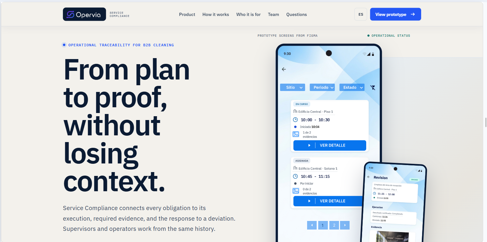
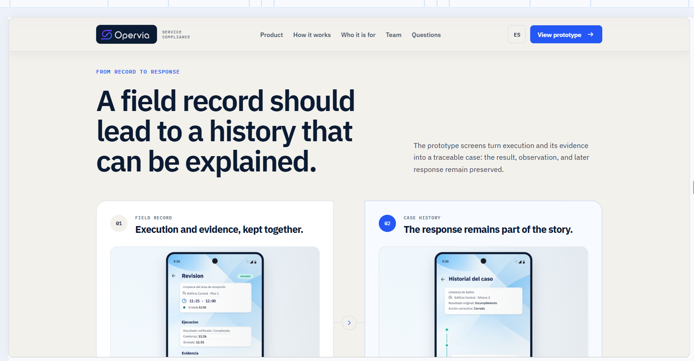

# Capítulo III: Solution UI/UX Design

Este capítulo presenta la propuesta de interacción de Service Compliance para la empresa prestadora de servicios de limpieza tercerizada. La solución distingue una aplicación Android nativa para operarios, una aplicación multiplataforma para supervisores y administradores de la empresa prestadora y un Landing Page público orientado a explicar el producto y explorar el prototipo del producto. No se propone una aplicación web operativa ni un portal para la organización cliente en esta etapa.

El diseño responde a una distinción que atraviesa el Chapter II: registrar una Execution no equivale a determinar su Compliance Result. Del mismo modo, una Exception no constituye automáticamente un Non-compliance, y una Corrective Action registrada como atendida por el operario requiere verificación antes de cerrarse. Estas diferencias determinan etiquetas, permisos, navegación y secuencias de interacción.

La propuesta visual y funcional se documenta separando los artefactos disponibles de aquellos cuya elaboración o revisión sigue pendiente. Los mockups exportados de Figma representan decisiones de interfaz; no constituyen evidencia de aplicaciones móviles implementadas.

## 3.1. Product Design

La experiencia se organiza alrededor de las preguntas específicas de cada rol. El operario necesita saber qué debe realizar, dónde, cuándo y qué información debe registrar. El supervisor necesita conocer qué obligaciones requieren atención, qué ocurrió durante su ejecución y qué decisión de cumplimiento corresponde. La definición y activación de planes corresponde al administrador organizacional autorizado. El administrador empresarial, propuesto como rol adicional para la gestión de las cuentas y la contratación B2B, debe operar dentro de un alcance organizacional separado del trabajo cotidiano de campo. Por último, el visitante del Landing Page necesita comprender la propuesta de valor y encontrar un acceso al prototipo público.

| Producto | Usuarios | Responsabilidad central | Tecnología prevista / estado actual |
|---|---|---|---|
| Operator Mobile Application | Operarios | Consultar asignaciones, ejecutar obligaciones, adjuntar evidencia, reportar excepciones y atender correctivas | Kotlin, Android nativo |
| Supervisor & Administration Mobile Application | Supervisores y administrador empresarial, con permisos separados | Supervisar/evaluar/reportar (supervisor); configurar planes/usuarios/alcance (administrador) | Flutter/Dart, Android e iOS |
| Landing Page | Visitantes y compradores potenciales | Explicar el servicio y explorar el prototipo/demostración | HTML/CSS/JavaScript; existe un despliegue previo, cuyo diseño vigente está documentado con capturas de su publicación |

El administrador no constituye un tercer segmento entrevistado. Sus operaciones se incorporan como un rol organizacional propuesto, condicionado a la aprobación de las historias de gestión de usuarios y cupos correspondientes en el Product Backlog.

### 3.1.1. Style Guidelines

#### 3.1.1.1. General Style Guidelines

**Identidad.** Opervia es la startup que ofrece Service Compliance. El nombre del producto identifica una solución dedicada a explicar el cumplimiento de un servicio tercerizado mediante la relación entre planificación, ejecución, evidencia, evaluación y seguimiento. La identidad evita prometer certificación jurídica, aprobación automática del servicio o detección infalible de incumplimientos.

**Marca gráfica.** El isotipo existente representa continuidad del proceso, hitos de registro y comprobación. Su uso debe respetar un área libre, contraste suficiente y una versión monocromática para fondos de contraste limitado. No se incorporan sellos ISO, SOC 2, menciones de clientes ni métricas de operación que no estén acreditadas.

*Figura 3.1. Identificador gráfico de Service Compliance utilizado como referencia de marca.*

**Tipografía.** La familia definida es IBM Plex Sans. Se utiliza una jerarquía legible que separa título de vista, encabezados de secciones, contenidos operativos y metadatos. En móvil, los títulos se proponen entre 22 y 24 sp, los subtítulos entre 18 y 20 sp y los textos principales entre 14 y 16 sp, sujetos a escalamiento del sistema operativo y pruebas de legibilidad. Los códigos, periodos, fechas y estados no deben depender únicamente de cambios de peso tipográfico.

*Figura 3.2. Familia tipográfica seleccionada para la identidad visual.*

**Colores y significado.** La paleta existente emplea azul primario `#0875EE`, azul marino `#07133F`, gris de texto `#616B78` y superficies blancas `#FFFFFF`. Para estados se utilizan combinaciones de color y texto: gris para información pendiente o asignada, azul para ejecución en curso, verde azulado para finalizaciones o evaluaciones conformes y rojo para errores o incumplimientos. La etiqueta siempre debe explicar el significado, incluso si el color no es perceptible.

No se utilizará el mismo color o etiqueta para confundir dimensiones distintas. Por ejemplo, «Enviada» corresponde al registro de ejecución; «Pendiente de evaluación» corresponde a la revisión; «Cumple» es un resultado de cumplimiento; «Pendiente de sincronización» indica un estado técnico local.

**Espaciado y componentes.** Se establece como criterio una escala de espaciado regular basada en múltiplos de 4 y 8 unidades, tarjetas con separación visible entre obligaciones, acciones táctiles de tamaño suficiente y agrupación de información relacionada. Las cifras de espaciado deberán consolidarse como tokens en Figma antes de considerarse un Design System implementado. Los estados vacíos, errores de validación y confirmaciones forman parte de los componentes reutilizables; no se diseñan como páginas autónomas cuando basta una variante del mismo componente.

**Voz y tono.** Se adopta comunicación seria, respetuosa y directa. Los mensajes explican qué ocurrió, si la información quedó guardada y qué acción corresponde. Se evitan acusaciones al operario y mensajes que confundan el registro de una actividad con su aprobación. Son preferibles «Ejecución enviada para revisión» y «Acción correctiva pendiente de verificación» a «Servicio certificado» o «Incumplimiento resuelto» antes de la decisión correspondiente.

**Accesibilidad e internacionalización.** El modelo de interfaz contempla `en_US` como idioma predeterminado y `es_419` como alternativa, según la configuración definida. Los componentes deben preservar contenido legible al aumentar el tamaño del texto, incorporar etiquetas accesibles para iconos y ofrecer foco/orden de lectura adecuados. Una combinación de colores visualmente uniforme no acredita por sí sola accesibilidad. Estas son decisiones de diseño; la implementación y las pruebas en dispositivos móviles permanecen pendientes.

#### 3.1.1.2. Web Style Guidelines

El Landing Page utiliza una estructura editorial clara en vez de una consola técnica de monitoreo. La prioridad es comunicar el problema, la propuesta de valor, el proceso que permite demostrar cumplimiento, los dos roles operativos y el acceso al prototipo del producto. Debe adaptarse a navegadores de escritorio y móvil, sin cambiar el contenido esencial entre tamaños de pantalla.

El encabezado identifica la marca, presenta una navegación breve por secciones y mantiene una acción principal para explorar el prototipo. Los enlaces y botones deben expresar acciones verificables: «Cómo funciona», «Para quién es» y «Explorar el prototipo». No se prometen pruebas piloto en 48 horas, certificaciones de seguridad, resultados de ahorro ni integraciones que todavía no existan.

Se requiere estructura semántica HTML, contraste suficiente, soporte de teclado, estados visibles de foco, textos alternativos y una experiencia responsiva. El selector de idiomas debe conservar etiquetas consistentes y no depender exclusivamente de banderas. La Landing Page es el único producto web incluido en el alcance inicial.

#### 3.1.1.3. Mobile Style Guidelines

La navegación, disposición de acciones y densidad de información se adaptan a dos tipos de trabajo. En Android nativo, el operario encuentra primero su próxima obligación y puede registrar el resultado en pocos pasos. En Flutter, el supervisor prioriza obligaciones que requieren intervención, evaluaciones pendientes y casos; el administrador accede a funciones organizacionales mediante permisos separados.

Las aplicaciones deben permitir identificar claramente el alcance activo (empresa, servicio, sede, fecha o zona) cuando sea relevante. Una captura de foto, lectura QR, firma manuscrita o geolocalización puntual debe responder a un Evidence Requirement concreto, no ejecutarse indiscriminadamente. El seguimiento continuo de ubicación no forma parte del alcance aprobado.

La interacción sin conexión debe indicar cuándo se visualizan datos almacenados previamente y qué registros permanecen pendientes de sincronización. La interfaz no mostrará éxito remoto antes de contar con confirmación de la API.

### 3.1.2. Information Architecture

#### 3.1.2.1. Organization Systems

La organización de información combina audiencia, tarea, secuencia y tiempo. En el Landing Page se utiliza jerarquía informativa, iniciando por la necesidad del comprador y terminando en una acceso al prototipo. En las aplicaciones, el contenido se adapta a permisos y objetivos del usuario, sin mezclar el trabajo de un operario con decisiones de evaluación o administración de cuentas.

| Experiencia | Organización principal | Uso concreto |
|---|---|---|
| Landing Page | Jerárquica y secuencial | Problema, propuesta de valor, funcionamiento, roles y prototipo |
| Operario | Por trabajo y secuencia de ejecución | Obligaciones próximas o en curso; detalle, ejecución, evidencia o Exception y envío |
| Supervisor | Por tarea, estado y servicio/sede | Resumen; obligaciones; revisión de ejecuciones; casos; reportes |
| Administrador | Por organización y permisos | Usuarios, roles, cupos contratados y servicios autorizados, una vez aprobadas las historias correspondientes |
| Historiales | Cronológica | Conservación de Execution, Compliance Result, observaciones y correctivas sin reemplazar eventos anteriores |

La fecha y la ventana de ejecución son criterios de consulta para obligaciones. Las decisiones de cumplimiento se ordenan por estado de revisión, no por el estado técnico de sincronización. En los reportes, la jerarquía de filtros sigue empresa/servicio/sede/periodo, de acuerdo con el alcance permitido a cada usuario.

#### 3.1.2.2. Labelling Systems

Las etiquetas buscan ser breves y mantener equivalencia con el Ubiquitous Language de Chapter II. En el contenido dirigido al usuario, los términos en inglés del modelo de dominio se presentan mediante nombres comprensibles en el idioma seleccionado.

| Concepto | Etiqueta `es_419` | Etiqueta `en_US` | Precisión semántica |
|---|---|---|---|
| Service Obligation | Obligación / Actividad asignada | Service obligation / Assigned task | Trabajo esperado dentro de una ventana; no resultado evaluado |
| Execution | Ejecución | Execution | Trabajo realizado o intentado; no significa conformidad |
| Evidence Requirement | Evidencia requerida | Required evidence | Depende de la obligación y puede ser inexistente |
| Exception | Impedimento / Excepción reportada | Reported exception | Circunstancia por revisar; no incumplimiento automático |
| Compliance Result | Resultado de cumplimiento | Compliance result | Decisión del supervisor |
| Corrective Action | Acción correctiva | Corrective action | Atención por operario; verificación/cierre por supervisor |
| Compliance Case | Historial del caso | Case history | Secuencia de evaluaciones y acciones posteriores |
| SyncState | Pendiente de sincronización | Pending sync | Estado técnico del dispositivo, separado del negocio |

La interfaz diferencia al menos cuatro dimensiones: estado de la obligación (asignada, en curso, vencida según reglas), estado de la ejecución (no registrada, en curso, enviada), estado de evaluación (pendiente o resultado registrado) y estado de transmisión (sin conexión, pendiente, sincronizado, error). No se reducirá esa información a un único atributo `status`.

#### 3.1.2.3. SEO Tags and Meta Tags

Los metadatos del Landing Page describen la oferta sin atribuirle capacidades regulatorias o una base instalada inexistente. Los valores se proponen en inglés para la experiencia predeterminada y español latinoamericano para su alternativa traducida.

| Elemento | Inglés `en_US` | Español `es_419` |
|---|---|---|
| Page Title | Service Compliance: Outsourced Service Traceability \| Opervia | Service Compliance: Trazabilidad de servicios tercerizados \| Opervia |
| Description | Connect service obligations, field execution, evidence and compliance review in a traceable operational workflow. | Relaciona obligaciones del servicio, ejecución, evidencia y evaluación de cumplimiento en un historial trazable. |
| Keywords | outsourced cleaning, service obligations, evidence, compliance, field operations | limpieza tercerizada, obligaciones, evidencias, cumplimiento, operaciones de campo |
| Author | Opervia | Opervia |
| Open Graph Title | Service Compliance by Opervia | Service Compliance de Opervia |

Para la publicación móvil futura se proponen los siguientes elementos ASO, sin afirmar que ya existen fichas activas en tiendas:

| Elemento | Operator Android | Supervisor Flutter |
|---|---|---|
| App Title | Service Compliance Operator | Service Compliance Supervisor |
| Subtitle | Assigned work and evidence | Operational and compliance review |
| Keywords | field work, cleaning, evidence, assigned tasks | supervision, compliance, corrective actions, reporting |
| Description | Review assigned obligations, record execution and report exceptions. | Review operations, evaluate compliance and follow up on corrective actions. |

#### 3.1.2.4. Searching Systems

La Landing Page, por su volumen de contenido, no requiere una búsqueda interna. La navegación por secciones permite llegar a funcionamiento, destinatarios y acceso al prototipo.

En Android, el operario consulta la lista de obligaciones de su periodo y puede distinguir las que están pendientes, en curso y registradas. No se propone un buscador global si el volumen de tareas no lo justifica. En la experiencia del supervisor se incluyen filtros por servicio, sede, periodo y estado de obligación/revisión. Para los casos y reportes se ofrece filtrado por resultado de cumplimiento, preservando los pendientes de evaluación como categoría distinta.

Cuando una consulta no devuelve registros, se muestra un estado vacío explicativo. Cuando el dispositivo trabaja con información local desactualizada, la interfaz lo advierte para no presentar datos históricos como si estuvieran actualizados.

#### 3.1.2.5. Navigation Systems

Operario: Android nativo. La navegación aprobada se estructura en `Inicio | Trabajo | Historial | Perfil`. Las notificaciones se abren desde un acceso secundario; las acciones correctivas asignadas se presentan dentro del trabajo que requiere atención. La pantalla de inicio prioriza la próxima obligación y permite continuar una ejecución activa. «Historial» reúne ejecuciones previas y el resultado de la revisión cuando exista, no solo acciones correctivas.

Supervisor: Flutter. La navegación aprobada es `Resumen | Actividades | Casos | Reportes`, con Perfil desde el avatar. «Actividades» organiza obligaciones y asignaciones; «Casos» reúne evaluaciones, Exceptions, Non-compliances, Corrective Actions y Client Observations. El listado de operarios es una consulta contextual desde Actividades, no una pestaña autónoma. Esta elección preserva la importancia de Compliance Management en la navegación principal.

Administrador: Flutter. El administrador, como rol organizacional adicional, comparte tecnología con el supervisor pero no sus permisos ni necesariamente toda su navegación. Sus funciones incluyen configuración y activación de Service Plans (US-01 a US-03), así como gestión de usuarios y cupos (US-20).

Landing Page. Header con marca y accesos a `How it works`, `Who it's for` y `Explore the prototype`. En móvil, la navegación se contrae sin ocultar el llamado a la acción. La acción «Explorar el prototipo» enlaza al archivo de Figma sin recoger datos de contacto ni simular una suscripción o contratación.

### 3.1.3. Landing Page UI Design

El Landing Page actual está implementado y desplegado en [Service Compliance | Opervia](https://operviastartup.github.io/service-compliance-landingpage/). Comunica el alcance del producto, la trazabilidad de obligaciones y las experiencias de operario y supervisión. Los wireframes heredados del informe que incluyen certificaciones, compañías cliente, resultados de auditoría o tarifas sin condiciones verificables no se consideran la propuesta vigente.

#### 3.1.3.1. Landing Page Wireframe

El sitio se estructura en seis áreas de contenido, repetidas conceptualmente en desktop y mobile con una disposición adaptada al espacio de lectura.

| Área | Función comunicativa | Contenido mínimo |
|---|---|---|
| Header / Hero | Identificar producto y destinatario | Logotipo, propuesta de valor para empresas prestadoras, CTA «Explorar el prototipo» |
| Problema operativo | Mostrar el costo de la fragmentación | Información distribuida entre planificación, comunicación, fotos y reportes; sin cifras no medidas |
| Cómo funciona | Explicar el proceso | Plan, obligación, ejecución y evidencia, evaluación y seguimiento |
| Dos experiencias móviles | Distinguir responsabilidades | Operario registra; supervisor verifica y evalúa |
| Beneficio de trazabilidad | Demostrar alcance | Caso ilustrativo, marcado como ejemplo, que conserva incumplimiento original y correctiva |
| Explorar prototipo | Permitir ver las pantallas de producto | CTA que abre Figma con destino reconocible; no existe formulario ni contratación en línea |

En desktop se utiliza una primera sección de dos columnas, con propuesta de valor y representación de las aplicaciones. En mobile web los elementos se apilan en orden de lectura, sin métricas decorativas ni menús técnicos. El equipo ha definido un modelo de suscripción B2B con plan base de S/300 mensuales y opción Custom. La Landing Page publicada en este hito no implementa checkout, registro comercial ni contratación en línea: su acción principal permite explorar el prototipo del producto en Figma.

*Figura 3.3. Sección principal de la landing page publicada de Service Compliance.*

#### 3.1.3.2. Landing Page Mock-up

La landing publicada conserva IBM Plex Sans, azul primario, espacios blancos y un CTA identificable. Su composición comunica el vínculo entre obligación, ejecución, evidencia y seguimiento, sin atribuir funcionamiento comercial a las pantallas de Figma. La evidencia visual del sitio corresponde a capturas de la página publicada, no a pantallas internas del prototipo.

*Figura 3.4. Sección de producto de la landing page publicada, con ejecución, evidencia e historial de caso.*

### 3.1.4. Mobile Applications UX/UI Design

El diseño móvil se organiza por flujos de usuario y no por una enumeración indiscriminada de vistas. Las pantallas de telemetría en vivo, mapas de técnicos, mantenimiento, certificación del operario, control de asistencia, panel web de despacho y métricas personales avanzadas del material anterior quedan fuera del alcance confirmado. Recuperación de contraseña y geolocalización puntual pueden aparecer como componentes necesarios de acceso o evidencia; MFA y tracking GPS continuo se reservan para un backlog posterior.

#### 3.1.4.1. Mobile Applications Wireframes

El operario inicia sesión con una cuenta asignada y consulta su trabajo. Cada actividad muestra el sitio, la ventana de atención, el estado y la cantidad de evidencias vinculadas.

  

*Figura 3.5. Pantallas del prototipo para consulta de actividades y revisión de evidencia.*

El supervisor consulta actividades, revisa la ejecución y registra el resultado de cumplimiento. El historial del caso mantiene el resultado original y las acciones posteriores.

  

*Figura 3.6. Pantallas del prototipo para evaluación, acción correctiva e historial del caso.*

#### 3.1.4.2. Mobile Applications Wireflow Diagrams

Los Wireflows deben mostrar una sucesión de wireframes o estados visuales, no solo flechas entre nombres de funcionalidades. Para cada User Goal se especifica la ruta esperada y las bifurcaciones que requieren estados de pantalla diferentes. Se usarán Lucidchart u Overflow para producir los artefactos formales definidos para el proyecto.

| Goal | Actor | User Stories | Ruta principal a representar | Estado alternativo relevante |
|---|---|---|---|---|
| WG-01: entrar al espacio de trabajo autorizado | Operario / Supervisor | US-17 | Login, validación, destino por rol | Credenciales inválidas, cuenta deshabilitada, error de red |
| WG-02: comprender y registrar el trabajo asignado | Operario | US-04/05/06 | Inicio, obligación, ejecución, evidencia, envío | Sin tareas, obligación reasignada, evidencia requerida faltante |
| WG-03: documentar un impedimento | Operario | US-07/08 | Ejecución, Exception, envío a revisión | Sin conexión o evidencia inaccesible |
| WG-04: evaluar una ejecución | Supervisor | US-09/10/11 | Actividades, ejecución, evidencia/criterios, Compliance Result | Información insuficiente o Exception aceptada |
| WG-05: atender y verificar una acción correctiva | Operario / Supervisor | US-12/21 | Caso, asignación, atención, verificación, cierre | Atención devuelta; resultado original preservado |
| WG-06: reconstruir un caso y generar reporte | Supervisor | US-13/14/15 | Casos, cronología, filtro, reporte | Sin resultados, evidencia no accesible |
| WG-07: gestionar usuarios y cupos | Administrador | US-20 | Organización, usuarios, alta o invitación, confirmación | Cupo agotado, usuario fuera del alcance |

El ejemplo WG-03 necesita mostrar una salida válida cuando no se dispone de una evidencia obligatoria: la aplicación conserva el requisito insatisfecho, vincula la Exception y envía la ejecución para revisión sin asignarle Compliance Result. El estado técnico `Pending Sync`, cuando corresponde, se presenta de forma independiente.

#### 3.1.4.3. Mobile Applications Mock-ups

El equipo elaboró mockups en Figma para dos experiencias móviles y estados compartidos. Se revisaron 57 exportaciones: seis de acceso, 33 del operario y 18 clasificadas como supervisor. El archivo fuente de diseño se encuentra en [Grupo 3: Service Compliance](https://www.figma.com/design/5aLeroV2VsHrYEImQNATTI/Grupo-3---Service-Compliance). Las capturas siguientes son artefactos de diseño, no pantallas de aplicaciones Kotlin o Flutter ya implementadas. El inventario completo de exportaciones se entrega junto con este capítulo.

Los mockups se agrupan por objetivos de usuario para que sus variaciones representen estados de la misma interfaz y no se contabilicen como funcionalidades diferentes. Se priorizan las rutas del operario que ejecuta el servicio, del supervisor que evalúa y de la cuenta empresarial que administra acceso.

##### Acceso compartido: US-17

Se diseñaron la pantalla de inicio de sesión, el estado de autenticación, mensajes de red y credenciales incorrectas. La variante de validación de formato corresponde al formulario y no sustituye la verificación de credenciales por el servidor. La pantalla indica que las cuentas las gestiona la «Supervisión Opervia»; debe sustituirse por un texto coherente con el administrador de la empresa prestadora, responsable de aprovisionar cuentas según el alcance contratado.

##### Operario: consultar la jornada y el trabajo asignado (US-04)

La primera vista prioriza la obligación próxima, sus horarios y la existencia de evidencias requeridas. La pestaña «Trabajo» separa obligaciones en curso, pendientes y registradas; una vista alternativa muestra la ausencia de actividades pendientes. También existe una variante sin conexión que mantiene la última información guardada. Esta última no asegura que la asignación local sea la más reciente.

##### Operario: detalles, disponibilidad y ejecución (US-04/US-05)

Antes de iniciar la ejecución, el operario puede revisar zona, ventana, instrucciones y evidencias aplicables. Los mockups muestran una obligación con dos fotografías requeridas, otra sin evidencia obligatoria y respuestas de error para una obligación cancelada o ya no asignada. La interacción de ejecución presenta instrucciones y seguimiento de pasos. La lista de pasos de la pantalla no implica que cada paso sea un registro persistente; esa regla requiere aprobación explícita.

##### Operario: captura y revisión de evidencia (US-06)

El flujo incluye solicitud de permisos, cámara, revisión de la fotografía y validación de evidencia faltante antes del envío. El usuario puede cancelar o repetir una captura sin registrar un archivo vacío. El diseño incluye indicadores como «Nitidez: 98 % óptima», «Protocolo verificado» y etiquetas de auditoría que no tienen una tecnología ni regla verificadas en el alcance actual; deben eliminarse o identificarse claramente como datos meramente ilustrativos hasta contar con implementación y fundamento. La fotografía de ejemplo también debe corresponder a una actividad de limpieza realista, no a contenido ajeno a la obligación.

##### Operario: reportar impedimento o Exception (US-07)

La pantalla de Exception registra motivo y descripción, y puede incorporar evidencia contextual. El envío habilita una revisión posterior sin suponer que la excepción es aceptada. En la confirmación exportada se utiliza la expresión «Turno protegido» y se asegura que la incidencia no afecta el cumplimiento: esa afirmación debe cambiarse, porque únicamente el supervisor autorizado decide si corresponde una `Exception Accepted` o un `Non-compliance`.

##### Operario: resultado registrado y sincronización (US-05/US-08)

La confirmación debe distinguir tres situaciones: guardado local, envío confirmado por la API y evaluación pendiente del supervisor. En las capturas figuran variantes online/offline y un centro de sincronización con pendientes, reintento y error individual. La etiqueta «Actividad completada» en la vista sin conexión debe leerse como resultado declarado por el operario; no puede confundirse con cumplimiento aprobado o con envío exitoso al servidor.

##### Operario: historial, perfil y notificaciones (US-22/US-23)

El historial contempla registros anteriores, filtros por fecha y condición, observaciones y acceso al detalle del trabajo. Los filtros de sincronización no deben presentarse como estados de cumplimiento; `Conforme` solo puede mostrarse cuando existe evaluación registrada. El perfil incluye enlaces a soporte y términos; las notificaciones diferencian cambios de actividad, solicitud de correctiva y confirmación de registros enviados.

##### Supervisor: localizar y revisar ejecuciones (US-09/US-10)

Los filtros por sitio, periodo y estado permiten encontrar obligaciones en curso, enviadas, exceptuadas o atrasadas. La revisión de una Execution reúne lo declarado por el operario, la evidencia asociada y las Exceptions. «Enviado» expresa una transición operativa, no que el servicio ya esté conforme. La navegación visible en las capturas es la versión anterior de cinco destinos y debe alinearse con `Resumen | Actividades | Casos | Reportes`, con Perfil disponible desde el avatar.

##### Supervisor: evaluar el cumplimiento (US-11)

La propuesta visual permite seleccionar `Compliant`, `Exception Accepted` o `Non-compliance`. `Deviation` permanece como hallazgo intermedio y no constituye otro resultado definitivo. Antes de registrar un incumplimiento o aceptar una excepción debe mostrarse el fundamento y los criterios aplicables; el selector por sí solo no demuestra que se hayan verificado dichos criterios.

##### Supervisor: caso y acción correctiva (US-12/US-14/US-21)

El historial del Compliance Case presenta ejecución, evidencia, evaluación, asignación de correctiva, atención y verificación en una secuencia cronológica. La creación de una Corrective Action debe partir de un caso que requiera corrección, con instrucciones y responsable. La pantalla actual permite escoger manualmente un estado al crearla; debe reemplazarse por un estado inicial derivado de la operación, sin permitir cerrar la correctiva antes de verificar su atención.

Las exportaciones `Supervisor 17.png` y `Supervisor 18.png` muestran registrar atención por parte del trabajador responsable. A pesar de su carpeta de origen, corresponden funcionalmente al operario, no al supervisor que verifica y cierra. El catálogo de figuras no debe usarlas para atribuir al supervisor acciones propias del operario.

##### Supervisor: alertas y reportes (US-15/US-16)

Las alertas se destinan a vencimientos, solicitudes de revisión y cambios importantes. El reporte filtra por periodo, sede y servicio. Su gráfica de muestra contiene inconsistencias entre las cantidades de la leyenda, las barras y los totales; deben corregirse con datos ilustrativos y matemáticamente coherentes, sin presentarlos como métricas reales de Opervia. Las preferencias avanzadas de alertas son un diseño adicional y no una función confirmada del alcance inicial.

##### Cobertura y límites de los mockups exportados

El nuevo lote completa visualmente la consulta, ejecución, evidencia, Exception, sincronización, historial y notificaciones del operario. Sin embargo, no aporta pantallas aprobadas para creación/activación de Service Plans, definición de Obligation Definitions, asignación de operario ni administración de usuarios y cupos. Tampoco incluye un Landing Page rediseñado. Esas funciones figuran en la especificación funcional o el alcance propuesto, pero sus mockups siguen pendientes. Un total de 57 imágenes no equivale a 57 pantallas finales ni a un prototipo interactivo comprobado: varias son estados o variantes de una misma vista.

#### 3.1.4.4. Mobile Applications User Flow Diagrams

Los User Flow Diagrams incorporan los mockups reales y representan decisiones, happy paths y unhappy paths. Deben construirse con el mismo conjunto WG-01…WG-07 documentado en Wireflows, evitando que una pantalla nueva introduzca capacidades sin User Story. El siguiente cuadro fija las bifurcaciones esenciales.

| User Goal | Happy Path | Unhappy/alternative paths | Regla decisiva |
|---|---|---|---|
| WG-01 | Login válido, rol autorizado | Credenciales erróneas, cuenta inactiva, error de red, sesión vencida | El backend, no solo UI, autoriza operaciones |
| WG-02 | Consultar obligación, iniciar, registrar resultado | Sin obligaciones; cambio de asignación; requisitos pendientes | Execution enviada ≠ Compliant |
| WG-03 | Registrar Exception, adjuntar si corresponde, enviar | Requisito no satisfecho; offline; error de envío | Exception no se transforma automáticamente en Non-compliance |
| WG-04 | Revisar, evaluar, registrar Compliance Result | Información insuficiente; discrepancia detectada | Solo supervisor determina resultado definitivo |
| WG-05 | Asignar correctiva, atender, verificar, cerrar | Evidencia faltante; atención rechazada o reenviada | Cierre no elimina resultado original |
| WG-06 | Consultar caso, filtrar, generar reporte | Sin resultados, periodo inválido, evidencia inaccesible | Pendiente de evaluación no es conforme ni incumplimiento |
| WG-07 | Consultar cupos, invitar usuario, confirmar | Cupos agotados, permisos insuficientes | Administración organizacional separada de supervisión |

Las bifurcaciones anteriores sirven como especificación de los recorridos en Lucidchart y Overflow.

#### 3.1.4.5. Mobile Applications Prototyping

La evaluación de prototipos debe permitir comprobar continuidad entre estados de pantalla y responsabilidad de cada rol. Para el operario, los recorridos prioritarios son consulta de obligación, registro de ejecución y Exception, atención correctiva y revisión del historial. Para el supervisor, los recorridos prioritarios son consulta de obligaciones, revisión/evaluación, asignación y verificación correctiva, reconstrucción de caso y reportes. En el administrador se evaluarán, después de aprobar los requisitos, alta de usuarios y control de cupos.

El prototipo debe evidenciar: acciones reversibles, estados vacíos, errores de credenciales, confirmación de guardado, errores de conectividad y diferencias entre pendiente de envío, pendiente de revisión y resultado de cumplimiento. Un clic que solo navega entre imágenes sin respetar esas condiciones no demuestra el comportamiento del flujo.

| Prototipo | Recorridos que debe demostrar | Evidencia disponible |
|---|---|---|
| Operator App (Figma) | WG-01, WG-02, WG-03 y parte operario de WG-05 | Mockups de inicio, trabajo, ejecución, evidencia, excepción, sincronización, historial y alertas |
| Supervisor App (Figma) | WG-01, WG-04, WG-05 y WG-06 | Mockups de inicio, trabajo, ejecución, evidencia, excepción, sincronización, historial y alertas |
| Administrator Experience | WG-07 | Gestión de cuentas, cupos y configuración organizacional |
