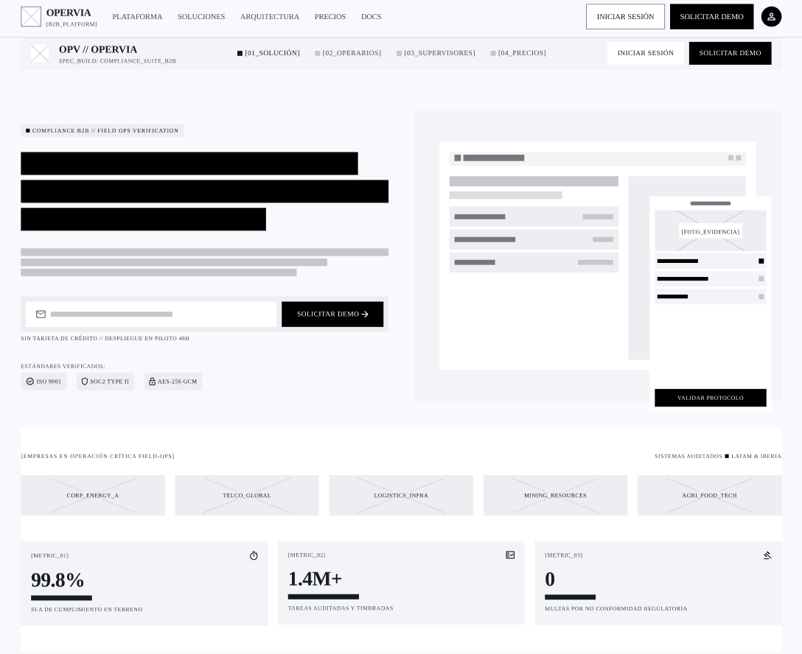
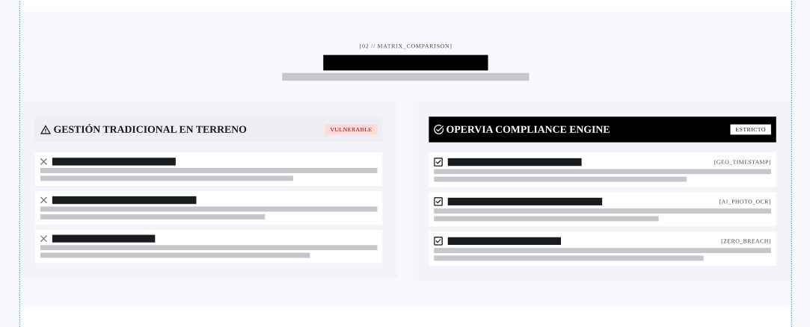
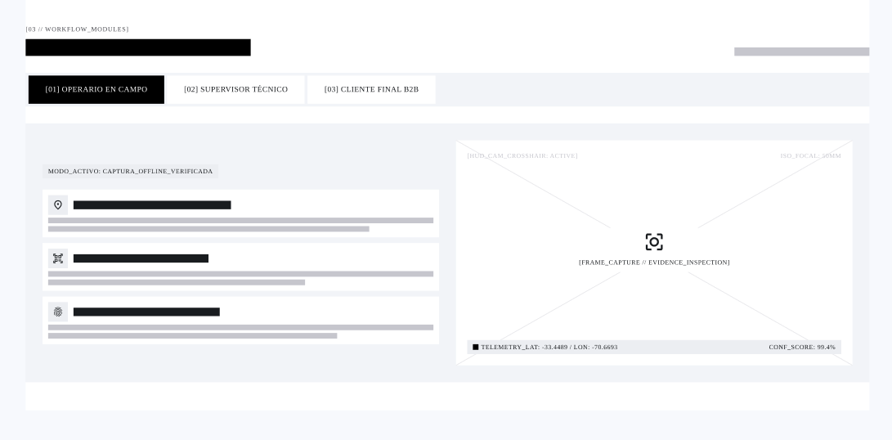
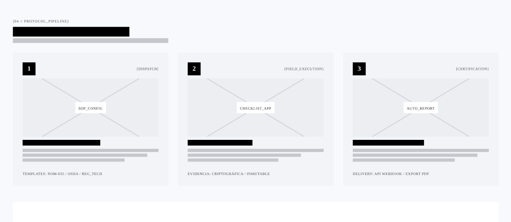
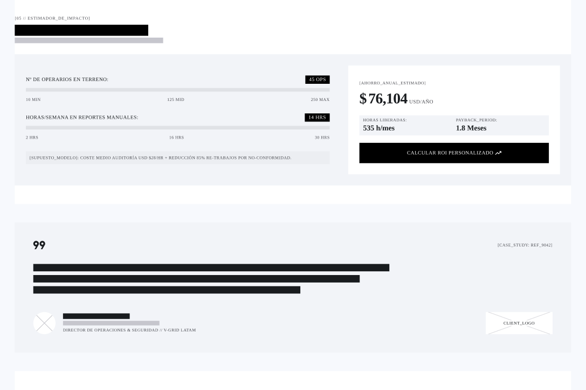
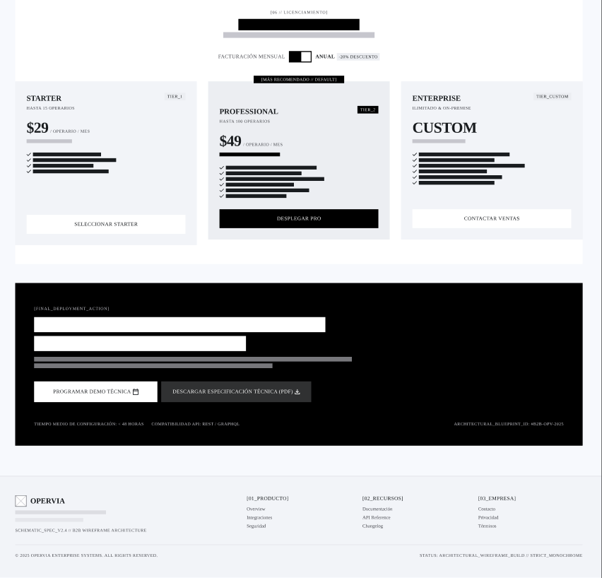

# Capítulo III: Solution UI/UX Design

## 3.1. Product design

### 3.1.1. Style Guidelines

#### 3.1.1.1. General Style Guidelines

La propuesta visual utiliza un fondo geométrico en tonos celestes, superficies blancas para las cards y azul intenso para las acciones principales y los elementos seleccionados de navegación. Se mantiene un color en especifico para cada encabezado dentro de la aplicacion, lo que establece una jerarquía entre el nombre de la pantalla, sus secciones y los detalles de cada registro.
Los estados se identifican mediante etiquetas textuales y colores de apoyo. El color acompaña el significado del estado; la etiqueta mantiene esa información visible por sí misma.
La interfaz procura conservar una estructura recurrente: encabezado, contexto del caso, contenido agrupado y acción principal cuando corresponde. Las cards redondeadas y las separaciones constantes ayudan a mantener la continuidad entre pantallas. Estos lineamientos describen la propuesta visual del equipo para la aplicacion Service Compliance

### Branding

**Nombre de la marca** 

**Service Compliance** es el nombre de la aplicación móvil, orientada inicialmente a apoyar la gestión de servicios de limpieza tercerizados. La denominación refleja su propósito: relacionar las obligaciones del servicio con su ejecución, las evidencias registradas y la evaluación del cumplimiento.

**Logotipo**

El isotipo de Service Compliance combina un recorrido continuo, dos puntos que señalan hitos del proceso y una marca de verificación. En conjunto, estos elementos representan la trazabilidad de las obligaciones del servicio y su revisión, desde el seguimiento de las actividades hasta la confirmación del resultado de cumplimiento.

  

**Eslogan** 

El eslogan principal de Service Compliance es *Evidencia, trazabilidad y verificabilidad*. Este eslogan sintetiza el propósito de **Service Compliance**: vincular las obligaciones con su ejecución, conservar la evidencia asociada y mantener información que permita revisar los resultados de cumplimiento.

**Valores de la marca**

Service Compliance se basa en valores que guían la manera en que la aplicación organiza y presenta la información del servicio:

- **Evidencia:** Cada registro se vincula con la obligación y el criterio correspondiente. Esto permite revisar el resultado con información contextualizada.
  
- **Trazabilidad:** El historial conserva la secuencia de ejecución, evaluación y acciones posteriores. Así puede consultarse la evolución de cada caso.
  
- **Verificabilidad:** Los resultados se revisan con base en criterios y evidencias registradas. Cada evaluación queda asociada con su responsable y fecha.

- **Integridad:** Las decisiones anteriores permanecen en el historial del caso. Las acciones posteriores no reemplazan ni ocultan el resultado original.

- **Transparencia:** Los estados, responsables y eventos se presentan con claridad. Esto facilita comprender qué ocurrió durante cada etapa.

### Tipografía

Para las interfaces de Service Compliance se utiliza IBM Plex Sans como familia tipográfica principal. Su aplicación consistente en títulos, textos, etiquetas, botones y datos ayuda a mantener una identidad visual uniforme en las pantallas móviles.

La jerarquía se establece mediante el tamaño y el peso de la fuente: los títulos de pantalla y sección destacan sobre el texto descriptivo; los botones y estados usan pesos bold o semibold para facilitar su identificación; y los datos secundarios conservan un peso regular. Se evita combinar familias tipográficas distintas y se priorizan tamaños legibles en pantallas pequeñas.

  

**Jerarquía Tipográfica**

La jerarquía tipográfica de Service Compliance se organiza en varios niveles, cada uno con tamaños y pesos específicos:

- **Título de pantalla:** IBM Plex Sans Bold, 22–24 sp. Se utiliza para el nombre principal de cada pantalla y permite identificar rápidamente dónde se encuentra el usuario.

- **Título de sección:** IBM Plex Sans Bold, 18–20 sp. Organiza el contenido de una pantalla y ayuda a distinguir sus apartados.

- **Texto principal:** IBM Plex Sans Regular, 14–16 sp. Se aplica a descripciones, instrucciones y datos centrales de obligaciones, ejecuciones y acciones correctivas.

- **Botones:** IBM Plex Sans Semibold, 14–16 sp. Destaca acciones disponibles, como “Ver detalle” o “Registrar atención”.

### Paleta de colores

- Azul primario (#0875EE)
  - Fondo de botones principales; texto de botones secundarios; interruptores activos.
 
- Azul marino (#07133F)
  - Títulos de pantalla y títulos de sección.
 
- Gris de texto (#616B78)
  - Texto descriptivo y contenido general.
 
- Azul claro de estado (#E5F1FB)
  - Fondo de la etiqueta En curso.
 
- Azul medio de estado (#26709E)
  - Texto de la etiqueta En curso.

- Gris claro de estado (#E8EEF5)
  - Fondo de la etiqueta Asignada.
 
- Gris oscuro de estado (#475569)
  - Texto de la etiqueta Asignada y color del estado Pendiente de evaluación en el reporte rápido.

- Verde agua claro de estado (#CCFBF1)
  - Fondo de la etiqueta Enviado.
 
- Verde azulado de estado (#0F766E)
  - Texto de la etiqueta Enviado y color del estado Cumple en el reporte rápido.

- Amarillo claro de estado (#FEF3C7)
  - Fondo de la etiqueta Exceptuada.

- Marrón de estado (#92400E)
  - Texto de la etiqueta Exceptuada y color de Excepción aceptada en el reporte rápido.
 
- Rojo claro de estado (#FEE2E2)
  - Fondo de una etiqueta de estado de error o incumplimiento.
 
- Rojo de estado (#B91C1C)
  - Texto de esa etiqueta y color del estado Incumplimiento en el reporte rápido.

- Blanco (#FFFFFF)
  - Fondo de las cards.

- Rosa muy claro de error (#FFF1F2)
  - Fondo del campo de credenciales cuando el login presenta un error.
 
- Rojo de error (#BA1A1A)
  - Borde del campo de credenciales con error.
 

### Voz y tono

La voz de Service Compliance es profesional, clara, respetuosa y objetiva. La comunicación utiliza palabras directas y consistentes para que supervisores y operarios comprendan las obligaciones, los estados de cada caso y las acciones disponibles. Las instrucciones priorizan verbos concretos y evitan tecnicismos innecesarios. En sus dimensiones, mantiene un registro serio y profesional, formal pero cercano, respetuoso y sereno.

El tono se adapta a cada situación sin perder esa identidad. En las instrucciones cotidianas es directo y tranquilo; en las confirmaciones informa qué ocurrió y cuál es el siguiente paso. Ante una alerta, un error o una corrección devuelta, mantiene un tono neutral y orientado a la acción, sin culpabilizar al usuario ni exagerar la gravedad.

### 3.1.2. Information Architecture

#### 3.1.2.1. Organization Systems

La información de Service Compliance se organizará según las necesidades de sus usuarios y el propósito de cada experiencia. La Landing Page estará dirigida a visitantes que necesitan comprender el alcance del producto y decidir si desean solicitar una demostración o establecer contacto. La aplicación móvil estará orientada a las tareas de supervisores y operarios, cuyas responsabilidades requieren recorridos diferenciados.

**Landing Page**: Se propone una organización jerárquica y progresiva. Primero se presentará la propuesta general y sus destinatarios; luego se explicarán el problema que aborda, sus beneficios y la forma en que contribuye a gestionar el cumplimiento de los servicios. La información comercial y las opciones de contacto se ubicarán después de que el visitante haya podido comprender el producto. Esta organización facilitará el paso desde el descubrimiento hasta la decisión de solicitar información, sin depender de una estructura definitiva de pantallas o secciones.

**Aplicación móvil**: La información se organizará primero de acuerdo con el rol y luego según las tareas que debe realizar cada usuario. Para el operario, el contenido priorizará las obligaciones asignadas, sus instrucciones y el registro de la ejecución. Para el supervisor, se organizará alrededor de la consulta operativa, la revisión de ejecuciones, la evaluación del cumplimiento, la gestión de acciones correctivas y la consulta de alertas, historiales y reportes.

La organización secuencial se aplicará a las tareas que requieren completar acciones relacionadas. El recorrido del operario comprenderá consultar una obligación, revisar sus indicaciones, registrar la ejecución y adjuntar la evidencia requerida o reportar un impedimento. En el flujo correctivo, consultará la corrección solicitada, registrará la atención realizada y la enviará a revisión. El supervisor revisará la ejecución, registrará el resultado y, si corresponde, asignará una acción correctiva y verificará su atención.

La organización cronológica se utilizará en los historiales de casos y de acciones correctivas, para que los eventos puedan comprenderse según su orden de ocurrencia. En los reportes se organizarán los resultados mediante las dimensiones de periodo, sede, servicio y categoría de cumplimiento, lo que permitirá consultar y comparar la información correspondiente. La ordenación alfabética no será prioritaria para las obligaciones, pues su consulta depende principalmente de su estado y programación temporal.

#### 3.1.2.2. Labelling Systems

Las etiquetas de Service Compliance se definirán con términos breves, comprensibles y consistentes. Su propósito será ayudar a visitantes y usuarios a reconocer el contenido disponible, comprender los estados y anticipar el resultado de una acción. Los mismos conceptos conservarán una denominación estable en las distintas partes del producto.

**Landing Page**: Las etiquetas se orientarán a comunicar contenidos y acciones con un lenguaje directo. Las opciones para solicitar una demostración o contactar a Opervia se formularán como acciones concretas, relacionadas con el objetivo de conversión. Las etiquetas deberán conservar su sentido en español e inglés y evitar términos técnicos que no sean necesarios para comprender la propuesta.

**Aplicación móvil**: Las etiquetas se definirán de acuerdo con las tareas de cada rol. Los términos principales distinguirán conceptos como Plan de servicio, Obligación, Ejecución, Evidencia, Excepción, Resultado de cumplimiento, Acción correctiva, Observación del cliente, Caso de cumplimiento e Historial. Cuando se requiera relacionar una etiqueta con el modelo de dominio o las historias de usuario, se conservará la correspondencia entre el término en español y el concepto técnico asociado.

Los estados de las obligaciones se expresarán mediante las categorías Asignada, En curso, Enviada, Exceptuada y Atrasada. Los resultados de evaluación utilizarán Cumple, Excepción aceptada, Desviación e Incumplimiento. En el seguimiento de las acciones correctivas se distinguirán los eventos de asignación, atención registrada, envío para revisión y verificación. Esta separación permitirá diferenciar el resultado original de la evaluación respecto de las acciones realizadas posteriormente.

Las acciones utilizarán verbos que describan el propósito de la interacción, como consultar una obligación, registrar una ejecución, adjuntar evidencia, reportar un impedimento, evaluar el cumplimiento, asignar una acción correctiva, registrar su atención o consultar un historial. La denominación específica de los controles se establecerá durante el diseño de las interfaces, manteniendo esta relación entre etiqueta y propósito.

#### 3.1.2.3. SEO Tags and Meta Tags

La estrategia de metadatos se propone para la Landing Page y para la aplicación móvil Service Compliance. La Landing Page tendrá valores en español e inglés, de acuerdo con los idiomas previstos para esta experiencia. Los siguientes valores constituyen una propuesta para orientar su diseño y publicación.

| Elemento SEO | Español | Ingles |
|---|---|---|
| Title | Service Compliance, Gestión de servicios tercerizados, Opervia | Service Compliance, Outsourced Service Management, Opervia |
| Meta Description | Centraliza la planificación, ejecución, evidencia y seguimiento de servicios tercerizados en una solución móvil para supervisores y operarios de campo. | Centralize the planning, execution, evidence, and tracking of outsourced services in a mobile solution for supervisors and field operators.|
| Meta Keywords | gestión de servicios tercerizados, cumplimiento de servicios, obligaciones operativas, evidencia de ejecución, supervisión de limpieza, trazabilidad de servicios | outsourced service management, service compliance, operational obligations, execution evidence, cleaning supervision, service traceability |
| Meta Author |   Opervia | Opervia | 

Para la aplicación móvil se proponen los elementos ASO en ambos idiomas. El título conservará el nombre del producto y el subtítulo, las palabras clave y la descripción comunicarán sus principales objetivos y usuarios.

| Elemento ASO | Español | Ingles |
|---|---|---|
| App Title | Service Compliance | Service Compliance |
| App Subtitle | Evidencia y control de servicios | Service tracking and evidence |
| App Keywords | cumplimiento de servicios, servicios tercerizados, obligaciones, ejecución, evidencias, supervisión, limpieza, acciones correctivas, reportes | service compliance, outsourced services, obligations, field execution, evidence, supervision, cleaning, corrective actions, reports |
| App Description | Organiza las obligaciones del servicio y registra su ejecución desde el móvil. Adjunta evidencias, informa impedimentos y permite a supervisores evaluar resultados, gestionar acciones correctivas y consultar el historial de cada caso. | Organize service obligations and record their execution from a mobile device. Attach evidence, report impediments, and enable supervisors to evaluate results, manage corrective actions, and review each case history. |

#### 3.1.2.4. Searching Systems

**Landing Page**: La consulta de información se orientará mediante una estructura jerárquica que permita al visitante comprender la propuesta y localizar los contenidos necesarios para evaluar el producto. La búsqueda interna no se considera una función central de esta experiencia; las opciones de contacto permitirán continuar el recorrido de conversión.

**Aplicación móvil**: La búsqueda de obligaciones y resultados se realizará mediante criterios vinculados con las tareas de cada rol. En la consulta del estado operativo, el supervisor podrá delimitar las obligaciones por sitio, periodo y estado. La información resultante se organizará para facilitar la identificación de aquellas obligaciones que requieren revisión.

#### 3.1.2.5. Navigation Systems

**Landing Page**: La navegación se orientará a que el visitante comprenda gradualmente la propuesta de Service Compliance y pueda expresar su interés en una demostración o piloto. El recorrido facilitará el paso desde la consulta de información general hasta las acciones de contacto. La organización deberá permitir una consulta legible y navegable desde escritorio y dispositivos móviles.

**Aplicación móvil**: La navegación será distinta para supervisores y operarios, de acuerdo con sus responsabilidades y las funciones autorizadas para cada rol. La autenticación permitirá relacionar cada experiencia con el perfil correspondiente.

El recorrido del supervisor conectará la consulta de obligaciones con la revisión de la ejecución, la evidencia y las excepciones registradas. De este modo, podrá evaluar el cumplimiento y, si corresponde, asignar una acción correctiva. Después de que el operario registre la atención, el supervisor podrá revisar la respuesta y verificarla. La información del caso y sus eventos se conservarán para su consulta posterior. Los reportes y las alertas formarán parte de sus recorridos de seguimiento.

El recorrido del operario partirá de la consulta de sus obligaciones. Desde allí podrá revisar las indicaciones, registrar la ejecución, adjuntar la evidencia requerida y reportar impedimentos cuando una actividad no pueda desarrollarse según lo previsto. Cuando reciba una acción correctiva, podrá consultar lo solicitado, registrar la atención y enviarla para revisión. También podrá consultar el historial de las atenciones y revisar la secuencia de eventos asociada.

Para las situaciones de conectividad limitada, la navegación del registro de una ejecución deberá contemplar el guardado temporal y la sincronización posterior. Las rutas de cada rol priorizarán sus tareas principales y mantendrán una correspondencia clara entre la información consultada y las acciones disponibles.

### 3.1.3. Landing Page UI Design

---

#### 3.1.3.1. Landing Page Wireframe

A continuación se detalla la especificación del esquema de baja fidelidad (wireframe / low-fidelity skeleton) correspondiente a la Landing Page de Opervia. La interfaz está estructurada modularmente para presentar la propuesta de valor en verificación y cumplimiento de operaciones en campo B2B.

---

##### 1. Header y Hero Section (`[01_SOLUCIÓN]`)

* **Propósito:** Captar la atención del cliente corporativo e incentivar el inicio de pruebas o solicitudes de demostración técnica.
* **Componentes:**
  * **Barra de Navegación (Header):** Logotipo de Opervia, enlaces a secciones (`Plataforma`, `Soluciones`, `Arquitectura`, `Precios`, `Docs`) y botones de acción (`Iniciar Sesión`, `Solicitar Demo`).
  * **Hero Section:** Etiqueta `COMPLIANCE B2B // FIELD OPS VERIFICATION`, titular principal, subtítulo explicativo, campo de entrada para correo corporativo y botón principal `Solicitar Demo`.
  * **Sellos de Estándares:** Badges de certificación verificados (`ISO 9001`, `SOC2 TYPE II`, `AES-256 GCM`).
  * **Visor Interactivo:** Mockup dinámico que simula el dashboard web y la app móvil con la vista `[FOTO_EVIDENCIA]` y botón `VALIDAR PROTOCOLO`.
  * **Métricas Clave (KPIs):**
    * **`99.8%`**: SLA de cumplimiento en terreno.
    * **`1.4M+`**: Tareas auditadas y timbradas.
    * **`0`**: Multas por no conformidad regulatoria.

---

##### 2. Matriz Comparativa (`[02 // MATRIX_COMPARISON]`)

* **Propósito:** Mostrar las diferencias clave entre el proceso tradicional en terreno y el motor de cumplimiento de Opervia.
* **Componentes:**
  * **Gestión Tradicional en Terreno (`Vulnerable`):** Puntos de control manuales marcados con error/inseguros.
  * **Opervia Compliance Engine (`Estricto`):** Lista de verificación validada con sellos técnicos (`[GEO_TIMESTAMP]`, `[AI_PHOTO_OCR]`, `[ZERO_BREACH]`).

---

##### 3. Módulos de Trabajo (`[03 // WORKFLOW_MODULES]`)

* **Propósito:** Explicar el flujo de la plataforma según el rol del usuario operativo.
* **Componentes:**
  * **Navegación por Pestañas:** Modos `[01] OPERARIO EN CAMPO`, `[02] SUPERVISOR TÉCNICO` y `[03] CLIENTE FINAL B2B`.
  * **Visor de Telemetría:** Área de inspección de evidencia con marco de captura `[FRAME_CAPTURE // EVIDENCE_INSPECTION]`, indicador `TELEMETRY_LAT/LON` y puntuación de confianza `CONF_SCORE: 99.4%`.

---

##### 4. Pipeline de Protocolo (`[04 // PROTOCOL_PIPELINE]`)

* **Propósito:** Mostrar los 3 pasos secuenciales del ciclo de ejecución y certificación.
* **Componentes:**
  * **Paso 1 `[DISPATCH]`:** Configuración de procedimientos estándar (`SOP_CONFIG`) y plantillas normativas (`NOM-035 / OSHA / REG_TECH`).
  * **Paso 2 `[FIELD_EXECUTION]`:** Lista de verificación interactiva (`CHECKLIST_APP`) con evidencia criptográfica e inmutable.
  * **Paso 3 `[CERTIFICATION]`:** Generación automática de reportes (`AUTO_REPORT`) mediante API Webhook o exportación a PDF.

---

##### 5. Estimador de Impacto / Calculadora de ROI (`[05 // ESTIMADOR_DE_IMPACTO]`)

* **Propósito:** Permitir al cliente calcular el ahorro financiero estimado al implementar la plataforma.
* **Componentes:**
  * **Controles Deslizantes (Sliders):** Selección de `Nº de Operarios en Terreno` y `Horas/Semana en Reportes Manuales`.
  * **Tarjeta de Ahorro Estimado:** Visualización del monto `USD/Año` (ej. `$76,104`), `Horas liberadas/mes` y `Periodo de retorno (Payback Period)`. Botón de acción `CALCULAR ROI PERSONALIZADO`.

---

##### 6. Planes y Licenciamiento (`[06 // LICENCIAMIENTO]`)

* **Propósito:** Presentar la estructura de costos y planes de suscripción B2B.
* **Componentes:**
  * **Selector de Facturación:** Conmutador `Mensual / Anual` con distintivo de descuento (`-20% DESCUENTO`).
  * **Tabla de Precios:**
    * **Starter (`$29 / operario / mes`):** Hasta 15 operarios. Botón `SELECCIONAR STARTER`.
    * **Professional (`$49 / operario / mes` - Recomendado):** Hasta 100 operarios. Botón `DESPLEGAR PRO`.
    * **Enterprise (`CUSTOM`):** Ilimitado & On-Premise. Botón `CONTACTAR VENTAS`.
  * **Sección Final de Despliegue (CTA & Footer):** Botones para `PROGRAMAR DEMO TÉCNICA` o `DESCARGAR ESPECIFICACIÓN TÉCNICA (PDF)`, y enlaces a documentación, API y políticas legales.

#### 3.1.3.2. Landing Page Mock-up

### 3.1.4. Mobile Applications UX/UI Design

---

#### 3.1.4.1. Mobile Applications Wireframes

A continuación se detalla la especificación completa de esquemas de baja fidelidad (wireframes / low-fidelity skeletons) diseñados en Figma para la plataforma Opervia, cubriendo los flujos del Operario de Campo, Supervisor en Terreno y el Panel Web de Dispatch.

---

##### Módulo 1: Autenticación y Registro de Usuarios

* **Wireframe 01: Inicio de Sesión (`Opervia Skeleton - Login`)**

  
  
  * **Propósito:** Autenticación segura del personal operativo y supervisores mediante credenciales corporativas.
  * **Componentes:** Formulario de ingreso (usuario/correo, contraseña), botón "Iniciar Sesión" y recuperación de contraseña.

* **Wireframe 02: Verificación OTP / 2FA (`Opervia Skeleton - OTP Verification`)**
  
    
    
  * **Propósito:** Doble factor de autenticación para garantizar la seguridad en dispositivos de campo.
  * **Componentes:** Input numérico de 6 dígitos, temporizador de reenvío de código y botón de confirmación.

* **Wireframe 03: Registro de Cuenta / Perfil (`Opervia Skeleton - Account Registration`)**
 
   
   
  * **Propósito:** Configuración inicial del perfil de usuario, rol asignado y área/cuadrilla operativa.

---

##### Módulo 2: Ejecución de Trabajos, Evidencias y Sincronización (Operario)

* **Wireframe 04: Panel Diario / Dispatch Móvil (`Opervia Skeleton - Field Dispatch`)**

  

  * **Propósito:** Vista principal del operario con el listado de obligaciones y órdenes de trabajo asignadas para el día.
  * **Componentes:** Barra de búsqueda, filtro por estado (Pendiente, En Curso, Completado), tarjetas de órdenes con horarios/prioridad y barra de navegación inferior.

* **Wireframe 05: Detalle de Orden de Trabajo (`Opervia Skeleton - Work Order Detail - Overview`)**

  
  
  * **Propósito:** Visualización de especificaciones técnicas, ubicación y requerimientos antes de iniciar la tarea.
  * **Componentes:** Datos del sitio/cliente, temporizador de actividad, lista de chequeo (checklist) interactivas y botón principal "Iniciar Actividad".

* **Wireframe 06: Ejecución y Checklist (`Opervia Skeleton - Work Order Detail - Execution`)**

    
 
  * **Propósito:** Seguimiento en tiempo real del progreso del mantenimiento u obligación legal.
  * **Componentes:** Checkbox de tareas completadas, campo de observaciones rápidas y botón para adjuntar evidencias.

* **Wireframe 07: Captura de Evidencia - Cámara Overlay (`Opervia Skeleton - Camera Overlay`)**

    

  * **Propósito:** Captura de fotografías con estampación en tiempo real de metadatos de validación (US-06).
  * **Componentes:** Retícula de encuadre, overlay visual con coordenadas GPS (Lat/Long), nivel de precisión en metros y timestamp UTC.

* **Wireframe 08: Galería de Evidencias y Firma Digital (`Opervia Skeleton - Evidence Preview & Sign`)**

     
  

  * **Propósito:** Revisión de fotografías adjuntas y captura de firma manuscrita de conformidad del cliente/supervisor.
  * **Componentes:** Carrusel de fotos capturadas, selector de categoría (Antes/Después/Documento), lienzo de firma manuscrita y botón "Finalizar Tarea".

* **Wireframe 09: Confirmación de Envío / Éxito (`Opervia Skeleton - Task Completion Success`)**

    

  * **Propósito:** Confirmar al operario que la tarea se registró correctamente en la plataforma.
  * **Componentes:** Modal de éxito con Checkmark, resumen del tiempo invertido y botón de retorno al dispatch.

* **Wireframe 10: Resumen de Historial Diario (`Opervia Skeleton - Daily Summary Log`)**

    

  * **Propósito:** Consulta de actividades completadas e historial de intervenciones durante la jornada.

---

##### Módulo 3: Supervisión, Control en Sitio y Auditoría (Supervisor)

* **Wireframe 11: Dashboard de Supervisión (`Opervia Skeleton - Supervision & Field Control`)**
  
    
    

  * **Propósito:** Monitoreo del estado general de las cuadrillas y cumplimiento de obligaciones en mapa/lista.
  * **Componentes:** Métricas KPI rápidas (Avance %, Tareas Retrasadas, Alertas), mapa con pines de ubicación y selector de fecha.

* **Wireframe 12: Mapa de Control de Nodos (`Opervia Skeleton - Node Control Map`)**

  
    
  * **Propósito:** Geolocalización en tiempo real de los técnicos y sitios de trabajo.
  * **Componentes:** Visor interactivo de mapa, filtros por zona geográfica y lista lateral de operarios activos.

* **Wireframe 13: Detalle de Control de Nodo (`Opervia Skeleton - Node Control Detail`)**

    
    
  * **Propósito:** Inspección técnica profunda del estado de cumplimiento de una estación o sede específica.
  * **Componentes:** Historial de mantenimiento del sitio, responsable asignado y estado de alertas críticas.

* **Wireframe 14: Gestión de Incidentes (`Opervia Skeleton - Incident Resolution`)**

    
    
  * **Propósito:** Registro y atención inmediata de bloqueos o fallas imprevistas informadas desde el campo.
  * **Componentes:** Nivel de severidad (Alta/Media/Baja), fotos del problema, asignación de responsable y botón "Resolver Incidente".

* **Wireframe 15: Métricas de Rendimiento (`Opervia Skeleton - Performance Metrics`)**

    
    
  * **Propósito:** Evaluación del desempeño técnico por operario o cuadrilla.
  * **Componentes:** Gráficos de barras/dona con porcentaje de cumplimiento, tiempos promedio de atención y calificación de calidad.

* **Wireframe 16: Control de Asistencia y Bitácora (`Opervia Skeleton - Attendance & Shift Log`)**

    
    
  * **Propósito:** Control del marcaje de entrada/salida y cumplimiento de turnos del equipo de trabajo.

* **Wireframe 17: Reasignación Manual (`Opervia Skeleton - Manual Dispatch Override`)**

    

  * **Propósito:** Permitir al supervisor reasignar órdenes de trabajo en caso de imprevistos o ausencias.

---

##### Módulo 4: Análisis, Reportes y Sincronización Offline

* **Wireframe 18: Centro de Analítica Móvil (`Opervia Skeleton - Analytics Center`)**
  
  

  * **Propósito:** Visualización ejecutiva de indicadores clave de cumplimiento normativo y SLA.

* **Wireframe 19: Gráficos de Tendencia (`Opervia Skeleton - Trend Analysis Chart`)**

  
  
  * **Propósito:** Evaluación del histórico de fallas y cumplimiento a lo largo del tiempo.

* **Wireframe 20: Detalle de Alertas Críticas (`Opervia Skeleton - Alert Center`)**

    

  * **Propósito:** Centro de notificaciones para eventos que requieren atención inmediata o riesgo de sanción.

* **Wireframe 21: Ajustes y Configuración (`Opervia Skeleton - App Settings`)**

    

  * **Propósito:** Gestión de parámetros de la aplicación, almacenamiento local y descargas de mapas.

* **Wireframe 22: Perfil de Usuario (`Opervia Skeleton - User Profile`)**

    

  * **Propósito:** Información del técnico, credenciales activas y certificado digital de operario.

* **Wireframe 23: Centro de Sincronización Offline (`Opervia Skeleton - Offline Sync Center`) [US-08]**

    

  * **Propósito:** Panel de control para la gestión de cola de datos locales cuando no hay cobertura de red.
  * **Componentes:**
    * Indicador de estado de conexión ("Modo Offline Activo").
    * Lista de registros pendientes (`PENDING_SYNC`) con distintivos de estado (`Pendiente`, `Sincronizado`, `Error`).
    * Botón de acción manual "Sincronizar Ahora" con política de reintentos e idempotencia (`X-Idempotency-Key`).

#### 3.1.4.2. Mobile Applications Wireflow Diagrams

#### 3.1.4.3. Mobile Applications Mock-ups

#### 3.1.4.4. Mobile Applications User Flow Diagrams

#### 3.1.4.5. Mobile Applications Prototyping

