# Capítulo III: Solution UI/UX Design

## 3.1. Product design

### 3.1.1. Style Guidelines

#### 3.1.1.1. General Style Guidelines

La propuesta visual utiliza un fondo geométrico en tonos celestes, superficies blancas para las cards y azul intenso para las acciones principales y los elementos seleccionados de navegación. Se mantiene un color en especifico para cada encabezado dentro de la aplicacion, lo que establece una jerarquía entre el nombre de la pantalla, sus secciones y los detalles de cada registro.
Los estados se identifican mediante etiquetas textuales y colores de apoyo. El color acompaña el significado del estado; la etiqueta mantiene esa información visible por sí misma.
La interfaz procura conservar una estructura recurrente: encabezado, contexto del caso, contenido agrupado y acción principal cuando corresponde. Las cards redondeadas y las separaciones constantes ayudan a mantener la continuidad entre pantallas. Estos lineamientos describen la propuesta visual del equipo para la aplicacion Service Compliance

### Branding

**Nombre de la marca** 

**Service Compliance** es el nombre de la aplicación móvil, orientada inicialmente a apoyar la gestión de servicios de limpieza tercerizados. La denominación refleja su propósito: relacionar las obligaciones del servicio con su ejecución, las evidencias registradas y la evaluación del cumplimiento.

**Logotipo**

El isotipo de Service Compliance combina un recorrido continuo, dos puntos que señalan hitos del proceso y una marca de verificación. En conjunto, estos elementos representan la trazabilidad de las obligaciones del servicio y su revisión, desde el seguimiento de las actividades hasta la confirmación del resultado de cumplimiento.

  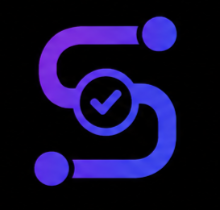

**Eslogan** 

El eslogan principal de Service Compliance es *Evidencia, trazabilidad y verificabilidad*. Este eslogan sintetiza el propósito de **Service Compliance**: vincular las obligaciones con su ejecución, conservar la evidencia asociada y mantener información que permita revisar los resultados de cumplimiento.

**Valores de la marca**

Service Compliance se basa en valores que guían la manera en que la aplicación organiza y presenta la información del servicio:

- **Evidencia:** Cada registro se vincula con la obligación y el criterio correspondiente. Esto permite revisar el resultado con información contextualizada.
  
- **Trazabilidad:** El historial conserva la secuencia de ejecución, evaluación y acciones posteriores. Así puede consultarse la evolución de cada caso.
  
- **Verificabilidad:** Los resultados se revisan con base en criterios y evidencias registradas. Cada evaluación queda asociada con su responsable y fecha.

- **Integridad:** Las decisiones anteriores permanecen en el historial del caso. Las acciones posteriores no reemplazan ni ocultan el resultado original.

- **Transparencia:** Los estados, responsables y eventos se presentan con claridad. Esto facilita comprender qué ocurrió durante cada etapa.

### Tipografía

Para las interfaces de Service Compliance se utiliza IBM Plex Sans como familia tipográfica principal. Su aplicación consistente en títulos, textos, etiquetas, botones y datos ayuda a mantener una identidad visual uniforme en las pantallas móviles.

La jerarquía se establece mediante el tamaño y el peso de la fuente: los títulos de pantalla y sección destacan sobre el texto descriptivo; los botones y estados usan pesos bold o semibold para facilitar su identificación; y los datos secundarios conservan un peso regular. Se evita combinar familias tipográficas distintas y se priorizan tamaños legibles en pantallas pequeñas.

  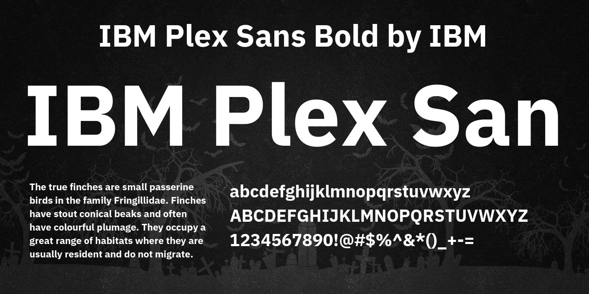

**Jerarquía Tipográfica**

La jerarquía tipográfica de Service Compliance se organiza en varios niveles, cada uno con tamaños y pesos específicos:

- **Título de pantalla:** IBM Plex Sans Bold, 22–24 sp. Se utiliza para el nombre principal de cada pantalla y permite identificar rápidamente dónde se encuentra el usuario.

- **Título de sección:** IBM Plex Sans Bold, 18–20 sp. Organiza el contenido de una pantalla y ayuda a distinguir sus apartados.

- **Texto principal:** IBM Plex Sans Regular, 14–16 sp. Se aplica a descripciones, instrucciones y datos centrales de obligaciones, ejecuciones y acciones correctivas.

- **Botones:** IBM Plex Sans Semibold, 14–16 sp. Destaca acciones disponibles, como “Ver detalle” o “Registrar atención”.

### Voz y tono

La voz de Service Compliance es profesional, clara, respetuosa y objetiva. La comunicación utiliza palabras directas y consistentes para que supervisores y operarios comprendan las obligaciones, los estados de cada caso y las acciones disponibles. Las instrucciones priorizan verbos concretos y evitan tecnicismos innecesarios. En sus dimensiones, mantiene un registro serio y profesional, formal pero cercano, respetuoso y sereno.

El tono se adapta a cada situación sin perder esa identidad. En las instrucciones cotidianas es directo y tranquilo; en las confirmaciones informa qué ocurrió y cuál es el siguiente paso. Ante una alerta, un error o una corrección devuelta, mantiene un tono neutral y orientado a la acción, sin culpabilizar al usuario ni exagerar la gravedad.

### 3.1.2. Information Architecture

#### 3.1.2.1. Organization Systems

#### 3.1.2.2. Labelling Systems

#### 3.1.2.3. SEO Tags and Meta Tags

####3.1.2.4. Searching Systems

3.1.2.5. Navigation Systems

3.1.3. Landing Page UI Design

3.1.3.1. Landing Page Wireframe

3.1.3.2. Landing Page Mock-up

3.1.4. Mobile Applications UX/UI Design

#### 3.1.4.1. Mobile Applications Wireframes

A continuación se detalla la especificación completa de esquemas de baja fidelidad (wireframes / low-fidelity skeletons) diseñados en Figma para la plataforma Opervia, cubriendo los flujos del Operario de Campo, Supervisor en Terreno y el Panel Web de Dispatch.

---

##### Módulo 1: Autenticación y Registro de Usuarios

* **Wireframe 01: Inicio de Sesión (`Opervia Skeleton - Login`)**

  
  
  * **Propósito:** Autenticación segura del personal operativo y supervisores mediante credenciales corporativas.
  * **Componentes:** Formulario de ingreso (usuario/correo, contraseña), botón "Iniciar Sesión" y recuperación de contraseña.

* **Wireframe 02: Verificación OTP / 2FA (`Opervia Skeleton - OTP Verification`)**
  
    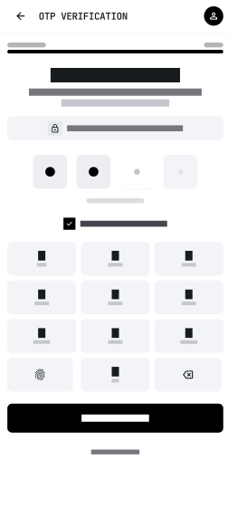
    
  * **Propósito:** Doble factor de autenticación para garantizar la seguridad en dispositivos de campo.
  * **Componentes:** Input numérico de 6 dígitos, temporizador de reenvío de código y botón de confirmación.

* **Wireframe 03: Registro de Cuenta / Perfil (`Opervia Skeleton - Account Registration`)**
 
   
   
  * **Propósito:** Configuración inicial del perfil de usuario, rol asignado y área/cuadrilla operativa.

---

##### Módulo 2: Ejecución de Trabajos, Evidencias y Sincronización (Operario)

* **Wireframe 04: Panel Diario / Dispatch Móvil (`Opervia Skeleton - Field Dispatch`)**

  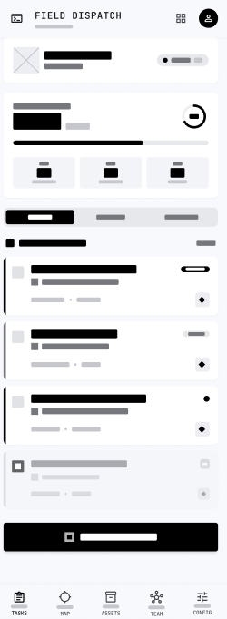

  * **Propósito:** Vista principal del operario con el listado de obligaciones y órdenes de trabajo asignadas para el día.
  * **Componentes:** Barra de búsqueda, filtro por estado (Pendiente, En Curso, Completado), tarjetas de órdenes con horarios/prioridad y barra de navegación inferior.

* **Wireframe 05: Detalle de Orden de Trabajo (`Opervia Skeleton - Work Order Detail - Overview`)**

  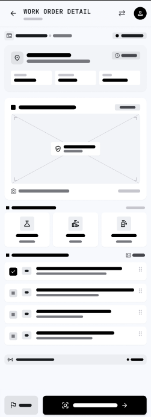
  
  * **Propósito:** Visualización de especificaciones técnicas, ubicación y requerimientos antes de iniciar la tarea.
  * **Componentes:** Datos del sitio/cliente, temporizador de actividad, lista de chequeo (checklist) interactivas y botón principal "Iniciar Actividad".

* **Wireframe 06: Ejecución y Checklist (`Opervia Skeleton - Work Order Detail - Execution`)**

    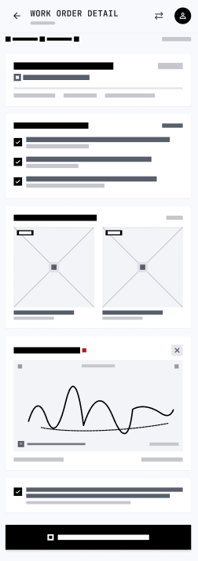
 
  * **Propósito:** Seguimiento en tiempo real del progreso del mantenimiento u obligación legal.
  * **Componentes:** Checkbox de tareas completadas, campo de observaciones rápidas y botón para adjuntar evidencias.

* **Wireframe 07: Captura de Evidencia - Cámara Overlay (`Opervia Skeleton - Camera Overlay`)**

    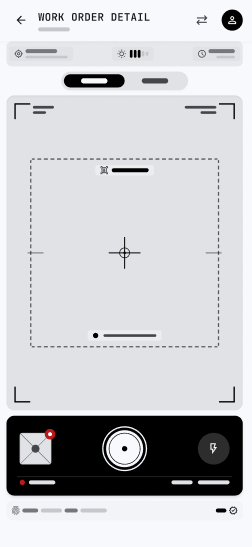

  * **Propósito:** Captura de fotografías con estampación en tiempo real de metadatos de validación (US-06).
  * **Componentes:** Retícula de encuadre, overlay visual con coordenadas GPS (Lat/Long), nivel de precisión en metros y timestamp UTC.

* **Wireframe 08: Galería de Evidencias y Firma Digital (`Opervia Skeleton - Evidence Preview & Sign`)**

     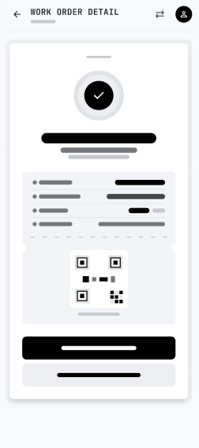
  

  * **Propósito:** Revisión de fotografías adjuntas y captura de firma manuscrita de conformidad del cliente/supervisor.
  * **Componentes:** Carrusel de fotos capturadas, selector de categoría (Antes/Después/Documento), lienzo de firma manuscrita y botón "Finalizar Tarea".

* **Wireframe 09: Confirmación de Envío / Éxito (`Opervia Skeleton - Task Completion Success`)**

    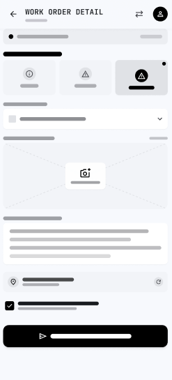

  * **Propósito:** Confirmar al operario que la tarea se registró correctamente en la plataforma.
  * **Componentes:** Modal de éxito con Checkmark, resumen del tiempo invertido y botón de retorno al dispatch.

* **Wireframe 10: Resumen de Historial Diario (`Opervia Skeleton - Daily Summary Log`)**

    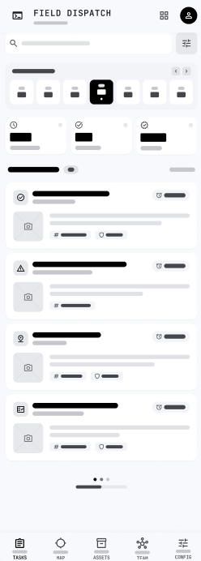

  * **Propósito:** Consulta de actividades completadas e historial de intervenciones durante la jornada.

---

##### Módulo 3: Supervisión, Control en Sitio y Auditoría (Supervisor)

* **Wireframe 11: Dashboard de Supervisión (`Opervia Skeleton - Supervision & Field Control`)**
  
    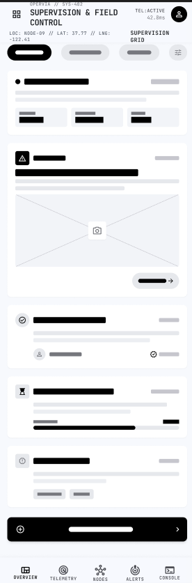
    

  * **Propósito:** Monitoreo del estado general de las cuadrillas y cumplimiento de obligaciones en mapa/lista.
  * **Componentes:** Métricas KPI rápidas (Avance %, Tareas Retrasadas, Alertas), mapa con pines de ubicación y selector de fecha.

* **Wireframe 12: Mapa de Control de Nodos (`Opervia Skeleton - Node Control Map`)**

  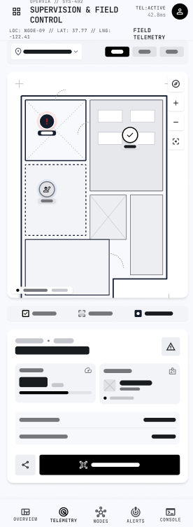
    
  * **Propósito:** Geolocalización en tiempo real de los técnicos y sitios de trabajo.
  * **Componentes:** Visor interactivo de mapa, filtros por zona geográfica y lista lateral de operarios activos.

* **Wireframe 13: Detalle de Control de Nodo (`Opervia Skeleton - Node Control Detail`)**

    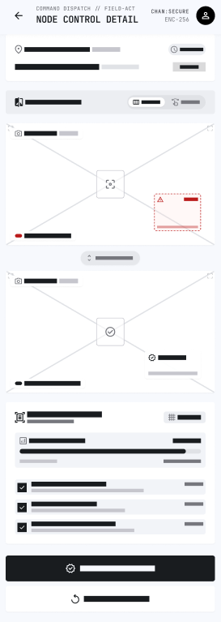
    
  * **Propósito:** Inspección técnica profunda del estado de cumplimiento de una estación o sede específica.
  * **Componentes:** Historial de mantenimiento del sitio, responsable asignado y estado de alertas críticas.

* **Wireframe 14: Gestión de Incidentes (`Opervia Skeleton - Incident Resolution`)**

    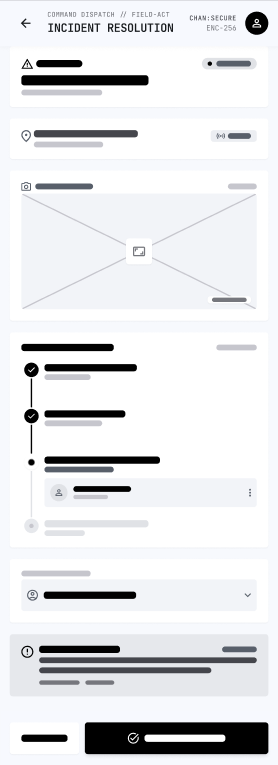
    
  * **Propósito:** Registro y atención inmediata de bloqueos o fallas imprevistas informadas desde el campo.
  * **Componentes:** Nivel de severidad (Alta/Media/Baja), fotos del problema, asignación de responsable y botón "Resolver Incidente".

* **Wireframe 15: Métricas de Rendimiento (`Opervia Skeleton - Performance Metrics`)**

    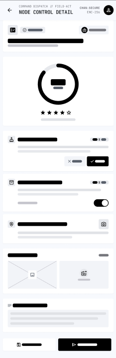
    
  * **Propósito:** Evaluación del desempeño técnico por operario o cuadrilla.
  * **Componentes:** Gráficos de barras/dona con porcentaje de cumplimiento, tiempos promedio de atención y calificación de calidad.

* **Wireframe 16: Control de Asistencia y Bitácora (`Opervia Skeleton - Attendance & Shift Log`)**

    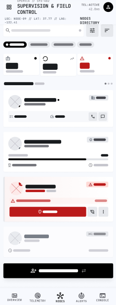
    
  * **Propósito:** Control del marcaje de entrada/salida y cumplimiento de turnos del equipo de trabajo.

* **Wireframe 17: Reasignación Manual (`Opervia Skeleton - Manual Dispatch Override`)**

    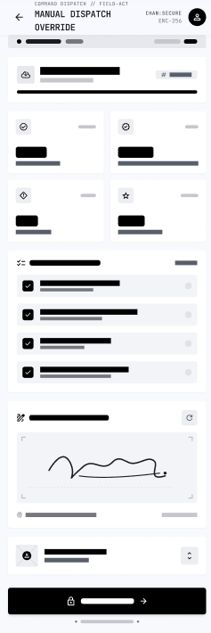

  * **Propósito:** Permitir al supervisor reasignar órdenes de trabajo en caso de imprevistos o ausencias.

---

##### Módulo 4: Análisis, Reportes y Sincronización Offline

* **Wireframe 18: Centro de Analítica Móvil (`Opervia Skeleton - Analytics Center`)**
  
  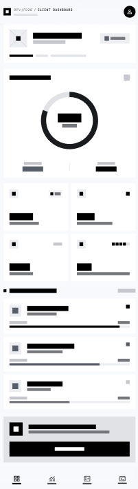

  * **Propósito:** Visualización ejecutiva de indicadores clave de cumplimiento normativo y SLA.

* **Wireframe 19: Gráficos de Tendencia (`Opervia Skeleton - Trend Analysis Chart`)**

  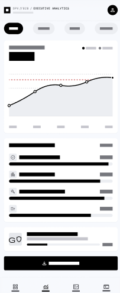
  
  * **Propósito:** Evaluación del histórico de fallas y cumplimiento a lo largo del tiempo.

* **Wireframe 20: Detalle de Alertas Críticas (`Opervia Skeleton - Alert Center`)**

    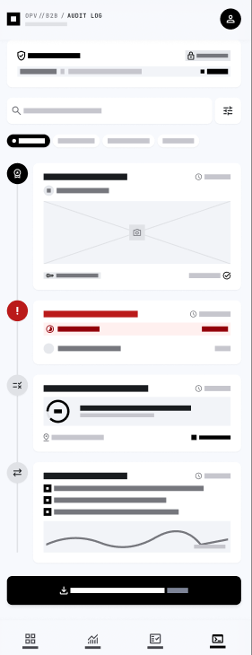

  * **Propósito:** Centro de notificaciones para eventos que requieren atención inmediata o riesgo de sanción.

* **Wireframe 21: Ajustes y Configuración (`Opervia Skeleton - App Settings`)**

    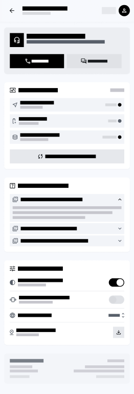

  * **Propósito:** Gestión de parámetros de la aplicación, almacenamiento local y descargas de mapas.

* **Wireframe 22: Perfil de Usuario (`Opervia Skeleton - User Profile`)**

    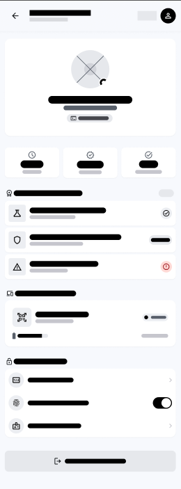

  * **Propósito:** Información del técnico, credenciales activas y certificado digital de operario.

* **Wireframe 23: Centro de Sincronización Offline (`Opervia Skeleton - Offline Sync Center`) [US-08]**

    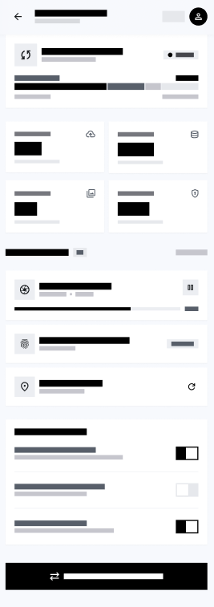

  * **Propósito:** Panel de control para la gestión de cola de datos locales cuando no hay cobertura de red.
  * **Componentes:**
    * Indicador de estado de conexión ("Modo Offline Activo").
    * Lista de registros pendientes (`PENDING_SYNC`) con distintivos de estado (`Pendiente`, `Sincronizado`, `Error`).
    * Botón de acción manual "Sincronizar Ahora" con política de reintentos e idempotencia (`X-Idempotency-Key`).

3.1.4.2. Mobile Applications Wireflow Diagrams

3.1.4.3. Mobile Applications Mock-ups

3.1.4.4. Mobile Applications User Flow Diagrams

3.1.4.5. Mobile Applications Prototyping

