# Capítulo IV: Product Implementation & Validation

Este capítulo documenta el TB1 – Stage Review y el Sprint 1 de Service Compliance. El incremento comprende autenticación por roles, PostgreSQL, obligaciones, ejecuciones, evidencias, API REST, Swagger, pruebas y despliegue del backend. Incident & Corrective Action y Compliance Reporting permanecen como alcance posterior.

## 4.1. Software Configuration Management

### 4.1.1. Software Development Environment Configuration

| Producto | Tecnología | Uso |
|---|---|---|
| Backend | Spring Boot 4.1.1, Java 17 | API REST |
| Build | Gradle Wrapper | Compilación y JAR |
| Persistencia | JPA/Hibernate, Flyway | PostgreSQL y migraciones |
| Seguridad | Spring Security, JWT, BCrypt | Autenticación/autorización |
| Documentación | OpenAPI, Swagger UI | Contrato y pruebas |
| Despliegue | Docker, Render | Servicio público |
| Control | GitHub, Conventional Commits | Colaboración |
| Gestión | Trello | Backlog y Sprint 1 |

Repositorio backend: https://github.com/OperviaStartup/serviceComplianceAPI

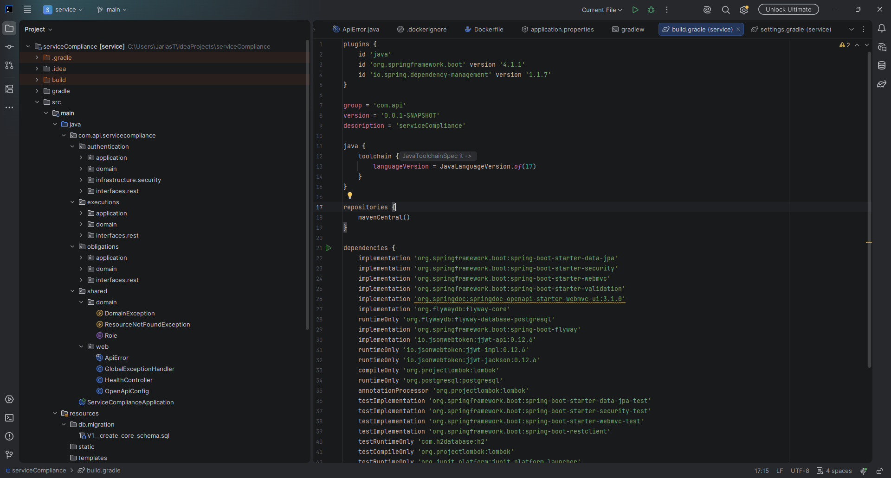

*Figura 4.1. Entorno de desarrollo.*

### 4.1.2. Source Code Management

El informe se mantiene en https://github.com/OperviaStartup/service-compliance-project-report y el backend en https://github.com/OperviaStartup/serviceComplianceAPI. El backend trabaja sobre main, según el acuerdo del equipo, y utiliza Conventional Commits.

| Prefijo | Uso | Ejemplo |
|---|---|---|
| feat: | Nueva funcionalidad | feat: add execution evidence flow |
| fix: | Corrección | fix: build application in Render Docker image |
| test: | Pruebas | test: verify real PostgreSQL user workflow |
| docs: | Documentación | docs: document REST API with OpenAPI |
| chore: | Configuración | chore: configure project tooling |

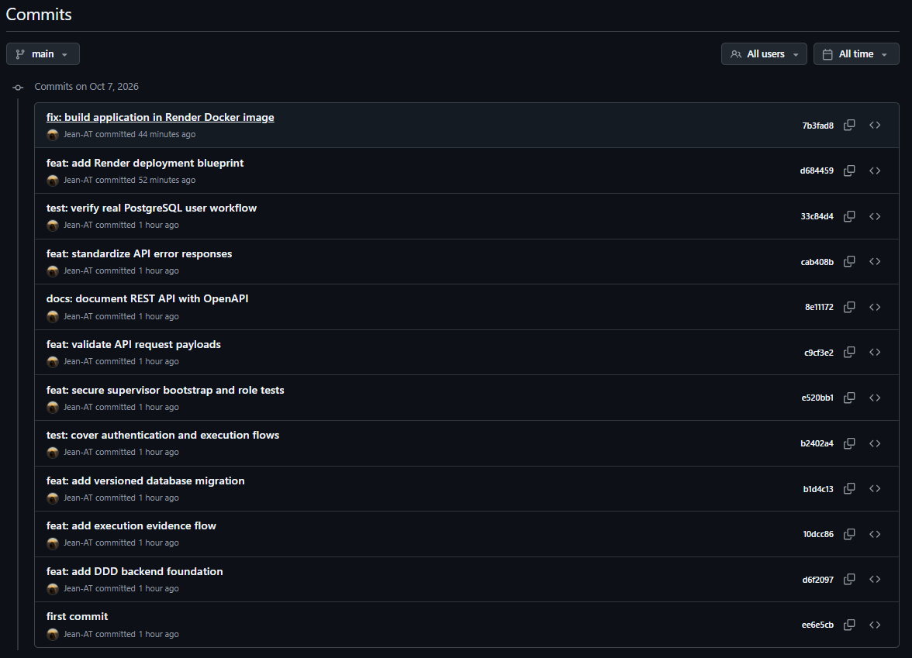

*Figura 4.2. Historial del backend.*

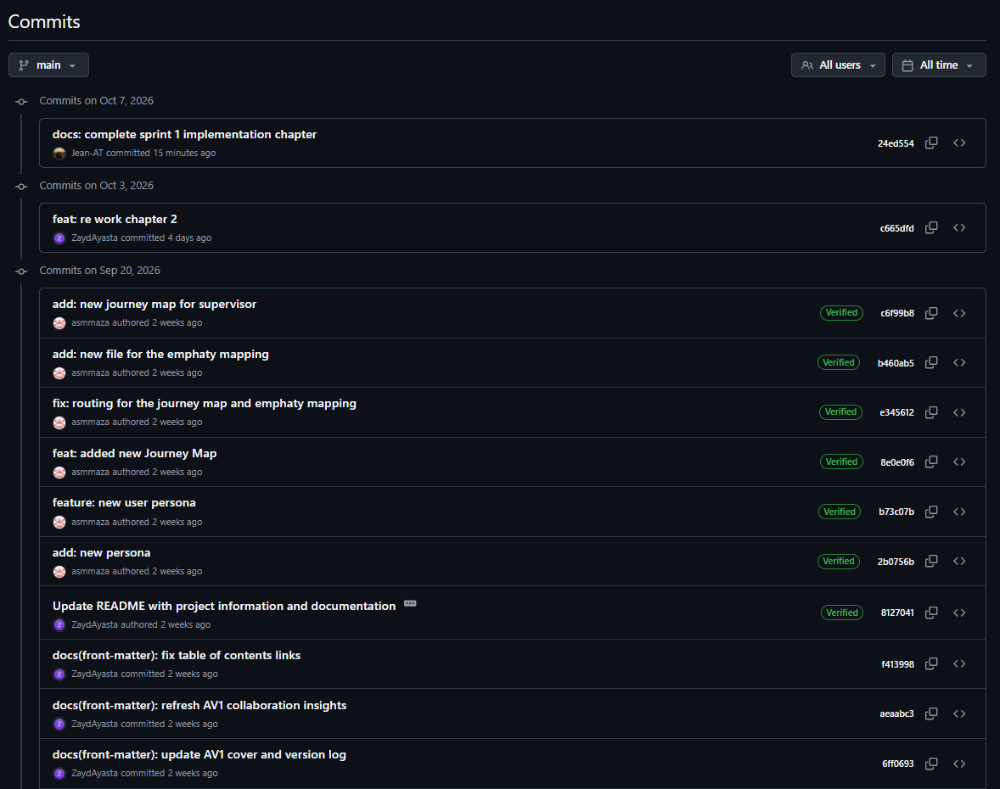

*Figura 4.3. Colaboración del informe.*

### 4.1.3. Source Code Style Guide & Conventions

El backend aplica DDD y SOLID. El dominio contiene reglas y agregados; Application coordina casos de uso; Interface expone REST; Infrastructure implementa persistencia y servicios técnicos; Shared contiene contratos comunes. Los controladores delegan, las dependencias se inyectan, cada clase mantiene una responsabilidad principal, los DTOs aplican Jakarta Validation y las contraseñas se protegen con BCrypt. Las respuestas de error utilizan ApiError.

    com.api.servicecompliance/
    ├── authentication/
    ├── obligations/
    ├── executions/
    └── shared/

*Figura 4.4. Estructura DDD del backend.*

### 4.1.4. Software Deployment Configuration

Render ejecuta un Web Service Docker conectado a PostgreSQL. El Dockerfile compila con JDK 17 y ejecuta el JAR con JRE 17. La aplicación escucha PORT y expone GET /health. Flyway ejecuta V1__create_core_schema.sql y Hibernate usa ddl-auto=validate.

| Variable | Propósito |
|---|---|
| DB_HOST, DB_PORT, DB_NAME | Conexión PostgreSQL |
| DB_USERNAME, DB_PASSWORD | Credenciales PostgreSQL |
| JWT_SECRET, JWT_EXPIRATION_MS | Tokens JWT |
| BOOTSTRAP_SUPERVISOR_EMAIL | Supervisor inicial |
| BOOTSTRAP_SUPERVISOR_PASSWORD | Mínimo 12 caracteres |

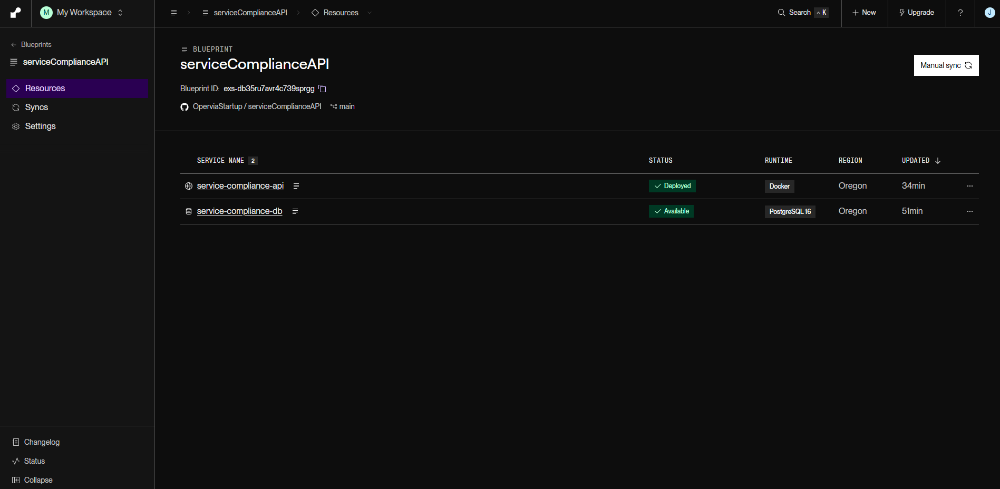

*Figura 4.5. Blueprint de Render.*

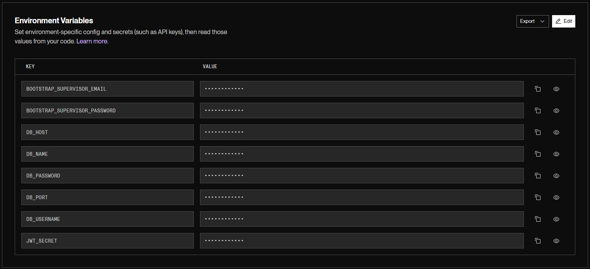

*Figura 4.6. Variables de entorno sin exponer secretos.*

## 4.2. Landing Page & Mobile Application Implementation

### 4.2.1. Landing Page Implementation

La Landing Page de Opervia / Service Compliance se implementó como un sitio estático autocontenido en un único archivo HTML. Su objetivo es comunicar la propuesta de valor, explicar el flujo de cumplimiento y orientar al visitante hacia la solicitud de una demostración. La implementación conserva el lenguaje visual definido por el equipo y adapta la experiencia para escritorio y móvil.

Repositorio local: `C:\Users\JariasT\IdeaProjects\service-compliance-landing`.

#### 4.2.1.1. Estructura y organización

El archivo `index.html` está organizado mediante comentarios de sección, encabezado principal, navegación, contenido principal y pie de página. El contenido principal se divide en nueve secciones funcionales:

| Sección | Propósito | Backlog |
|---|---|---|
| Hero | Presentar Opervia, Service Compliance y el CTA principal | US-18 |
| Problem | Explicar la operación fragmentada y sus riesgos | US-18 |
| Value Proposition | Mostrar el flujo de planificación a cumplimiento | US-18 |
| How It Works | Explicar las fases del proceso operativo | US-18 |
| Dual Experience | Diferenciar operario y supervisor | US-18 |
| Traceability Case | Mostrar trazabilidad y desviaciones | US-18 |
| Benefits | Resumir beneficios operativos y de auditoría | US-18 |
| Pricing | Presentar planes de servicio | US-18 |
| Final CTA | Orientar a solicitud de demo o contacto | US-19 |

La comprobación estructural confirmó nueve secciones abiertas y nueve cerradas. El pie de página utiliza el ancla `nosotros`, referenciada por la navegación.

*Figura 4.17. Organización estructural de la Landing Page.*

#### 4.2.1.2. Responsive Web Design

La Landing Page utiliza clases responsive para adaptar grillas, espaciado, tipografía, navegación, cards, CTAs y mockups. Las vistas de referencia para TB1 son desktop de 1440 px y mobile de 390 px.

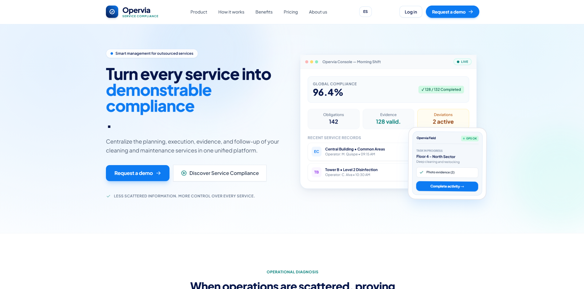

*Figura 4.18. Landing Page en vista desktop.*

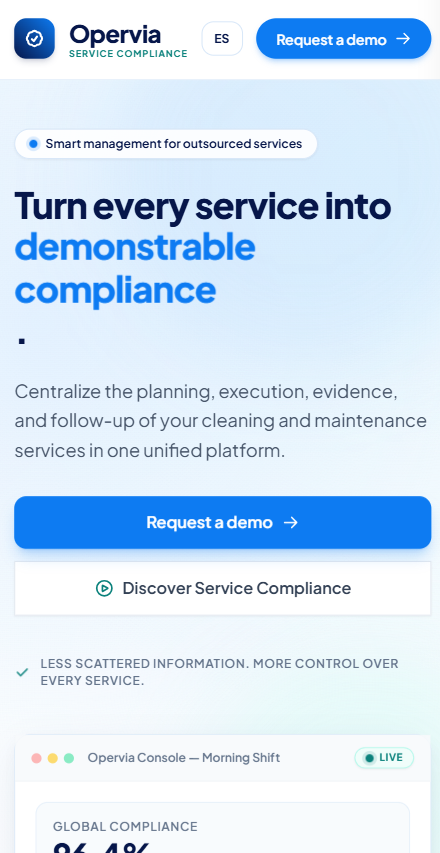

*Figura 4.19. Landing Page en vista mobile.*

#### 4.2.1.3. Internationalization and Accessibility

La interfaz inicia en español mediante `lang="es"` y cuenta con el selector `languageToggle` para cambiar entre español e inglés. El script traduce los nodos de texto visibles mediante un diccionario que cubre navegación, mockups, diagnóstico, workflow, beneficios, precios, CTA y pie de página. El idioma seleccionado se conserva en `localStorage` con la clave `opervia-language`.

La accesibilidad estructural implementada incluye `aria-label` en header, navegación, footer y selector de idioma; botón de idioma con `type="button"`; estructura semántica con `header`, `nav`, `main`, `section` y `footer`; y soporte para `prefers-reduced-motion`.

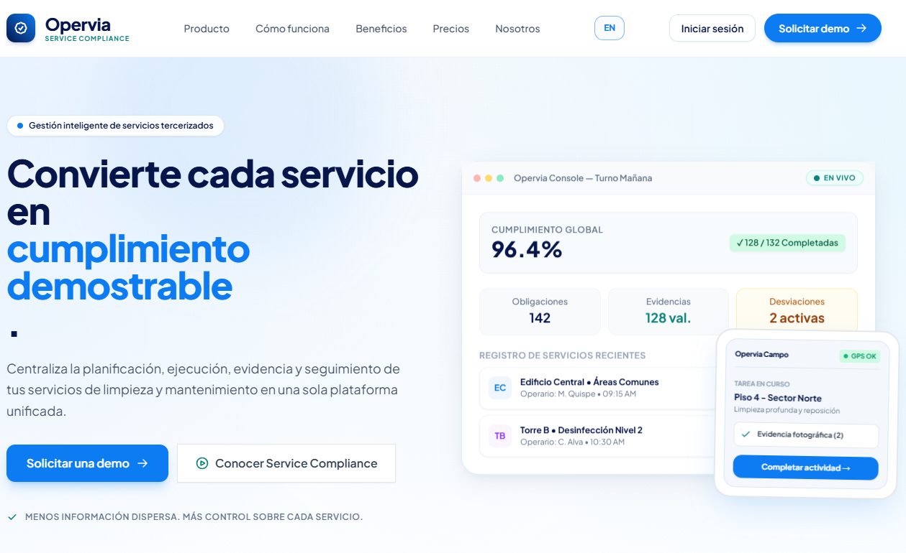

*Figura 4.20. Internacionalización español/inglés.*

*Figura 4.21. Estructura semántica y atributos accesibles.*

#### 4.2.1.4. SEO, navegación y despliegue

La página incluye título descriptivo, meta description, navegación por anclas internas y enlaces hacia Producto, Cómo funciona, Beneficios, Precios, Nosotros y Demo. No se detectaron referencias relativas a assets locales; la página es autocontenida y utiliza dependencias externas declaradas.

El archivo `.github/workflows/pages.yml` automatiza el despliegue a GitHub Pages en cada push a `main` y permite ejecución manual mediante `workflow_dispatch`. El workflow configura Pages, empaqueta la raíz y publica el artefacto estático.

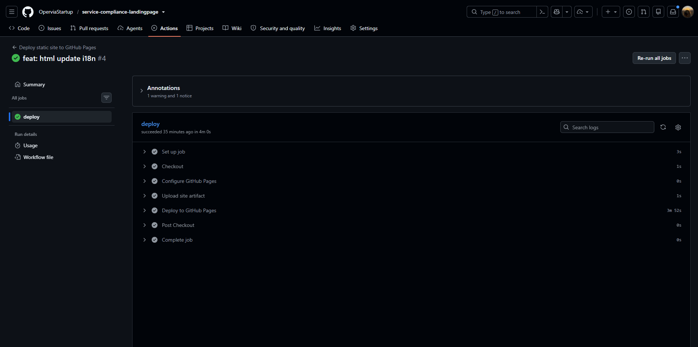

*Figura 4.22. Workflow de despliegue de la Landing Page.*

<!-- Reemplazar con la URL pública real después de verificar GitHub Pages. -->
**URL pública:** `<completar URL de GitHub Pages>`

*Figura 4.23. Landing Page publicada en GitHub Pages.*

#### 4.2.1.5. Términos y condiciones

<!-- RESPONSABLE DEL LANDING PAGE: completar con la ubicación real de Términos del Servicio, Política de Privacidad y evidencia de sus enlaces en el footer. La rúbrica exige estos documentos en Landing Page y aplicación móvil durante el registro. -->

### 4.2.2. Sprint 1 — Backend foundation and core operational flow

**Sprint Goal:** entregar una API REST segura y persistente para demostrar el flujo supervisor-operario.

**Duración:** completar fechas reales del Sprint 1.
**Criterio TB1:** backend desplegado aproximadamente al 70%, Swagger operativo, PostgreSQL conectado y pantallas core disponibles.

#### 4.2.2.1. Sprint Planning 1

US-17 se adelantó desde Sprint 2 por ser una capacidad habilitadora de seguridad.

| Tipo | Story | Alcance | Puntos |
|---|---|---|---:|
| Habilitadora | US-17 | Autenticarse y acceder según rol | 5 |
| Producto | US-02 | Definir obligación | 5 |
| Producto | US-04 | Consultar obligaciones asignadas | 3 |
| Producto | US-05 | Registrar ejecución | 5 |
| Producto | US-06 | Adjuntar evidencia | 3 |
| Técnica | TS-01 | API REST documentada | 5 |
| Investigación | SP-01 | Aprendizaje autónomo | 5 |
| **Total** |  |  | **26** |

US-18 y US-19 quedan a cargo del responsable del Landing Page.

#### 4.2.2.2. Aspect Leaders and Collaborators

| Integrante | Líder de aspecto | Responsabilidad Sprint 1 |
|---|---|---|
| Arias Tasayco, Jean Pool Alexander | Backend e integración | Auth, PostgreSQL, Flyway, API, Docker, Render y E2E |
| Ayasta Martel, Zayd Jaffar | Backlog y trazabilidad | Historias, criterios, Sprint Backlog y rúbrica |
| Blancas Chávez, Carlos Franco | DDD y arquitectura | Contextos, capas, diagramas y revisión diseño-código |
| Flores Eusebio, Angel Thyago | Validación de negocio | Escenarios supervisor-operador y aceptación |
| Montes Maza, Augusto Sebastian | UX móvil | Pantallas core y flujo móvil |
| Sánchez Espinoza, Mathias Enrique | Usuarios e investigación | Validación con usuarios y entrevistas |

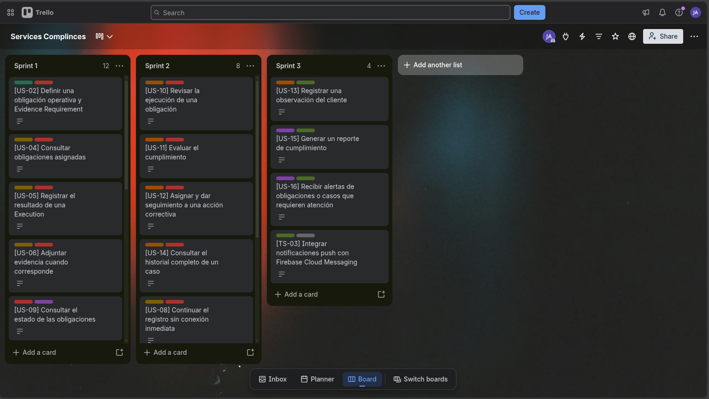

*Figura 4.7. Distribución de responsabilidades.*

#### 4.2.2.3. Sprint Backlog 1

| ID | Tarea | Responsable | Colaboradores | Estado |
|---|---|---|---|---|
| S1-T01 | Spring Boot, Java 17, Gradle y DDD | Jean | Carlos | Completado |
| S1-T02 | Registro, login y JWT | Jean | Carlos, Zayd | Completado |
| S1-T03 | Roles SUPERVISOR/OPERATOR | Jean | Carlos, Angel | Completado |
| S1-T04 | PostgreSQL y Flyway V1 | Jean | Carlos | Completado |
| S1-T05 | Crear/consultar obligaciones | Jean | Zayd, Angel | Completado |
| S1-T06 | Registrar ejecuciones | Jean | Angel, Augusto | Completado |
| S1-T07 | Registrar/consultar evidencias | Jean | Augusto, Mathias | Completado |
| S1-T08 | Validaciones y ApiError | Jean | Carlos, Zayd | Completado |
| S1-T09 | Swagger/OpenAPI | Jean | Zayd | Completado |
| S1-T10 | Unit, integration y E2E | Jean | Angel, Mathias | Completado |
| S1-T11 | Pantallas core móviles | Augusto | Mathias, Jean | Completar evidencia |
| S1-T12 | PoC de aprendizaje autónomo | Carlos | Jean, Augusto | Completar evidencia |
| S1-T13 | Landing Page | Responsable del Landing Page | Equipo de diseño | Implementado; completar evidencias y URL |

#### 4.2.2.4. Development Evidence for Sprint Review

| Evidencia | Contenido |
|---|---|
| E1 | Paquetes DDD |
| E2 | Autenticación |
| E3 | Roles |
| E4 | Obligación |
| E5 | Ejecución/evidencia |
| E6 | Flyway/PostgreSQL |
| E7 | Docker/Render |

E1 : Paquetes DDD

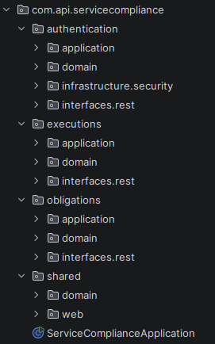

E2 : Autenticación

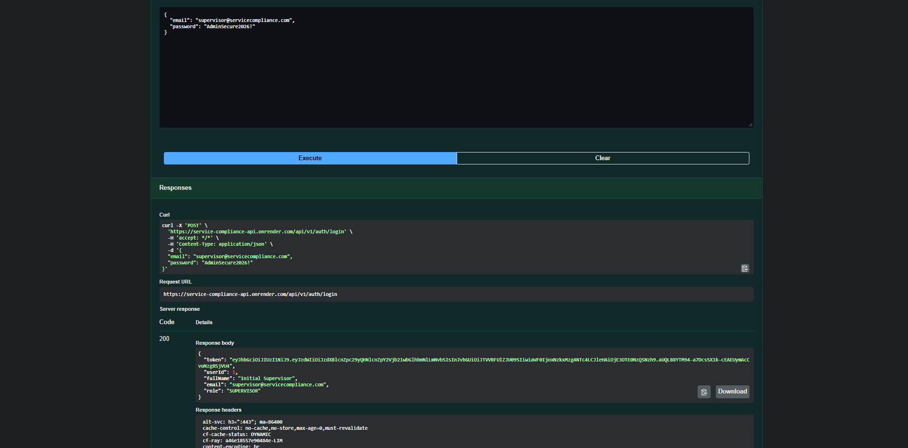

E3 : Roles

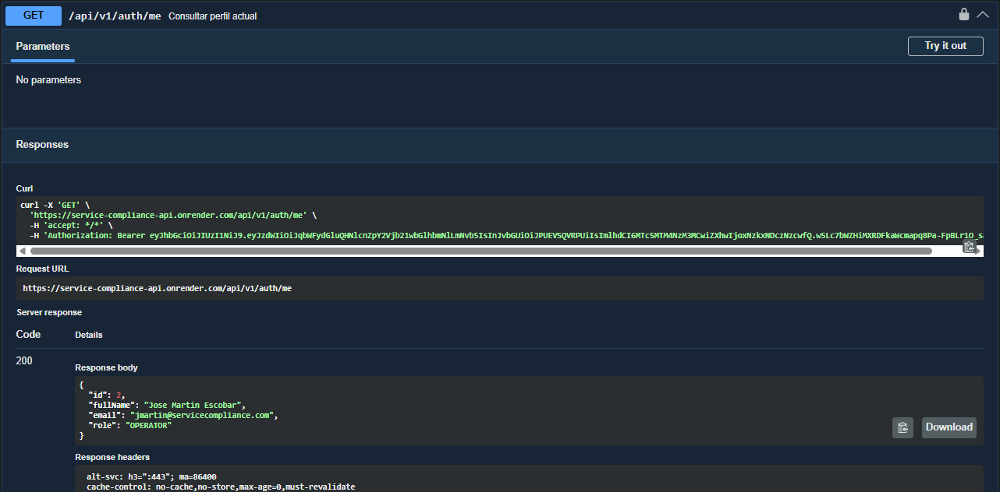

E4 : Obligación

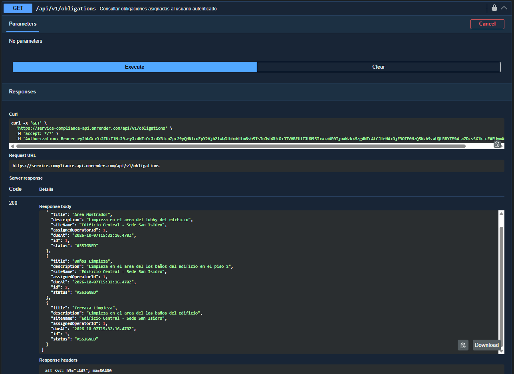

E5 : Ejecución/evidencia

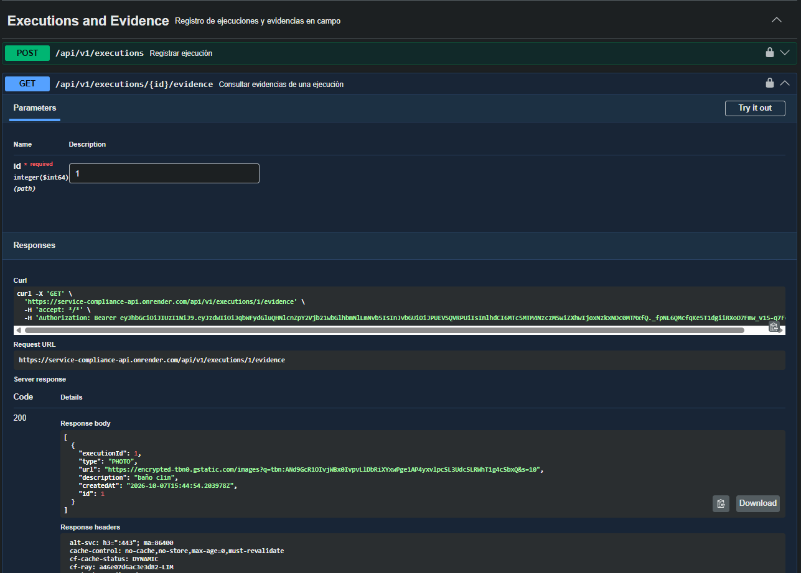

E6 : Flyway/PostgreSQL

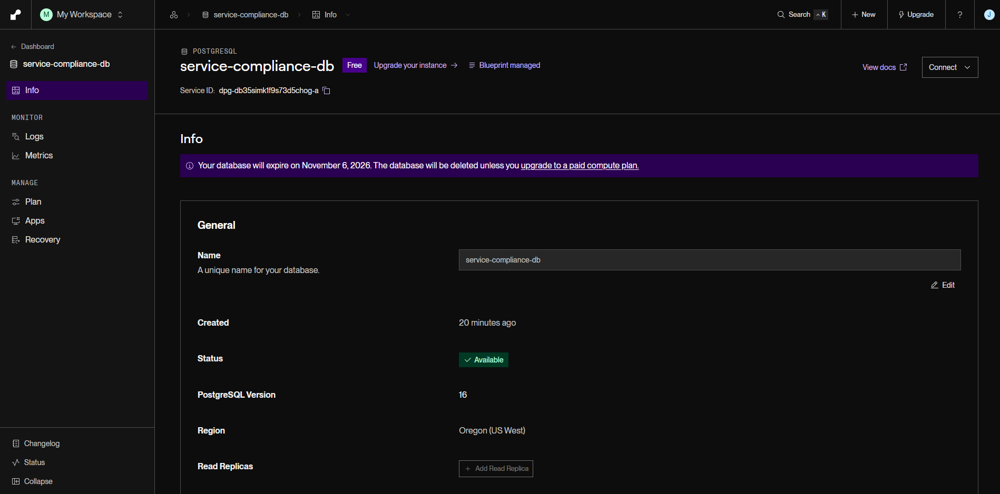

E7 : Docker/Render

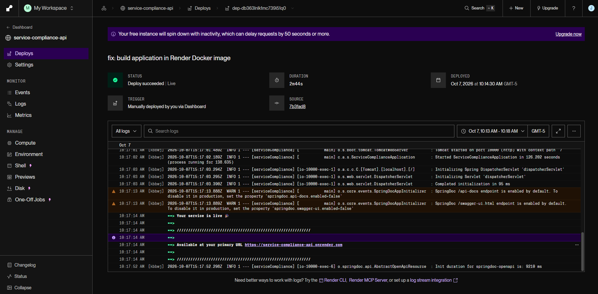

#### 4.2.2.5. Testing Suite Evidence for Sprint Review

| Prueba | Resultado esperado |
|---|---|---|
| Registro de operador | 201 Created |
| Login operador/supervisor | 200 OK y JWT |
| Crear obligación como supervisor | 201 Created |
| Crear obligación como operador | 403 Forbidden |
| Consultar obligaciones | 200 OK |
| Crear ejecución | 201 Created |
| Registrar evidencia | 201 Created |
| Request inválido | 400 con errores |
| Token ausente/inválido | 401 Unauthorized |

#### 4.2.2.6. Execution Evidence for Sprint Review

Flujo validado: el supervisor inicia sesión y crea una obligación; el operador inicia sesión, consulta sus obligaciones, registra una ejecución y adjunta evidencia; el sistema rechaza operaciones exclusivas del supervisor cuando las solicita el operador.

| Verificación E2E contra PostgreSQL | Resultado |
|---|---|
| Registro y login | 201 / 200 |
| Obligación creada | ID generado |
| Obligaciones asignadas | 1 |
| Ejecución registrada | ID generado |
| Evidencia registrada | ID generado |
| Operador crea obligación | 403 Forbidden |

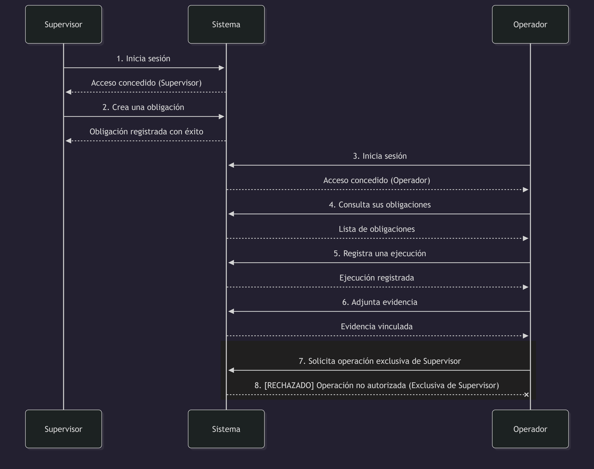

*Figura 4.9. Flujo E2E del Sprint 1.*

#### 4.2.2.7. Services Documentation Evidence for Sprint Review

| Método | Endpoint | Rol |
|---|---|---|
| POST | /api/v1/auth/register | Público |
| POST | /api/v1/auth/login | Público |
| GET | /api/v1/auth/me | Autenticado |
| POST | /api/v1/obligations | Supervisor |
| GET | /api/v1/obligations | Autenticado |
| POST | /api/v1/executions | Operador |
| GET | /api/v1/executions/{id} | Autenticado |
| POST | /api/v1/executions/{id}/evidence | Operador |
| GET | /api/v1/executions/{id}/evidence | Autenticado |
| GET | /health | Público |

Swagger: /swagger-ui.html. OpenAPI: /api-docs.

| Error | Código | Respuesta |
|---|---:|---|
| Validación/JSON inválido | 400 | ApiError |
| No autenticado | 401 | ApiError |
| Rol insuficiente | 403 | ApiError |
| Recurso inexistente | 404 | ApiError |
| Error inesperado | 500 | ApiError sin datos sensibles |

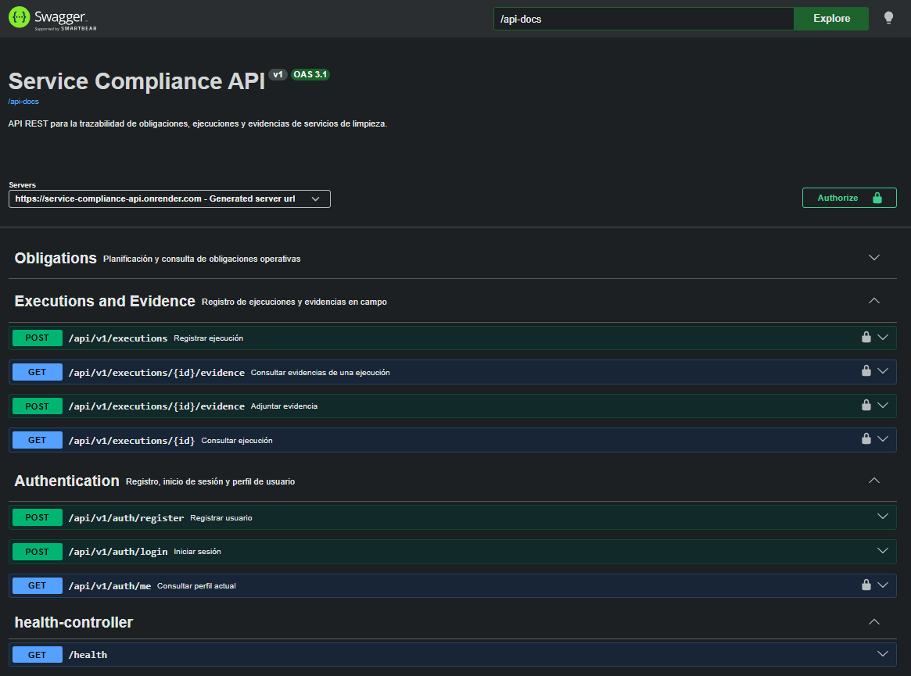

*Figura 4.10. Swagger con Bearer JWT.*

#### 4.2.2.8. Software Deployment Evidence for Sprint Review

| Verificación | URL esperada |
|---|---|
| Health check | https://service-compliance-api.onrender.com/health |
| Swagger | https://service-compliance-api.onrender.com/swagger-ui.html |
| OpenAPI | https://service-compliance-api.onrender.com/api-docs |

*Figura 4.12. Backend desplegado.*

*Figura 4.13. Health check y Swagger públicos.*

#### 4.2.2.9. Team Collaboration Insights during Sprint

| Integrante | Evidencia de colaboración |
|---|---|
| Arias Tasayco | Commits backend, E2E, Docker/Render |
| Ayasta Martel | Sprint Backlog y trazabilidad |
| Blancas Chávez | Arquitectura DDD y diagramas |
| Flores Eusebio | Validación de negocio |
| Montes Maza | Pantallas core y usabilidad |
| Sánchez Espinoza | Entrevistas y validación |

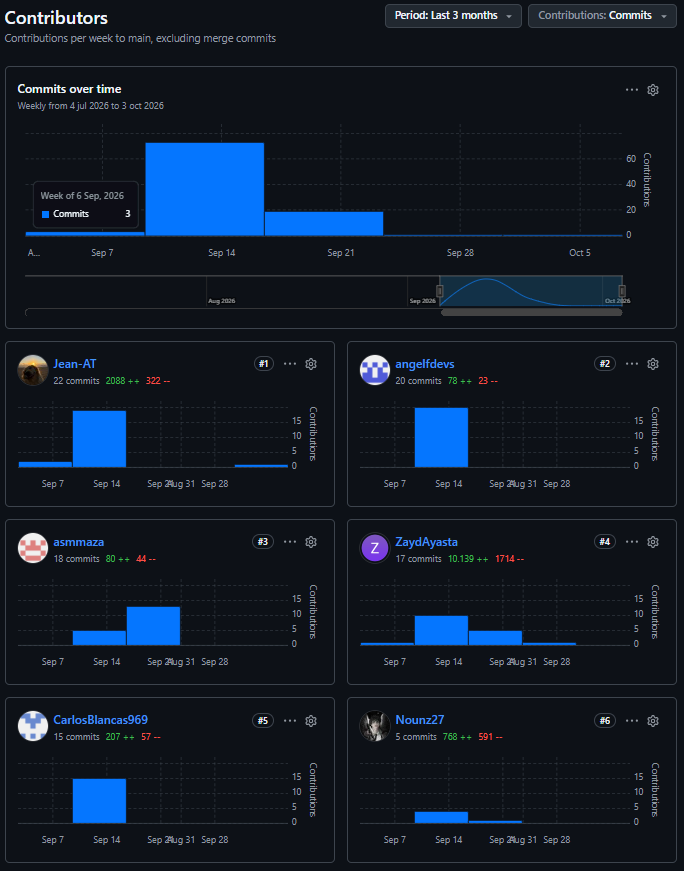

*Figura 4.14. Colaboración del equipo.*

### 4.3.3. Evaluaciones según heurísticas

| Heurística | Criterio | Resultado | Acción |
|---|---|---|---|
| Visibilidad del estado | Se reconoce login y registro exitoso | Completar | Completar |
| Mundo real | Usa obligación, ejecución y evidencia | Completar | Completar |
| Control | Puede volver sin perder datos confirmados | Completar | Completar |
| Consistencia | Estados y mensajes son uniformes | Completar | Completar |
| Prevención | Valida campos antes de enviar | Completar | Completar |
| Recuperación | Mensajes indican cómo corregir | Completar | Completar |
| Documentación | Swagger explica endpoints y errores | Completar | Completar |

## Cierre del Sprint 1

Sprint 1 entrega autenticación, autorización, PostgreSQL, migraciones, obligaciones, ejecuciones, evidencias, pruebas, OpenAPI, Render y una Landing Page estática desplegable. La sincronización offline, evaluación de cumplimiento, incidentes, acciones correctivas, reportes, notificaciones y almacenamiento multimedia quedan para siguientes sprints. Para cerrar la evidencia de la Landing Page todavía deben agregarse la URL pública, capturas de desktop/mobile, prueba del cambio de idioma y los enlaces de términos y privacidad.
