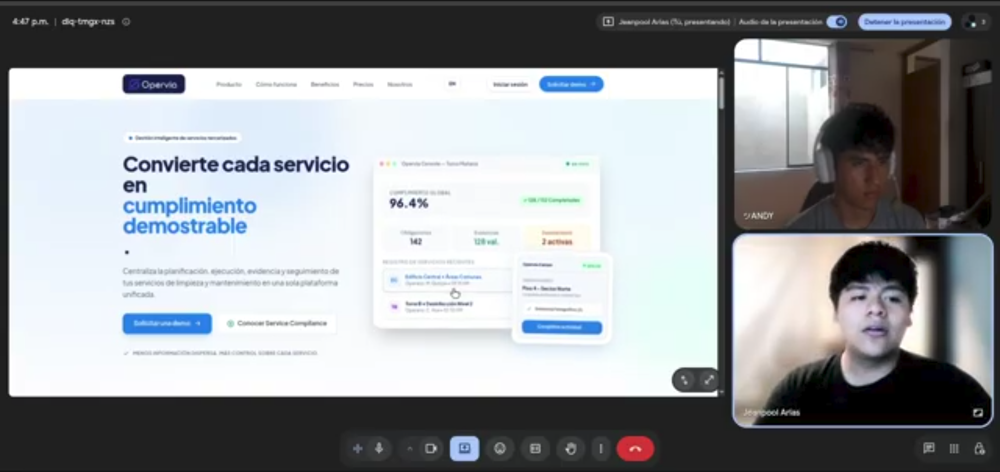
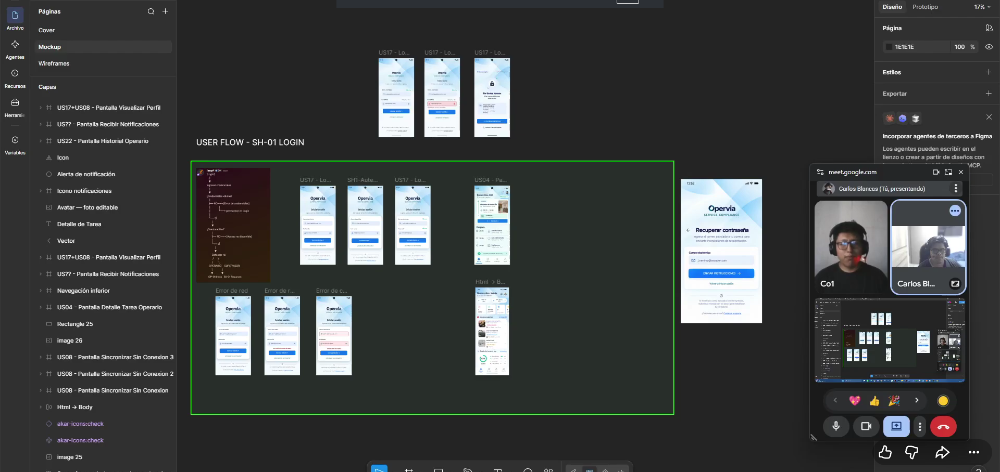

# Capítulo IV: Product Implementation & Validation

## 4.1. Software Configuration Management

### 4.1.1. Software Development Environment Configuration

| Producto      | Tecnología                   | Uso                        |
| ------------- | ---------------------------- | -------------------------- |
| Backend       | Spring Boot 4.1.1, Java 17   | API REST                   |
| Build         | Gradle Wrapper               | Compilación y JAR          |
| Persistencia  | JPA/Hibernate, Flyway        | PostgreSQL y migraciones   |
| Seguridad     | Spring Security, JWT, BCrypt | Autenticación/autorización |
| Documentación | OpenAPI, Swagger UI          | Contrato y pruebas         |
| Despliegue    | Docker, Render               | Servicio público           |
| Control       | GitHub, Conventional Commits | Colaboración               |
| Gestión       | Trello                       | Backlog y Sprint 1         |

Repositorio backend: https://github.com/OperviaStartup/serviceComplianceAPI

*Figura 4.1. Entorno de desarrollo.*

### 4.1.2. Source Code Management

El informe se mantiene en https://github.com/OperviaStartup/service-compliance-project-report y el backend en https://github.com/OperviaStartup/serviceComplianceAPI. El backend trabaja sobre main, según el acuerdo del equipo, y utiliza Conventional Commits.

| Prefijo | Uso | Ejemplo |
|---|---|---|
| feat: | Nueva funcionalidad | feat: add execution evidence flow |
| fix: | Corrección | fix: build application in Render Docker image |
| test: | Pruebas | test: verify real PostgreSQL user workflow |
| docs: | Documentación | docs: document REST API with OpenAPI |
| chore: | Configuración | chore: configure project tooling |

*Figura 4.2. Historial del backend.*

*Figura 4.3. Colaboración del informe.*

### 4.1.3. Source Code Style Guide & Conventions

El backend aplica DDD y SOLID. El dominio contiene reglas y agregados; Application coordina casos de uso; Interface expone REST; Infrastructure implementa persistencia y servicios técnicos; Shared contiene contratos comunes. Los controladores delegan, las dependencias se inyectan, cada clase mantiene una responsabilidad principal, los DTOs aplican Jakarta Validation y las contraseñas se protegen con BCrypt. Las respuestas de error utilizan ApiError.

    com.api.servicecompliance/
    ├── authentication/
    ├── obligations/
    ├── executions/
    └── shared/

*Figura 4.4. Estructura DDD del backend.*

### 4.1.4. Software Deployment Configuration

Render ejecuta un Web Service Docker conectado a PostgreSQL. El Dockerfile compila con JDK 17 y ejecuta el JAR con JRE 17. La aplicación escucha PORT y expone GET /health. Flyway ejecuta V1__create_core_schema.sql y Hibernate usa ddl-auto=validate.

| Variable | Propósito |
|---|---|
| DB_HOST, DB_PORT, DB_NAME | Conexión PostgreSQL |
| DB_USERNAME, DB_PASSWORD | Credenciales PostgreSQL |
| JWT_SECRET, JWT_EXPIRATION_MS | Tokens JWT |
| BOOTSTRAP_SUPERVISOR_EMAIL | Supervisor inicial |
| BOOTSTRAP_SUPERVISOR_PASSWORD | Mínimo 12 caracteres |

*Figura 4.5. Blueprint de Render.*

*Figura 4.6. Variables de entorno sin exponer secretos.*

## 4.2. Landing Page & Mobile Application Implementation

### 4.2.1. Landing Page Implementation

La Landing Page de Opervia / Service Compliance se implementó como un sitio estático autocontenido en un único archivo HTML. Su objetivo es comunicar la propuesta de valor, explicar el flujo de cumplimiento y orientar al visitante hacia la solicitud de una demostración. La implementación conserva el lenguaje visual definido por el equipo y adapta la experiencia para escritorio y móvil.

Repositorio local: `https://github.com/OperviaStartup/service-compliance-landingpage`.

#### 4.2.1.1. Estructura y organización

El archivo `index.html` está organizado mediante comentarios de sección, encabezado principal, navegación, contenido principal y pie de página. El contenido principal se divide en nueve secciones funcionales:

| Sección | Propósito | Backlog |
|---|---|---|
| Hero | Presentar Opervia, Service Compliance y el CTA principal | US-18 |
| Problem | Explicar la operación fragmentada y sus riesgos | US-18 |
| Value Proposition | Mostrar el flujo de planificación a cumplimiento | US-18 |
| How It Works | Explicar las fases del proceso operativo | US-18 |
| Dual Experience | Diferenciar operario y supervisor | US-18 |
| Traceability Case | Mostrar trazabilidad y desviaciones | US-18 |
| Benefits | Resumir beneficios operativos y de auditoría | US-18 |
| Pricing | Presentar planes de servicio | US-18 |
| Final CTA | Orientar a solicitud de demo o contacto | US-19 |

La comprobación estructural confirmó nueve secciones abiertas y nueve cerradas. El pie de página utiliza el ancla `nosotros`, referenciada por la navegación.

*Figura 4.17. Organización estructural de la Landing Page.*

#### 4.2.1.2. Responsive Web Design

La Landing Page utiliza clases responsive para adaptar grillas, espaciado, tipografía, navegación, cards, CTAs y mockups. Las vistas de referencia para TB1 son desktop de 1440 px y mobile de 390 px.

*Figura 4.18. Landing Page en vista desktop.*

*Figura 4.19. Landing Page en vista mobile.*

#### 4.2.1.3. Internationalization and Accessibility

La interfaz inicia en español mediante `lang="es"` y cuenta con el selector `languageToggle` para cambiar entre español e inglés. El script traduce los nodos de texto visibles mediante un diccionario que cubre navegación, mockups, diagnóstico, workflow, beneficios, precios, CTA y pie de página. El idioma seleccionado se conserva en `localStorage` con la clave `opervia-language`.

La accesibilidad estructural implementada incluye `aria-label` en header, navegación, footer y selector de idioma; botón de idioma con `type="button"`; estructura semántica con `header`, `nav`, `main`, `section` y `footer`; y soporte para `prefers-reduced-motion`.

*Figura 4.20. Internacionalización español/inglés.*

#### 4.2.1.4. SEO, navegación y despliegue

La página incluye título descriptivo, meta description, navegación por anclas internas y enlaces hacia Producto, Cómo funciona, Beneficios, Precios, Nosotros y Demo. No se detectaron referencias relativas a assets locales; la página es autocontenida y utiliza dependencias externas declaradas.

El archivo `.github/workflows/pages.yml` automatiza el despliegue a GitHub Pages en cada push a `main` y permite ejecución manual mediante `workflow_dispatch`. El workflow configura Pages, empaqueta la raíz y publica el artefacto estático.

*Figura 4.22. Workflow de despliegue de la Landing Page.*

<!-- Reemplazar con la URL pública real después de verificar GitHub Pages. -->
**URL pública:** `https://operviastartup.github.io/service-compliance-landingpage/`

#### 4.2.1.5. Términos y condiciones

<!-- Responsable del Landing Page: completar con los enlaces reales a Términos del Servicio y Política de Privacidad, tanto en el footer como en el flujo de registro de la aplicación móvil. -->

### 4.2.2. Sprint 1 — Backend foundation and core operational flow

**Sprint Goal:** entregar una API REST segura y persistente para demostrar el flujo supervisor-operario.

**Duración:** completar fechas reales del Sprint 1.
**Criterio TB1:** backend desplegado aproximadamente al 70%, Swagger operativo, PostgreSQL conectado y pantallas core disponibles.

#### 4.2.2.1. Sprint Planning 1

US-17 se adelantó desde Sprint 2 por ser una capacidad habilitadora de seguridad.

| Tipo | Story | Alcance | Puntos |
|---|---|---|---:|
| Habilitadora | US-17 | Autenticarse y acceder según rol | 5 |
| Producto | US-02 | Definir obligación | 5 |
| Producto | US-04 | Consultar obligaciones asignadas | 3 |
| Producto | US-05 | Registrar ejecución | 5 |
| Producto | US-06 | Adjuntar evidencia | 3 |
| Técnica | TS-01 | API REST documentada | 5 |
| **Total** |  |  | **21** |

US-18 y US-19 quedan a cargo del responsable del Landing Page.

#### 4.2.2.2. Aspect Leaders and Collaborators

| Integrante | Líder de aspecto | Responsabilidad Sprint 1 |
|---|---|---|
| Arias Tasayco, Jean Pool Alexander | Backend e integración | Auth, PostgreSQL, Flyway, API, Docker, Render y E2E |
| Ayasta Martel, Zayd Jaffar | Backlog y trazabilidad | Historias, criterios, Sprint Backlog y rúbrica |
| Blancas Chávez, Carlos Franco | DDD y arquitectura | Contextos, capas, diagramas y revisión diseño-código |
| Flores Eusebio, Angel Thyago | Validación de negocio | Escenarios supervisor-operador y aceptación |
| Montes Maza, Augusto Sebastian | UX móvil | Pantallas core y flujo móvil |
| Sánchez Espinoza, Mathias Enrique | Usuarios e investigación | Validación con usuarios y entrevistas |

*Figura 4.7. Distribución de responsabilidades.*

#### 4.2.2.3. Sprint Backlog 1

| ID | Tarea | Responsable | Colaboradores | Estado |
|---|---|---|---|---|
| S1-T01 | Spring Boot, Java 17, Gradle y DDD | Jean | Carlos | Completado |
| S1-T02 | Registro, login y JWT | Jean | Carlos, Zayd | Completado |
| S1-T03 | Roles SUPERVISOR/OPERATOR | Jean | Carlos, Angel | Completado |
| S1-T04 | PostgreSQL y Flyway V1 | Jean | Carlos | Completado |
| S1-T05 | Crear/consultar obligaciones | Jean | Zayd, Angel | Completado |
| S1-T06 | Registrar ejecuciones | Jean | Angel, Augusto | Completado |
| S1-T07 | Registrar/consultar evidencias | Jean | Augusto, Mathias | Completado |
| S1-T08 | Validaciones y ApiError | Jean | Carlos, Zayd | Completado |
| S1-T09 | Swagger/OpenAPI | Jean | Zayd | Completado |
| S1-T10 | Unit, integration y E2E | Jean | Angel, Mathias | Completado |
| S1-T11 | Pantallas core móviles | Augusto | Mathias, Jean | Completar evidencia |
| S1-T13 | Landing Page | Responsable del Landing Page | Equipo de diseño | Implementado; completar evidencias y URL |

#### 4.2.2.4. Development Evidence for Sprint Review

| Evidencia | Contenido |
|---|---|
| E1 | Paquetes DDD |
| E2 | Autenticación |
| E3 | Roles |
| E4 | Obligación |
| E5 | Ejecución/evidencia |
| E6 | Flyway/PostgreSQL |
| E7 | Docker/Render |

E1 : Paquetes DDD

E2 : Autenticación

E3 : Roles

E4 : Obligación

E5 : Ejecución/evidencia

E6 : Flyway/PostgreSQL

E7 : Docker/Render

#### 4.2.2.5. Testing Suite Evidence for Sprint Review

| Prueba                           | Resultado esperado |
| -------------------------------- | ------------------ |
| Registro de operador             | 201 Created        |
| Login operador/supervisor        | 200 OK y JWT       |
| Crear obligación como supervisor | 201 Created        |
| Crear obligación como operador   | 403 Forbidden      |
| Consultar obligaciones           | 200 OK             |
| Crear ejecución                  | 201 Created        |
| Registrar evidencia              | 201 Created        |
| Request inválido                 | 400 con errores    |
| Token ausente/inválido           | 401 Unauthorized   |

#### 4.2.2.6. Execution Evidence for Sprint Review

Flujo validado: el supervisor inicia sesión y crea una obligación; el operador inicia sesión, consulta sus obligaciones, registra una ejecución y adjunta evidencia; el sistema rechaza operaciones exclusivas del supervisor cuando las solicita el operador.

| Verificación E2E contra PostgreSQL | Resultado |
|---|---|
| Registro y login | 201 / 200 |
| Obligación creada | ID generado |
| Obligaciones asignadas | 1 |
| Ejecución registrada | ID generado |
| Evidencia registrada | ID generado |
| Operador crea obligación | 403 Forbidden |

*Figura 4.9. Flujo E2E del Sprint 1.*

#### 4.2.2.7. Services Documentation Evidence for Sprint Review

| Método | Endpoint | Rol |
|---|---|---|
| POST | /api/v1/auth/register | Público |
| POST | /api/v1/auth/login | Público |
| GET | /api/v1/auth/me | Autenticado |
| POST | /api/v1/obligations | Supervisor |
| GET | /api/v1/obligations | Autenticado |
| POST | /api/v1/executions | Operador |
| GET | /api/v1/executions/{id} | Autenticado |
| POST | /api/v1/executions/{id}/evidence | Operador |
| GET | /api/v1/executions/{id}/evidence | Autenticado |
| GET | /health | Público |

Swagger: /swagger-ui.html. OpenAPI: /api-docs.

| Error | Código | Respuesta |
|---|---:|---|
| Validación/JSON inválido | 400 | ApiError |
| No autenticado | 401 | ApiError |
| Rol insuficiente | 403 | ApiError |
| Recurso inexistente | 404 | ApiError |
| Error inesperado | 500 | ApiError sin datos sensibles |

*Figura 4.10. Swagger con Bearer JWT.*

#### 4.2.2.8. Software Deployment Evidence for Sprint Review

| Verificación | URL esperada |
|---|---|
| Health check | https://service-compliance-api.onrender.com/health |
| Swagger | https://service-compliance-api.onrender.com/swagger-ui.html |
| OpenAPI | https://service-compliance-api.onrender.com/api-docs |

*Figura 4.12. Backend desplegado.*

*Figura 4.13. Health check y Swagger públicos.*

#### 4.2.2.9. Team Collaboration Insights during Sprint

| Integrante | Evidencia de colaboración |
|---|---|
| Arias Tasayco | Commits backend, E2E, Docker/Render |
| Ayasta Martel | Sprint Backlog y trazabilidad |
| Blancas Chávez | Arquitectura DDD y diagramas |
| Flores Eusebio | Validación de negocio |
| Montes Maza | Pantallas core y usabilidad |
| Sánchez Espinoza | Entrevistas y validación |

*Figura 4.14. Colaboración del equipo.*

## 4.3. Validation Interviews

La validación del Sprint 1 comprueba que el flujo de autenticación, consulta de obligaciones, registro de ejecución y evidencia es comprensible para supervisores/coordinadores y operarios de limpieza tercerizada.
### 4.3.1. Diseño de entrevistas

**Objetivo:** validar la comprensión y utilidad del flujo implementado en la Landing Page, las pantallas core móviles y el backend REST.

| Perfil                 | Tarea                                   | Pregunta principal                                                 |
| ---------------------- | --------------------------------------- | ------------------------------------------------------------------ |
| Supervisor/coordinador | Revisar obligación y ejecución          | ¿La información permite comprender qué se planificó y qué ocurrió? |
| Operario               | Iniciar sesión y consultar obligaciones | ¿Puedes identificar qué realizar, dónde y cuándo?                  |
| Operario               | Registrar ejecución y evidencia         | ¿El flujo refleja tu trabajo y es comprensible?                    |

### 4.3.2. Registro de entrevistas

La siguiente tabla consolida las entrevistas de validación con los participantes definidos para este Sprint. Los datos personales, los enlaces y las duraciones se toman del registro de entrevistas del capítulo 2. La fecha de realización no aparece en la fuente disponible y, por ese motivo, no se infiere ni se reemplaza por una fecha estimada. El tiempo de inicio indicado corresponde al inicio del video individual enlazado.

| Participante                     | Perfil                 |    Edad | Distrito / ubicación                                | Funcionalidad observada               | Links                        |
| -------------------------------- | ---------------------- | ------: | --------------------------------------------------- | ------------------------------------- | ---------------------------- |
| Andy Aschalla                    | Supervisor/coordinador | 20 años | San Martín de Porres / conjunto empresarial en Lima | Landing Page y revisión de obligación | https://youtu.be/dpmmz5uPGgM |
| José Ramírez                     | Operario               | 22 años | San Juan de Lurigancho / edificio de oficinas       | Login y consulta de obligaciones      | https://youtu.be/ZxyewRU2b-4 |
| Rodrigo Andres Gonzales Portugal | Operario               | 21 años | Los Olivos / centro de labores en San Martín        | Ejecución y evidencia                 |                              |

#### Entrevista de Andy Aschalla

*Figura 4.16. Evidencia de video de la entrevista de Andy Aschalla.*

Andy Aschalla trabaja como supervisor de limpieza tercerizada. Su jornada incluye el control de asistencia, la revisión de novedades, la cobertura de ausencias, las rondas de inspección, la atención de incidencias y la actualización de reportes. Durante la validación de la Landing Page y la revisión de una obligación, su experiencia permite contrastar si la información presentada resulta coherente con las tareas de supervisión. El principal valor esperado es que una obligación permita entender qué actividad debe controlarse y facilite relacionarla con las novedades y evidencias del servicio. Sus fricciones actuales se concentran en las ausencias imprevistas, la reorganización de rutas y la reconstrucción de evidencia cuando un cliente formula una observación. Actualmente combina comunicación verbal, formatos firmados y fotografías enviadas por WhatsApp, por lo que el flujo validado debe reducir la dispersión de información sin añadir pasos innecesarios.

#### Entrevista de José Ramírez

*Figura 4.17. Evidencia de video de la entrevista de José Ramírez.*

José Ramírez cuenta con seis años de experiencia en servicios de limpieza y combina labores operativas con coordinación de su equipo. En la validación del login y la consulta de obligaciones, el flujo se relaciona con su necesidad de recibir una referencia clara de las actividades asignadas. En su operación actual, las zonas y cambios de trabajo se comunican principalmente por WhatsApp, y las fotografías de evidencia se envían por el mismo canal. José está familiarizado con WhatsApp; la dificultad aparece cuando los mensajes se mezclan y luego deben relacionarse con una actividad concreta. Por ello, el hallazgo valida la utilidad de centralizar tarea, estado y evidencia. Como mejora específica, se identifica la posibilidad de permitir el acceso mediante el correo con dominio de la empresa, además del mecanismo de autenticación considerado en el Sprint 1. La conectividad suele ser suficiente, aunque reporta menor señal en el sótano.

#### Entrevista de Rodrigo Andres Gonzales Portugal

*Figura 4.18. Evidencia de video de la entrevista de Rodrigo Andres Gonzales Portugal.*

Rodrigo Andres Gonzales Portugal tiene un año y medio de experiencia realizando actividades de limpieza en una tienda de peceras, donde también atiende clientes y entrega pedidos. En la validación del registro de ejecución y evidencia, el flujo se contrasta con un contexto en el que las actividades pueden combinarse con otras funciones y retrasarse cuando falta personal. Actualmente comunica la finalización mediante mensajes o llamadas y, para determinadas tareas, su jefe solicita fotografías. También utiliza listas o cuadernos, que considera vulnerables a pérdida o deterioro. El hallazgo respalda que la ejecución y su evidencia se presenten como un registro digital asociado a la obligación, de modo que el supervisor pueda consultar qué actividad fue realizada. Rodrigo considera el diseño intuitivo y adecuado para este propósito. La conectividad actualmente es adecuada después de la instalación de un router.

#### Síntesis de hallazgos

| Hallazgo de validación                                                                               | Entrevistas relacionadas                                       | Decisión para el Sprint 1                                                          |
| ---------------------------------------------------------------------------------------------------- | -------------------------------------------------------------- | ---------------------------------------------------------------------------------- |
| La obligación debe mostrar una referencia operativa comprensible para supervisar lo planificado.     | Andy Aschalla                                                  | Mantener la consulta de obligaciones y la revisión del flujo supervisor.           |
| La autenticación y la consulta deben ser directas y compatibles con hábitos existentes.              | José Ramírez                                                   | Mantener el login y registrar como mejora futura el acceso con correo corporativo. |
| La ejecución debe quedar asociada a una evidencia consultable por el supervisor.                     | Rodrigo Andres Gonzales Portugal                               | Mantener el registro de ejecución y evidencia como flujo central.                  |
| La información no debería depender únicamente de mensajes, llamadas, cuadernos o formatos dispersos. | Andy Aschalla, José Ramírez y Rodrigo Andres Gonzales Portugal | Priorizar la trazabilidad entre obligación, ejecución y evidencia.                 |

### 4.3.3. Evaluaciones según heurísticas

| Heurística | Evidencia observada en las entrevistas | Resultado | Acción de seguimiento |
|---|---|---|---|
| Visibilidad del estado | Los tres participantes reconocen el propósito de login, obligación, ejecución y evidencia. | Validada | Mantener estados explícitos para obligación y ejecución. |
| Correspondencia con el mundo real | Andy relaciona la obligación con la supervisión; José con la actividad asignada; Rodrigo con la ejecución y la fotografía. | Validada | Conservar el vocabulario operativo del capítulo 2. |
| Control y libertad | No se reporta pérdida de datos confirmados durante las entrevistas disponibles. | Parcialmente validada | Probar explícitamente volver, cancelar y retomar una ejecución. |
| Consistencia y estándares | El flujo se percibe intuitivo y adecuado; José propone complementar el acceso con correo corporativo. | Validada con mejora | Uniformizar etiquetas y evaluar el correo corporativo en un Sprint posterior. |
| Prevención de errores | Las entrevistas evidencian riesgo de mensajes mezclados, registros dispersos y cuadernos deteriorados. | Parcialmente validada | Asociar cada evidencia a una obligación antes de confirmar. |
| Recuperación ante errores | Las fuentes describen problemas operativos, pero no registran una prueba específica de recuperación dentro del prototipo. | Pendiente de prueba | Añadir mensajes accionables para campos inválidos, reintento y conectividad limitada. |
| Documentación y ayuda | La validación se centró en el flujo de usuario; la documentación técnica se encuentra en Swagger. | Validada técnicamente / pendiente en usuario | Verificar que los mensajes de ayuda sean comprensibles para operarios. |

En conjunto, la validación respalda el flujo principal del Sprint 1: autenticarse, consultar una obligación, registrar su ejecución y adjuntar evidencia. También revela dos líneas de mejora: acceso con correo corporativo y manejo explícito de conectividad o recuperación. Estas observaciones se incorporan como trabajo posterior y no se presentan como funcionalidades ya entregadas.

## Cierre del Sprint 1

Sprint 1 entrega autenticación, autorización, PostgreSQL, migraciones, obligaciones, ejecuciones, evidencias, pruebas, OpenAPI, Render y una Landing Page estática desplegable. La sincronización offline, evaluación de cumplimiento, incidentes, acciones correctivas, reportes, notificaciones y almacenamiento multimedia quedan para siguientes sprints. Para cerrar la evidencia de la Landing Page todavía deben agregarse la URL pública, capturas de desktop/mobile, prueba del cambio de idioma y los enlaces de términos y privacidad.
