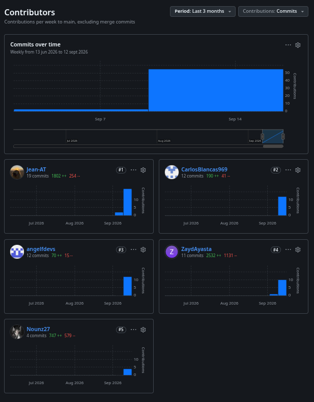

## Project Report Collaboration Insights

### Repositorio del Project Report

El informe del proyecto Service Compliance, desarrollado por el equipo Opervia, se mantiene en el siguiente repositorio de GitHub:

Repositorio:
https://github.com/OperviaStartup/service-compliance-project-report

Durante la elaboración de la entrega AV1, el equipo distribuyó las actividades del informe de acuerdo con las secciones y artefactos requeridos. Los integrantes trabajaron sobre el mismo repositorio, registrando sus aportes mediante commits y realizando revisiones conjuntas para mantener coherencia entre la definición del problema, la investigación de usuarios, los requisitos y el diseño de la solución.

La colaboración registrada en GitHub permite observar la participación de los integrantes en la construcción y actualización del Project Report. Las contribuciones realizadas corresponden a actividades de investigación, redacción, elaboración de artefactos, diagramación y revisión del contenido de la entrega.

### Evidencias de colaboración — AV1

Contribuciones al repositorio

Figura 1. Analíticos de contribución del repositorio del Project Report durante la elaboración de AV1.

La figura muestra la distribución de commits realizados por los integrantes que han registrado contribuciones en el repositorio durante el periodo correspondiente a la entrega.

### Distribución de la colaboración por integrante

| Integrante                         | Principales actividades realizadas                                                                                                      |
| ---------------------------------- | --------------------------------------------------------------------------------------------------------------------------------------- |
| Arias Tasayco, Jean Pool Alexander | Estructuración y revisión general del informe, desarrollo del Capítulo I y apoyo en la integración de artefactos de diseño de software. |
| Blancas Chávez, Carlos Franco      | Desarrollo y revisión de los artefactos relacionados con Strategic-Level Domain-Driven Design.                                          |
| Flores Eusebio, Angel Thyago       | Investigación de competidores, análisis competitivo y definición de estrategias frente a competidores.                                  |
| Sánchez Espinoza, Mathias Enrique  | Diseño y documentación del proceso de entrevistas dirigido a los segmentos objetivo.                                                    |
| Montes Maza, Augusto Sebastian     | Elaboración y revisión de artefactos de Needfinding.                                                                                    |
| Ayasta Martel, Zayd Jaffar         | Elaboración de Requirements Specification, incluyendo User Stories, Impact Mapping y Product Backlog.                                   |
