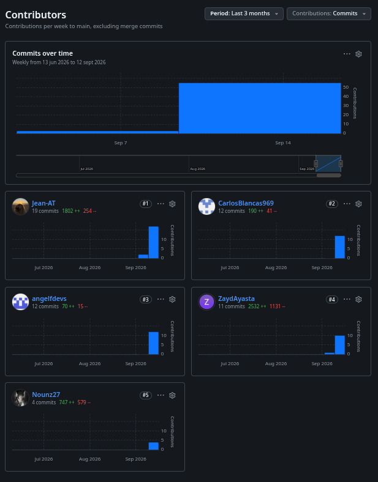

## Project Report Collaboration Insights

### Repositorio del Project Report

El informe de Service Compliance, desarrollado por el equipo Opervia, se mantiene en el siguiente repositorio de GitHub:

**Repositorio:**  
https://github.com/OperviaStartup/service-compliance-project-report

Durante la elaboración de AV1, el equipo distribuyó el trabajo entre la definición y revisión del Capítulo I, investigación con usuarios, Needfinding, Requirements Specification y artefactos de diseño de software del Capítulo II. Los aportes fueron integrados progresivamente en el repositorio mediante commits y, en determinados trabajos de reconstrucción documental, mediante ramas y Pull Requests hacia `main`.

### Evidencia de colaboración — AV1

*Figura 1. Analíticos de contribución del repositorio del Project Report durante AV1.*

Al cierre de la elaboración de AV1, el historial del repositorio registra contribuciones de los seis integrantes del equipo.

| Integrante | Usuario de GitHub | Principales aportes en AV1 |
|---|---|---|
| Arias Tasayco, Jean Pool Alexander | `Jean-AT` | Capítulo I, revisión e integración del informe, EventStorming y preparación del documento final. |
| Ayasta Martel, Zayd Jaffar | `ZaydAyasta` | Requirements Specification, revisión del Capítulo I y Capitulo II, front matter, tabla de contenidos y documentación general del repositorio. |
| Blancas Chávez, Carlos Franco | `CarlosBlancas969` | Strategic-Level Domain-Driven Design y artefactos relacionados del Capítulo II. |
| Flores Eusebio, Angel Thyago | `angelfdevs` | Análisis competitivo, entrevistas y actualización de evidencias y contenido del Capítulo II. |
| Montes Maza, Augusto Sebastian | `asmmaza` | User Personas, Journey Mapping, Empathy Mapping y otros artefactos de Needfinding. |
| Sánchez Espinoza, Mathias Enrique | `Nounz27` | Diseño y actualización de entrevistas, análisis asociado y recursos del Capítulo II. |

La evidencia mostrada corresponde al historial de commits del repositorio y es consistente con las modificaciones relevantes resumidas en el Registro de Versiones del Informe.